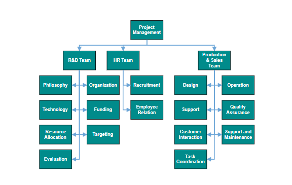
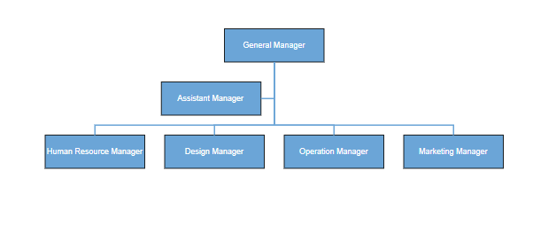

# Organizational Chart layout in Vue Diagram control

An organizational chart is a diagram that displays the structure of an organization and relationships. To create an organizational chart, the [`type`](https://ej2.syncfusion.com/vue/documentation/api/diagram/layout/#type) of layout should be set as an `OrganizationalChart`.

## Organizational chart with DataSource

The following code example illustrates how to create an organizational chart with DataSource.









        


>Note: If you want to use Organizational chart layout in diagram, you need to inject HierarchicalTree module along with DataBinding module in the diagram.

## Organizational chart with nodes and connectors

You can render an org-chart layout without using DataSource. The following code demonstrates how to render an org-chart layout without using data source.









        


## GetLayout info

Organizational chart layout starts parsing from root and iterate through all its child elements. The [`getLayoutInfo`](https://ej2.syncfusion.com/vue/documentation/api/diagram/layoutModel/#getlayoutinfo) method provides necessary information of a node’s children and the way to arrange (direction, orientation, offsets, etc.) them. The arrangements can be customized by overriding this function as explained.

Set chart orientations, chart types, and offset to be left between parent and child nodes by overriding the `getLayoutInfo` method. The `getLayoutInfo` method is called to configure every subtree of the organizational chart. It takes the following arguments.

    * node: Parent node to that options are to be customized.
    * options: Object to set the customizable properties.

The following table illustrates the properties that “options” argument takes.

| Property | Description | Default Value |
| -------- | ----------- | ------------- |
|options.assistants|By default, the collection is empty. When any of the child nodes have to be set as **Assistant**, you can remove from children collection and have to insert into assistants collection.|Empty array|
|options.orientation|Gets or sets the organizational chart orientation.|SubTreeOrientation.Vertical|
|options.type|Gets or sets the chart organizational chart type.|For horizontal chart orientation:SubTreeAlignments.Center and for vertical chart orientation:SubTreeAlignments.Alternate|
|options.offset|Offset is the horizontal space to be left between parent and child nodes.|20 pixels applicable only for vertical chart orientations.|
|options.hasSubTree|Gets whether the node contains subtrees.|Boolean|
|options.level|Gets the depth of the node from layout root.|Number|
|options.enableRouting|By default, connections are routed based on the chart type and orientations. This property gets or sets whether default routing is to be enabled or disabled.|true|
|options.rows|Sets the number of rows on which the child nodes will be arranged. Applicable only for balanced type horizontal tree.|Number|

The following table illustrates the different chart orientations and chart types.

|Orientation|Type|Description|Example|
| -------- | ----------- | ------------- |------|
|Horizontal|Left|Arranges the child nodes horizontally at the left side of the parent.||
||Right|Arranges the child nodes horizontally at the right side of the parent.||
||Center|Arranges the children like standard tree layout orientation.||
||Balanced|Arranges the leaf level child nodes in multiple rows.||
|Vertical|Left|Arranges the children vertically at the left side of the parent.||
||Right|Arranges the children vertically at the right side of the parent.||
||Alternate|Arranges the children vertically at both left and right sides of the parent.||

### SubTree horizontal orientation

The following example shows how to utilize the `getLayoutInfo` function to customize the sub tree alignment in horizontal orientation.









        


### SubTree vertical orientation 

The following code example illustrates how to set the vertical arrangement to the leaf level trees.









        


### Assistant

Assistants are child item that have a different relationship with the parent node. They are laid out in a dedicated part of the tree. A node can be specified as an assistant of its parent by adding it to the `assistants` property of the argument “options”.

The following code example illustrates how to add assistants to layout.









        


>Note: An Assistant node cannot have any child nodes
