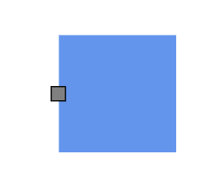
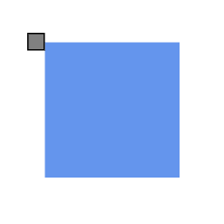
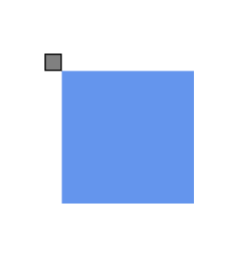

# Positioning node's port

Diagram allows you to customize the position of the port efficiently. Port can be aligned relative to the node boundaries. It has Margin, Offset, Horizontal, and Vertical alignment settings.

## Port offset

The [`offset`](https://ej2.syncfusion.com/vue/documentation/api/diagram/pointModel/) property is used to align the ports based on fractions. 0 represents top/left corner, 1 represents bottom/right corner, and 0.5 represents half of width/height.

The following table shows the position of port within the shape.

The following table shows the position of port within the shape.

| Offset values | Output |
| -------- | -------- |
| (0,0) |  |
| (0,0.5) |  |
| (0,1) |  |
| (0.5,0) |  |
| (0.5,0.5) | |
| (0.5,1) |  |
| (1,0) |  |
| (1,0.5) |  |
| (1,1) |  |

## Horizontal and vertical alignment

The [`horizontalAlignment`](https://ej2.syncfusion.com/vue/documentation/api/diagram/horizontalAlignment/) property of the port is used to set how the port is horizontally aligned at the port position. The [`verticalAlignment`](https://ej2.syncfusion.com/vue/documentation/api/diagram/verticalAlignment/) property is used to set how the port is vertically aligned at the port position.









        


The following table shows all the possible alignments visually with offset (0, 0).

| Horizontal Alignment | Vertical Alignment | Output with Offset(0,0) |
| -------- | -------- | -------- |
| Left | Top |  |
| Center | Top |  |
| Right | Top |   |
| Left | Center |  |
| Center | Center|  |
| Right | Center |  |
| Left | Bottom |  |
| Center | Bottom |  |
| Right |Bottom | |

## Margin for port

[`Margin`](https://ej2.syncfusion.com/vue/documentation/api/diagram/marginModel/) is an absolute value used to add some blank space to any one of its four sides. The ports can be displaced with the margin property. The following code example explains how to align a port based on its offset and margin values.









        


## See also

* [How to interact with the ports](./ports-interaction)

* [How to customize the ports](./ports-appearance)

* [How to create connector port](./ports-connector-port)
