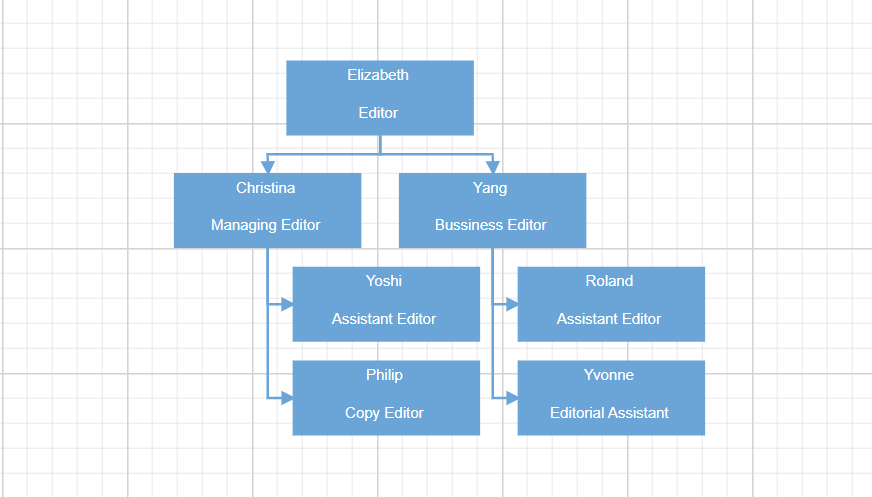

# Getting Started with the Vue Diagram Component in the Quasar Framework

This article provides a step-by-step guide for setting up a [Quasar](https://quasar.dev/) project and integrating the Syncfusion Vue Diagram component using the [Composition API](https://vuejs.org/guide/introduction.html#composition-api).

The `Quasar` Framework is a Vue.js-based open-source framework that empowers developers to create high-performance and responsive applications across various platforms, such as web, mobile, and desktop.

## Prerequisites

[System requirements for Syncfusion Vue UI components](../system-requirements)

## Set up the Quasar project

To initiate the creation of a new [Quasar](https://quasar.dev/start/quick-start/) project, use the following commands:

```bash
npm init quasar
```

This command prompts additional configurations. Follow the steps outlined in the images below:


This generates the necessary files and prompts for project dependency installation. Respond with 'yes' to proceed with npm install, as shown in the image below:


Navigate to your project directory:

```bash
cd quasar-project
```

Now that `quasar-project` is ready to run with default settings, let's add Syncfusion components to the project.

## Add the Syncfusion Vue packages

Syncfusion Vue component packages are available at [npmjs.com](https://www.npmjs.com/search?q=ej2-vue). To use Syncfusion Vue components in the project, install the corresponding npm package.

This article uses the [Vue Diagram component](https://www.syncfusion.com/vue-components/vue-gantt-chart) as an example. To use the Vue Diagram component in the project, the `@syncfusion/ej2-vue-diagrams` package needs to be installed using the following command:

```bash
npm install @syncfusion/ej2-vue-diagrams --save
```

## Import Syncfusion CSS styles

You can import themes for the Syncfusion Vue component in various ways, such as using CSS or SASS styles from npm packages, CDN, CRG and [Theme Studio](https://ej2.syncfusion.com/vue/documentation/appearance/theme-studio/). Refer to the [themes topic](https://ej2.syncfusion.com/vue/documentation/appearance/theme/) to learn more about built-in themes and different ways to refer to themes in a Vue project.

In this article, the `Material 3` theme is applied using CSS styles, which are available in installed packages. The necessary `Material 3` CSS styles for the Diagram component and its dependents were imported into the `<style>` section of the **src/app.vue** file.




<style>
@import "../node_modules/@syncfusion/ej2-base/styles/material3.css";
@import "../node_modules/@syncfusion/ej2-navigations/styles/material3.css";
@import "../node_modules/@syncfusion/ej2-buttons/styles/material3.css";
@import "../node_modules/@syncfusion/ej2-inputs/styles/material3.css";
@import "../node_modules/@syncfusion/ej2-popups/styles/material3.css";
@import "../node_modules/@syncfusion/ej2-vue-diagrams/styles/material3.css";
</style>




> The order of importing CSS styles should be in line with their dependency graph.

## Add the Syncfusion Vue component

Follow the below steps to add the Vue Diagram component:

1\. First, add the `setup` attribute to the `script` tag to indicate that Vue will be using the `Composition API`. And import the Diagram component and its child directives in the `script` section of the **src/app.vue** file.




<script setup>
import {DiagramComponent as EjsDiagram,DataBinding,HierarchicalTree,} from "@syncfusion/ej2-vue-diagrams";
</script>



   
2\. Then, define the Diagram component in the **src/app.vue** file, as shown below:




<template>
    <ejs-diagram
        id="diagram"
        :width="width"
        :height="height"
        :layout="layout"
        :dataSourceSettings="dataSourceSettings"
        :getNodeDefaults="getNodeDefaults"
        :getConnectorDefaults="getConnectorDefaults"
        >
    </ejs-diagram>
</template>




3\. Declare the values for the `dataSource` property in the `script` section.




<script setup>
import { provide } from "vue";
import { DataManager } from "@syncfusion/ej2-data";
const width="1300px";
const height = "800px";

const localdata = [
    {
    Name: "Elizabeth",
    Role: "Editor",
    },
    {
    Name: "Christina",
    ReportingPerson: "Elizabeth",
    Role: "Managing Editor",
    },
    {
    Name: "Yoshi",
    ReportingPerson: "Christina",
    Role: "Assistant Editor",
    },
    {
    Name: "Philip",
    ReportingPerson: "Christina",
    Role: "Copy Editor",
    },
    {
    Name: "Yang",
    ReportingPerson: "Elizabeth",
    Role: "Bussiness Editor",
    },
    {
    Name: "Roland",
    ReportingPerson: "Yang",
    Role: "Assistant Editor",
    },
    {
    Name: "Yvonne",
    ReportingPerson: "Yang",
    Role: "Editorial Assistant",
    },
];
const getNodeDefaults= (node) => {
        node.height = 60;
        node.width = 150;
        return node;
        };

const getConnectorDefaults= (obj) => {
    obj.type = "Orthogonal";
        obj.style = {
            strokeColor: "#6BA5D7",
            fill: "#6BA5D7",
            strokeWidth: 2,
        };
        obj.targetDecorator = {
            style: {
            fill: "#6BA5D7",
            strokeColor: "#6BA5D7",
            },
        };
        return obj;
};
const layout={
        type: "OrganizationalChart",
        };
const dataSourceSettings= {
        id: "Name",
        parentId: "ReportingPerson",
        dataManager: new DataManager(localdata),
        doBinding: (nodeModel, localdata) => {
            nodeModel.annotations = [
            {
                content: localdata.Name,
                offset: { x: 0.5, y: 0.2 },
                style: { color: "white" },
            },
            {
                content: localdata.Role,
                offset: { x: 0.5, y: 0.7 },
                style: { color: "white" },
            },
            ];
            nodeModel.style = { fill: "#6BA5D7", strokeWidth: 0 };
        },
        };
const diagram = [DataBinding, HierarchicalTree];
provide('diagram', diagram);
</script>




Here is the summarized code for the above steps in the **src/app.vue** file:




<template>
    <ejs-diagram
        id="diagram"
        :width="width"
        :height="height"
        :layout="layout"
        :dataSourceSettings="dataSourceSettings"
        :getNodeDefaults="getNodeDefaults"
        :getConnectorDefaults="getConnectorDefaults"
        >
    </ejs-diagram>
</template>
  
<script setup>
import {DiagramComponent as EjsDiagram,DataBinding,HierarchicalTree,} from "@syncfusion/ej2-vue-diagrams";
import { provide } from "vue";
import { DataManager } from "@syncfusion/ej2-data";
const width="1300px";
const height = "800px";

const localdata = [
    {
    Name: "Elizabeth",
    Role: "Editor",
    },
    {
    Name: "Christina",
    ReportingPerson: "Elizabeth",
    Role: "Managing Editor",
    },
    {
    Name: "Yoshi",
    ReportingPerson: "Christina",
    Role: "Assistant Editor",
    },
    {
    Name: "Philip",
    ReportingPerson: "Christina",
    Role: "Copy Editor",
    },
    {
    Name: "Yang",
    ReportingPerson: "Elizabeth",
    Role: "Bussiness Editor",
    },
    {
    Name: "Roland",
    ReportingPerson: "Yang",
    Role: "Assistant Editor",
    },
    {
    Name: "Yvonne",
    ReportingPerson: "Yang",
    Role: "Editorial Assistant",
    },
];
const getNodeDefaults= (node) => {
        node.height = 60;
        node.width = 150;
        return node;
        };

const getConnectorDefaults= (obj) => {
    obj.type = "Orthogonal";
        obj.style = {
            strokeColor: "#6BA5D7",
            fill: "#6BA5D7",
            strokeWidth: 2,
        };
        obj.targetDecorator = {
            style: {
            fill: "#6BA5D7",
            strokeColor: "#6BA5D7",
            },
        };
        return obj;
};
const layout={
        type: "OrganizationalChart",
        };
const dataSourceSettings= {
        id: "Name",
        parentId: "ReportingPerson",
        dataManager: new DataManager(localdata),
        doBinding: (nodeModel, localdata) => {
            nodeModel.annotations = [
            {
                content: localdata.Name,
                offset: { x: 0.5, y: 0.2 },
                style: { color: "white" },
            },
            {
                content: localdata.Role,
                offset: { x: 0.5, y: 0.7 },
                style: { color: "white" },
            },
            ];
            nodeModel.style = { fill: "#6BA5D7", strokeWidth: 0 };
        },
        };
const diagram = [DataBinding, HierarchicalTree];
provide('diagram', diagram);
</script>

<style>
@import "../node_modules/@syncfusion/ej2-base/styles/material3.css";
@import "../node_modules/@syncfusion/ej2-navigations/styles/material3.css";
@import "../node_modules/@syncfusion/ej2-buttons/styles/material3.css";
@import "../node_modules/@syncfusion/ej2-inputs/styles/material3.css";
@import "../node_modules/@syncfusion/ej2-popups/styles/material3.css";
@import "../node_modules/@syncfusion/ej2-vue-diagrams/styles/material3.css";
</style>




## Run the project

To run the project, use the following command:

```bash
npm run dev
```

The output will appear as follows:

