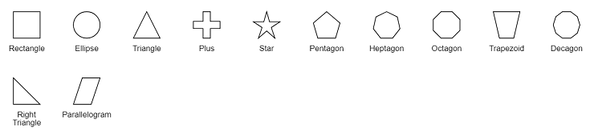

# Shapes in Vue Diagram component

Diagram provides support to add different kind of nodes. They are as follows:

* Text node
* Image node
* HTML node
* Native node
* Basic shapes
* Flow shapes

<!-- markdownlint-disable MD033 -->
<!-- markdownlint-disable MD010 -->

## Text

Texts can be added to the diagram as [`text`](https://helpej2.syncfusion.com/vue/documentation/api/diagram/node/#shape) node. The shape property of the node allows you to set the type of node and for text nodes, it should be set as **text**. In addition, define the content object that is used to define the text to be added and style is used to customize the appearance of that text. The following code illustrates how to create a text node.









        


## Image

Diagram allows to add images as [`image`](https://helpej2.syncfusion.com/vue/documentation/api/diagram/node/#shape) nodes. The shape property of node allows you to set the type of node and for image nodes, it should be set as **image**. In addition, the source property of shape enables you to set the image source.

The following code illustrates how an image node is created.









        


### Base64 Encoded Image Into The Image Node:

The following code illustrates how to add Base64 image into image node.









        


N> Deploy your HTML file in the web application and export the diagram (image node) or else the image node will not be exported in the Chrome and Firefox due to security issues. Refer to the following link.

Link 1: `http://asked.online/draw-images-on-canvas-locally-using-chrome/2546077/`

Link 2: `http://stackoverflow.com/questions/4761711/local-image-in-canvas-in-chrome`

### Image alignment

Stretch and align the image content anywhere but within the node boundary.

The scale property of the node allows to stretch the image as you desired (either to maintain proportion or to stretch). By default, the [`scale`](https://helpej2.syncfusion.com/vue/documentation/api/diagram/image/#scale) property of the node is set as **meet**. The [`align`](https://helpej2.syncfusion.com/vue/documentation/api/diagram/imageAlignment/) property is used to set the alignment of the image.

The following code illustrates how to use scale and align properties to stretch the image.









        


The following table illustrates all the possible scale options for the image node.

| Values | Images |
|-------- | -------- |
| None |  |
| Meet | |
| Slice | |
| Stretch | |

N> To visualize the changes in image scaling, it is essential to use the align property along with scale.

## HTML

Html elements can be embedded in the diagram through [`Html`](https://helpej2.syncfusion.com/vue/documentation/api/diagram/node/#shape) type node. The shape property of node allows you to set the type of node and to create a HTML node it should be set as `HTML`.

N> HTML node cannot be exported to image format, like JPEG, PNG, and BMP. It is by design, while exporting the diagram is drawn in a canvas. Further, this canvas is exported into image formats. Currently, drawing in a canvas equivalent from all possible HTML is not feasible. Hence, this limitation.

### HTML Node with contentTemplate.

To render an HTML node with a content template, we need to define the desired template string within the [`content`](https://helpej2.syncfusion.com/vue/documentation/api/diagram/htmlModel/#content) property. The following code illustrates how to create an HTML node with a content template:









        


#### Functional content template.

To render an HTML node using a functional template, we define a function that returns the template string. Within this function, modifications can be made based on the node's ID.

The following code illustrates how to render an HTML node using the function and manipulate its content dynamically.









        


### HTML Node With nodeTemplate

To render html node with nodeTemplate we need to define the nodeTemplate in the html file and assign it to the [`nodeTemplate`](https://helpej2.syncfusion.com/vue/documentation/api/diagram/#nodetemplate) property of the diagram. The following code illustrates how to render html node with nodeTemplate.









        


#### Functional nodeTemplate

We can define a function which returns a template string and assign it directly to the `nodeTemplate` property of diagram.

Refer the code example below.









        


## Native

Diagram provides support to embed SVG element into a node. The shape property of node allows you to set the type of node. To create a [`native`](https://helpej2.syncfusion.com/vue/documentation/api/diagram/node/#shape) node, it should be set as **native**. The following code illustrates how a native node is created.









        


N> Like HTML node, the native node also cannot be exported to image format. Fill color of native node can be overridden by the inline style or fill of the SVG element specified in the template.

### SVG content alignment

Stretch and align the svg content anywhere but within the node boundary.

The scale property of the node allows to stretch the svg content as you desired (either to maintain proportion or to stretch). By default, the [`scale`](https://helpej2.syncfusion.com/vue/documentation/api/diagram/nativeModel/#scale) property of native shape is set as **meet**.

The following tables illustrates all the possible scale options for the node.

| Values | Images |
|-------- | -------- |
| None |  |
| Meet |  |
| Slice |  |
| Stretch | |

## Basic shapes

* The [`Basic`](https://helpej2.syncfusion.com/vue/documentation/api/diagram/node/#shape) shapes are common shapes that are used to represent the geometrical information visually. To create basic shapes, the type of the shape should be set as **basic**. Its shape property can be set with any one of the built-in shape.

* To render a rounded rectangle, you need to set the type as basic and shape as rectangle. Set the [`cornerRadius`](https://helpej2.syncfusion.com/vue/documentation/api/diagram/basicShapeModel/#cornerradius) property to specify the radius of rounded rectangle.

The following code example illustrates how to create a basic shape.









        


N> By default, the `shape` property of the node is set as **basic**.

Default property for shape is Rectangle.

N> When the `shape` is not set for a basic shape, it is considered as a **rectangle**.

The list of basic shapes are as follows.

## Path

The [`Path`](https://helpej2.syncfusion.com/vue/documentation/api/diagram/node/#shape) shape is a commonly used basic shape that allows visually to represent the geometrical information. As node path data, any geometrical data can be provided. You can create your own Geometry and assign it to data if you want anything different from the standard figures. A geometry does not require any dimension specifications, such as width or height, because it specifies its own size. If the node’s size is set, the geometry is extended to fit the node’s dimensions.

To create a path node, specify the shape as Path. The [`data`](https://helpej2.syncfusion.com/vue/documentation/api/diagram/pathModel/#data) property of node allows you to define the path to be drawn. The following code illustrates how a path node is created.









        


## Flow Shapes

The [`flow`](https://helpej2.syncfusion.com/vue/documentation/api/diagram/node/#shape) shapes are used to represent the process flow. It is used for analyzing, designing, and managing for documentation process. To create a flow shape, specify the shape type as **flow**. Flow shapes and by default, it is considered as **process**. The following code example illustrates how to create a flow shape.









        


The list of flow shapes are as follows.

