# Style in Vue Diagram component

## Customizing the connector end point handle

Use the following CSS to customize the connector end point handle.

```scss

.e-diagram-endpoint-handle {
    fill: red;
    stroke: green;
    stroke-width: 3px;
   }

```
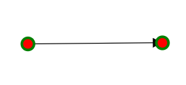

## Customizing the connector end point handle when connected

Use the following CSS to customize the connector end point handle when connected.

```scss

.e-diagram-endpoint-handle.e-connected {
    fill: red;
    stroke: green;
    stroke-width: 3px;
   }

```
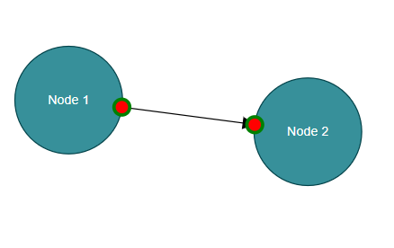

## Customizing the connector end point handle when disabled

Use the following CSS to customize the connector end point handle when disabled.

```scss

 .e-diagram-endpoint-handle.e-disabled {
      fill: lightgrey;
      opacity: 1;
      stroke: black;
    }

```
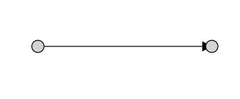

## Customizing the bezier segment thumb

Use the following CSS to customize the bezier segment thumb.

```scss

  .e-diagram-bezier-segment-handle{
      stroke:yellow;
      stroke-width:2px;
      fill:green;
  }

```
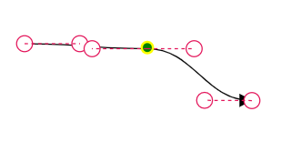

## Customizing the bezier control points

Use the following CSS to customize the bezier control points.

```scss

   .e-diagram-bezier-control-handle {
      stroke:yellow;
        stroke-width:2px;
        fill:green;
    }

```
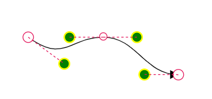

## Customizing the orthogonal segment thumb

Use the following CSS to customize the orthogonal segment thumb.

```scss

   .e-diagram-ortho-segment-handle {
        stroke:yellow;
          stroke-width:2px;
          fill:green;
      }

```
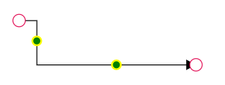

## Customizing the straight segment thumb

Use the following CSS to customize the straight segment thumb.

```scss

    .e-diagram-straight-segment-handle {
      stroke:yellow;
        stroke-width:2px;
        fill:green;
    }

```
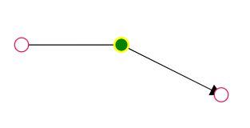

## Customizing the resize handle

Use the following CSS to customize the resize handle.

```scss

.e-diagram-resize-handle {
    fill: yellow;
    opacity: 1;
    stroke: orange;
  }
```

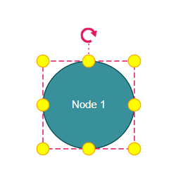

## Customizing the selector

Use the following CSS to customize the selector.

```scss

.e-diagram-selector{
    stroke:yellow;
    stroke-width:2px;
  }
```

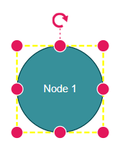

## Customizing the selector pivot line

Use the following CSS to customize the line between the selector and rotate handle.

```scss

 .e-diagram-pivot-line {
    stroke: black;
    stroke-width:2px;
  }

```
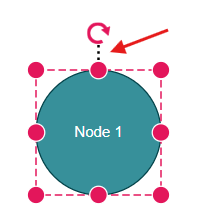

## Customizing the selector border

Use the following CSS to customize the selector border.

```scss

.e-diagram-border {
    stroke: red;
  }

```

## Customizing the rotate handle

Use the following CSS to customize the rotate handle properties.

```scss

.e-diagram-rotate-handle {
    fill: yellow;
    stroke: orange;
  }

```
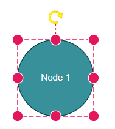

## Customizing the symbolpalette while hovering

Use the following CSS to customize the symbolpalette while hovering.

```scss

.e-symbolpalette .e-symbol-hover:hover {
    background: red;
  }

```
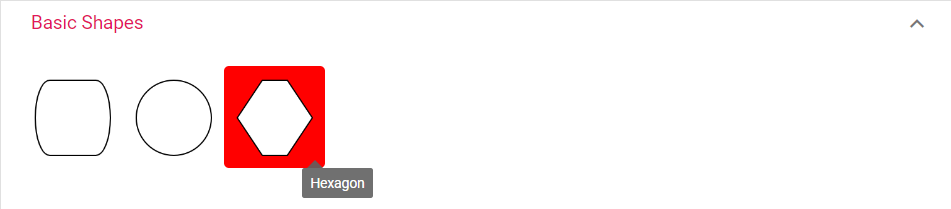

## Customizing the symbolpalette when selected

Use the following CSS to customize the symbolpalette when selected.

```scss

.e-symbolpalette .e-symbol-selected {
    background: yellow;
  }

```

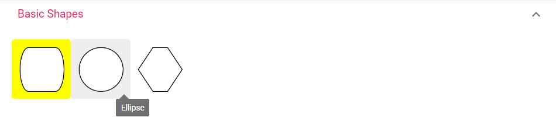

## Customizing the ruler

Use the following CSS to customize the ruler properties.

```scss

.e-diagram .e-ruler {
    background-color: blue;
    font-size: 13px;
  }

```
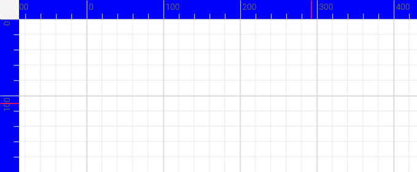

## Customizing the ruler overlap

Use the following CSS to ruler overlap properties.

```scss

.e-diagram .e-ruler-overlap {
    background-color: red;
  }

```
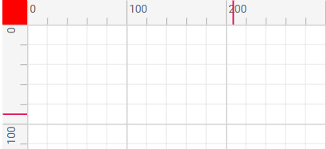

## Customizing the ruler marker color

Use the following CSS to customize the marker color

```scss

.e-diagram .e-d-ruler-marker {
        stroke: yellow;
        stroke-width:3px;
      }

```
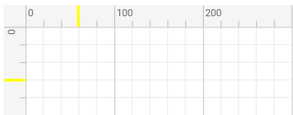

## Customizing the text edit

Use the following CSS to customize the text edit properties.

```scss

 .e-diagram .e-diagram-text-edit {
     background: white;
      border-color: blue;
      border-style: dashed;
      border-width: 3px;
      box-sizing: content-box;
      color: black;
      min-width: 50px;
  }

```
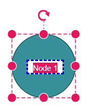 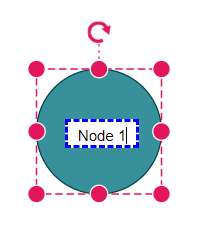 

## Customizing the text edit on selection

Use the following CSS to customize the text edit on selection properties.

```scss

 .e-diagram-text-edit::selection {
    background: yellow;
    color: green;
  }

```
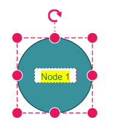 

## Customizing the page breaks

Use the following CSS to customize the page breaks line color

```scss
.e-diagram-page-break {
      stroke: red;
      stroke-width: 2px;
    }
```

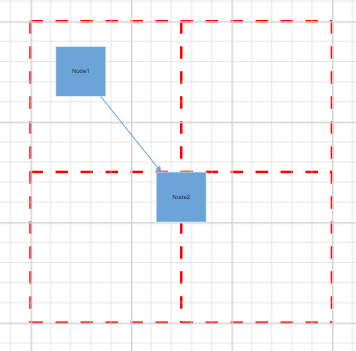 