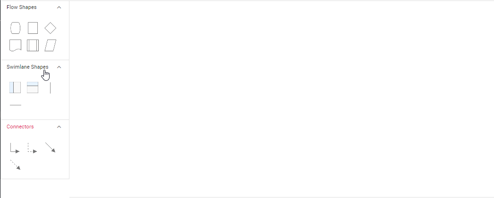

## Add swimlane to palette

Diagram provides support to add swimlane and phases to symbol palette. The following code sample illustrate how to add swimlane and phases to palette.









        


### Drag and drop swimlane to palette

* The drag and drop support for swimlane shapes has been provided.
* Horizontal lanes can be added to vertical swimlanes, and vice versa.
* The phase will only drop on swimlane shape with same orientation. The following image illustrates how to drag symbol from palette.

