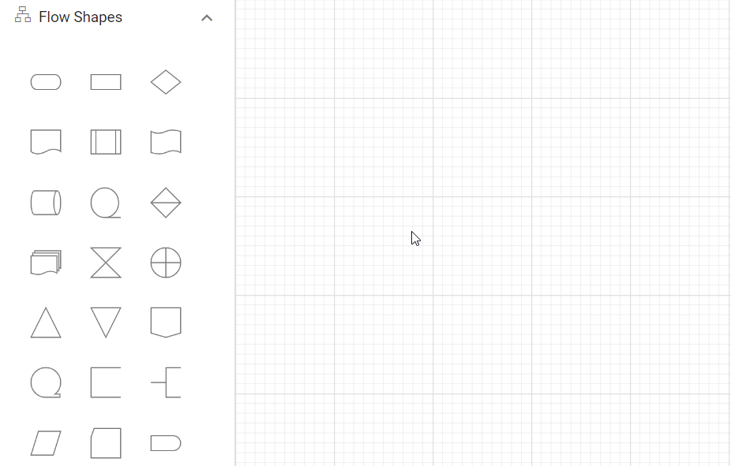

# Symbol palette in Vue Diagram component

The [`symbolPalette`](https://ej2.syncfusion.com/vue/documentation/api/symbol-palette/#symbolpalettecomponent)  is a gallery of reusable symbols and diagram elements that can be dragged and dropped on the diagram surface multiple times.

## Create symbol palette

The [`width`](https://ej2.syncfusion.com/vue/documentation/api/symbol-palette/#width) and [`height`](https://ej2.syncfusion.com/vue/documentation/api/symbol-palette/#height) property of the symbol palette allows to define the size of the symbol palette.
To create Symbol Palette easily and to add nodes and connectors in it, refer to the below video,




export default {
    name: 'app'
    data() {
        return {
            //Defines how many palettes can be at expanded mode at a time
            expandMode: "Multiple",
            //Defines the palette collection
            palettes: [{
                    //Sets the id of the palette
                    id: 'flow',
                    //Sets whether the palette expands/collapse its children
                    expanded: true,
                    //Adds the palette items to palette
                    symbols: flowshapes,
                    //Sets the header text of the palette
                    title: 'Flow Shapes',
                    iconCss: 'e-ddb-icons e-flow'
                },
                {
                    id: 'basic',
                    expanded: true,
                    symbols: basicShapes,
                    title: 'Basic Shapes',
                    iconCss: 'e-ddb-icons e-basic'
                },
                {
                    id: 'connectors',
                    expanded: true,
                    symbols: connectorSymbols,
                    title: 'Connectors',
                    iconCss: 'e-ddb-icons e-connector'
                }
            ],
            palettewidth: "100%",
            paletteheight: "700px",
            symbolHeight: 60,
            symbolWidth: 60,
            }
        }
    }


<!-- markdownlint-disable MD010 -->

## Add nodes and palettes to SymbolPalette

The collection of predefined symbols can be added to palettes using the [`symbols`](https://ej2.syncfusion.com/vue/documentation/api/diagram/paletteModel/#symbols) property.

A palette displays a group of related symbols and textually annotates the group with its header. A [`Palettes`](https://ej2.syncfusion.com/vue/documentation/api/diagram/palette/) can be added as a collection of symbol groups.

To initialize a palette, define a JSON object with the unique property [`ID`](https://ej2.syncfusion.com/vue/documentation/api/diagram/paletteModel/#id). Additionally, include the symbols property, which contains an array of different symbols.

The following code example illustrates how to define symbols in a palette and how to add them to the symbol palette:









        


## Add connectors in symbol palette

Connectors can be added to the symbol palette by defining them in the symbols array of the palette. 
The following example shows how to render connectors in the symbol palette:









        


## Add group nodes in symbol palette

The symbol palette supports adding group nodes. To add group nodes to the palette, the child nodes should be defined first, followed by the parent node. Refer to the following code to see how to render group nodes in the symbol palette:









        


## Drag and drop symbols from palette to diagram

To drag and drop symbols from the palette to the diagram canvas, press and hold the mouse button on the desired symbol in the palette, drag it to the desired location on the diagram canvas, and release the mouse button to drop it.



## Add symbols to palette at runtime

Symbols can be added to palette at runtime by using public method, [`addPaletteItem`](https://ej2.syncfusion.com/vue/documentation/api/symbol-palette/#addpaletteitem). The following example shows how to add shapes to the palette at runtime.









        


## Remove symbols from palette at runtime

Symbols can be removed from palette at runtime by using public method, [`removePaletteItem`](https://ej2.syncfusion.com/vue/documentation/api/symbol-palette/#removepaletteitem). The following example shows how to remove shapes from the palette at runtime.









        


## Symbol defaults

While adding more symbols such as nodes and connectors to the palette, you can define the default settings for those objects using the [`getNodeDefaults`](https://ej2.syncfusion.com/vue/documentation/api/diagram/symbolPaletteModel/#getnodedefaults) and the [`getConnectorDefaults`](https://ej2.syncfusion.com/vue/documentation/api/diagram/symbolPaletteModel/#getconnectordefaults) properties of symbol palette.
These properties allow you to specify default configurations for nodes and connectors, ensuring consistency and saving time when adding multiple symbols. By setting these properties, you can predefine attributes such as size, color, shape for nodes and line style, thickness, for connectors. 

In the following example, the fill color of node and target decorator shape of connector is defined in getNodeDefaults and getConnectorDefaults respectively.









        


## Add palettes at runtime

You can dynamically add palettes to the symbol palette at runtime to enhance flexibility and customization. This allows you to introduce new groups of symbols as needed without having to reload or reinitialize the diagram. The [`addPalettes`](https://ej2.syncfusion.com/vue/documentation/api/symbol-palette/#addpalettes) method of the symbol palette enables you to create and configure new palettes programmatically. This method takes parameters that define the palette's properties, such as the palette `ID`, `title`, and the `symbols` it contains.

Follow the example below to see how to add a palette at runtime.









        


## Remove palettes at runtime

You can remove palettes from the symbol palette at runtime. There are two ways to do this:

* Use the `removePalette` method to remove a single palette by its ID.
* Use the [`removePalettes`](https://ej2.syncfusion.com/vue/documentation/api/symbol-palette/#removepalettes) method to remove multiple palettes by passing an array of palette IDs as a parameter.

Follow the example below to see how to remove palettes at runtime.









        


## Stretch the symbols into the palette

The [`fit`](https://ej2.syncfusion.com/vue/documentation/api/diagram/symbolInfo/#fit) property defines whether the symbol has to be fit inside the size, that is defined by the symbol palette. For example, when you resize the rectangle in the symbol, ratio of the rectangle size has to be maintained rather changing into square shape. The following code example illustrates how to customize the symbol size.









        


## Refresh symbol palette

The `refresh` method allows you to refresh the symbols dynamically in the SymbolPalette.

```ts
//To refresh the symbols in symbol palette
symbolPalette.refresh();

```
