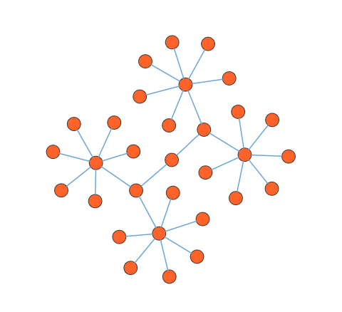

# Symmetric layout in Vue Diagram control

The symmetric layout has been formed using nodes position by closer together or pushing them further apart. This is repeated iteratively until the system comes to an equilibrium state.

## Symmetric layout

The layout’s [`springLength`](https://ej2.syncfusion.com/vue/documentation/api/diagram/layoutModel/#springlength) defined as how long edges should be, ideally. This will be the resting length for the springs. Edge attraction and vertex repulsion forces to be defined by using layout’s [`springFactor`](https://ej2.syncfusion.com/vue/documentation/api/diagram/layoutModel/#springfactor), the more sibling nodes repel each other. The relative positions do not change any more from one iteration to the next. The number of iterations can be specified by using layout’s [`maxIteration`](https://ej2.syncfusion.com/vue/documentation/api/diagram/layoutModel/#maxiteration).

The following code illustrates how to arrange the nodes in a radial tree structure.









        


>Note: If you want to use symmetric layout in diagram, you need to inject SymmetricLayout in the diagram.

