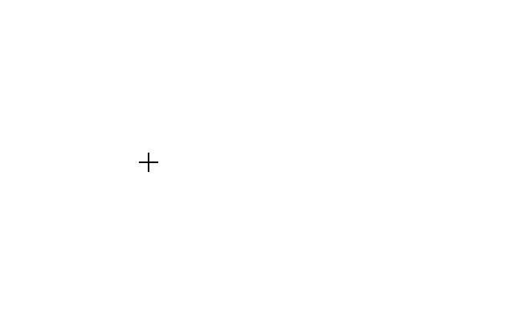

# Tools in Vue Diagram component

The tools in the diagram control can perform various actions such as selecting, panning, and drawing. These tools are explained below.

- `Select`: Allows you to choose specific elements within the diagram.
- `Pan`: Enables you to move the view of the diagram to different areas without altering the elements.
- `Draw`: Provides the ability to draw new shapes, connectors, on the diagram surface.

These tools are Essential&reg; for creating, editing, and navigating complex diagrams efficiently.

## Drawing tools

Drawing tool allows you to draw any kind of node/connector during runtime by clicking and dragging on the diagram page.

### Draw nodes

To draw a shape, set the JSON of that shape to the [`drawingObject`](https://ej2.syncfusion.com/vue/documentation/api/diagram/#drawingobject)  property of the diagram and activate the drawing tool by using the [`tool`](https://ej2.syncfusion.com/vue/documentation/api/diagram/#tool) property. The following code example illustrates how to draw a rectangle at runtime.









        


The following code example illustrates how to draw a path shape.









        


### Text Nodes

Similarly, you can draw a text node by setting the type of shape as 'Text' in the [`drawingObject`](https://ej2.syncfusion.com/vue/documentation/api/diagram/#drawingobject) property. The [`text`](https://ej2.syncfusion.com/vue/documentation/api/diagram/textModel/) type node contains a property called content, which specifies the text within the node. You can add the content to the text node once you finish drawing the node. Here is how you can draw a text node at runtime:









        


### Draw Connectors

To draw connectors, set the JSON of the connector to the drawType property. The drawing [`tool`](https://ej2.syncfusion.com/vue/documentation/api/diagram/#tool) can be activated by using the tool property. The following code example illustrates how to draw a straight line connector.









        


### Polygon shape

The diagram allows you to create polygon shapes by clicking and moving the mouse at runtime on the diagram page. This interactive feature enables users to define custom shapes with multiple sides by specifying points directly on the diagram canvas.

To draw a polygon shape, you need to set the [`drawingObject`](https://ej2.syncfusion.com/vue/documentation/api/diagram/#drawingobject) property with the appropriate JSON configuration for a `polygon`. This includes specifying the type as 'Polygon'.

The following code illustrates how to draw a polygon shape.









        


## Polyline Connector

Diagram allows to create the polyline segments with straight lines and angled vertices at the control points by clicking and moving the mouse at runtime on the diagram page.

To draw a polyline connector, set the type of the [`drawingObject`](https://ej2.syncfusion.com/vue/documentation/api/diagram/#drawingobject) as '`Polyline`'.

The following code illustrates how to draw a polyline connector.









        


 The segments of a polyline connector can be adjusted at runtime by dragging the segment thumb, as shown in the image below. To enable segment editing, you should set the [`DragSegmentThumb`](https://ej2.syncfusion.com/vue/documentation/api/diagram/connectorConstraints/) constraint for the connector.

N> To make the segment thumb visible, inject the [`ConnectorEditing`](https://ej2.syncfusion.com/vue/documentation/api/diagram/connectorEditing/) module into the diagram.

### Freehand Drawing

The diagram supports free-hand drawing, allowing users to draw anything independently on the diagram page. Free-hand drawing is enabled by setting the type of the [`drawingObject`](https://ej2.syncfusion.com/vue/documentation/api/diagram/#drawingobject) property to '`Freehand`'.

The following code illustrates how to perform freehand drawing:

The following code illustrates how to draw a freehand drawing.









        


The segments of a freehand connector can be adjusted at runtime by dragging the segment thumb, as shown in the image below. To enable segment editing, you should set the [`DragSegmentThumb`](https://ej2.syncfusion.com/vue/documentation/api/diagram/connectorConstraints/) constraint for the connector.

## Tool selection

There are some functionalities that can be achieved by clicking and dragging on the diagram surface. They are as follows.

* Draw selection rectangle: MultipleSelect tool
* Pan the diagram: Zoom pan
* Draw nodes/connectors: DrawOnce/DrawOnce

As all the three behaviors are completely different, you can achieve only one behavior at a time based on the tool that you choose. When more than one of those tools are applied, a tool is activated based on the precedence given in the following table.

|Precedence|Tools|Description|
|----------|-----|-----------|
|1st|ContinuesDraw|Allows you to draw the nodes or connectors continuously. Once it is activated, you cannot perform any other interaction in the diagram.|
|2nd|DrawOnce|Allows you to draw a single node or connector. Once you complete the DrawOnce action, SingleSelect, and MultipleSelect tools are automatically enabled.|
|3rd|ZoomPan|Allows you to pan the diagram. When you enable both the SingleSelect and ZoomPan tools, you can perform the basic interaction as the cursor hovers node/connector. Panning is enabled when cursor hovers the diagram.|
|4th|MultipleSelect|Allows you to select multiple nodes and connectors. When you enable both the MultipleSelect and ZoomPan tools, cursor hovers the diagram. When panning is enabled, you cannot select multiple nodes.|
|5th|SingleSelect|Allows you to select individual nodes or connectors.|
|6th|None|Disables all tools.|

These tools provide flexibility and functionality for creating and interacting with elements within the diagram interface.

### Zoom pan tool

To activate panning mode set the [`tool`](https://ej2.syncfusion.com/vue/documentation/api/diagram/#tool) property of the diagram as `ZoomPan`. The following code illustrates how to enable Zoom pan in the diagram









        


N> Please note that panning the diagram is not possible when 'multiplePage' is set to false if any diagram object (node or connector) is outside the defined page break area.

## Events

[`elementDraw`](https://ej2.syncfusion.com/vue/documentation/api/diagram/iElementDrawEventArgs/) event is triggered when node or connector is drawn using drawing tool.









        


