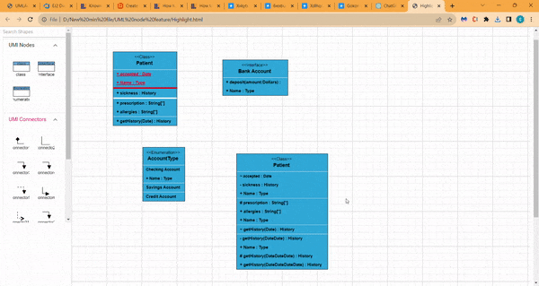
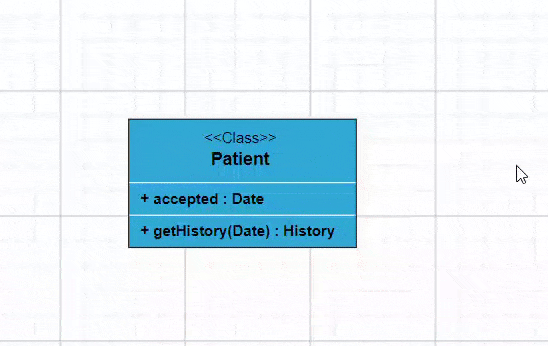
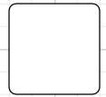

# UML diagram in Vue Diagram component

## UML Class Diagram

A class diagram visually depicts the static structure of an application and is extensively employed in modeling object-oriented systems. It holds a unique position in UML diagrams, as it directly aligns with object-oriented languages. The diagram also facilitates automatic generation of class diagram shapes based on business logic, streamlining the translation from conceptual models to practical implementation.

## UML Class Diagram Shapes

The UML class diagram shapes are explained as follows.

### Class

 A class defines a group of objects that share common specifications, features, constraints, and semantics. To create a class object, the classifier should be defined using the [`class`](https://ej2.syncfusion.com/vue/documentation/api/diagram/umlClassifierShapeModel#class) notation. This notation serves as a foundational element in object-oriented programming, encapsulating the Essential&reg; characteristics and behavior that objects belonging to the class will exhibit.

 Also, define the [`name`](https://ej2.syncfusion.com/vue/documentation/api/diagram/umlClassModel#name), [`attributes`](https://ej2.syncfusion.com/vue/documentation/api/diagram/umlClassModel#attributes-umlClassAttributeModel), and [`methods`](https://ej2.syncfusion.com/vue/documentation/api/diagram/umlClassModel#methods-umlClassMethodModel) of the class using the class property of node.

The attribute’s [`name`](https://ej2.syncfusion.com/vue/documentation/api/diagram/umlClassAttributeModel#name), [`type`](https://ej2.syncfusion.com/vue/documentation/api/diagram/umlClassAttributeModel#type), and [`scope`](https://ej2.syncfusion.com/vue/documentation/api/diagram/umlClassAttributeModel#scope-string) properties allow you to define the name, data type, and visibility of the attribute.

The method’s [`name`](https://ej2.syncfusion.com/vue/documentation/api/diagram/umlClassMethodModel#name), [`parameters`](https://ej2.syncfusion.com/vue/documentation/api/diagram/umlClassMethodModel#parameters), [`type`](https://ej2.syncfusion.com/vue/documentation/api/diagram/umlClassMethodModel#type), and [`scope`](https://ej2.syncfusion.com/vue/documentation/api/diagram/umlClassMethodModel#scope) properties allow you to define the name, parameter, return type, and visibility of the methods.

* The method [`parameters`](https://ej2.syncfusion.com/vue/documentation/api/diagram/umlClassMethodModel#parameters) object properties allow you to define the name and type of the parameter.

* The following code example illustrates how to create a class.









        


### Interface

* An [`interface`](https://ej2.syncfusion.com/vue/documentation/api/diagram/umlClassifierShapeModel#interface) is a specific type of classifier that signifies a declaration of a cohesive set of public features and obligations. When creating an interface, it involves defining the classifier property using the interface notation. This Essential&reg; concept in object-oriented programming outlines a contract for classes to adhere to, specifying the required methods and behaviors without delving into the implementation details.

Additionally, you can define the [`name`](https://ej2.syncfusion.com/vue/documentation/api/diagram/umlInterfaceModel#name), [`attributes`](https://ej2.syncfusion.com/vue/documentation/api/diagram/umlInterfaceModel#attributes), and [`methods`](https://ej2.syncfusion.com/vue/documentation/api/diagram/umlInterfaceModel#methods) of the interface using the interface property of the node.

The attributes' name, type, and scope properties allow you to specify the name, data type, and visibility of each attribute.

Similarly, the methods' name, parameters, type, and scope properties enable you to define the name, parameters, return type, and visibility of the methods.

The parameters object within methods allows you to specify the name and type of each parameter.

The following code example illustrates how to create an interface:









        


### Enumeration

To establish an enumeration, designate the classifier property of the node as [enumeration](https://ej2.syncfusion.com/vue/documentation/api/diagram/umlClassifierShapeModel#enumeration). Additionally, define the [`name`](https://ej2.syncfusion.com/vue/documentation/api/diagram/umlEnumerationModel/#name) and enumerate the [`members`](https://ej2.syncfusion.com/vue/documentation/api/diagram/umlEnumerationMemberModel/) of the enumeration using the appropriate enumeration property of the node. This process encapsulates a set of distinct values within the enumeration, allowing for a clear representation of specific and named constants within a system.

You can set a name for the enumeration members collection using the [`name`](https://ej2.syncfusion.com/vue/documentation/api/diagram/umlEnumerationMemberModel/#name) property of members collection.

The following code example illustrates how to create an enumeration.









        


## UML Class Relationships

A class may be involved in one or more relationships with other classes. A relationship can be one of the following types:

| Shape       | Image                                |
| ----------- | ------------------------------------ |
| Association |  |
| Aggregation |   |
| Composition |  |
| Inheritance |   |
| Dependency  |  |

### Association

`Association` is basically a set of links that connects elements of a UML model. The type of association is as follows.

    1. Directional
    2. BiDirectional

The association property allows you to define the type of association. The default value of association is `“Directional”`. The following code example illustrates how to create an association.









        


### Aggregation

`Aggregation` is a binary association between a property and one or more composite objects that group together a set of instances. Aggregation is decorated with a hollow diamond. To create an aggregation shape, define the [`relationship`](https://ej2.syncfusion.com/vue/documentation/api/diagram/relationShipModel/#relationship) of connector shape as “Aggregation”.

The following code example illustrates how to create an aggregation.









        


### Composition

Composition is a strong form of `aggregation`. The composition is decorated with a black diamond. To create a composition shape, define the [`relationship`](https://ej2.syncfusion.com/vue/documentation/api/diagram/relationShipModel/#relationship) property of the connector shape as "Composition".

The following code example illustrates how to create a composition.









        


### Inheritance

Inheritance is also called as “generalization”. Inheritance is a binary taxonomic directed relationship between a more general classifier (super class) and a more specific classifier (subclass). Inheritance is shown as a line with hollow triangle.

To create an inheritance, define the [`relationship`](https://ej2.syncfusion.com/vue/documentation/api/diagram/relationShipModel/#relationship) as “inheritance”.

The following code example illustrates how to create an inheritance.









        


### Dependency

Dependency is a directed relationship, which is used to show that some UML elements needs or depends on other model elements for specifications. Dependency is shown as dashed line with opened arrow. To create a dependency, define the [`relationship`](https://ej2.syncfusion.com/vue/documentation/api/diagram/relationShipModel/#relationship) property of connector shape as “dependency”.

The following code example illustrates how to create an dependency.









        


### Multiplicity

Multiplicity is a definition of an inclusive interval of non-negative integers to specify the allowable number of instances of described element. The type of multiplicity are as follows.

    1. OneToOne
    2. ManyToOne
    3. OneToMany
    4. ManyToMany

By default the multiplicity will be considered as “OneToOne”.

The multiplicity property in UML allows you to specify large number of elements or some collection of elements.

The shape multiplicity’s [`source`](https://ej2.syncfusion.com/vue/documentation/api/diagram/classifierMultiplicityModel/#source) property is used to set the source label to connector and the [`target`](https://ej2.syncfusion.com/vue/documentation/api/diagram/classifierMultiplicityModel/#target) property is used to set the target label to connector.

To set an optionality or cardinality for the connector source label, use [`optional`](../api/diagram/multiplicityLabelModel/#optional) property.

The [`lowerBounds`](https://ej2.syncfusion.com/vue/documentation/api/diagram/multiplicityLabelModel#lowerBounds) and [`upperBounds`](https://ej2.syncfusion.com/vue/documentation/api/diagram/multiplicityLabelModel#upperBounds) could be natural constants or constant expressions evaluated to natural (non negative) number. Upper bound could be also specified as asterisk ‘\*’ which denotes unlimited number of elements. Upper bound should be greater than or equal to the lower bound.

* The following code example illustrates how to customize the multiplicity.









        


## How to add UML child at runtime

In UML nodes, child elements such as member, method and attribute can be added either programmatically or interactively.

### Adding UML child through code

The [addChildToUmlNode](https://ej2.syncfusion.com/vue/documentation/api/diagram#addchildtoumlnode) method is employed for dynamically adding a child to the UML node during runtime, providing flexibility in modifying the diagram structure programmatically.

The following code example illustrates how to add members, methods and attributes to UML node at rumtime.









        


### Adding UML child through user interaction

To include a child, select a node, move the mouse outside it, and position the pointer near the right side. A highlighter emerges between the two child elements. Click the highlighter to add a child type to the chosen UML node seamlessly. The following gif illustrates how to add Child through user interaction.

## Adding UML Nodes in Symbol palette

UML built-in shapes are easily rendered in a symbol palette. The [`symbols`](https://ej2.syncfusion.com/vue/documentation/api/diagram/paletteModel/#symbols) property of [`palettes`](https://ej2.syncfusion.com/vue/documentation/api/diagram/paletteModel/) is used to define UML symbols with the necessary classes and methods. This feature allows you to add a collection of predefined UML symbols to the palette, making your UML diagramming application more versatile.

The following code example showcases the rendering of UML built-in shapes in a symbol palette.









        


## Editing in UML nodes

You can edit the name, attributes, and methods of the class diagram shapes just double clicking, similar to editing a node annotation.

The following image illustrates how the text editor looks in an edit mode.

## UML Activity diagram

An Activity diagram functions as a visual flowchart, illustrating the progression from one activity to the next within a system. Each activity corresponds to a system operation, providing a clear depiction of the sequential flow in a dynamic process..

The purpose of an activity diagram can be described as follows.

    1. Draw the activity flow of a system.

    2. Describe the sequence from one activity to another.

    3. Describe the parallel, branched, and concurrent flow of the system.
    
### UML Activity diagram Shapes

To create a UmlActivity, define the [`type`](https://ej2.syncfusion.com/vue/documentation/api/diagram/umlActivityShapeModel/#type) as "UmlActivity" and set the list of built-in shapes in the [`shape`](https://ej2.syncfusion.com/vue/documentation/api/diagram/umlActivityShapeModel/#shape) property as demonstrated below.

| Shape          | Image                                    |
| -------------- | ---------------------------------------- |
| Action         |           |
| Decision       |          |
| MergeNode      |        |
| InitialNode    |        |
| FinalNode      |       |
| ForkNode       |        |
| JoinNode       |        |
| TimeEvent      |       |
| AcceptingEvent |  |
| SendSignal     |      |
| ReceiveSignal  |   |
| StructuredNode |  |
| Note           |            |

The following code illustrates how to create a UMLActivity shapes.









        


### UMLActivity connector

To establish a UMLActivity connector, specify the [`type`](https://ej2.syncfusion.com/vue/documentation/api/diagram/relationShipModel/#type) of connector shape as "UMLActivity" and define the flow as either "Exception," "Control," or "Object." This configuration delineates the nature of the connection, allowing for a precise representation of the interaction within the activity diagram.

The following code illustrates how to create a UMLActivity connector.









        
