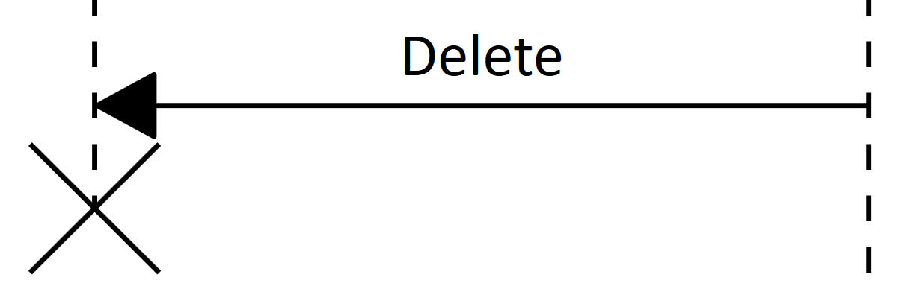
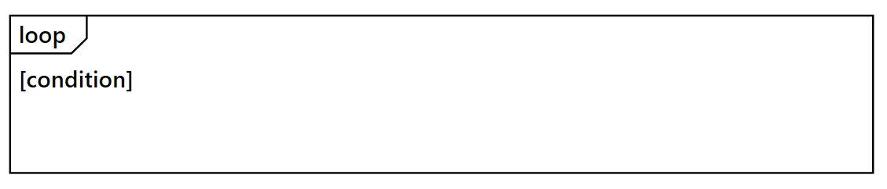

# UML Sequence Diagram in Vue Diagram component

A UML sequence diagram is an interaction diagram that demonstrates how objects interact with each other and the order of these interactions. The Syncfusion® diagram control provides comprehensive support for creating and visualizing UML sequence diagrams through the [UmlSequenceDiagramModel](https://ej2.syncfusion.com/vue/documentation/api/diagram/umlSequenceDiagramModel). To enable this functionality, assign the `UmlSequenceDiagramModel` to the [model](https://ej2.syncfusion.com/vue/documentation/api/diagram/#model) property of the diagram control.

## UML Sequence Diagram Elements

A sequence diagram includes several key elements such as participants, messages, activation boxes, and fragments. The sections below demonstrate how to define and configure these components using the diagram control.

### Participants

[UmlSequenceParticipantModel](https://ej2.syncfusion.com/vue/documentation/api/diagram/umlSequenceParticipantModel/) in a sequence diagram represent the entities that interact with each other, appearing at the top of the diagram with lifelines extending vertically downward.

#### UmlSequenceParticipantModel Properties

| Property | Type | Description |
|---|---|---|
| id | string \| number | A unique identifier for the participant |
| content | string | The display text for the participant |
| isActor | boolean | Specifies whether the participant is displayed as an actor (true) or an object (false) |
| showDestructionMarker | boolean | Indicates whether a destruction marker (X) is shown at the end of the lifeline |
| activationBoxes | UmlSequenceActivationBoxModel[] | A collection of activation boxes associated with the participant |

The following code example illustrates how to create participants.









        


### Messages

[UmlSequenceMessageModel](https://ej2.syncfusion.com/vue/documentation/api/diagram/umlSequenceMessageModel/) represents communication between participants and are displayed as arrows connecting lifelines.

#### Types of Messages

| Message Type | Description | Example |
|---|---|---|
| Synchronous | The sender waits for a response |  |
| Asynchronous | The sender continues without waiting |  |
| Reply | A response to a previous message |  |
| Create | Creates a new participant |  |
| Delete | Terminates a participant |  |
| Self | A message from a participant to itself |  |

#### UmlSequenceMessageModel Properties

| Property | Type | Description |
|---|---|---|
| id | string \| number | A unique identifier for the message |
| content | string | The display text for the message |
| fromParticipantID | string \| number | ID of the participant sending the message |
| toParticipantID | string \| number | ID of the participant receiving the message |
| type | UmlSequenceMessageType | Type of the message (Synchronous, Asynchronous, Reply, Create, Delete, Self) |

The following code example illustrates how to create messages:









        


### Activation Boxes

[UmlSequenceActivationBoxModel](https://ej2.syncfusion.com/vue/documentation/api/diagram/umlSequenceActivationBoxModel) represents periods when a participant is active and processing a message. They appear as thin rectangles on participant lifelines.

#### UmlSequenceActivationBoxModel Properties

| Property | Type | Description |
|---|---|---|
| id | string \| number | A unique identifier for the activation box |
| startMessageID | string \| number | ID of the message that initiates the activation |
| endMessageID | string \| number | ID of the message that terminates the activation |

The following code example illustrates how to create activation boxes.









        


### Fragments

[UmlSequenceFragmentModel](https://ej2.syncfusion.com/vue/documentation/api/diagram/umlSequenceFragmentModel) groups a set of messages based on specific conditions in a sequence diagram. They are displayed as rectangular enclosures that visually separate conditional or looping interactions.

#### Types of Fragments

The [UmlSequenceFragmentType](https://ej2.syncfusion.com/vue/documentation/api/diagram/umlSequenceFragmentType) enum defines the following fragment types:

| Fragment Type  | Description  | Example  |  
|---------------|-------------|--------|  
| Optional  | Represents a sequence that is executed only if a specified condition is met; otherwise, it is skipped. |  |  
| Alternative | Represents multiple conditional paths (if-else structure), where only one path executes based on the condition. |  |  
| Loop | Represents a repeating sequence of interactions that continues based on a loop condition. |  |  

#### UmlSequenceFragmentModel Properties

| Property | Type | Description |
|---|---|---|
| id | string \| number | A unique identifier for the fragment |
| type | UmlSequenceFragmentType | Type of the fragment (Optional, Loop, Alternative) |
| conditions | UmlSequenceFragmentConditionModel[] | Collection of conditions for the fragment |

#### UmlSequenceFragmentConditionModel Properties

| Property | Type | Description |
|---|---|---|
| content | string | Text describing the condition or parameter |
| messageIds | (string \| number)[] | Collection of message IDs included in this condition section |
| fragmentIds | string[] | Collection of nested fragments ids (for complex structures) |

The following code example illustrates how to create fragments.









        


### Customizing Participant Spacing in Sequence Diagram 

The [spaceBetweenParticipants](https://ej2.syncfusion.com/vue/documentation/api/diagram/umlSequenceDiagramModel/#spaceBetweenParticipants) property in `UmlSequenceDiagramModel` controls the horizontal spacing between participants. The default value is 100, and it can be adjusted based on your layout requirements.

```javascript
// Define the UML Sequence Diagram model
const model = {
  // Define the space between participants
  spaceBetweenParticipants: 300,
  participants: participants,    // collection of participants in the sequence diagram  
  messages: messages,            // collection of messages exchanged between participants  
  fragments: fragments           // collection of sequence diagram fragments (opt, alt, loop) 
}
```