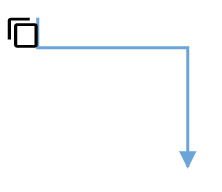
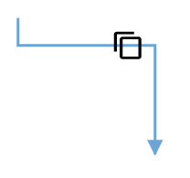

# User handle in Vue Diagram component

* User handles are used to add some frequently used commands around the selector. To create user handles, define and add them to the [`userHandles`](https://ej2.syncfusion.com/vue/documentation/api/diagram/selectorModel#userHandles-userhandlemodel[]) collection of the [`selectedItems`](https://ej2.syncfusion.com/vue/documentation/api/diagram#selectAll#selecteditems-selectormodel) property.
* The name property of user handle is used to define the name of the user handle and its further used to find the user handle at runtime and do any customization.

## Alignment

User handles can be aligned relative to the node boundaries. It has [`margin`](https://ej2.syncfusion.com/vue/documentation/api/diagram/userHandle#margin-marginmodel), [`offset`](https://ej2.syncfusion.com/vue/documentation/api/diagram/userHandle#offset-number), [`side`](https://ej2.syncfusion.com/vue/documentation/api/diagram/userHandle#side-side), [`horizontalAlignment`](https://ej2.syncfusion.com/vue/documentation/api/diagram/userHandle#horizontalalignment-horizontalalignment), and [`verticalAlignment`](https://ej2.syncfusion.com/vue/documentation/api/diagram/userHandle#verticalalignment-verticalalignment) settings. It is quite tricky when all four alignments are used together but gives more control over alignment.

### Offset for user handle

The [`offset`](https://ej2.syncfusion.com/vue/documentation/api/diagram/userHandle#offset-number) property of [`userHandles`](https://ej2.syncfusion.com/vue/documentation/api/diagram/selectorModel#userHandles-userhandlemodel[]) is used to align the user handle based on fractions. 0 represents top/left corner, 1 represents bottom/right corner, and 0.5 represents half of width/height.

### Side

The [`side`](https://ej2.syncfusion.com/vue/documentation/api/diagram/userHandle#side-side) property of [`userHandles`](https://ej2.syncfusion.com/vue/documentation/api/diagram/selectorModel#userHandles-userhandlemodel[]) is used to align the user handle by using the [`Top`](https://ej2.syncfusion.com/vue/documentation/api/diagram/side#top), [`Bottom`](https://ej2.syncfusion.com/vue/documentation/api/diagram/side#bottom), [`Left`](https://ej2.syncfusion.com/vue/documentation/api/diagram/side#left), and [`Right`](https://ej2.syncfusion.com/vue/documentation/api/diagram/side#right) options.

### Horizontal and vertical alignments

The [`horizontalAlignment`](https://ej2.syncfusion.com/vue/documentation/api/diagram/userHandle#horizontalalignment-horizontalalignment) property of [`userHandles`](https://ej2.syncfusion.com/vue/documentation/api/diagram/selectorModel#userHandles-userhandlemodel[]) is used to set how the user handle is horizontally aligned at the position based on the [`offset`](https://ej2.syncfusion.com/vue/documentation/api/diagram/userHandle#offset-number). The [`verticalAlignment`](https://ej2.syncfusion.com/vue/documentation/api/diagram/userHandle#verticalalignment-verticalalignment) property is used to set how user handle is vertically aligned at the position.

### Margin for user handle

Margin is an absolute value used to add some blank space in any one of its four sides. The [`userHandles`](https://ej2.syncfusion.com/vue/documentation/api/diagram/selectorModel#userHandles-userhandlemodel[]) can be displaced with the [`margin`](https://ej2.syncfusion.com/vue/documentation/api/diagram/userHandle#margin-marginmodel) property.

### Appearance

The appearance of the user handle can be customized by using the [`size`](https://ej2.syncfusion.com/vue/documentation/api/diagram/userHandle#size-number), [`borderColor`](https://ej2.syncfusion.com/vue/documentation/api/diagram/userHandle#bordercolor-string), [`backgroundColor`](https://ej2.syncfusion.com/vue/documentation/api/diagram/userHandle#backgroundcolor-string), [`visible`](https://ej2.syncfusion.com/vue/documentation/api/diagram/userHandle#visible-boolean), [`pathData`](https://ej2.syncfusion.com/vue/documentation/api/diagram/userHandle#pathdata-string), and [`pathColor`](https://ej2.syncfusion.com/vue/documentation/api/diagram/userHandle#pathcolor-string) properties of the [`userHandles`](https://ej2.syncfusion.com/vue/documentation/api/diagram/selectorModel#userHandles-userhandlemodel[]).









        


## Fixed user handles

The fixed user handles are used to add some frequently used commands around the node and connector even without selecting it.

## Initialization an fixed user handles

To create the fixed user handles, define and add them to the collection of nodes and connectors property. The following code example used to create an fixed user handles for the  nodes and connectors.









        


## Customization

* The id property of fixed user handle is used to define the unique identification of the fixed user handle and it is further used to add custom events to the fixed user handle.

* The fixed user handle can be positioned relative to the node and connector boundaries. It has offset, padding and cornerRadius settings. It is used to position and customize the fixed user handle.

* The `Padding` is used to leave the space that is inside the fixed user handle between the icon and the border.

* The corner radius allows to create fixed user handles with rounded corners. The radius of the rounded corner is set with the `cornerRadius` property.

>Note: The PathData needs to be provided to render fixed user handle.

### Size

 Diagram allows you set size for the fixed user handles by using the `width` and `height` property. The default value of the width and height property is 10.

### Style

* You can change the style of the fixed user handles with the specific properties of borderColor, borderWidth, and background color using the handleStrokeColor, handleStrokeWidth, and fill properties, and the icon borderColor, and borderWidth using the iconStrokeColor and iconStrokeWidth.

* The fixed user handle's `iconStrokeColor` and `iconStrokeWidth` property used to change the stroke color and stroke width of the given `pathData`.

* The fixed user handle `handleStrokeColor` and, `fill` properties are used to define the background color and border color of the user handle and the `handleStrokeWidth` property is used to define the border width of the fixed user handle.

* The `visible` property of the fixed user handle enables or disables the visibility of fixed user handle.

The following code explains how to customize the appearance of the fixed user handles.









        

>Note: The Fixed user handle id should need to be unique.

## Customizing the node fixed user handle

* The node fixed user handle can be aligned relative to the node boundaries. It has `margin` and `offset` settings. It is quite useful to position the node fixed user handle and used together and gives you more control over the node fixed user handle positioning.

### Margin for the node fixed user handle

Margin is an absolute value used to add some blank space in any one of its four sides. The fixed user handle can be displaced with the `margin` property.

### Offset for the node fixed user handle

The `offset` property of fixed user handle is used to align the user handle based on the `x` and `y` points. (0,0) represents the top or left corner and (1,1) represents the bottom or right corner.

The following table shows all the possible alignments visually shows the fixed user handle positions.

| Offset | Margin | Output |
| -------- | -------- | -------- |
| (0,0) | Right = 20 ||
| (0.5,0) | Bottom = 20 ||
| (1,0) | Left = 20 ||
| (0,0.5) | Right = 20 ||
| (0,1) | Left = 20 ||
| (0,1) | Right = 20 ||
| (0.5,1) | Top = 20 ||
| (1,1) | Left = 20 ||

The following code explains how to customize the node fixed user handle.









        


## Customizing the connector fixed user handle

* The connector fixed user handle can be aligned relative to the connector boundaries. It has alignment, displacement and offset settings. It is useful to position the connector fixed userhandle and used together and gives you more control over the connector fixed user handle positioning.

* The `offset` and `alignment` properties of fixed user handle allows you to align the connector fixed user handles to the segments.

### Offset for the connector fixed user handle

The `offset` property of connector fixed user handle is used to align the user handle based on fractions. 0 represents the connector source point, 1 represents the connector target point, and 0.5 represents the center point of the connector segment.

### Alignment

The connector’s fixed user handle can be aligned over its segment path using the `alignment` property of fixed user handle.

The following table shows all the possible alignments visually shows the fixed user handle positions.

| Offset | Alignment | Output |
| -------- | -------- | -------- |
| 0 | Before ||
| 0.5 | Center ||
| 1 | After ||

### Displacement

* The `displacement` property allows you to specify the space to be left from the connector segment based on the x and y value provided.

The following table shows all the possible alignments visually shows the fixed user handle positions.

| Displacement | Alignment | Output |
| -------- | -------- | -------- |
| x=10 | Before ||
| x=10 | After ||
| y=10 | Before ||
| y=10 | After ||

>Note: Displacement will not be done if the alignment is set to be center.

The following code explains how to customize the connector fixed user handle.









        


### Tooltip support for User Handle

The diagram provides support to show tooltip when the mouse hovers over any user handle.
To show tooltip on mouse over, the [`tooltip`](https://ej2.syncfusion.com/vue/documentation/api/diagram#tooltip) property of diagram model needs to be set with the tooltip [`content`](https://ej2.syncfusion.com/vue/documentation/api/diagram/diagramTooltip/#content) and [`position`](https://ej2.syncfusion.com/vue/documentation/api/diagram/diagramTooltip/#position) as shown in the following example.









        


### Tooltip support for Fixed User Handle

The diagram provides support to show tooltip when the mouse hovers over any fixed user handle. To show the tooltip on mouse over, the [`tooltip`](../api/diagram#tooltip) property of diagram model needs to be set with the tooltip [`content`](../api/diagram/diagramTooltip/#content) and [`position`](../api/diagram/diagramTooltip/#position) as shown in the following example.









        


### Customizing Fixed User Handles with HTML Templates

Fixed user handles are interactive elements added to nodes and connectors. Their appearance can be customized using HTML templates. To render fixed user handle with HTML templates, we need to create an HTML element inside a `template` tag then add the template reference using the [`fixedUserHandleTemplate`](https://ej2.syncfusion.com/vue/documentation/api/diagram/selectorModel#userHandles-fixeduserhandletemplate) property in the diagram model.









        
