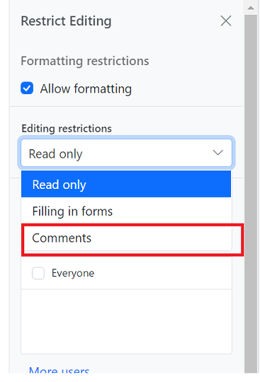

# Comments in Vue Document editor component

Document Editor allows you to add comments to documents. You can add, navigate and remove comments in code and from the UI.

## Add a new comment

Comments can be inserted to the selected text.

```ts
this.$refs.documenteditor.ej2Instances.editor.insertComment("Test comment");
```

## Comment navigation

Next and previous comments can be navigated using the below code snippet.

```ts
//Navigate to next comment
this.$refs.documenteditor.ej2Instances.selection.navigateNextComment();

//Navigate to previous comment
this.$refs.documenteditor.ej2Instances.selection.navigatePreviousComment();
```

## Delete comment

Current comment can be be deleted using the below code snippet.

```ts
this.$refs.documenteditor.ej2Instances.editor.deleteComment();
```

## Delete all comment

All the comments in the document can be deleted using the below code snippet.

```ts
this.$refs.documenteditor.ej2Instances.editor.deleteAllComments();
```

## Protect the document in comments only mode

Document Editor provides support for protecting the document with `CommentsOnly` protection. In this protection, user allowed to add or edit comments alone in the document.

Document editor provides an option to protect and unprotect document using [`enforceProtection`](https://ej2.syncfusion.com/vue/documentation/api/document-editor/editor/#enforceprotection) and [`stopProtection`](https://ej2.syncfusion.com/vue/documentation/api/document-editor/editor/#stopprotection) API.

The following example code illustrates how to enforce and stop protection in Document editor container.




<template>
  <div id="app">
    <ejs-documenteditorcontainer ref='container' :serviceUrl='serviceUrl' height="590px" id='container'
      :enableToolbar='true'>
    </ejs-documenteditorcontainer>
  </div>
</template>
<script setup>
import { onMounted, ref, provide } from 'vue';
import { DocumentEditorContainerComponent as EjsDocumenteditorcontainer, Toolbar } from '@syncfusion/ej2-vue-documenteditor';

const container = ref(null);
const serviceUrl = 'https://ej2services.syncfusion.com/production/web-services/api/documenteditor/';

provide('DocumentEditorContainer', [Toolbar]);

onMounted(function () {
  //enforce protection
  container.value.ej2Instances.documentEditor.editor.enforceProtection('123', 'CommentsOnly');
  //stop the document protection
  container.value.ej2Instances.documentEditor.editor.stopProtection('123');
})

</script>




<template>
  <div id="app">
    <ejs-documenteditorcontainer ref='container' :serviceUrl='serviceUrl' height="590px" id='container'
      :enableToolbar='true'>
    </ejs-documenteditorcontainer>
  </div>
</template>
<script>
import { DocumentEditorContainerComponent, Toolbar } from '@syncfusion/ej2-vue-documenteditor';

export default {
  components: {
    'ejs-documenteditorcontainer': DocumentEditorContainerComponent
  },
  data() {
    return { serviceUrl: 'https://ej2services.syncfusion.com/production/web-services/api/documenteditor/' };
  },
  provide: {//Inject require modules.
    DocumentEditorContainer: [Toolbar]
  },
  mounted() {
    //enforce protection
    this.$refs.container.ej2Instances.documentEditor.editor.enforceProtection('123', 'CommentsOnly');
    //stop the document protection
    this.$refs.container.ej2Instances.documentEditor.editor.stopProtection('123');
  }
}
</script>




Comment only protection can be enabled in UI by using [Restrict Editing pane](../document-editor/document-management#restrict-editing-pane)



>Note: In enforce Protection method, first parameter denotes password and second parameter denotes protection type. Possible values of protection type are `NoProtection |ReadOnly |FormFieldsOnly |CommentsOnly`. In stop protection method, parameter denotes the password.

## Mention support in Comments

Mention support displays a list of items that users can select or tag from the suggested list. To use this feature, type the @ character in the comment box and select or tag the user from the suggestion list.

The following example illustrates how to enable mention support in the Document Editor

```
<template>
    <div id="app">
      <ejs-documenteditorcontainer ref='documenteditor' :serviceUrl='serviceUrl' :documentEditorSettings='settings' height="590px" id='container' :enableToolbar='true'></ejs-documenteditorcontainer>
    </div>
</template>
<script>
  import Vue from 'vue';
  import { DocumentEditorContainerPlugin, DocumentEditorContainerComponent,Toolbar} from '@syncfusion/ej2-vue-documenteditor';
  Vue.use(DocumentEditorContainerPlugin);
  let mentionData =  [
                { "Name": "Selma Rose", "Eimg": "3", "EmailId": "selma@mycompany.com" },
                { "Name": "Russo Kay", "Eimg": "8", "EmailId": "russo@mycompany.com" },
                { "Name": "Camden Kate", "Eimg": "9", "EmailId": "camden@mycompany.com" },
                { "Name": "Mary Kate", "Eimg": "4", "EmailId": "marry@mycompany.com" },
                { "Name": "Ursula Ann", "Eimg": "2", "EmailId": "ursula@mycompany.com" },
                { "Name": "Margaret", "Eimg": "5", "EmailId": "margaret@mycompany.com" },
                { "Name": "Laura Grace", "Eimg": "6", "EmailId": "laura@mycompany.com" },
                { "Name": "Robert", "Eimg": "8", "EmailId": "robert@mycompany.com" },
                { "Name": "Albert", "Eimg": "9", "EmailId": "albert@mycompany.com" },
                { "Name": "Michale", "Eimg": "10", "EmailId": "michale@mycompany.com" },
                { "Name": "Andrew James", "Eimg": "7", "EmailId": "james@mycompany.com" },
                { "Name": "Rosalie", "Eimg": "4", "EmailId": "rosalie@mycompany.com" },
                { "Name": "Stella Ruth", "Eimg": "2", "EmailId": "stella@mycompany.com" },
                { "Name": "Richard Rose", "Eimg": "10", "EmailId": "richard@mycompany.com" },
                { "Name": "Gabrielle", "Eimg": "3", "EmailId": "gabrielle@mycompany.com" },
                { "Name": "Thomas", "Eimg": "7", "EmailId": "thomas@mycompany.com" },
                { "Name": "Charles Danny", "Eimg": "8", "EmailId": "charles@mycompany.com" },
                { "Name": "Daniel", "Eimg": "10", "EmailId": "daniel@mycompany.com" },
                { "Name": "Matthew", "Eimg": "7", "EmailId": "matthew@mycompany.com" },
                { "Name": "Donald Krish", "Eimg": "9", "EmailId": "donald@mycompany.com" },
                { "Name": "Yohana", "Eimg": "1", "EmailId": "yohana@mycompany.com" },
                { "Name": "Kevin Paul", "Eimg": "10", "EmailId": "kevin@mycompany.com" },
                { "Name": "Andrew Fuller", "Eimg": "3", "EmailId": "andrew@mycompany.com"}
            ];
  export default {
    data() {
      return { serviceUrl:'https://ej2services.syncfusion.com/production/web-services/api/documenteditor/',
      settings: { mentionSettings: { dataSource: mentionData, fields: { text: 'Name' }} }},
    },
    provide: {
      //Inject require modules.
      DocumentEditorContainer: [Toolbar]
    }
  }
</script>
```