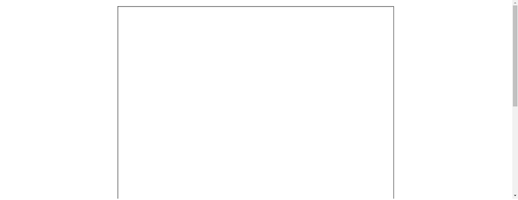
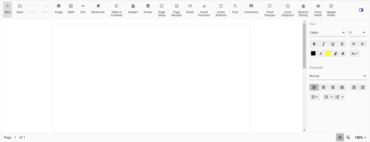

# Getting Started with Syncfusion Document Editor Component in Vue 3

This article provides a step-by-step guide for setting up a [Vite](https://vitejs.dev/) project with a JavaScript environment and integrating the Syncfusion Vue Document Editor component using the [Composition API](https://vuejs.org/guide/introduction.html#composition-api) / [Options API](https://vuejs.org/guide/introduction.html#options-api).

The `Composition API` is a new feature introduced in Vue.js 3 that provides an alternative way to organize and reuse component logic. It allows developers to write components as functions that use smaller, reusable functions called composition functions to manage their properties and behavior.

The `Options API` is the traditional way of writing Vue.js components, where the component logic is organized into a series of options that define the component's properties and behavior. These options include data, methods, computed properties, watchers, life cycle hooks, and more.

## Prerequisites

[System requirements for Syncfusion Vue UI components](https://ej2.syncfusion.com/vue/documentation/system-requirements)

## Set up the Vite project

A recommended approach for beginning with Vue is to scaffold a project using [Vite](https://vitejs.dev/). To create a new Vite project, use one of the commands that are specific to either NPM or Yarn.

```bash
npm create vite@latest
```

or

```bash
yarn create vite
```

Using one of the above commands will lead you to set up additional configurations for the project as below:

1.Define the project name: We can specify the name of the project directly. Let's specify the name of the project as `my-project` for this article.

```bash
? Project name: » my-project
```

2.Select `Vue` as the framework. It will create a Vue 3 project.

```bash
? Select a framework: » - Use arrow-keys. Return to submit.
Vanilla
> Vue
  React
  Preact
  Lit
  Svelte
  Others
```

3.Choose `JavaScript` as the framework variant to build this Vite project using JavaScript and Vue.

```bash
? Select a variant: » - Use arrow-keys. Return to submit.
> JavaScript
  TypeScript
  Customize with create-vue ↗
  Nuxt ↗
```

4.Upon completing the steps to create the `my-project`, run the following command to install its dependencies:

```bash
cd my-project
npm install
```

or

```bash
cd my-project
yarn install
```

Now that `my-project` is ready to run with default settings, let's add Syncfusion components to the project.

## Add Syncfusion Vue packages

Syncfusion Vue component packages are available at [npmjs.com](https://www.npmjs.com/search?q=ej2-vue). To use Syncfusion Vue components in the project, install the corresponding npm package.

This article uses the [Vue Document Editor component](https://www.syncfusion.com/vue-components/vue-word-processor) as an example. To use the Vue Document Editor component in the project, the `@syncfusion/ej2-vue-documenteditor` package needs to be installed using the following command:

```bash
  npm install @syncfusion/ej2-vue-documenteditor --save
```

or

```bash
yarn add @syncfusion/ej2-vue-documenteditor
```

## Import Syncfusion CSS styles

You can import themes for the Syncfusion Vue component in various ways, such as using CSS or SASS styles from npm packages, CDN, [CRG](https://ej2.syncfusion.com/javascript/documentation/common/custom-resource-generator/) and [Theme Studio](https://ej2.syncfusion.com/vue/documentation/appearance/theme-studio/). Refer to [themes topic](https://ej2.syncfusion.com/vue/documentation/appearance/theme/) to know more about built-in themes and different ways to refer to themes in a Vue project.

In this article, `Material` theme is applied using CSS styles, which are available in installed packages. The necessary `Material` CSS styles for the Document Editor component and its dependents were imported into the `<style>` section of **src/App.vue** file.




<style>
@import '../node_modules/@syncfusion/ej2-base/styles/material.css';
@import '../node_modules/@syncfusion/ej2-buttons/styles/material.css';
@import '../node_modules/@syncfusion/ej2-inputs/styles/material.css';
@import '../node_modules/@syncfusion/ej2-popups/styles/material.css';
@import '../node_modules/@syncfusion/ej2-lists/styles/material.css';
@import '../node_modules/@syncfusion/ej2-navigations/styles/material.css';
@import '../node_modules/@syncfusion/ej2-splitbuttons/styles/material.css';
@import '../node_modules/@syncfusion/ej2-dropdowns/styles/material.css';
@import "../node_modules/@syncfusion/ej2-vue-documenteditor/styles/material.css";
</style>




> Document editor has different themes, please refer to [supported themes](../appearance/theme) section.

## Adding Component

> Starting from `v19.3.0.x`, we have optimized the accuracy of text size measurements such as to match Microsoft Word pagination for most Word documents. This improvement is included as default behavior along with an optional API [to disable it and retain the document pagination behavior of older versions](../document-editor/how-to/disable-optimized-text-measuring).

### Adding DocumentEditor component in the application

Document Editor Component is used to create, view and edit word documents. In this, you can customize the UI options based on your requirements to modify the document.

You have completed all the necessary configurations needed for rendering the Syncfusion Vue component. Now, you are going to add the Document Editor component using following steps.

Follow the below steps to add the Vue Document Editor component using `Composition API` or `Options API`:

**Step 1:** First, import and register the DocumentEditor component and its child directives in the `script` section of the **src/App.vue** file. If you are using the `Composition API`, you should add the `setup` attribute to the `script` tag to indicate that Vue will be using the `Composition API`.




<script setup>
import { DocumentEditorComponent as EjsDocumenteditor, Print, SfdtExport, WordExport, TextExport, Selection, Search, Editor, ImageResizer, EditorHistory, ContextMenu, OptionsPane, HyperlinkDialog, TableDialog, BookmarkDialog, TableOfContentsDialog, PageSetupDialog, StyleDialog, ListDialog, ParagraphDialog, BulletsAndNumberingDialog, FontDialog, TablePropertiesDialog, BordersAndShadingDialog, TableOptionsDialog, CellOptionsDialog, StylesDialog } from '@syncfusion/ej2-vue-documenteditor';
</script>




<script>
import { DocumentEditorComponent, Print, SfdtExport, WordExport, TextExport, Selection, Search, Editor, ImageResizer, EditorHistory, ContextMenu, OptionsPane, HyperlinkDialog, TableDialog, BookmarkDialog, TableOfContentsDialog, PageSetupDialog, StyleDialog, ListDialog, ParagraphDialog, BulletsAndNumberingDialog, FontDialog, TablePropertiesDialog, BordersAndShadingDialog, TableOptionsDialog, CellOptionsDialog, StylesDialog } from '@syncfusion/ej2-vue-documenteditor';
</script>




**Step 2:** Add the component definition in `template` section.




<template>
  <ejs-documenteditor :serviceUrl='serviceUrl' :isReadOnly='false' :enablePrint='true' :enableSfdtExport='true' :enableSelection='true' :enableContextMenu='true' :enableSearch='true' :enableOptionsPane='true' :enableWordExport='true' :enableTextExport='true' :enableEditor='true' :enableImageResizer='true' :enableEditorHistory='true' :enableHyperlinkDialog='true' :enableTableDialog='true' :enableBookmarkDialog='true' :enableTableOfContentsDialog='true' :enablePageSetupDialog='true' :enableStyleDialog='true' :enableListDialog='true' :enableParagraphDialog='true' :enableFontDialog='true' :enableTablePropertiesDialog='true' :enableBordersAndShadingDialog='true' :enableTableOptionsDialog='true'> </ejs-documenteditor>
</template>




**Step 3:** Declare the bound properties `serviceUrl` in the `script` section.




<script>
  import { provide } from 'vue';
  import { DocumentEditorComponent as EjsDocumenteditor, Print, SfdtExport, WordExport, TextExport, Selection, Search, Editor, ImageResizer, EditorHistory, ContextMenu, OptionsPane, HyperlinkDialog, TableDialog, BookmarkDialog, TableOfContentsDialog, PageSetupDialog, StyleDialog, ListDialog, ParagraphDialog, BulletsAndNumberingDialog, FontDialog, TablePropertiesDialog, BordersAndShadingDialog, TableOptionsDialog, CellOptionsDialog, StylesDialog } from '@syncfusion/ej2-vue-documenteditor';

  const serviceUrl = 'https://ej2services.syncfusion.com/production/web-services/api/documenteditor/';
  const documenteditor = null;

  provide('DocumentEditor', [Print, SfdtExport, WordExport, TextExport, Selection, Search, Editor, ImageResizer, EditorHistory, ContextMenu, OptionsPane, HyperlinkDialog, TableDialog, BookmarkDialog, TableOfContentsDialog, PageSetupDialog, StyleDialog, ListDialog, ParagraphDialog, BulletsAndNumberingDialog, FontDialog, TablePropertiesDialog, BordersAndShadingDialog, TableOptionsDialog, CellOptionsDialog, StylesDialog]);
</script>




<script>
  import { DocumentEditorComponent, Print, SfdtExport, WordExport, TextExport, Selection, Search, Editor, ImageResizer, EditorHistory, ContextMenu, OptionsPane, HyperlinkDialog, TableDialog, BookmarkDialog, TableOfContentsDialog, PageSetupDialog, StyleDialog, ListDialog, ParagraphDialog, BulletsAndNumberingDialog, FontDialog, TablePropertiesDialog, BordersAndShadingDialog, TableOptionsDialog, CellOptionsDialog, StylesDialog } from '@syncfusion/ej2-vue-documenteditor';

  //Component registeration
  export default {
    name: 'App',
    components: {
      // Declaring component
      'ejs-documenteditor' : DocumentEditorComponent
    },
    data () {
      return {
        serviceUrl:'https://ej2services.syncfusion.com/production/web-services/api/documenteditor/'
      };
    },
    provide: {
        DocumentEditor: [Print, SfdtExport, WordExport, TextExport, Selection, Search, Editor, ImageResizer, EditorHistory, ContextMenu, OptionsPane, HyperlinkDialog, TableDialog, BookmarkDialog, TableOfContentsDialog, PageSetupDialog, StyleDialog, ListDialog, ParagraphDialog, BulletsAndNumberingDialog, FontDialog, TablePropertiesDialog, BordersAndShadingDialog, TableOptionsDialog, CellOptionsDialog, StylesDialog]
    }
  }
</script>




**Step 4:** Summarizing the above steps, update the `src/App.vue` file with following code.




<template>
  <ejs-documenteditor :serviceUrl='serviceUrl' :isReadOnly='false' :enablePrint='true' :enableSfdtExport='true' :enableSelection='true' :enableContextMenu='true' :enableSearch='true' :enableOptionsPane='true' :enableWordExport='true' :enableTextExport='true' :enableEditor='true' :enableImageResizer='true' :enableEditorHistory='true' :enableHyperlinkDialog='true' :enableTableDialog='true' :enableBookmarkDialog='true' :enableTableOfContentsDialog='true' :enablePageSetupDialog='true' :enableStyleDialog='true' :enableListDialog='true' :enableParagraphDialog='true' :enableFontDialog='true' :enableTablePropertiesDialog='true' :enableBordersAndShadingDialog='true' :enableTableOptionsDialog='true'> </ejs-documenteditor>
</template>

<script setup>
  import { provide } from 'vue';
  import { DocumentEditorComponent as EjsDocumenteditor, Print, SfdtExport, WordExport, TextExport, Selection, Search, Editor, ImageResizer, EditorHistory, ContextMenu, OptionsPane, HyperlinkDialog, TableDialog, BookmarkDialog, TableOfContentsDialog, PageSetupDialog, StyleDialog, ListDialog, ParagraphDialog, BulletsAndNumberingDialog, FontDialog, TablePropertiesDialog, BordersAndShadingDialog, TableOptionsDialog, CellOptionsDialog, StylesDialog } from '@syncfusion/ej2-vue-documenteditor';

  const serviceUrl = 'https://ej2services.syncfusion.com/production/web-services/api/documenteditor/';
  const documenteditor = null;

  provide('DocumentEditor', [Print, SfdtExport, WordExport, TextExport, Selection, Search, Editor, ImageResizer, EditorHistory, ContextMenu, OptionsPane, HyperlinkDialog, TableDialog, BookmarkDialog, TableOfContentsDialog, PageSetupDialog, StyleDialog, ListDialog, ParagraphDialog, BulletsAndNumberingDialog, FontDialog, TablePropertiesDialog, BordersAndShadingDialog, TableOptionsDialog, CellOptionsDialog, StylesDialog]);
</script>

<style>
  @import '../node_modules/@syncfusion/ej2-base/styles/material.css';
  @import '../node_modules/@syncfusion/ej2-buttons/styles/material.css';
  @import '../node_modules/@syncfusion/ej2-inputs/styles/material.css';
  @import '../node_modules/@syncfusion/ej2-popups/styles/material.css';
  @import '../node_modules/@syncfusion/ej2-lists/styles/material.css';
  @import '../node_modules/@syncfusion/ej2-navigations/styles/material.css';
  @import '../node_modules/@syncfusion/ej2-splitbuttons/styles/material.css';
  @import '../node_modules/@syncfusion/ej2-dropdowns/styles/material.css';
  @import "../node_modules/@syncfusion/ej2-vue-documenteditor/styles/material.css";
</style>




<template>
  <ejs-documenteditor :serviceUrl='serviceUrl' :isReadOnly='false' :enablePrint='true' :enableSfdtExport='true' :enableSelection='true' :enableContextMenu='true' :enableSearch='true' :enableOptionsPane='true' :enableWordExport='true' :enableTextExport='true' :enableEditor='true' :enableImageResizer='true' :enableEditorHistory='true' :enableHyperlinkDialog='true' :enableTableDialog='true' :enableBookmarkDialog='true' :enableTableOfContentsDialog='true' :enablePageSetupDialog='true' :enableStyleDialog='true' :enableListDialog='true' :enableParagraphDialog='true' :enableFontDialog='true' :enableTablePropertiesDialog='true' :enableBordersAndShadingDialog='true' :enableTableOptionsDialog='true'> </ejs-documenteditor>
</template>

<script>
  import { DocumentEditorComponent, Print, SfdtExport, WordExport, TextExport, Selection, Search, Editor, ImageResizer, EditorHistory, ContextMenu, OptionsPane, HyperlinkDialog, TableDialog, BookmarkDialog, TableOfContentsDialog, PageSetupDialog, StyleDialog, ListDialog, ParagraphDialog, BulletsAndNumberingDialog, FontDialog, TablePropertiesDialog, BordersAndShadingDialog, TableOptionsDialog, CellOptionsDialog, StylesDialog } from '@syncfusion/ej2-vue-documenteditor';

  //Component registeration
  export default {
    name: 'App',
    components: {
      // Declaring component
      'ejs-documenteditor' : DocumentEditorComponent
    },
    data () {
      return {
        serviceUrl:'https://ej2services.syncfusion.com/production/web-services/api/documenteditor/'
      };
    },
    provide: {
        DocumentEditor: [Print, SfdtExport, WordExport, TextExport, Selection, Search, Editor, ImageResizer, EditorHistory, ContextMenu, OptionsPane, HyperlinkDialog, TableDialog, BookmarkDialog, TableOfContentsDialog, PageSetupDialog, StyleDialog, ListDialog, ParagraphDialog, BulletsAndNumberingDialog, FontDialog, TablePropertiesDialog, BordersAndShadingDialog, TableOptionsDialog, CellOptionsDialog, StylesDialog]
    }
  }
</script>

<style>
  @import '../node_modules/@syncfusion/ej2-base/styles/material.css';
  @import '../node_modules/@syncfusion/ej2-buttons/styles/material.css';
  @import '../node_modules/@syncfusion/ej2-inputs/styles/material.css';
  @import '../node_modules/@syncfusion/ej2-popups/styles/material.css';
  @import '../node_modules/@syncfusion/ej2-lists/styles/material.css';
  @import '../node_modules/@syncfusion/ej2-navigations/styles/material.css';
  @import '../node_modules/@syncfusion/ej2-splitbuttons/styles/material.css';
  @import '../node_modules/@syncfusion/ej2-dropdowns/styles/material.css';
  @import "../node_modules/@syncfusion/ej2-vue-documenteditor/styles/material.css";
</style>




#### Running the DocumentEditor application

Run the application using the following command.

```bash
npm run dev
```

or

```bash
yarn run dev
```

The output will appear as follows:



### Adding DocumentEditorContainer component in the application

Document Editor Container Component is also used to create, view and edit word document. But here, you can use predefined toolbar and properties pane to view and modify word document.

You have completed all the necessary configurations needed  for rendering the Syncfusion Vue component. Now, you are going to add the DocumentEditorContainer component using following steps.

Follow the below steps to add the Vue DocumentEditorContainer component using `Composition API` or `Options API`:

**Step 1:** First, import and register the DocumentEditorContainer component and its child directives in the `script` section of the **src/App.vue** file. If you are using the `Composition API`, you should add the `setup` attribute to the `script` tag to indicate that Vue will be using the `Composition API`.




<script setup>
  import { DocumentEditorContainerComponent as EjsDocumenteditorcontainer, Toolbar } from '@syncfusion/ej2-vue-documenteditor';
</script>




<script>
  import { DocumentEditorContainerComponent, Toolbar } from '@syncfusion/ej2-vue-documenteditor';
</script>




**Step 2:** Add the component definition in `template` section.




<template>
  <ejs-documenteditorcontainer :serviceUrl='serviceUrl' :enableToolbar='true'> </ejs-documenteditorcontainer>
</template>




**Step 3:** Declare the bound properties `serviceUrl` in the `script` section.




<script setup>
  import { provide } from 'vue';
  import { DocumentEditorContainerComponent as EjsDocumenteditorcontainer, Toolbar } from '@syncfusion/ej2-vue-documenteditor';

  const serviceUrl = 'https://ej2services.syncfusion.com/production/web-services/api/documenteditor/';
  const documentEditorContainer = null;

  provide('DocumentEditorContainer', [Toolbar]);
</script>




<script>
  import { DocumentEditorContainerComponent, Toolbar } from '@syncfusion/ej2-vue-documenteditor';

  //Component registeration
  export default {
    name: 'App',
    components: {
      // Declaring component
      "ejs-documenteditorcontainer": DocumentEditorContainerComponent
    },
    data () {
      return {
        serviceUrl:'https://ej2services.syncfusion.com/production/web-services/api/documenteditor/'
      };
    },
    provide: {
        DocumentEditorContainer: [Toolbar]
    }
  }
</script>




**Step 4:** Summarizing the above steps, update the `src/App.vue` file with following code.




<template>
  <ejs-documenteditorcontainer :serviceUrl='serviceUrl' :enableToolbar='true'> </ejs-documenteditorcontainer>
</template>

<script setup>
  import { provide, ref } from 'vue';
  import { DocumentEditorContainerComponent as EjsDocumenteditorcontainer, Toolbar } from '@syncfusion/ej2-vue-documenteditor';

  const serviceUrl = 'https://ej2services.syncfusion.com/production/web-services/api/documenteditor/';
  const documentEditorContainer = ref(null);

  provide('DocumentEditorContainer', [Toolbar]);
</script>

<style>
  @import '../node_modules/@syncfusion/ej2-base/styles/material.css';
  @import '../node_modules/@syncfusion/ej2-buttons/styles/material.css';
  @import '../node_modules/@syncfusion/ej2-inputs/styles/material.css';
  @import '../node_modules/@syncfusion/ej2-popups/styles/material.css';
  @import '../node_modules/@syncfusion/ej2-lists/styles/material.css';
  @import '../node_modules/@syncfusion/ej2-navigations/styles/material.css';
  @import '../node_modules/@syncfusion/ej2-splitbuttons/styles/material.css';
  @import '../node_modules/@syncfusion/ej2-dropdowns/styles/material.css';
  @import "../node_modules/@syncfusion/ej2-vue-documenteditor/styles/material.css";
</style>




<template>
  <ejs-documenteditorcontainer :serviceUrl='serviceUrl' :enableToolbar='true'> </ejs-documenteditorcontainer>
</template>

<script>
  import { DocumentEditorContainerComponent, Toolbar } from '@syncfusion/ej2-vue-documenteditor';

  //Component registeration
  export default {
    name: 'App',
    components: {
      // Declaring component
      'ejs-documenteditorcontainer' : DocumentEditorContainerComponent
    },
    data () {
      return {
        serviceUrl:'https://ej2services.syncfusion.com/production/web-services/api/documenteditor/'
      };
    },
    provide: {
      DocumentEditorContainer: [Toolbar]
    }
  }
</script>

<style>
  @import '../node_modules/@syncfusion/ej2-base/styles/material.css';
  @import '../node_modules/@syncfusion/ej2-buttons/styles/material.css';
  @import '../node_modules/@syncfusion/ej2-inputs/styles/material.css';
  @import '../node_modules/@syncfusion/ej2-popups/styles/material.css';
  @import '../node_modules/@syncfusion/ej2-lists/styles/material.css';
  @import '../node_modules/@syncfusion/ej2-navigations/styles/material.css';
  @import '../node_modules/@syncfusion/ej2-splitbuttons/styles/material.css';
  @import '../node_modules/@syncfusion/ej2-dropdowns/styles/material.css';
  @import "../node_modules/@syncfusion/ej2-vue-documenteditor/styles/material.css";
</style>




#### Running the DocumentEditorContainer application

Run the application using the following command.

```bash
npm run dev
```

or

```bash
yarn run dev
```

The output will appear as follows:

