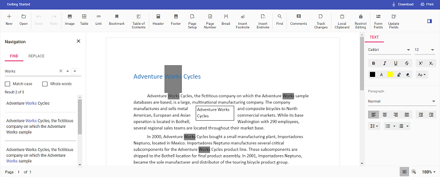

# Change the default search highlight color in Vue Document editor component

Document editor provides an options to change the default search highlight color using [`searchHighlightColor`](https://ej2.syncfusion.com/vue/documentation/api/document-editor/documentEditorSettingsModel/#searchhighlightcolor) in Document editor settings. The highlight color which is given in [`documentEditorSettings`](https://ej2.syncfusion.com/vue/documentation/api/document-editor-container/#documenteditorsettings) will be highlighted on the searched text. By default, search highlight color is `yellow`.

Similarly, you can use [`documentEditorSettings`](https://ej2.syncfusion.com/vue/documentation/api/document-editor#documenteditorsettings) property for DocumentEditor also.

The following example code illustrates how to change the default search highlight color.




<template>
  

    <ejs-documenteditorcontainer ref='documenteditor' :serviceUrl='serviceUrl' :documentEditorSettings='settings'
      height="590px" id='container' :enableToolbar='true'></ejs-documenteditorcontainer>
  

</template>




<template>
  

    <ejs-documenteditorcontainer ref='documenteditor' :serviceUrl='serviceUrl' :documentEditorSettings='settings'
      height="590px" id='container' :enableToolbar='true'></ejs-documenteditorcontainer>
  

</template>




Output will be like below:

