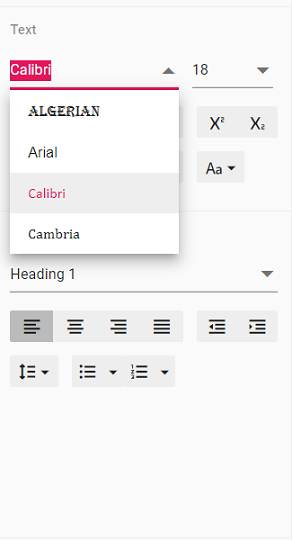

# Customize font family drop down in Vue Document editor component

Document editor provides an options to customize the font family drop down list values using [`fontfamilies`](https://ej2.syncfusion.com/vue/documentation/api/document-editor/documentEditorSettingsModel/#fontfamilies) in Document editor settings. Fonts which are added in fontFamilies of [`documentEditorSettings`](https://ej2.syncfusion.com/vue/documentation/api/document-editor-container/#documenteditorsettings) will be displayed on font drop down list of text properties pane and font dialog.

Similarly, you can use [`documentEditorSettings`](https://ej2.syncfusion.com/vue/documentation/api/document-editor#documenteditorsettings) property for DocumentEditor also.

The following example code illustrates how to change the font families in Document editor container.

```
<template>
    <div id="app">
      <ejs-documenteditorcontainer ref='documenteditor' :serviceUrl='serviceUrl' :documentEditorSettings='settings' height="590px" id='container' :enableToolbar='true'></ejs-documenteditorcontainer>
    </div>
</template>
<script>
  import Vue from 'vue';
  import { DocumentEditorContainerPlugin, DocumentEditorContainerComponent,Toolbar} from '@syncfusion/ej2-vue-documenteditor';

  Vue.use(DocumentEditorContainerPlugin);

  export default {
    data() {
      return { serviceUrl:'https://ej2services.syncfusion.com/production/web-services/api/documenteditor/',
      // Add required font families to list it in font drop down
      settings:{ fontFamilies: ['Algerian', 'Arial', 'Calibri', 'Cambria']} };
    },
    provide: {
      //Inject require modules.
      DocumentEditorContainer: [Toolbar]
    }
  }
</script>
```

Output will be like below:

