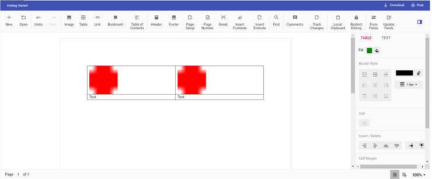

# Insert text or image in table programmatically in Vue Document editor component

Using Document editor API's, you can insert [`text`](../../document-editor/how-to/insert-text-in-current-position/#insert-text-in-current-cursor-position) or [`image`](../../document-editor/image/#images) in [`table`](../../document-editor/table/#create-a-table) programmatically based on your requirement.

Use [`selection`](../../document-editor/how-to/move-selection-to-specific-position/#selects-content-based-on-start-and-end-hierarchical-index) API's to navigate between rows and cells.

The following example illustrates how to create 2*2 table and then add text and image programmatically.

```
<template>
  <div id="app">
    <ejs-documenteditorcontainer
      ref="container"
      :serviceUrl="serviceUrl"
      height="590px"
      id="container"
      :enableToolbar="true"
      v-on:created="onCreated.bind(this)"
    ></ejs-documenteditorcontainer>
  </div>
</template>
<script>
  import Vue from 'vue';
  import {
    DocumentEditorContainerPlugin,
    DocumentEditorContainerComponent,
    Toolbar,
  } from '@syncfusion/ej2-vue-documenteditor';

  Vue.use(DocumentEditorContainerPlugin);

  export default {
    data() {
      return {
        serviceUrl:
          'https://ej2services.syncfusion.com/production/web-services/api/documenteditor/',
      };
    },
    provide: {
      //Inject require modules.
      DocumentEditorContainer: [Toolbar],
    },
    methods: {
        onCreated: function () {
          // To insert the table in cursor position
          this.$refs.container.ej2Instances.documentEditor.editor.insertTable(2, 2);
          // To insert the image at table first cell
          this.$refs.container.ej2Instances.documentEditor.editor.insertImage(
            'data:image/png;base64,iVBORw0KGgoAAAANSUhEUgAAAAUAAAAFCAYAAACNbyblAAAAHElEQVQI12P4    //8/w38GIAXDIBKE0DHxgljNBAAO9TXL0Y4OHwAAAABJRU5ErkJggg=='
          );
          // To move the cursor to next cell
          this.moveCursorToNextCell();
          // To insert the image at table second cell
          this.$refs.container.ej2Instances.documentEditor.editor.insertImage(
            'data:image/png;base64,iVBORw0KGgoAAAANSUhEUgAAAAUAAAAFCAYAAACNbyblAAAAHElEQVQI12P4    //8/w38GIAXDIBKE0DHxgljNBAAO9TXL0Y4OHwAAAABJRU5ErkJggg=='
          );
          // To move the cursor to next row
          this.moveCursorToNextRow();
          // To insert text in cursor position
          this.$refs.container.ej2Instances.documentEditor.editor.insertText('Text');
          // To move the cursor to next cell
          this.moveCursorToNextCell();
          // To insert text in cursor position
          this.$refs.container.ej2Instances.documentEditor.editor.insertText('Text');
        },
        moveCursorToNextCell:function() {
          // To get current selection start offset
          var startOffset = this.$refs.container.ej2Instances.documentEditor.selection.startOffset;
          // Increasing cell index to consider next cell
          var cellIndex = parseInt(startOffset.substring(6, 7)) + 1;
          // Changing start offset
          startOffset =
            startOffset.substring(0, 6) +
            cellIndex.toString() +
            startOffset.substring(7, startOffset.length);
          // Navigating selection using select method
          this.$refs.container.ej2Instances.documentEditor.selection.select(startOffset, startOffset);
        },
        moveCursorToNextRow:function() {
          // To get current selection start offset
          var startOffset = this.$refs.container.ej2Instances.documentEditor.selection.startOffset;
          // Increasing row index to consider next row
          var rowIndex = parseInt(startOffset.substring(4, 5)) + 1;
          var cellIndex =
            parseInt(startOffset.substring(6, 7)) != 0
              ? parseInt(startOffset.substring(6, 7)) - 1
              : 0;
          // Changing start offset
          startOffset =
            startOffset.substring(0, 4) +
            rowIndex.toString() +
            startOffset.substring(5, 6) +
            cellIndex +
            startOffset.substring(7, startOffset.length);
          // Navigating selection using select method
          this.$refs.container.ej2Instances.documentEditor.selection.select(startOffset, startOffset);
        }
      }
  };
</script>
```

The output will be like below.

