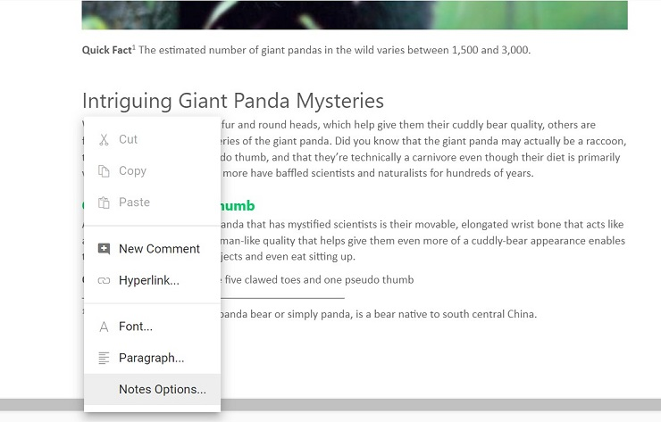

# Notes in Vue Document editor component

DocumentEditorContainer component provides support for inserting footnotes and endnotes through the in-built toolbar. Refer to the following screenshot.

The Footnotes and endnotes are both ways of adding extra bits of information to your writing outside of the main text. You can use footnotes and endnotes to add side comments to your work or to place other publications like books, articles, or websites.

## Insert footnotes

Document Editor exposes an API to insert footnotes at cursor position programmatically or can be inserted to the end of selected text.




<template>
  

    

      <button v-on:click='Insertfootnote'>Insert footnote</button>
    

    <ejs-documenteditor id="container6" height="370px" style="width: 100%;" :serviceUrl='serviceUrl' :isReadOnly='false'
      :enablePrint='true' :enableSfdtExport='true' :enableSelection='true' :enableContextMenu='true'
      :enableSearch='true' :enableOptionsPane='true' :enableWordExport='true' :enableTextExport='true'
      :enableEditor='true' :enableImageResizer='true' :enableEditorHistory='true' :enableHyperlinkDialog='true'
      :enableTableDialog='true' :enableBookmarkDialog='true' :enableTableOfContentsDialog='true'
      :enablePageSetupDialog='true' :enableStyleDialog='true' :enableListDialog='true' :enableParagraphDialog='true'
      :enableFontDialog='true' :enableTablePropertiesDialog='true' :enableBordersAndShadingDialog='true'
      :enableTableOptionsDialog='true'></ejs-documenteditor>
  

</template>




<template>
  

    

      <button v-on:click='Insertfootnote'>Insert footnote</button>
    

    <ejs-documenteditor id="container6" height="370px" style="width: 100%;" :serviceUrl='serviceUrl' :isReadOnly='false'
      :enablePrint='true' :enableSfdtExport='true' :enableSelection='true' :enableContextMenu='true'
      :enableSearch='true' :enableOptionsPane='true' :enableWordExport='true' :enableTextExport='true'
      :enableEditor='true' :enableImageResizer='true' :enableEditorHistory='true' :enableHyperlinkDialog='true'
      :enableTableDialog='true' :enableBookmarkDialog='true' :enableTableOfContentsDialog='true'
      :enablePageSetupDialog='true' :enableStyleDialog='true' :enableListDialog='true' :enableParagraphDialog='true'
      :enableFontDialog='true' :enableTablePropertiesDialog='true' :enableBordersAndShadingDialog='true'
      :enableTableOptionsDialog='true'></ejs-documenteditor>
  

</template>




## Insert endnotes

Document Editor exposes an API to insert endnotes at cursor position programmatically or can be inserted to the end of selected text.




<template>
  

    

      <button v-on:click='Insertendnote'>Insert endnote</button>
    

    <ejs-documenteditor id="container6" style="width: 100%;height: 100%;" :serviceUrl='serviceUrl' :isReadOnly='false'
      :enablePrint='true' :enableSfdtExport='true' :enableSelection='true' :enableContextMenu='true'
      :enableSearch='true' :enableOptionsPane='true' :enableWordExport='true' :enableTextExport='true'
      :enableEditor='true' :enableImageResizer='true' :enableEditorHistory='true' :enableHyperlinkDialog='true'
      :enableTableDialog='true' :enableBookmarkDialog='true' :enableTableOfContentsDialog='true'
      :enablePageSetupDialog='true' :enableStyleDialog='true' :enableListDialog='true' :enableParagraphDialog='true'
      :enableFontDialog='true' :enableTablePropertiesDialog='true' :enableBordersAndShadingDialog='true'
      :enableTableOptionsDialog='true'></ejs-documenteditor>
  

</template>




<template>
  

    

      <button v-on:click='Insertendnote'>Insert endnote</button>
    

    <ejs-documenteditor id="container6" style="width: 100%;height: 100%;" :serviceUrl='serviceUrl' :isReadOnly='false'
      :enablePrint='true' :enableSfdtExport='true' :enableSelection='true' :enableContextMenu='true'
      :enableSearch='true' :enableOptionsPane='true' :enableWordExport='true' :enableTextExport='true'
      :enableEditor='true' :enableImageResizer='true' :enableEditorHistory='true' :enableHyperlinkDialog='true'
      :enableTableDialog='true' :enableBookmarkDialog='true' :enableTableOfContentsDialog='true'
      :enablePageSetupDialog='true' :enableStyleDialog='true' :enableListDialog='true' :enableParagraphDialog='true'
      :enableFontDialog='true' :enableTablePropertiesDialog='true' :enableBordersAndShadingDialog='true'
      :enableTableOptionsDialog='true'></ejs-documenteditor>
  

</template>




## Update or edit footnotes and endnotes

You can update or edit the footnotes and endnotes using the built-in context menu shown up by right-clicking it. The footnote endnote dialog box popup and you can customize the number format and start at. Refer to the following screenshot.

