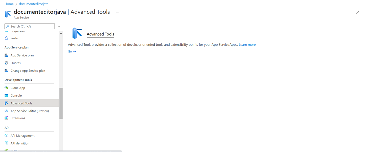
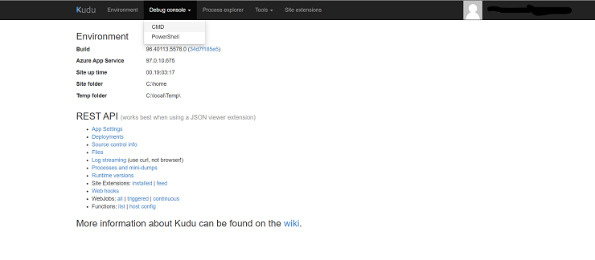
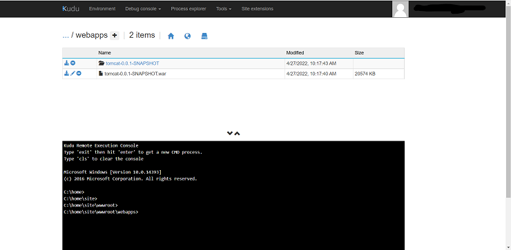

# How to deploy documenteditor java web api in azure in Vue Document editor component

## Prerequisites

Have [`Azure account`](https://azure.microsoft.com/en-gb/) and [`Azure CLI`](https://docs.microsoft.com/en-us/cli/azure/?view=azure-cli-latest) setup in your environment.

You can get the example [`web service project from GitHub`](https://github.com/SyncfusionExamples/EJ2-DocumentEditor-Java-WebService) and then perform the following steps to create the packages and host in azure app service.

**Step 1** Clean the package using following command.

```console
mvn clean package
```

**Step 2** Run the application locally using following command.

```console
mvn spring-boot:run
```

**Step 3** Build the package using following command.

```console
mvn package
```

Above package generation command creates the `**tomcat-0.0.1-SNAPSHOT.war**` in the below location in the sample folder.

`target/tomcat-0.0.1-SNAPSHOT.war`

**Step 4:** Create a Azure app service with Java & Tomcat. For example, create the app services name as `documenteditorjava`.

**Step 5:** After creating app service, navigate to `Advanced Tools` options under `Development Tools`.



Then, click `Go` and select the `CMD` options under `Debug console`.



**Step 6**: Once the file manager is opened, please navigate to

`site -> wwwroot -> webapps`

**Step 7**: Now, upload the generated war file `tomcat-0.0.1-SNAPSHOT.war`. Uploaded war file gets extracted automatically, it will uploaded like below:



**Step 8:** Browse to the app.

Browse to the deployed app at `http://<app_name>.azurewebsites.net`, i.e. `http://documenteditorjava.azurewebsites.net`. Browse this link and it navigate to the Document Editor Web API control `http://documenteditorjava.azurewebsites.net/tomcat-0.0.1-SNAPSHOT`. It returns the default get method response.

Append the app service running the URL `http://documenteditorjava.azurewebsites.net/tomcat-0.0.1-SNAPSHOT` to the service URL in the client-side Document Editor control. For more information about the Document Editor control, refer to this [`getting started page`](https://ej2.syncfusion.com/javascript/documentation/document-editor/getting-started).