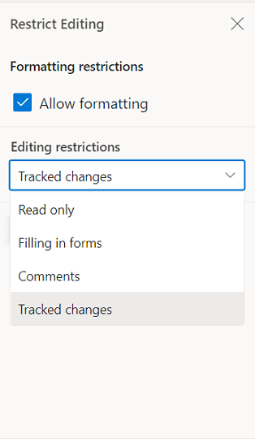

# Track changes in Vue Document editor component

Track Changes allows you to keep a record of changes or edits made to a document. You can then choose to accept or reject the modifications. It is a useful tool for managing changes made by several reviewers to the same document. If track changes option is enabled, all editing operations are preserved as revisions in Document Editor.

## Enable track changes in Document Editor

The following example demonstrates how to enable track changes.

```ts
<ejs-documenteditorcontainer ref='container' :serviceUrl='serviceUrl' height="590px" id='container' :enableTrackChanges='true'></ejs-documenteditorcontainer>
```
>Track changes are document level settings. When opening a document, if the document does not have track changes enabled, then enableTrackChanges will be disabled even if we set enableTrackChanges = 'true' in the initial rendering. If you want to enable track changes for all the documents, then we recommend enabling track changes during the document change event. The following example demonstrates how to enable Track changes for the all the Document while Opening.

```ts
<template>
    <div id="app">
      <ejs-documenteditorcontainer ref='container' :serviceUrl='serviceUrl' height="590px" id='container' :enableToolbar='true' :enableTrackChanges='true'></ejs-documenteditorcontainer>
    </div>
</template>
<script>
  import Vue from 'vue';
  import { DocumentEditorContainerPlugin, DocumentEditorContainerComponent,Toolbar} from '@syncfusion/ej2-vue-documenteditor';

  Vue.use(DocumentEditorContainerPlugin);

  export default {
    data() {
      return { serviceUrl:'https://services.syncfusion.com/vue/production/api/documenteditor/'};
    },
    provide: {
      //Inject require modules.
      DocumentEditorContainer: [Toolbar]
    },
    mounted(){
      this.$refs.doceditcontainer.ej2Instances.documentChange = () => {
        if (this.$refs.doceditcontainer.ej2Instances!== null) {
          this.$refs.doceditcontainer.ej2Instances.documentEditor.enableTrackChanges = true;
        }
      };
    }
  }
</script>
```
## Show/Hide Revisions Pane
 
The Show/Hide Revisions Pane feature in the Document Editor allows users to toggle the visibility of the revisions pane, providing flexibility in managing tracked changes within the document.
 
The following example code illustrates how to show/hide the revisions pane.

```ts
<template>
    <div id="app">
      <ejs-documenteditorcontainer ref='container' :serviceUrl='serviceUrl' height="590px" id='container' :enableToolbar='true' :enableTrackChanges='true'></ejs-documenteditorcontainer>
    </div>
</template>
<script>
  import Vue from 'vue';
  import { DocumentEditorContainerPlugin, DocumentEditorContainerComponent,Toolbar} from '@syncfusion/ej2-vue-documenteditor';

  Vue.use(DocumentEditorContainerPlugin);

  export default {
    data() {
      return { serviceUrl:'https://services.syncfusion.com/vue/production/api/documenteditor/'};
    },
    provide: {
      //Inject require modules.
      DocumentEditorContainer: [Toolbar]
    },
    mounted(){
    this.$refs.container.documentEditor.showRevisions = true; // To show revisions pane
    this.$refs.container.documentEditor.showRevisions = false; // To hide revisions pane
    }
  }
</script>
```

> The Web API hosted link `https://services.syncfusion.com/vue/production/api/documenteditor/` utilized in the Document Editor's serviceUrl property is intended solely for demonstration and evaluation purposes. For production deployment, please host your own web service with your required server configurations. You can refer and reuse the [GitHub Web Service example](https://github.com/SyncfusionExamples/EJ2-DocumentEditor-WebServices) or [Docker image](https://hub.docker.com/r/syncfusion/word-processor-server) for hosting your own web service and use for the serviceUrl property.

## Get all tracked revisions

The following example demonstrate how to get all tracked revision from current document.

```ts
<ejs-documenteditorcontainer ref='container' :serviceUrl='serviceUrl' height="590px" id='container' :enableTrackChanges='true'></ejs-documenteditorcontainer>

/**
 * Get revisions from the current document
 */
let revisions : RevisionCollection = this.$refs.container.documentEditor.revisions;
```

## Accept or Reject all changes programmatically

The following example demonstrates how to accept/reject all changes.

```ts
<ejs-documenteditorcontainer ref='container' :serviceUrl='serviceUrl' height="590px" id='container' :enableTrackChanges='true'></ejs-documenteditorcontainer>

/**
 * Get revisions from the current document
 */
let revisions : RevisionCollection = this.$refs.container.documentEditor.revisions;

/**
 * Accept all tracked changes
 */
revisions.acceptAll();

/**
 * Reject all tracked changes
 */
revisions.rejectAll();
```

## Accept or reject a specific revision

The following example demonstrates how to accept/reject specific revision in the Document Editor.

```ts
/**
 * Get revisions from the current document
 */
let revisions : RevisionCollection = this.$refs.container.documentEditor.revisions;
/**
 * Accept specific changes
 */
revisions.get(0).accept();
/**
 * Reject specific changes
 */
revisions.get(1).reject();
```

## Navigate between the tracked changes

The following example demonstrates how to navigate tracked revision programmatically.

```ts
<ejs-documenteditorcontainer ref='container' :serviceUrl='serviceUrl' height="590px" id='container' :enableTrackChanges='true'></ejs-documenteditorcontainer>
/**
 * Navigate to next tracked change from the current selection.
 */
this.$refs.container.documentEditor.selection.navigateNextRevision();

/**
 * Navigate to previous tracked change from the current selection.
 */
this.$refs.container.documentEditor.selection.navigatePreviousRevision();
```

## Filtering changes based on user

In DocumentEditor, we have built-in review panel in which we have provided support for filtering changes based on the user.


## Protect the document in track changes only mode

Document Editor provides support for protecting the document with `RevisionsOnly` protection. In this protection, all the users are allowed to view the document and do their corrections, but they cannot accept or reject any tracked changes in the document. Later, the author can view their corrections and accept or reject the changes.

Document editor provides an option to protect and unprotect document using [`enforceProtection`](https://ej2.syncfusion.com/vue/documentation/api/document-editor/editor/#enforceprotection) and [`stopProtection`](https://ej2.syncfusion.com/vue/documentation/api/document-editor/editor/#stopprotection) API.

The following example code illustrates how to enforce and stop protection in Document editor container.




<template>
  <div id="app">
    <ejs-documenteditorcontainer ref='container' :serviceUrl='serviceUrl' height="590px" id='container'
      :enableToolbar='true'></ejs-documenteditorcontainer>
  </div>
</template>
<script setup>
import { DocumentEditorContainerComponent as EjsDocumenteditorcontainer, Toolbar } from '@syncfusion/ej2-vue-documenteditor';
import { onMounted, provide, ref } from 'vue';

const container = ref(null);
const serviceUrl = 'https://services.syncfusion.com/vue/production/api/documenteditor/';

//Inject require modules.
provide('DocumentEditorContainer', [Toolbar])

onMounted(function () {
  //enforce protection
  container.value.ej2Instances.documentEditor.editor.enforceProtection('123', 'RevisionsOnly');
  //stop the document protection
  container.value.ej2Instances.documentEditor.editor.stopProtection('123');
})
</script>




<template>
  <div id="app">
    <ejs-documenteditorcontainer ref='container' :serviceUrl='serviceUrl' height="590px" id='container'
      :enableToolbar='true'></ejs-documenteditorcontainer>
  </div>
</template>
<script>
import { DocumentEditorContainerComponent, Toolbar } from '@syncfusion/ej2-vue-documenteditor';

export default {
  components: {
    'ejs-documenteditorcontainer': DocumentEditorContainerComponent
  },
  data() {
    return { serviceUrl: 'https://services.syncfusion.com/vue/production/api/documenteditor/' };
  },
  provide: {
    //Inject require modules.
    DocumentEditorContainer: [Toolbar]
  },
  mounted() {
    //enforce protection
    this.$refs.container.ej2Instances.documentEditor.editor.enforceProtection('123', 'RevisionsOnly');
    //stop the document protection
    this.$refs.container.ej2Instances.documentEditor.editor.stopProtection('123');
  }
}
</script>




> The Web API hosted link `https://services.syncfusion.com/vue/production/api/documenteditor/` utilized in the Document Editor's serviceUrl property is intended solely for demonstration and evaluation purposes. For production deployment, please host your own web service with your required server configurations. You can refer and reuse the [GitHub Web Service example](https://github.com/SyncfusionExamples/EJ2-DocumentEditor-WebServices) or [Docker image](https://hub.docker.com/r/syncfusion/word-processor-server) for hosting your own web service and use for the serviceUrl property.

Tracked changes only protection can be enabled in UI by using [Restrict Editing pane](../document-editor/document-management#restrict-editing-pane)



>Note: In enforce Protection method, first parameter denotes password and second parameter denotes protection type. Possible values of protection type are `NoProtection |ReadOnly |FormFieldsOnly |CommentsOnly |RevisionsOnly`. In stop protection method, parameter denotes the password.

## Event

You can restrict the accept and reject changes based on the author name. The following example demonstrates how to restrict an author from accept/reject changes.




<template>
  <div>
    <div>
      <div>
        <ejs-documenteditorcontainer ref="container" style="display: block;" :height="'590px'"
          @beforeAcceptRejectChanges="beforeAcceptRejectChanges" :enableToolbar="true" />
      </div>
    </div>
  </div>
</template>

<script setup>
import { DocumentEditorContainerComponent as EjsDocumenteditorcontainer } from '@syncfusion/ej2-vue-documenteditor';


const beforeAcceptRejectChanges = function (args) {
  // Check the author of the revision
  if (args.author !== 'Hary') {
    // Cancel the accept/reject action
    args.cancel = true;
  }
}
</script>




<template>
  <div>
    <div>
      <div>
        <ejs-documenteditorcontainer ref="container" style="display: block;" :height="'590px'"
          @beforeAcceptRejectChanges="beforeAcceptRejectChanges" :enableToolbar="true" />
      </div>
    </div>
  </div>
</template>

<script>
import { DocumentEditorContainerComponent, Toolbar } from '@syncfusion/ej2-vue-documenteditor';

export default {
  components: {
    'ejs-documenteditorcontainer': DocumentEditorContainerComponent
  },
  methods: {
    beforeAcceptRejectChanges(args) {
      // Check the author of the revision
      if (args.author !== 'Hary') {
        // Cancel the accept/reject action
        args.cancel = true;
      }
    }
  }
};
</script>



