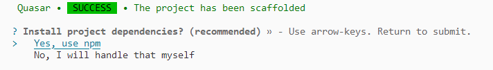

# Getting Started with the Vue DropDownList Component in the Quasar Framework

This article provides a step-by-step guide for setting up a [Quasar](https://quasar.dev/) project and integrating the Syncfusion<sup style="font-size:70%">&reg;</sup> Vue DropDownList component using the [Composition API](https://vuejs.org/guide/introduction.html#composition-api).

The `Quasar` Framework is a Vue.js-based open-source framework that empowers developers to create high-performance and responsive applications across various platforms, such as web, mobile, and desktop.

## Prerequisites

[System requirements for Syncfusion<sup style="font-size:70%">&reg;</sup> Vue UI components](../system-requirements)

## Set up the Quasar project

To initiate the creation of a new [Quasar](https://quasar.dev/start/quick-start/) project, use the following commands:

```bash
npm init quasar
```

This command prompts additional configurations. Follow the steps outlined in the images below:


This generates the necessary files and prompts for project dependency installation. Respond with 'yes' to proceed with npm install, as shown in the image below:



Navigate to your project directory:

```bash
cd quasar-project
```

Now that `quasar-project` is ready to run with default settings, let's add Syncfusion<sup style="font-size:70%">&reg;</sup> components to the project.

## Add the Syncfusion<sup style="font-size:70%">&reg;</sup> Vue packages

Syncfusion<sup style="font-size:70%">&reg;</sup> Vue component packages are available at [npmjs.com](https://www.npmjs.com/search?q=ej2-vue). To use Syncfusion<sup style="font-size:70%">&reg;</sup> Vue components in the project, install the corresponding npm package.

This article uses the [Vue DropDownList component](https://www.syncfusion.com/vue-components/vue-dropdown-list) as an example. To use the Vue DropDownList component in the project, the `@syncfusion/ej2-vue-gantt` package needs to be installed using the following command:

```bash
npm install @syncfusion/ej2-vue-dropdowns --save
```

## Import Syncfusion<sup style="font-size:70%">&reg;</sup> CSS styles

You can import themes for the Syncfusion<sup style="font-size:70%">&reg;</sup> Vue component in various ways, such as using CSS or SASS styles from npm packages, CDN, CRG and [Theme Studio](https://ej2.syncfusion.com/vue/documentation/appearance/theme-studio/). Refer to the [themes topic](https://ej2.syncfusion.com/vue/documentation/appearance/theme/) to learn more about built-in themes and different ways to refer to themes in a Vue project.

In this article, the `Material 3` theme is applied using CSS styles, which are available in installed packages. The necessary `Material 3` CSS styles for the DropDownList component and its dependents were imported into the `<style>` section of the **src/app.vue** file.




<style>
@import "../node_modules/@syncfusion/ej2-base/styles/material3.css";
@import "../node_modules/@syncfusion/ej2-inputs/styles/material3.css";
@import "../node_modules/@syncfusion/ej2-vue-dropdowns/styles/material3.css";
</style>




> The order of importing CSS styles should be in line with their dependency graph.

## Add the Syncfusion<sup style="font-size:70%">&reg;</sup> Vue component

Follow the below steps to add the Vue DropDownList component:

1\. First, add the `setup` attribute to the `script` tag to indicate that Vue will be using the `Composition API`. And import the DropDownList component and its child directives in the `script` section of the **src/app.vue** file.




<script setup>
   import { DropDownListComponent as EjsDropdownlist } from "@syncfusion/ej2-vue-dropdowns";
</script>



   
2\. Then, define the DropDownList component in the **src/app.vue** file, as shown below:




<template>
<div id="app">
    <div id='container' style="margin:50px auto 0; width:250px;">
        <ejs-dropdownlist id='dropdownlist' popupHeight="200px" popupWidth="250px" 
        :dataSource='data[0].sportsData' placeholder='Select a game'></ejs-dropdownlist>
    </div>
</div>
</template>




3\. Declare the values for the `dataSource` property in the `script` section.




<script setup>
    const data = [{ sportsData : ['Badminton', 'Cricket', 'Football', 'Golf', 'Tennis'] }];
</script>




Here is the summarized code for the above steps in the **src/app.vue** file:



<template>
<div id="app">
    <div id='container' style="margin:50px auto 0; width:250px;">
        <ejs-dropdownlist id='dropdownlist' popupHeight="200px" popupWidth="250px" 
        :dataSource='data[0].sportsData' placeholder='Select a game'></ejs-dropdownlist>
    </div>
</div>
</template>
<script setup>
    import { DropDownListComponent as EjsDropdownlist } from "@syncfusion/ej2-vue-dropdowns";

    const data = [{ sportsData : ['Badminton', 'Cricket', 'Football', 'Golf', 'Tennis'] }];           
</script>
<style>
@import "../node_modules/@syncfusion/ej2-base/styles/material3.css";
@import "../node_modules/@syncfusion/ej2-inputs/styles/material3.css";
@import "../node_modules/@syncfusion/ej2-vue-dropdowns/styles/material3.css";
</style>




## Run the project

To run the project, use the following command:

```bash
npm run dev
```

The output will appear as follows:

