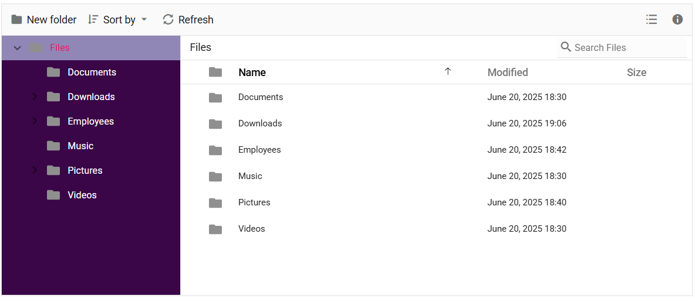
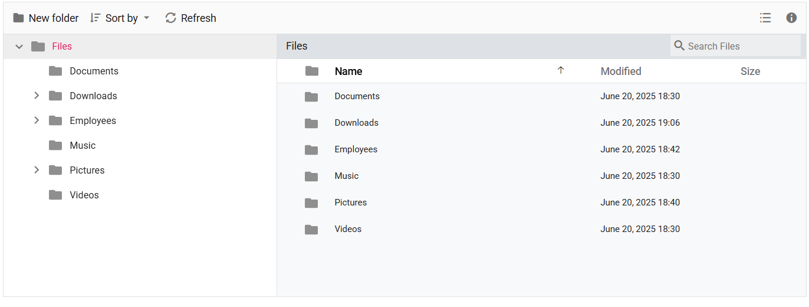
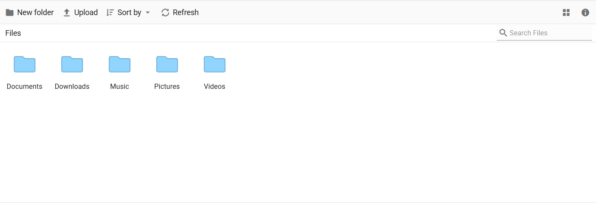
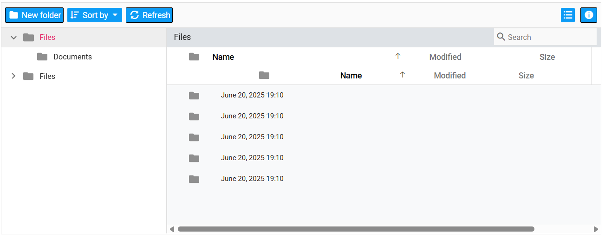
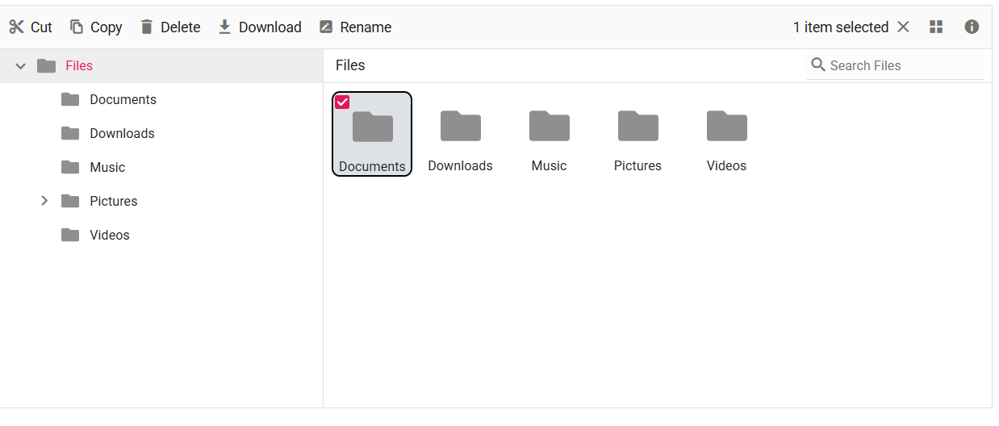
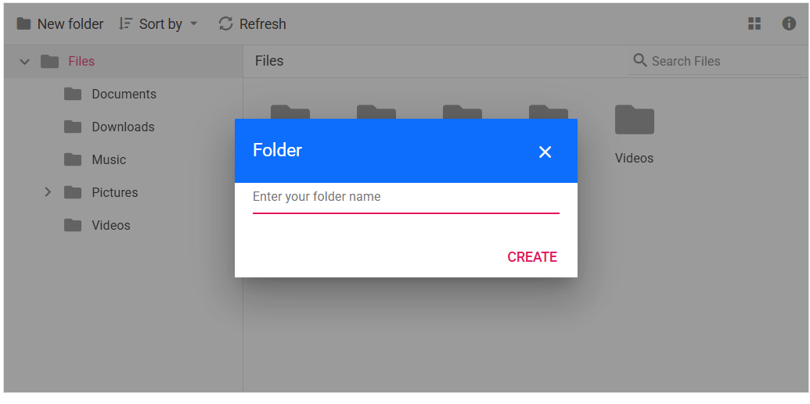

# How to customize style and appearance in Vue File Manager

This article shows CSS selectors and examples that can be used to modify the File Manager control's appearance to match user preferences.

## Customizing the File Manager navigation pane

To customize the File Manager navigation pane, target the `.e-navigation` selector and apply styles.

The following example shows how to customize the navigation pane visual styles:

```css
.sample-container {
    margin: 10px;
}

/* Set background color for the File Manager navigation pane */
.e-filemanager .e-navigation {
    background: #3a0647;
}

/* Highlight the active item in the TreeView inside the navigation pane */
.e-filemanager .e-treeview .e-list-item.e-active > .e-fullrow {
    background: #c3d3f9a1;
}

/* Set text color for TreeView items in the navigation pane */
.e-filemanager .e-treeview .e-list-text {
    color: #fff;
}
```



## Customizing the File Manager layout

To customize the File Manager layout, target the `.e-layout-content` selector and related view selectors.

```css
.sample-container {
    margin: 10px;
}

/* Style for breadcrumb (address bar) */
.e-filemanager .e-layout-content .e-address {
  background: #dee2e6;
}

/* Customize the background for the Large Icons view */
.e-filemanager .e-layout-content .e-large-icons {
  background: #f8f9fa;
}

/* Customize the background for the Details view table and content area */
.e-filemanager .e-layout-content .e-grid .e-table,
.e-filemanager .e-grid .e-gridcontent .e-content {
  background: #f8f9fa;
}
```



## Customizing the File Manager thumbnail

To customize thumbnails, apply `background-image` or other styles to the file-type selectors listed below.

| File Type | CSS Selector |
|----|----|
| Image | .e-fe-image |
| Music | .e-fe-music |
| Excel | .e-fe-xlsx |
| Video | .e-fe-video |
| PowerPoint | .e-fe-pptx |
| RAR | .e-fe-rar |
| ZIP | .e-fe-zip |
| Text | .e-fe-txt |
| JavaScript | .e-fe-js |
| CSS | .e-fe-css |
| HTML | .e-fe-html |
| Unknown | .e-fe-unknown |
| Executable | .e-fe-exe |
| MSI | .e-fe-msi |
| PHP | .e-fe-php |
| Word | .e-fe-doc |
| Word (docx) | .e-fe-docx |
| XML | .e-fe-xml |
| Folder | .e-fe-folder |

The following example demonstrates customizing the folder thumbnail for both Large Icons and Details views:

```css
/* Applies to both Large Icons view and Details view */
.e-filemanager .e-large-icons .e-fe-folder,
.e-filemanager .e-grid .e-fe-folder {
    background-image: url("data:image/svg+xml;base64,PD94bWwgdmVyc2lvbj0iMS4wIiBlbmNvZGluZz0idXRmLTgiPz48c3ZnIHZlcnNpb249IjEuMSIgaWQ9IkxheWVyXzEiIHhtbG5zPSJodHRwOi8vd3d3LnczLm9yZy8yMDAwL3N2ZyIgeG1sbnM6eGxpbms9Imh0dHA6Ly93d3cudzMub3JnLzE5OTkveGxpbmsiIHg9IjBweCIgeT0iMHB4IiB2aWV3Qm94PSIwIDAgMzIgMzIiIHN0eWxlPSJlbmFibGUtYmFja2dyb3VuZDpuZXcgMCAwIDMyIDMyOyIgeG1sOnNwYWNlPSJwcmVzZXJ2ZSI+PHN0eWxlIHR5cGU9InRleHQvY3NzIj4uc3Qwe2ZpbGw6I0ZGOTI5Mjt9LnN0MXtmaWxsOiNFODdFN0U7fS5zdDJ7ZmlsbDojRkZDM0MzO30uc3Qze2ZpbGw6IzkxRDRGRTt9LnN0NHtmaWxsOiM2M0E3RDM7fS5zdDV7ZmlsbDojQzFFN0ZGO30uc3Q2e2ZpbGw6I0ZGRkZGRjt9LnN0N3tmaWxsOiM4M0Q2Qjk7fS5zdDh7ZmlsbDojNDZDNjhDO30uc3Q5e2ZpbGw6I0JCRThEODt9LnN0MTB7ZmlsbDojRkVCMTdEO30uc3QxMXtmaWxsOiNERDk2NjY7fS5zdDEye2ZpbGw6I0ZFRDRCNzt9LnN0MTN7ZmlsbDojRjJBMkEyO30uc3QxNHtmaWxsOiNGMUM1QzU7fS5zdDE1e2ZpbGw6I0RCQjY2Mzt9LnN0MTZ7ZmlsbDojQ0VBMTUxO30uc3QxN3tmaWxsOiNFQkQ3QTk7fS5zdDE4e2ZpbGw6I0NFQ0VDRTt9LnN0MTl7ZmlsbDojQjdCN0I3O30uc3QyMHtmaWxsOiNFNEU0RTQ7fS5zdDIxe2ZpbGw6IzY1QUFEMTt9LnN0MjJ7ZmlsbDojRTU3QTdBO30uc3QyM3tmaWxsOiNFNkE2RTg7fS5zdDI0e2ZpbGw6I0Q2OEFENjt9LnN0MjV7ZmlsbDojRkZDQ0ZFO30uc3QyNntmaWxsOiM5OENFNUY7fS5zdDI3e2ZpbGw6IzhDQUYyQzt9LnN0Mjh7ZmlsbDojQzZFM0E3O30uc3QyOXtmaWxsOiNGRkI1Nzg7fS5zdDMwe2ZpbGw6I0VEOUY2NDt9LnN0MzF7ZmlsbDojRkZENkI1O30uc3QzMntmaWxsOiNGNEExRUY7fS5zdDMze2ZpbGw6I0REODdERDt9LnN0MzR7ZmlsbDojRjlDQkY2O30uc3QzNXtmaWxsOiNBOEEyRjQ7fS5zdDM2e2ZpbGw6Izg4ODVFODt9LnN0Mzd7ZmlsbDojQ0ZDQ0Y4O30uc3QzOHtmaWxsOiNCQ0JDQkM7fS5zdDM5e2ZpbGw6I0E4QThBODt9LnN0NDB7ZmlsbDojREFEQURBO30uc3Q0MXtmaWxsOiM3N0NDREI7fS5zdDQye2ZpbGw6IzREQkNDMTt9LnN0NDN7ZmlsbDojQjRFM0VCO30uc3Q0NHtmaWxsOiNGRkI3QTQ7fS5zdDQ1e2ZpbGw6I0Y2OUE3Qjt9LnN0NDZ7ZmlsbDojRkZEN0NEO30uc3Q0N3tmaWxsOiM3MUM4RjQ7fS5zdDQ4e2ZpbGw6IzhEQzk3Nzt9LnN0NDl7ZmlsbDojN0NBODUxO30uc3Q1MHtvcGFjaXR5OjAuNDU7ZmlsbDojRkZGRkZGO308L3N0eWxlPjxnPjxwYXRoIGNsYXNzPSJzdDMiIGQ9Ik0yOS41LDI3LjVoLTI3Yy0xLjEsMC0yLTAuOS0yLTJ2LTE5YzAtMS4xLDAuOS0yLDItMmgxMC40bDMuNSwzLjFoMTMuMmMxLjEsMCwyLDAuOSwyLDJ2MTUuOUMzMS41LDI2LjYsMzAuNiwyNy41LDI5LjUsMjcuNXoiLz48cGF0aCBjbGFzcz0ic3Q0IiBkPSJNMjkuNSwyOGgtMjdDMS4xLDI4LDAsMjYuOSwwLDI1LjV2LTE5QzAsNS4xLDEuMSw0LDIuNSw0aDEwLjZsMy41LDMuMWgxM2MxLjQsMCwyLjUsMS4xLDIuNSwyLjV2MTUuOUMzMiwyNi45LDMwLjksMjgsMjkuNSwyOHogTTIuNSw1QzEuNyw1LDEsNS43LDEsNi41djE5QzEsMjYuMywxLjcsMjcsMi41LDI3aDI3YzAuOCwwLDEuNS0wLjcsMS41LTEuNVY5LjZjMC0wLjgtMC43LTEuNS0xLjUtMS41SDE2LjJMMTIuNyw1SDIuNXoiLz48L2c+PC9zdmc+");
}
```



## Customizing the File Manager Toolbar

To style toolbar items, target the `.e-toolbar` and button selectors.

```css
.sample-container {
    margin: 10px;
}

/* Style for individual toolbar buttons */
.e-filemanager .e-toolbar .e-tbar-btn {
  background: #0d9cf6;
  border: 1px solid #000000;
}

/* Style for toolbar icons */
.e-filemanager .e-toolbar .e-tbar-btn .e-icons {
  color: #ffffff;
}

/* Style for toolbar button text */
.e-filemanager .e-toolbar .e-toolbar-item .e-tbar-btn .e-tbar-btn-text {
  color: #ffffff;
}
```



## Customizing the File Manager selected files/folders

Use the selectors below to change styles for selected or active files/folders.

```css
.sample-container {
    margin: 10px;
}

/* Highlight for active and hover item in Large Icons view */
.e-filemanager li.e-list-item.e-large-icon.e-active,
.e-filemanager li.e-list-item.e-large-icon.e-active:hover {
    background: #dee2e6;
    border: 2px solid #000000;
    border-radius: 10%;
}

/* Color for text in active large icons */
.e-filemanager .e-large-icons .e-active {
    color: #212529;
}

/* Highlight for active row in Details view */
.e-filemanager .e-grid td.e-active {
    background: #dee2e6;
}
```



## Customizing the File Manager Dialog

Below are common dialog elements and their selectors.

| Element | CSS Selector |
|---------|------------|
| Header | `.e-dlg-header-content` |
| Content | `.e-dlg-content` |
| Overlay | `.e-dlg-overlay` |
| Footer | `.e-footer-content` |

```css
.sample-container {
    margin: 10px;
}

/* For File Manager Dialog header */
.e-filemanager .e-dialog .e-dlg-header-content {
  background-color: #0d6efd;
}

/* For File Manager Dialog header close icon and text */
.e-filemanager .e-dialog .e-icon-dlg-close,
.e-filemanager .e-dialog .e-dlg-header {
  color: #fff;
}
```

