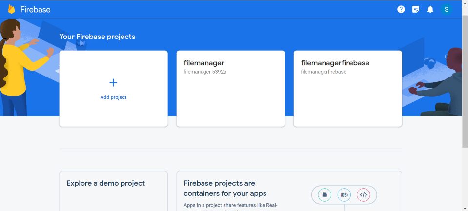
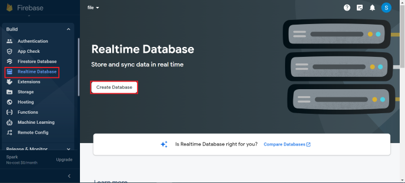
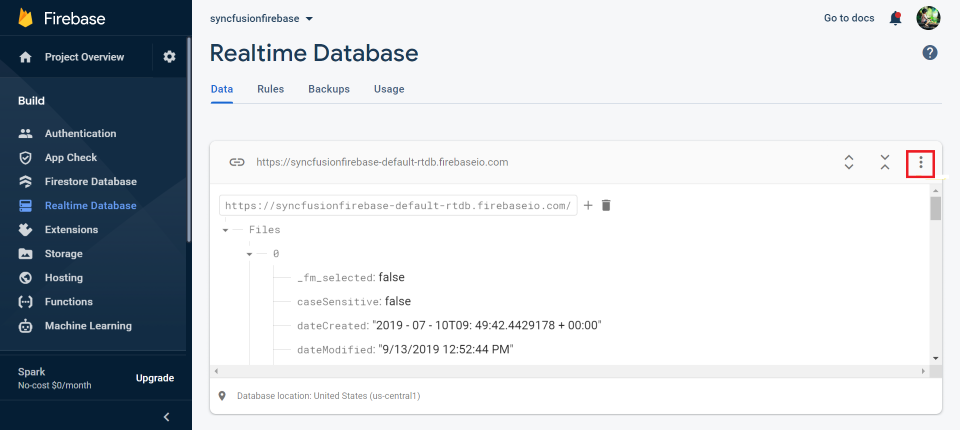
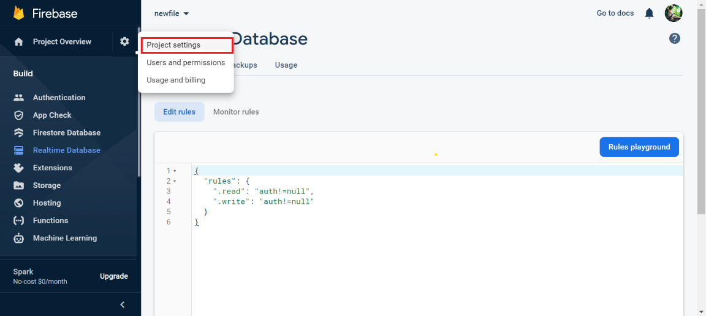
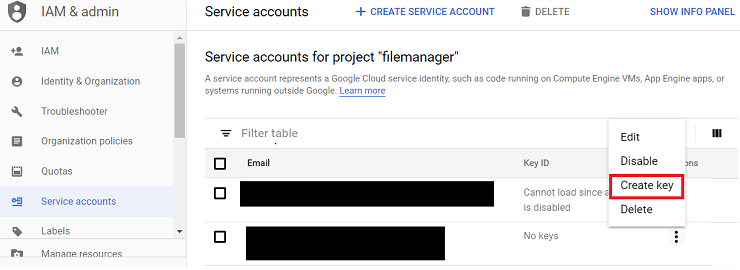
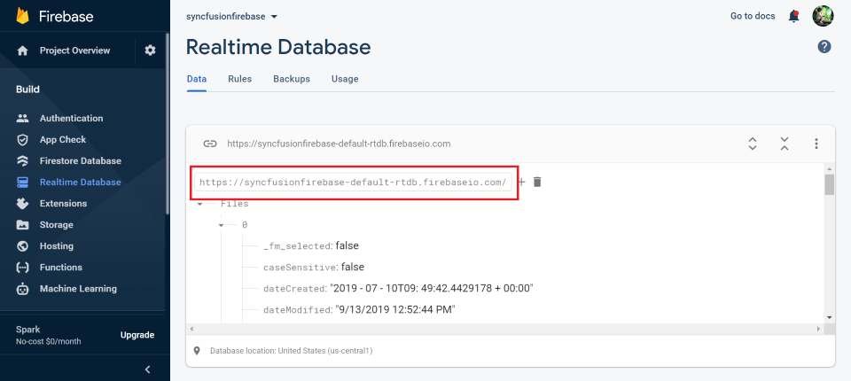

# File system provider in Vue File manager component

The file system provider allows the File Manager component to manage the files and folders in a physical or cloud-based file system. It provides the methods for performing various file actions like creating a new folder, copying and moving of files or folders, deleting uploading, and downloading the files or folders in the file system.

The following file providers are added in Syncfusion EJ2 File Manager component.

* [ASP.NET Core file system provider](#aspnet-core-file-system-provider)
* [ASP.NET MVC 5 file system provider](#aspnet-mvc-5-file-system-provider)
* [ASP.NET Core Azure cloud file system Provider](#aspnet-core-azure-cloud-file-system-provider)
* [ASP.NET MVC 5 Azure cloud file system Provider](#aspnet-mvc-azure-cloud-file-system-provider)
* [ASP.NET Core Amazon S3 cloud file provider](#aspnet-core-amazon-s3-cloud-file-provider)
* [ASP.NET MVC Amazon S3 cloud file provider](#aspnet-mvc-amazon-s3-cloud-file-provider)
* [File Transfer Protocol file system provider](#file-transfer-protocol-file-system-provider)
* [SQL database file system provider](#sql-database-file-system-provider)
* [NodeJS file system provider](#nodejs-file-system-provider)
* [Google Drive file system provider](#google-drive-file-system-provider)
* [Firebase Realtime Database file system provider](#firebase-file-system-provider)
* [IBM Cloud Object Storage provider](#ibm-cloud-object-storage-file-provider)

## ASP.NET Core file system provider

The ASP.NET Core file system provider allows the users to access and manage the physical file system. To get started, we need to clone the [ej2-aspcore-file-provider](https://github.com/SyncfusionExamples/ej2-aspcore-file-provider) using the following command.

```ts

git clone https://github.com/SyncfusionExamples/ej2-aspcore-file-provider  ej2-aspcore-file-provider

cd ej2-aspcore-file-provider

```

After cloning,  open the project in Visual Studio and restore the NuGet packages. Now, we need to set the root directory of the physical file system in the FileManager controller.

After setting the root directory of the file system,  build and run the project. Now, the project will be hosted in `http://localhost:{port}` and  mapping the ajaxSettings property of the FileManager component to the appropriate controller methods allows to manage the files in the physical file system.

```

<template>
    <div id="app">
        <ejs-filemanager id="file-manager" :ajaxSettings="ajaxSettings">
        </ejs-filemanager>
    </div>
</template>
<script setup>
import { provide } from "vue";

import { FileManagerComponent as EjsFilemanager, DetailsView, NavigationPane, Toolbar } from "@syncfusion/ej2-vue-filemanager";

const ajaxSettings = 
{   
    // Replace the hosted port number in the place of "{port}"
    url: "http://localhost:{port}/api/FileManager/FileOperations",
    getImageUrl: "http://localhost:{port}/api/FileManager/GetImage",
    uploadUrl: "http://localhost:{port}/api/FileManager/Upload",
    downloadUrl: "http://localhost:{port}/api/FileManager/Download"
};

provide('filemanager',  [DetailsView, NavigationPane, Toolbar]);

</script>
<style>
@import "../node_modules/@syncfusion/ej2-base/styles/material.css";
@import "../node_modules/@syncfusion/ej2-icons/styles/material.css";
@import "../node_modules/@syncfusion/ej2-inputs/styles/material.css";
@import "../node_modules/@syncfusion/ej2-popups/styles/material.css";
@import "../node_modules/@syncfusion/ej2-buttons/styles/material.css";
@import "../node_modules/@syncfusion/ej2-splitbuttons/styles/material.css";
@import "../node_modules/@syncfusion/ej2-navigations/styles/material.css";
@import "../node_modules/@syncfusion/ej2-layouts/styles/material.css";
@import "../node_modules/@syncfusion/ej2-grids/styles/material.css";
@import "../node_modules/@syncfusion/ej2-vue-filemanager/styles/material.css";
</style>

```

>Note: To learn more about file actions that can be performed with ASP.NET Core file system provider, refer to this [link](https://github.com/SyncfusionExamples/ej2-aspcore-file-provider#key-features)

## ASP.NET MVC 5 file system provider

The ASP.NET MVC5 file system provider allows the users to access and manage the physical file system. To get started, we need to clone the [ej2-aspmvc-file-provider](https://github.com/SyncfusionExamples/ej2-aspmvc-file-provider) using the following command.

```ts

git clone https://github.com/SyncfusionExamples/ej2-aspmvc-file-provider ej2-aspmvc-file-provider

cd ej2-aspmvc-file-provider

```

After cloning,  open the project in Visual Studio and restore the NuGet packages. Now, we need to set the root directory of the physical file system in the FileManager controller using the Root Folder method.

After setting the root directory of the file system,  build and run the project. Now, the project will be hosted in `http://localhost:{port}` and  mapping the ajaxSettings property of the FileManager component to the appropriate controller methods allows to manage the files in the physical file system.

```

<template>
    <div id="app">
        <ejs-filemanager id="file-manager" :ajaxSettings="ajaxSettings">
        </ejs-filemanager>
    </div>
</template>
<script setup>
import { provide } from "vue";

import { FileManagerComponent as EjsFilemanager, DetailsView, NavigationPane, Toolbar } from "@syncfusion/ej2-vue-filemanager";

const ajaxSettings = 
    {
    // Replace the hosted port number in the place of "{port}"
    url: "http://localhost:{port}/FileManager/FileOperations",
    getImageUrl: "http://localhost:{port}/FileManager/GetImage",
    uploadUrl: "http://localhost:{port}/FileManager/Upload",
    downloadUrl: "http://localhost:{port}/FileManager/Download"
    };
provide('filemanager',  [DetailsView, NavigationPane, Toolbar]);

</script>
<style>
@import "../node_modules/@syncfusion/ej2-base/styles/material.css";
@import "../node_modules/@syncfusion/ej2-icons/styles/material.css";
@import "../node_modules/@syncfusion/ej2-inputs/styles/material.css";
@import "../node_modules/@syncfusion/ej2-popups/styles/material.css";
@import "../node_modules/@syncfusion/ej2-buttons/styles/material.css";
@import "../node_modules/@syncfusion/ej2-splitbuttons/styles/material.css";
@import "../node_modules/@syncfusion/ej2-navigations/styles/material.css";
@import "../node_modules/@syncfusion/ej2-layouts/styles/material.css";
@import "../node_modules/@syncfusion/ej2-grids/styles/material.css";
@import "../node_modules/@syncfusion/ej2-vue-filemanager/styles/material.css";
</style>

```

> **Note:** To learn more about file actions that can be performed with ASP.NET MVC 5 file system provider, refer to this [link](https://github.com/SyncfusionExamples/ej2-aspmvc-file-provider#key-features)

## ASP.NET Core Azure cloud file system Provider

In ASP.NET Core, Azure file system provider allows the users to access and manage the blobs in the Azure blob storage. To get started, we need to clone the [azure-aspcore-file-provider](https://github.com/SyncfusionExamples/azure-aspcore-file-provider) using the following command

```ts

git clone https://github.com/SyncfusionExamples/azure-aspcore-file-provider  azure-aspcore-file-provider

```

After cloning, open the project in Visual Studio and restore the NuGet packages. Now, we need to register the Azure storage by passing details like name, password, and blob name to the Register Azure method in the FileManager controller.

```ts

void RegisterAzure(string accountName, string accountKey, string blobName)

 ```

Then, set the blob container and the root blob directory by passing the corresponding URLs as parameters in the setBlobContainer method as follows.

```ts

void setBlobContainer( Blob-contatiner-url, Root-blob-directory-url)

```

> **Note:** Also, assign the same *blobPath URL* and *filePath URL* in [**AzureFileOperations** and **AzureUpload**](https://github.com/SyncfusionExamples/azure-aspcore-file-provider/blob/master/Controllers/AzureProviderController.cs) methods in the FileManager controller to determine the original path of the Azure blob.

After setting the blob container references, just build and run the project. Now, the project will be hosted in `http://localhost:{port}` and just mapping the **ajaxSettings** property of the FileManager component to the appropriate controller methods allows to manage the Azure blob storage.

```

<template>
    <div id="app">
        <ejs-filemanager id="file-manager" :ajaxSettings="ajaxSettings">
        </ejs-filemanager>
    </div>
</template>
<script setup>
import { provide } from "vue";

import { FileManagerComponent as EjsFilemanager, DetailsView, NavigationPane, Toolbar } from "@syncfusion/ej2-vue-filemanager";

const ajaxSettings = 
{
    // Replace the hosted port number in the place of "{port}"
    url: "http://localhost:{port}/api/AzureProvider/AzureFileOperations",
    getImageUrl: "http://localhost:{port}/api/AzureProvider/AzureGetImage",
    uploadUrl: "http://localhost:{port}/api/AzureProvider/AzureUpload",
    downloadUrl: "http://localhost:{port}/api/AzureProvider/AzureDownload"
};
provide('filemanager',  [DetailsView, NavigationPane, Toolbar]);

</script>
<style>
@import "../node_modules/@syncfusion/ej2-base/styles/material.css";
@import "../node_modules/@syncfusion/ej2-icons/styles/material.css";
@import "../node_modules/@syncfusion/ej2-inputs/styles/material.css";
@import "../node_modules/@syncfusion/ej2-popups/styles/material.css";
@import "../node_modules/@syncfusion/ej2-buttons/styles/material.css";
@import "../node_modules/@syncfusion/ej2-splitbuttons/styles/material.css";
@import "../node_modules/@syncfusion/ej2-navigations/styles/material.css";
@import "../node_modules/@syncfusion/ej2-layouts/styles/material.css";
@import "../node_modules/@syncfusion/ej2-grids/styles/material.css";
@import "../node_modules/@syncfusion/ej2-vue-filemanager/styles/material.css";
</style>

```

> **Note:** To learn more about file actions that can be performed with ASP.NET Core Azure cloud file system Provider, refer to this [link](https://github.com/SyncfusionExamples/azure-aspcore-file-provider#key-features)

## ASP.NET MVC Azure cloud file system Provider

In ASP.NET MVC, Azure file system provider allows the users to access and manage the blobs in the Azure blob storage. To get started, we need to clone the [ej2-azure-aspmvc-file-provider](https://github.com/SyncfusionExamples/ej2-azure-aspmvc-file-provider) using the following command

```ts

git clone https://github.com/SyncfusionExamples/ej2-azure-aspmvc-file-provider  ej2-azure-aspmvc-file-provider

```

After cloning, open the project in Visual Studio and restore the NuGet packages. Now, we need to register the Azure storage by passing details like name, password, and blob name to the Register Azure method in the FileManager controller.

```ts

void RegisterAzure(string accountName, string accountKey, string blobName)

 ```

Then, set the blob container and the root blob directory by passing the corresponding URLs as parameters in the setBlobContainer method as follows.

```ts

void setBlobContainer( Blob-contatiner-url, Root-blob-directory-url)

```

> **Note:** Also, assign the same *blobPath URL* and *filePath URL* in [**AzureFileOperations** and **AzureUpload**](https://github.com/SyncfusionExamples/ej2-azure-aspmvc-file-provider/blob/master/Controllers/AzureProviderController.cs) methods in the FileManager controller to determine the original path of the Azure blob.

After setting the blob container references, just build and run the project. Now, the project will be hosted in `http://localhost:{port}` and just mapping the **ajaxSettings** property of the FileManager component to the appropriate controller methods allows to manage the Azure blob storage.

```

<template>
    <div id="app">
        <ejs-filemanager id="file-manager" :ajaxSettings="ajaxSettings">
        </ejs-filemanager>
    </div>
</template>
<script setup>
import { provide } from "vue";

import { FileManagerComponent as EjsFilemanager, DetailsView, NavigationPane, Toolbar } from "@syncfusion/ej2-vue-filemanager";

const ajaxSettings = 
{
    // Replace the hosted port number in the place of "{port}"
    url: "http://localhost:{port}/AzureProvider/AzureFileOperations",
    getImageUrl: "http://localhost:{port}/AzureProvider/AzureGetImage",
    uploadUrl: "http://localhost:{port}/AzureProvider/AzureUpload",
    downloadUrl: "http://localhost:{port}/AzureProvider/AzureDownload"
};
provide('filemanager',  [DetailsView, NavigationPane, Toolbar]);

</script>
<style>
@import "../node_modules/@syncfusion/ej2-base/styles/material.css";
@import "../node_modules/@syncfusion/ej2-icons/styles/material.css";
@import "../node_modules/@syncfusion/ej2-inputs/styles/material.css";
@import "../node_modules/@syncfusion/ej2-popups/styles/material.css";
@import "../node_modules/@syncfusion/ej2-buttons/styles/material.css";
@import "../node_modules/@syncfusion/ej2-splitbuttons/styles/material.css";
@import "../node_modules/@syncfusion/ej2-navigations/styles/material.css";
@import "../node_modules/@syncfusion/ej2-layouts/styles/material.css";
@import "../node_modules/@syncfusion/ej2-grids/styles/material.css";
@import "../node_modules/@syncfusion/ej2-vue-filemanager/styles/material.css";
</style>

```

> **Note:** To learn more about file actions that can be performed with ASP.NET MVC Azure cloud file system Provider, refer to this [link](https://github.com/SyncfusionExamples/ej2-azure-aspmvc-file-provider#key-features)

## ASP.NET Core Amazon S3 cloud file provider

In ASP.NET Core, Amazon ***S3*** (*Simple Storage Service*) cloud file provider allows the users to access and manage a server hosted file system as collection of objects stored in the Amazon S3 Bucket. To get started, clone the [amazon-s3-aspcore-file-provider](https://github.com/SyncfusionExamples/amazon-s3-aspcore-file-provider) using the following command

```ts

git clone https://github.com/SyncfusionExamples/amazon-s3-aspcore-file-provider.git  amazon-s3-aspcore-file-provider.git

```

> **Note:** To learn more about creating and configuring an Amazon S3 bucket, refer to this [link](https://docs.aws.amazon.com/AmazonS3/latest/user-guide/create-configure-bucket.html).

After cloning, open the project in Visual Studio and restore the NuGet packages. Now, register Amazon S3 client account details like *awsAccessKeyId*, *awsSecretKeyId* and *awsRegion* details in **RegisterAmazonS3** method in the FileManager controller to perform the file operations.

```ts

 void RegisterAmazonS3(string bucketName, string awsAccessKeyId, string awsSecretAccessKey, string bucketRegion)

```

After registering the Amazon client account details,  build and run the project. Now, the project will be hosted in `http://localhost:{port}` and  mapping the **ajaxSettings** property of the FileManager component to the appropriate controller methods allows to manage the Amazon ***S3*** (*Simple Storage Service*) bucket's objects storage.

```

<template>
    <div id="app">
        <ejs-filemanager id="file-manager" :ajaxSettings="ajaxSettings">
        </ejs-filemanager>
    </div>
</template>
<script setup>
import { provide } from "vue";

import { FileManagerComponent as EjsFilemanager, DetailsView, NavigationPane, Toolbar } from "@syncfusion/ej2-vue-filemanager";

const ajaxSettings = 
{
    // Replace the hosted port number in the place of "{port}"
    url: "http://localhost:{port}/api/AmazonS3Provider/AmazonS3FileOperations",
    getImageUrl: "http://localhost:{port}/api/AmazonS3Provider/AmazonS3GetImage",
    uploadUrl: "http://localhost:{port}/api/AmazonS3Provider/AmazonS3Upload",
    downloadUrl: "http://localhost:{port}/api/AmazonS3Provider/AmazonS3Download"
};
provide('filemanager',  [DetailsView, NavigationPane, Toolbar]);

</script>
<style>
@import "../node_modules/@syncfusion/ej2-base/styles/material.css";
@import "../node_modules/@syncfusion/ej2-icons/styles/material.css";
@import "../node_modules/@syncfusion/ej2-inputs/styles/material.css";
@import "../node_modules/@syncfusion/ej2-popups/styles/material.css";
@import "../node_modules/@syncfusion/ej2-buttons/styles/material.css";
@import "../node_modules/@syncfusion/ej2-splitbuttons/styles/material.css";
@import "../node_modules/@syncfusion/ej2-navigations/styles/material.css";
@import "../node_modules/@syncfusion/ej2-layouts/styles/material.css";
@import "../node_modules/@syncfusion/ej2-grids/styles/material.css";
@import "../node_modules/@syncfusion/ej2-vue-filemanager/styles/material.css";
</style>

```

> **Note:** To learn more about the file actions that can be performed with Amazon S3 Cloud File provider, refer to this [link](https://github.com/SyncfusionExamples/amazon-s3-aspcore-file-provider#key-features)

## ASP.NET MVC Amazon S3 cloud file provider

In ASP.NET MVC, Amazon ***S3*** (*Simple Storage Service*) cloud file provider allows the users to access and manage a server hosted files as collection of objects stored in the Amazon S3 Bucket. To get started, clone the [ej2-amazon-s3-aspmvc-file-provider](https://github.com/SyncfusionExamples/ej2-amazon-s3-aspmvc-file-provider) using the following command

```ts

git clone https://github.com/SyncfusionExamples/ej2-amazon-s3-aspmvc-file-provider.git  ej2-amazon-s3-aspmvc-file-provider.git

```

> **Note:** To learn more about creating and configuring an Amazon S3 bucket, refer to this [link](https://docs.aws.amazon.com/AmazonS3/latest/user-guide/create-configure-bucket.html).

After cloning, open the project in Visual Studio and restore the NuGet packages. Now, register Amazon S3 client account details like *awsAccessKeyId*, *awsSecretKeyId* and *awsRegion* details in **RegisterAmazonS3** method in the FileManager controller to perform the file operations.

```ts

 void RegisterAmazonS3(string bucketName, string awsAccessKeyId, string awsSecretAccessKey, string bucketRegion)

```

After registering the Amazon client account details, just build and run the project. Now, the project will be hosted in `http://localhost:{port}` and just mapping the **ajaxSettings** property of the FileManager component to the appropriate controller methods allows to manage the Amazon ***S3*** (*Simple Storage Service*) bucket's objects storage.

```

<template>
    <div id="app">
        <ejs-filemanager id="file-manager" :ajaxSettings="ajaxSettings">
        </ejs-filemanager>
    </div>
</template>
<script setup>
import { provide } from "vue";

import { FileManagerComponent as EjsFilemanager, DetailsView, NavigationPane, Toolbar } from "@syncfusion/ej2-vue-filemanager";

const ajaxSettings = 
{
    // Replace the hosted port number in the place of "{port}"
    url: "http://localhost:{port}/FileManager/FileOperations",
    getImageUrl: "http://localhost:{port}/FileManager/GetImage",
    uploadUrl: "http://localhost:{port}/FileManager/Upload",
    downloadUrl: "http://localhost:{port}/FileManager/Download"
};
provide('filemanager',  [DetailsView, NavigationPane, Toolbar]);

</script>
<style>
@import "../node_modules/@syncfusion/ej2-base/styles/material.css";
@import "../node_modules/@syncfusion/ej2-icons/styles/material.css";
@import "../node_modules/@syncfusion/ej2-inputs/styles/material.css";
@import "../node_modules/@syncfusion/ej2-popups/styles/material.css";
@import "../node_modules/@syncfusion/ej2-buttons/styles/material.css";
@import "../node_modules/@syncfusion/ej2-splitbuttons/styles/material.css";
@import "../node_modules/@syncfusion/ej2-navigations/styles/material.css";
@import "../node_modules/@syncfusion/ej2-layouts/styles/material.css";
@import "../node_modules/@syncfusion/ej2-grids/styles/material.css";
@import "../node_modules/@syncfusion/ej2-vue-filemanager/styles/material.css";
</style>

```

> **Note:** To learn more about the file actions that can be performed with ASP.NET MVC Amazon S3 Cloud File Provider, refer to this [link](https://github.com/SyncfusionExamples/ej2-amazon-s3-aspmvc-file-provider#key-features)

## File Transfer Protocol file system provider

In ASP.NET Core, File Transfer Protocol file system provider allows the users to access to the hosted file system as collection of objects stored in the file storage using File Transfer Protocol. To get started, clone the [ftp-aspcore-file-provider](https://github.com/SyncfusionExamples/ftp-aspcore-file-provider) using the following command

```ts

git clone https://github.com/SyncfusionExamples/ftp-aspcore-file-provider.git  ftp-aspcore-file-provider.git

```

After cloning, open the project in Visual Studio and restore the NuGet packages. Now, register File Transfer Protocol details like *hostName*, *userName* and *password* in **SetFTPConnection** method in the FileManager controller to perform the file operations.

```ts

 void SetFTPConnection(string hostName, string userName, string password)

```

After registering the File Transfer Protocol details, just build and run the project. Now, the project will be hosted in `http://localhost:{port}` and  mapping the **ajaxSettings** property of the FileManager component to the appropriate controller methods allows you to manage the FTP’s objects storage.

```

<template>
    <div id="app">
        <ejs-filemanager id="file-manager" :ajaxSettings="ajaxSettings">
        </ejs-filemanager>
    </div>
</template>
<script setup>
import { provide } from "vue";

import { FileManagerComponent as EjsFilemanager, DetailsView, NavigationPane, Toolbar } from "@syncfusion/ej2-vue-filemanager";

// Initializing File Manager file transfer protocol file system service.
const ajaxSettings = 
{
    // Replace the hosted port number in the place of "{port}"
    url: "http://localhost:{port}/api/FTPProvider/FTPFileOperations",
    getImageUrl: "http://localhost:{port}/api/FTPProvider/FTPGetImage",
    uploadUrl: "http://localhost:{port}/api/FTPProvider/FTPUpload",
    downloadUrl: "http://localhost:{port}/api/FTPProvider/FTPDownload"
};
provide('filemanager',  [DetailsView, NavigationPane, Toolbar]);

</script>
<style>
@import "../node_modules/@syncfusion/ej2-base/styles/material.css";
@import "../node_modules/@syncfusion/ej2-icons/styles/material.css";
@import "../node_modules/@syncfusion/ej2-inputs/styles/material.css";
@import "../node_modules/@syncfusion/ej2-popups/styles/material.css";
@import "../node_modules/@syncfusion/ej2-buttons/styles/material.css";
@import "../node_modules/@syncfusion/ej2-splitbuttons/styles/material.css";
@import "../node_modules/@syncfusion/ej2-navigations/styles/material.css";
@import "../node_modules/@syncfusion/ej2-layouts/styles/material.css";
@import "../node_modules/@syncfusion/ej2-grids/styles/material.css";
@import "../node_modules/@syncfusion/ej2-vue-filemanager/styles/material.css";
</style>

```

> **Note:** To learn more about the file actions that can be performed with File Transfer Protocol file system provider, refer to this [link](https://github.com/SyncfusionExamples/ftp-aspcore-file-provider#key-features)

## SQL database file system provider

In ASP.NET Core, SQL database file system provider allows the users to manage the file system being maintained in a SQL database table. Unlike the other file system providers, the SQL database file system provider works on ID basis. Here, each file and folder have a unique ID based on which all the file operations will be performed. To get started, we need to clone the [sql-server-database-aspcore-file-provider](https://github.com/SyncfusionExamples/sql-server-database-aspcore-file-provider) using the following command.

```ts

<add name="FileExplorerConnection" connectionString="Data Source=(LocalDB)\v11.0;AttachDbFilename=|DataDirectory|\FileManager.mdf;Integrated Security=True;Trusted_Connection=true" />

```

After cloning, open the project in Visual Studio and restore the NuGet packages. To establish the SQL server connection with the database file (for eg: FileManager.mdf), we need to specify the connection string in the web config file as follows.

```ts

<add name="FileExplorerConnection" connectionString="Data Source=(LocalDB)\v11.0;AttachDbFilename=|DataDirectory|\FileManager.mdf;Integrated Security=True;Trusted_Connection=true" />

```

Then, make an entry for the connection string in `appsettings.json` file as follows.

```ts

"ConnectionStrings": {
    "FileManagerConnection": "Data Source=(LocalDB)\\MSSQLLocalDB;AttachDbFilename=|DataDirectory|\\App_Data\\FileManager.mdf;Integrated Security=True;Connect Timeout=30"
  }

```

Now, to configure the database connection, we need to set the connection name, table name and root folder ID value by passing these values to the SetSQLConnection method.

```ts

void SetSQLConnection(string name, string tableName, string tableID)

```

> Refer to this [FileManager.mdf](https://github.com/SyncfusionExamples/sql-server-database-aspcore-file-provider/blob/master/App_Data/FileManager.mdf), to learn  about the pre-defined file system SQL database for the EJ2 File Manager.

After configuring the connection, build and run the project. Now, the project will be hosted in `http://localhost:{port}` and  mapping the ajaxSettings property of the FileManager component to the appropriate controller methods allows to manage the files in the SQL database table.

```

<template>
    <div id="app">
        <ejs-filemanager id="file-manager" :ajaxSettings="ajaxSettings">
        </ejs-filemanager>
    </div>
</template>
<script setup>
import { provide } from "vue";

import { FileManagerComponent as EjsFilemanager, DetailsView, NavigationPane, Toolbar } from "@syncfusion/ej2-vue-filemanager";

// Initializing File Manager SQL database file system service.

const ajaxSettings = 
{
    // Replace the hosted port number in the place of "{port}"
    url: "http://localhost:{port}/api/SQLProvider/SQLFileOperations",
    getImageUrl: "http://localhost:{port}/api/SQLProvider/SQLGetImage",
    uploadUrl: "http://localhost:{port}/api/SQLProvider/SQLUpload",
    downloadUrl: "http://localhost:{port}/api/SQLProvider/SQLDownload"
};

provide('filemanager',  [DetailsView, NavigationPane, Toolbar]);

</script>
<style>
@import "../node_modules/@syncfusion/ej2-base/styles/material.css";
@import "../node_modules/@syncfusion/ej2-icons/styles/material.css";
@import "../node_modules/@syncfusion/ej2-inputs/styles/material.css";
@import "../node_modules/@syncfusion/ej2-popups/styles/material.css";
@import "../node_modules/@syncfusion/ej2-buttons/styles/material.css";
@import "../node_modules/@syncfusion/ej2-splitbuttons/styles/material.css";
@import "../node_modules/@syncfusion/ej2-navigations/styles/material.css";
@import "../node_modules/@syncfusion/ej2-layouts/styles/material.css";
@import "../node_modules/@syncfusion/ej2-grids/styles/material.css";
@import "../node_modules/@syncfusion/ej2-vue-filemanager/styles/material.css";
</style>

```

> **Note:** To learn more about file actions that can be performed with SQL database file system provider, refer to this [link](https://github.com/SyncfusionExamples/sql-server-database-aspcore-file-provider#key-features)

## Google Drive file system provider

In ASP.NET Core, Google Drive file system provider allows the users to manage the files and folders in a Google Drive account. The Google Drive file system provider works on id basis where each file and folder have a unique ID. To get started, we need to clone the [google-drive-aspcore-file-provider](https://github.com/SyncfusionExamples/google-drive-aspcore-file-provider) using the following command.

```ts

git clone https://github.com/SyncfusionExamples/google-drive-aspcore-file-provider  google-drive-aspcore-file-provider

cd google-drive-aspcore-file-provider

```

Google Drive file system provider use the [Google Drive APIs](https://developers.google.com/drive/api/v3/reference/) to read the file in the file system and uses the [OAuth 2.0](https://developers.google.com/identity/protocols/oauth2) protocol for authentication and authorization. To authenticate from the client end, have to obtain OAuth 2.0 client credentials from the `Google API Console`. To learn more about generating the client credentials from the from Google API Console, refer to this [link](https://developers.google.com/identity/protocols/oauth2/javascript-implicit-flow).

After generating the client secret data, copy the JSON data to the following specified JSON files in the cloned location.

* EJ2GoogleDriveFileProvider > credentials > client_secret.json
* GoogleOAuth2.0Base > credentials > client_secret.json

After updating the credentials, build and run the project. Now, the project will be hosted in `http://localhost:{port}`, and it will ask to log on to the Gmail account  created the client secret credentials. Then, provide permission to access the Google Drive files by clicking the allow access button in the page. Now, mapping the ajaxSettings property of the FileManager component to the appropriate controller methods will allows to manage the files from the Google Drive.

```

<template>
    <div id="app">
        <ejs-filemanager id="file-manager" :ajaxSettings="ajaxSettings">
        </ejs-filemanager>
    </div>
</template>
<script setup>
import { provide } from "vue";

import { FileManagerComponent as EjsFilemanager, DetailsView, NavigationPane, Toolbar } from "@syncfusion/ej2-vue-filemanager";

// Initializing File Manager Google Drive file system service.
const ajaxSettings = 
{
    // Replace the hosted port number in the place of "{port}"
    url: "http://localhost:{port}/api/GoogleDriveProvider/GoogleDriveFileOperations",
    getImageUrl: "http://localhost:{port}/api/GoogleDriveProvider/GoogleDriveGetImage",
    uploadUrl: "http://localhost:{port}/api/GoogleDriveProvider/GoogleDriveUpload",
    downloadUrl: "http://localhost:{port}/api/GoogleDriveProvider/GoogleDriveDownload"
};
provide('filemanager',  [DetailsView, NavigationPane, Toolbar]);

</script>
<style>
@import "../node_modules/@syncfusion/ej2-base/styles/material.css";
@import "../node_modules/@syncfusion/ej2-icons/styles/material.css";
@import "../node_modules/@syncfusion/ej2-inputs/styles/material.css";
@import "../node_modules/@syncfusion/ej2-popups/styles/material.css";
@import "../node_modules/@syncfusion/ej2-buttons/styles/material.css";
@import "../node_modules/@syncfusion/ej2-splitbuttons/styles/material.css";
@import "../node_modules/@syncfusion/ej2-navigations/styles/material.css";
@import "../node_modules/@syncfusion/ej2-layouts/styles/material.css";
@import "../node_modules/@syncfusion/ej2-grids/styles/material.css";
@import "../node_modules/@syncfusion/ej2-vue-filemanager/styles/material.css";
</style>

```

> **Note:** To learn more about file actions that can be performed with Google drive file system provider, refer to this [link](https://github.com/SyncfusionExamples/google-drive-aspcore-file-provider#key-features)

## NodeJS file system provider

In ASP.NET Core, NodeJS file system provider allows the users to manage the files and folders in a physical file system. It provides methods for performing all basic file operations like creating a folder, copy, move, delete, and download files and folders in the file system. We can use of the NodeJS file system provider either by installing the [ej2-filemanager-node-filesystem](https://www.npmjs.com/package/@syncfusion/ej2-filemanager-node-filesystem) package or by cloning the [file system provider](https://github.com/SyncfusionExamples/ej2-filemanager-node-filesystem) from the GitHub.

### Using ej2-filemanager-node-filesystem package

* Install the ej2-filemanager-node-filesystem package by running the below command.

   ```ts
     npm install @syncfusion/ej2-filemanager-node-filesystem
   ```

* After installing the package, navigate to the ej2-filemanager-node-filesystem package folder within the node-modules
* Run the command **npm install** command.

### Cloning the ej2-filemanager-node-filesystem from GitHub

* Clone the ej2-filemanager-node-filesystem using the following command.

  ```ts
    git clone  https://github.com/SyncfusionExamples/ej2-filemanager-node-filesystem.git node-filesystem-provider
  ```

* After cloning, open the root folder and run the command **npm install** command.

After installing the packages, set the root folder directory of the physical file system in the package JSON under scripts sections as follows.

   ```ts
    "start": "node filesystem-server.js -d D:/Projects"
   ```

> **Note:** By default, the root directory will be configured to set `C:/Users` as the root directory.

To set the port in which the project to be hosted and the root directory of the file system. Run the following command.

   ```ts
     set PORT=3000 && node filesystem-server.js -d D:/Projects
   ```

> **Note:** By default, the service will run `8090` port.

Now, mapping the ajaxSettings property of the FileManager component to the appropriate file operation methods in the filesystem-server.js file will allow to manage the physical file system with NodeJS file system provider.

```

<template>
    <div id="app">
        <ejs-filemanager id="file-manager" :ajaxSettings="ajaxSettings">
        </ejs-filemanager>
    </div>
</template>
<script setup>
import { provide } from "vue";

import { FileManagerComponent as EjsFilemanager, DetailsView, NavigationPane, Toolbar } from "@syncfusion/ej2-vue-filemanager";

// Initializing File Manager NodeJS file system service.
const ajaxSettings = 
{
    // Replace the hosted port number in the place of "{port}"
    url: "http://localhost:{port}/",
    getImageUrl: "http://localhost:{port}/GetImage",
    uploadUrl: "http://localhost:{port}/Upload",
    downloadUrl: "http://localhost:{port}/Download"
};
provide('filemanager',  [DetailsView, NavigationPane, Toolbar]);

</script>
<style>
@import "../node_modules/@syncfusion/ej2-base/styles/material.css";
@import "../node_modules/@syncfusion/ej2-icons/styles/material.css";
@import "../node_modules/@syncfusion/ej2-inputs/styles/material.css";
@import "../node_modules/@syncfusion/ej2-popups/styles/material.css";
@import "../node_modules/@syncfusion/ej2-buttons/styles/material.css";
@import "../node_modules/@syncfusion/ej2-splitbuttons/styles/material.css";
@import "../node_modules/@syncfusion/ej2-navigations/styles/material.css";
@import "../node_modules/@syncfusion/ej2-layouts/styles/material.css";
@import "../node_modules/@syncfusion/ej2-grids/styles/material.css";
@import "../node_modules/@syncfusion/ej2-vue-filemanager/styles/material.css";
</style>

```

> **Note:** To learn more about file actions that can be performed with NodeJS file system provider, refer to this [link](https://github.com/SyncfusionExamples/ej2-filemanager-node-filesystem#key-features)

## Firebase Realtime Database file system provider

The [Firebase Realtime Database](https://firebase.google.com/) file system provider in **ASP.NET Core** provides the efficient way to store the File Manager file system in a cloud database as JSON representation.

### Generate Secret access key from service account

Follow the given steps to generate the secret access key:

* To access the Firebase console, please click on this [link](https://console.firebase.google.com/). Once you have accessed the console, you can create a new project by filling in the necessary fields and clicking on the relevant buttons.



* Within the Firebase console, navigate to the **Build** tab. Under this tab, select the option for **Realtime Database**. From there, you can create a new database by clicking on the **Create Database** button.



* To get started, create a root node and add any desired children to it. Please refer to the following code snippet for guidance on the structure of the JSON:

```ts

{
  "Files" : [ {
    "caseSensitive" : false,
    "dateCreated" : "8/22/2019 5:17:55 PM",
    "dateModified" : "8/22/2019 5:17:55 PM",
    "filterId" : "0/",
    "filterPath" : "/",
    "hasChild" : false,
    "id" : "5",
    "isFile" : false,
    "isRoot" : true,
    "name" : "Music",
    "parentId" : "0",
    "selected" : false,
    "showHiddenItems" : false,
    "size" : 0,
    "type" : "folder"
  },
   {
    "caseSensitive" : false,
    "dateCreated" : "8/22/2019 5:18:03 PM",
    "dateModified" : "8/22/2019 5:18:03 PM",
    "filterId" : "0/",
    "filterPath" : "/",
    "hasChild" : false,
    "id" : "6",
    "isFile" : false,
    "isRoot" : true,
    "name" : "videos",
    "parentId" : "0",
    "selected" : false,
    "showHiddenItems" : false,
    "size" : 0,
    "type" : ""
  }]
 }

```

Here, the `Files` denotes the `rootNode` and the subsequent object refers to the children of the root node. `rootNode` will be taken as the root folder of the file system loaded which will be loaded in File Manager component.

* To import a JSON file into the Firebase Realtime Database, navigate to the **Data** tab and click on the action icon shown in the accompanying image. From there, select the **Import JSON** option and upload the JSON file that was created using the code provided above.



* To interact with the Firebase Realtime Database through your application, it is necessary to grant read and write permissions by defining appropriate rules in the Firebase project's **Rules tab**, as shown in the following code snippet. Once you have specified the rules, you can publish them by clicking the **Publish** button to enable the necessary authentication.

```ts

{
  /* Visit https://firebase.google.com/docs/database/security to learn more about security rules. */
  "rules": {
    ".read": "auth!=null",
    ".write": "auth!=null"
  }
}

```

> **Note:** By default, rules of a Firebase project will be **false**. To read and write the data, configure the  **Rules** as given in the following code snippet in the *Rules* tab in the Firebase Realtime Database project.

* Navigate to the project settings as instructed and then click on the **Service Account** tab.



* To obtain the access key JSON file, simply click on the `Generate new private key` button and then confirm by clicking the `Generate key` button in the pop-up window that appears.



* Next, you will need to clone the [`firebase-realtime-database-apscore-file-provider`](https://github.com/SyncfusionExamples/firebase-realtime-database-aspcore-file-provider) repository. Once cloned, simply open the project in Visual Studio and restore the NuGet package.

* Once you have generated the secret key, you will need to replace the JSON in the `access_key.json` file in the Firebase Realtime Database provider project with the newly generated key. This will enable authentication and allow you to perform read and write operations.

* In the **Data** tab, locate the project API URL and then paste it into the below mentioned section.



Register the Firebase Realtime Database by assigning *Firebase Realtime Database REST API link*, *rootNode*, and *serviceAccountKeyPath* parameters in the `RegisterFirebaseRealtimeDB` method of class `FirebaseRealtimeDBFileProvider` in the controller part of the ASP.NET Core application.

```ts

this.operation.RegisterFirebaseRealtimeDB(string apiUrl, string rootNode, string serviceAccountKeyPath)

```

**Example:**

```ts

this.operation.RegisterFirebaseRealtimeDB("{copy your API URL here}", "Files", hostingEnvironment.ContentRootPath + \\FirebaseRealtimeDBHelper\\access_key.json);

```

In the above code,

* `{copy your API URL here}` denotes Firebase Realtime Database REST API link.

* `Files` denotes newly created root node in Firebase Realtime  Database.

* `hostingEnvironment.ContentRootPath + \\FirebaseRealtimeDBHelper\\access_key.json` denotes service account key path which has authentication key for the Firebase Realtime Database data.

After configuring the Firebase Realtime Database service link, build and run the project. Now, the project will be hosted in `http://localhost:{port}` and just mapping the **ajaxSettings** property of the File Manager component to the appropriate controller methods allows to manage the files in the Firebase Realtime Database.

```

<template>
    <div id="app">
        <ejs-filemanager id="file-manager" :ajaxSettings="ajaxSettings">
        </ejs-filemanager>
    </div>
</template>
<script setup>
import { provide } from "vue";

import { FileManagerComponent as EjsFilemanager, DetailsView, NavigationPane, Toolbar } from "@syncfusion/ej2-vue-filemanager";

// Initializing File Manager NodeJS file system service.
const ajaxSettings = 
{
    // Replace the hosted port number in the place of "{port}"
    url: "http://localhost:{port}/api/FirebaseProvider/FirebaseRealtimeFileOperations",
    getImageUrl: "http://localhost:{port}/api/FirebaseProvider/FirebaseRealtimeGetImage",
    uploadUrl: "http://localhost:{port}/api/FirebaseProvider/FirebaseRealtimeUpload",
    downloadUrl: "http://localhost:{port}/api/FirebaseProvider/FirebaseRealtimeDownload"
};
provide('filemanager',  [DetailsView, NavigationPane, Toolbar]);

</script>
<style>
@import "../node_modules/@syncfusion/ej2-base/styles/material.css";
@import "../node_modules/@syncfusion/ej2-icons/styles/material.css";
@import "../node_modules/@syncfusion/ej2-inputs/styles/material.css";
@import "../node_modules/@syncfusion/ej2-popups/styles/material.css";
@import "../node_modules/@syncfusion/ej2-buttons/styles/material.css";
@import "../node_modules/@syncfusion/ej2-splitbuttons/styles/material.css";
@import "../node_modules/@syncfusion/ej2-navigations/styles/material.css";
@import "../node_modules/@syncfusion/ej2-layouts/styles/material.css";
@import "../node_modules/@syncfusion/ej2-grids/styles/material.css";
@import "../node_modules/@syncfusion/ej2-vue-filemanager/styles/material.css";
</style>

```

>> **Note:** To learn more about the file actions that can be performed with Firebase Realtime Database file system provider, refer to this [link](https://github.com/SyncfusionExamples/firebase-realtime-database-aspcore-file-provider#key-features)

## IBM Cloud Object Storage file provider

The IBM Cloud Object Storage file provider module allows you work with the IBM Cloud Object Storage. It also provides the methods for performing various file actions such as creating a new folder, renaming files, and deleting files. The IBM Cloud Object Storage file provider serves the file provider support for the File Manager component with the IBM Cloud Object Storage. We can make use of IBM Cloud Object Storage file provider by installing the [ej2-filemanager-ibm-cos-node-file-provider](https://www.npmjs.com/package/@syncfusion/ej2-filemanager-ibm-cos-node-file-provider)npm package or by cloning the [file provider](https://github.com/SyncfusionExamples/filemanager-ibm-cos-node-file-provider) from the GitHub.

### Using ej2-filemanager-ibm-cos-node-file-provider npm package

* Install the ej2-filemanager-ibm-cos-node-file-provider npm package by running the below command.

  ```ts
   npm install @syncfusion/ej2-filemanager-ibm-cos-node-file-provider
  ```

* After installing the package, navigate to the ej2-filemanager-ibm-cos-node-file-provider package folder within the node-modules.

* Run the  **npm install** command to install the dependent packages for file provider.

### Cloning the filemanager-ibm-cos-node-file-provider from GitHub

* Clone the filemanager-ibm-cos-node-file-provider using the following command.

   ```ts
    git clone  https://github.com/SyncfusionExamples/filemanager-ibm-cos-node-file-provider.git
  ```

* After cloning, open the root folder and run the command **npm install** command.

To set the port in which the project to be hosted. Run the following command.

  ```ts
   set PORT=3000 && node index.js
  ```

> **Note:** By default, the service will run `8090` port.

Now, just mapping the **ajaxSettings** property of the FileManager component to the appropriate file operation methods in the index.js file will allow to manage the IBM Cloud Object Storage.

```

<template>
    <div id="app">
        <ejs-filemanager id="file-manager" :ajaxSettings="ajaxSettings">
        </ejs-filemanager>
    </div>
</template>
<script setup>
import { provide } from "vue";

import { FileManagerComponent as EjsFilemanager, DetailsView, NavigationPane, Toolbar } from "@syncfusion/ej2-vue-filemanager";

// Initializing File Manager NodeJS file system service.
const ajaxSettings = 
{
    // Replace the hosted port number in the place of "{port}"
    url: "http://localhost:{port}/",
    getImageUrl: "http://localhost:{port}/GetImage",
    uploadUrl: "http://localhost:{port}/Upload",
    downloadUrl: "http://localhost:{port}/Download"
};
provide('filemanager',  [DetailsView, NavigationPane, Toolbar]);

</script>
<style>
@import "../node_modules/@syncfusion/ej2-base/styles/material.css";
@import "../node_modules/@syncfusion/ej2-icons/styles/material.css";
@import "../node_modules/@syncfusion/ej2-inputs/styles/material.css";
@import "../node_modules/@syncfusion/ej2-popups/styles/material.css";
@import "../node_modules/@syncfusion/ej2-buttons/styles/material.css";
@import "../node_modules/@syncfusion/ej2-splitbuttons/styles/material.css";
@import "../node_modules/@syncfusion/ej2-navigations/styles/material.css";
@import "../node_modules/@syncfusion/ej2-layouts/styles/material.css";
@import "../node_modules/@syncfusion/ej2-grids/styles/material.css";
@import "../node_modules/@syncfusion/ej2-vue-filemanager/styles/material.css";
</style>

```

> **Note:** To learn more about the file actions that can be performed with IBM Cloud Object Storage file provider, refer to this [link](https://github.com/SyncfusionExamples/filemanager-ibm-cos-node-file-provider#key-features)