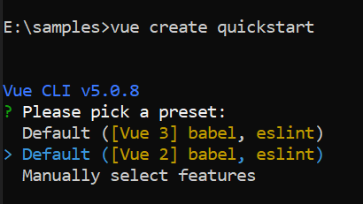

# Getting Started with the Vue File Manager Component in Vue 2

This article provides a step-by-step guide for setting up a Vue 2 project using [Vue-CLI](https://cli.vuejs.org) and integrating the [Vue File Manager](https://www.syncfusion.com/vue-components/vue-file-manager) component.

## Prerequisites

[System requirements for Vue UI components](https://ej2.syncfusion.com/vue/documentation/system-requirements)

## Setting up the Vue 2 project

To generate a Vue 2 project using Vue-CLI, use the [vue create](https://cli.vuejs.org#getting-started) command. Follow these steps to install Vue CLI and create a new project:

```bash
npm install -g @vue/cli
vue create quickstart
cd quickstart
```

or

```bash
yarn global add @vue/cli
vue create quickstart
cd quickstart
```

When creating a new project, choose the option `Default ([Vue 2] babel, eslint)` from the menu.



Once the `quickstart` project is set up with default settings, proceed to add Vue components to the project.

## Add Syncfusion<sup style="font-size:70%">&reg;</sup> Vue packages

To install the [Vue File Manager](https://www.syncfusion.com/vue-components/vue-file-manager) component, use the following command:

```bash
npm install @syncfusion/ej2-vue-filemanager --save
```
or

```bash
yarn add @syncfusion/ej2-vue-filemanager
```

## Import Syncfusion<sup style="font-size:70%">&reg;</sup> CSS styles

The following CSS files are available in the ../node_modules/@syncfusion package folder. Add these as references in **src/App.vue**.




<style>
    @import "../node_modules/@syncfusion/ej2-base/styles/material3.css";
    @import "../node_modules/@syncfusion/ej2-icons/styles/material3.css";
    @import "../node_modules/@syncfusion/ej2-inputs/styles/material3.css";
    @import "../node_modules/@syncfusion/ej2-popups/styles/material3.css";
    @import "../node_modules/@syncfusion/ej2-buttons/styles/material3.css";
    @import "../node_modules/@syncfusion/ej2-splitbuttons/styles/material3.css";
    @import "../node_modules/@syncfusion/ej2-navigations/styles/material3.css";
    @import "../node_modules/@syncfusion/ej2-layouts/styles/material3.css";
    @import "../node_modules/@syncfusion/ej2-grids/styles/material3.css";
    @import "../node_modules/@syncfusion/ej2-vue-filemanager/styles/material3.css";
</style>




> The order of CSS imports matters. Import base styles first, then component-specific styles. Missing CSS imports can result in misaligned layouts, buttons without styling, or missing visual elements in popups and dialogs.

## Add Syncfusion<sup style="font-size:70%">&reg;</sup> Vue component

The File Manager code should be placed in the **src/App.vue** file.









## Run the project

```bash
npm run serve
```

or

```bash
yarn run serve
```

## See also

* [Ajax Settings Configuration (uploadUrl, downloadUrl, getImageUrl)](./file-operations#ajax-settings-configuration)
* [Injecting Services for Overview](./user-interface#injecting-services-for-overview)
* [File Manager Views](./views)
* [File Manager File Operations](./file-operations)
* [File Manager Upload](./upload)
* [File Manager Customization](./customization)