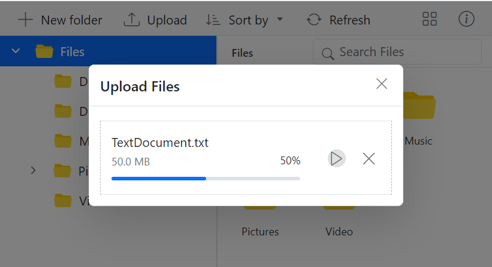

# Upload in Vue File Manager component

The Vue File Manager component provides a [uploadSettings](https://ej2.syncfusion.com/vue/documentation/api/file-manager/#uploadsettings) property with various options to customize how files are uploaded, including controlling file size, restricting file types, checking for excessively large and empty files, and enabling chunk uploads.

## Directory Upload

The [directoryUpload](https://ej2.syncfusion.com/vue/documentation/api/file-manager/uploadSettingsModel/#directoryupload) property controls whether users can browse and upload entire directories (folders) in the Syncfusion Vue File Manager component. 

To enable directory upload, set the `directoryUpload` property to `true` in the `uploadSettings` configuration.

When set to `true`, this property enables directory upload in the File Manager, allowing users to upload entire folders. If set to `false`, only individual files can be uploaded. 

>Note: When `directoryUpload` is set to `true`, only folders can be uploaded. When it is set to `false`, only individual files can be uploaded. Simultaneous uploading of files and folders is not supported.

To learn more about the folder upload actions, refer to this [link](https://ej2.syncfusion.com/vue/documentation/file-manager/file-operations#folder-upload-support)

## Chunk Upload

The [chunkSize](https://ej2.syncfusion.com/vue/documentation/api/file-manager/uploadSettingsModel/#chunksize) property specifies the size of each chunk when uploading large files. It divides the file into smaller parts, which are uploaded sequentially to the server.

This property allows you to enable chunked uploads for large files by specifying a `chunkSize`.

By specifying a `chunkSize`, the large file is divided into smaller parts, reducing the load on the network and making the upload process more efficient.

In the following example, the chunkSize is set to 5 MB (5,242,880 bytes), and the maxFileSize is set to 70 MB (73,728,000 bytes). This means files that are up to 70 MB will be uploaded in 5 MB chunks.












With chunk upload, the pause and resume options gives users enhanced control over the file upload process.

>Note: 
>1. Chunk upload will work when the selected file size is greater than the specified chunk size. Otherwise, it upload the files normally. 
>2. The pause and resume features available only when the chunk upload is enabled.

## Auto Upload

The [autoUpload](https://ej2.syncfusion.com/vue/documentation/api/file-manager/uploadSettingsModel/#autoupload) property controls whether files are automatically uploaded when they are added to the upload queue in the File Manager component.

The default value is `true`, the File Manager will automatically upload files as soon as they are added to the upload queue. If set to `false`, the files will not be uploaded automatically, giving you the chance to manipulate the files before uploading them to the server.












## Auto Close

The [autoClose](https://ej2.syncfusion.com/vue/documentation/api/file-manager/uploadSettingsModel/#autoclose) property controls whether the upload dialog automatically closes after all the files have been uploaded.

The default value is set to `false`, the upload dialog remains open even after the upload process is complete. If `autoClose` set to `true`, the upload dialog will automatically close after all the files in the upload queue are uploaded.












## Prevent upload based on file extensions

The [allowedExtensions](https://ej2.syncfusion.com/vue/documentation/api/file-manager/uploadSettingsModel/#allowedextensions) property specifies which file types are allowed for upload in the File Manager component by defining their extensions.

This property lets you define which file types can be uploaded by specifying allowed extensions, separated by commas. For example, to allow only image files, you would set the `allowedExtensions` property to .jpg,.png.

By setting the `allowedExtensions` property, you restrict the file types that can be uploaded. Only files with the specified extensions will be accepted.

If you want to allow only image files like .jpg and .png, you would set the property as follows:












## Restrict drag and drop upload

The File Manager component provides support for external drag-and-drop functionality for uploading files by dragging it from local file system to File Manager.

Setting [allowDragAndDrop](https://ej2.syncfusion.com/vue/angular/documentation/api/file-manager#allowdraganddrop) property to false will not prevent the file upload operation through external drag and drop. It will only prevent drag and drop action within the File Manager component

To completely prevent the external drag-and-drop upload functionality (i.e., disallowing users from dragging and dropping files from outside into the File Manager), you can set the [dropArea](https://ej2.syncfusion.com/vue/documentation/api/uploader#droparea) property to null. This can be done by accessing the File Manager instance via its class methods.

The following example demonstrates how to prevent the external drag and drop upload actions for all types of files in the File Manager component.




















        


## See also

* [Set min and max file size in upload](https://ej2.syncfusion.com/vue/documentation/file-manager/customization#upload-customization)
