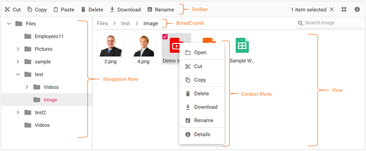
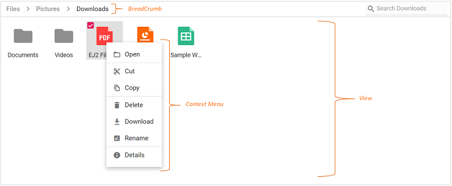
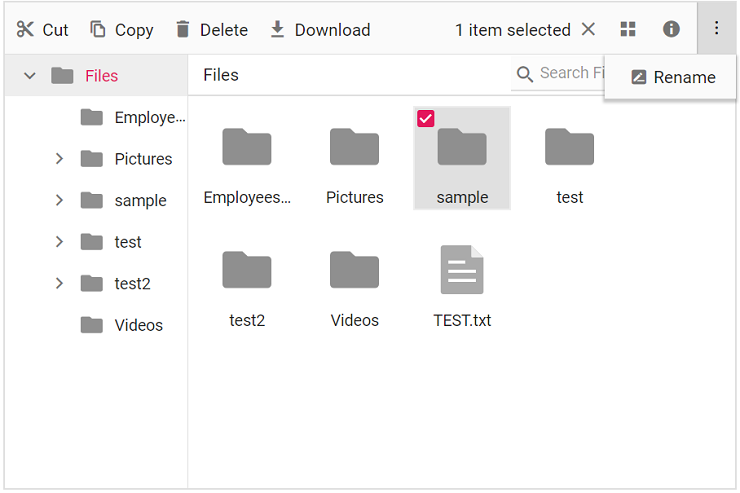
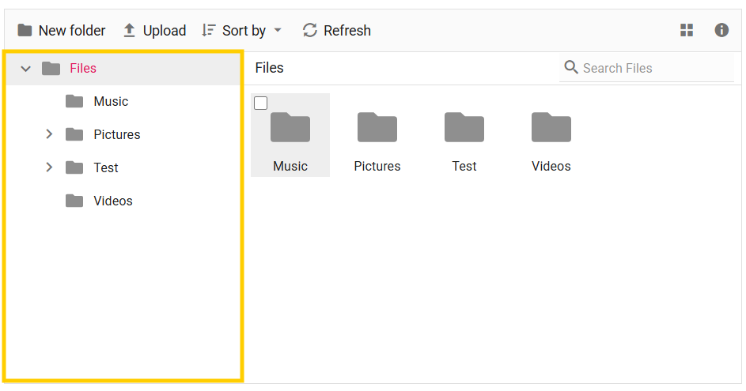
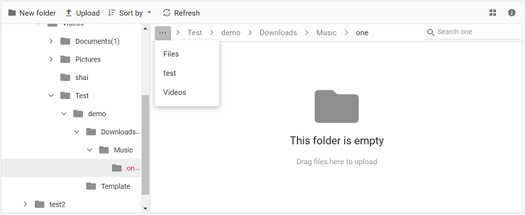
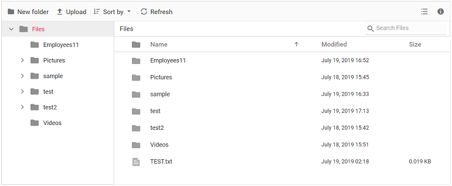
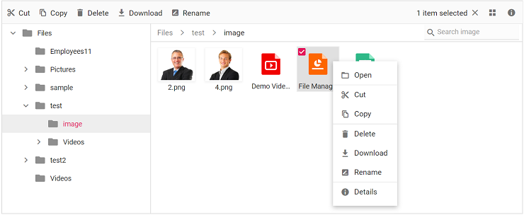

# User Interface in Vue File Manager component

The File Manager UI is comprised of several sections like view, toolbar, breadcrumb, context menu, and so on. The UI of the File Manager is enhanced with injectable modules like `Details View` for browsing files and folders in a grid, `Navigation Pane` for folder navigation, and `Toolbar` for file operations. The File Manager with all feature modules have the following sections in its UI.

* [View](#view) (Large Icons view for browsing files and folders),
* [Toolbar](#toolbar) (For direct access to file operations),
* [Navigation Pane](#navigation-pane) (For easy navigation between folders),
* [Breadcrumb](#breadcrumb) (For parent folder navigations),
* [Context Menu](#context-menu) (For accessing file operations).

The basic File Manager is a lightweight component with all the basic functions. The basic File Manager have the following sections in its UI to browse files and folders and manage them with file operations.

* [View](#view) (Large Icons view for browsing files and folders),
* [Breadcrumb](#breadcrumb) (For parent folder navigations),
* [Context Menu](#context-menu) (For accessing file operations).

## Toolbar

The `Toolbar` provides easy access to the file operations using different buttons and it is presented at the top of the File Manager.

If the toolbar items exceed its size, the extra items will move to a toolbar popup accessible via a dropdown button.

*Refer [Toolbar](./file-operations#toolbar) section in file operations to know more about the buttons present in toolbar*.

## Files and folders navigation

The File Manager provides navigation between files and folders using the following two options.

* [Navigation Pane](#navigation-pane)
* [Breadcrumb](#breadcrumb)

### Navigation pane

The navigation pane is an injectable module, so it should be injected before rendering the File Manager to use its functionality. It displays the folder hierarchy of the file system and provides easy navigation to the desired folder. Using [navigationPaneSettings](https://ej2.syncfusion.com/vue/documentation/api/file-manager/index-default#navigationpanesettings) minimum and maximum width of the navigation pane can be changed. The navigation pane can be shown or hidden using the [`visible`](https://ej2.syncfusion.com/vue/documentation/api/file-manager/navigationPaneSettingsModel#visible) option in the [navigationPaneSettings](https://ej2.syncfusion.com/vue/documentation/api/file-manager/index-default#navigationpanesettings) property.

You can customize the appearance of the navigation pane by using the `navigationPaneTemplate` property. This enables you to modify icons, display text, and include additional elements to suit your application's requirements.

### Breadcrumb

The File Manager provides breadcrumb for navigating to the parent folders. The breadcrumb in the File Manager is responsible for resizing.
Whenever the path length exceeds the breadcrumb length, a dropdown button will be added at the starting of the breadcrumb to hold the parent folders adjacent to root.

## View

View is the section where the files and folders are displayed for the user to browse. The File Manager has two types of views to display the files and folders.

* [Large Icons View](#large-icons-view)
* [Details View](#details-view)

The `large icons view` is the default starting view in the File Manager. The view can be changed by using the [toolbar](#toolbar) view button or by using the view menu in [context menu](#context-menu). The [view](https://ej2.syncfusion.com/vue/documentation/api/file-manager/index-default#view) API can also be used to change the initial view of the File Manager.

### Large icons view

In the large icons view, thumbnails are shown in a larger size optimized for content display. Image and video files display a **preview**. Extension thumbnails will be displayed for other type files.

The `largeIconsTemplate` property enables complete customization of how folders and files are rendered in the `Large Icons View`. It allows you to enhance the layout by adding background images, custom file-type icons, and actions such as dropdown menus.

### Details view

Details view is an injectable module in the File Manager, so it should be injected before rendering the File Manager to avail its functionality. In the details view, the files are displayed in a sorted list order. This file list includes columns like **Name**, **Date Modified**, **Type**, and **Size**. Each file has its own small icon representing the file type. Additional columns can be added using [detailsViewSettings](https://ej2.syncfusion.com/vue/documentation/api/file-manager/index-default#detailsviewsettings) API. The details view allows you to perform sorting using column header.

## Context menu

The context menu appears on user interaction such as right-click. The File Manager is provided with context menu support to perform list of file operations with the files and folders. Context menu appears with varying menu items based on the targets such as file, folder (including navigation pane folders),  and layout (empty area in view).

The context menu can be customized using the [contextMenuSettings](https://ej2.syncfusion.com/vue/documentation/api/file-manager/index-default#contextmenusettings), [menuOpen](https://ej2.syncfusion.com/vue/documentation/api/file-manager/index-default#menuopen), and [menuClick](https://ej2.syncfusion.com/vue/documentation/api/file-manager/index-default#menuclick) events.

*Refer [Context Menu](./file-operations#context-menu) section in file operations to know more about the menu items present in context menu*.

### Upload Files or Folders via context menu

File Manager component allows to perform the files or folder [upload](https://ej2.syncfusion.com/vue/documentation/file-manager/file-operations#upload) operations with the help of Context Menu items by switching between the Files or Folder from Upload menu item.

