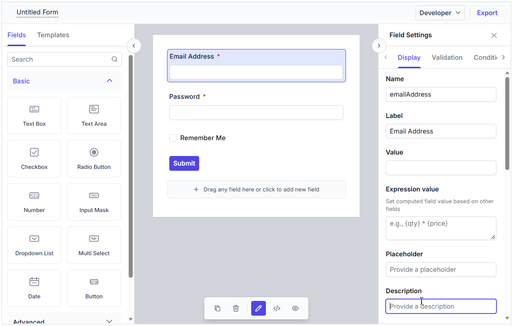
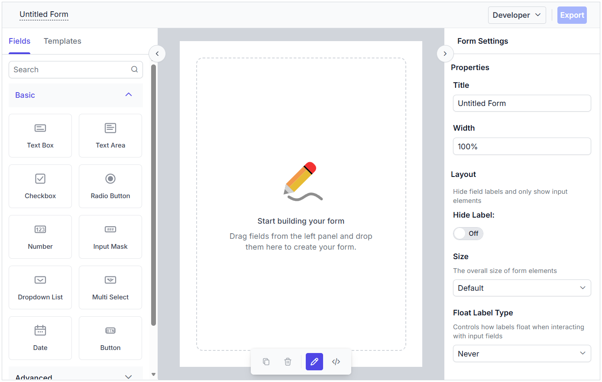
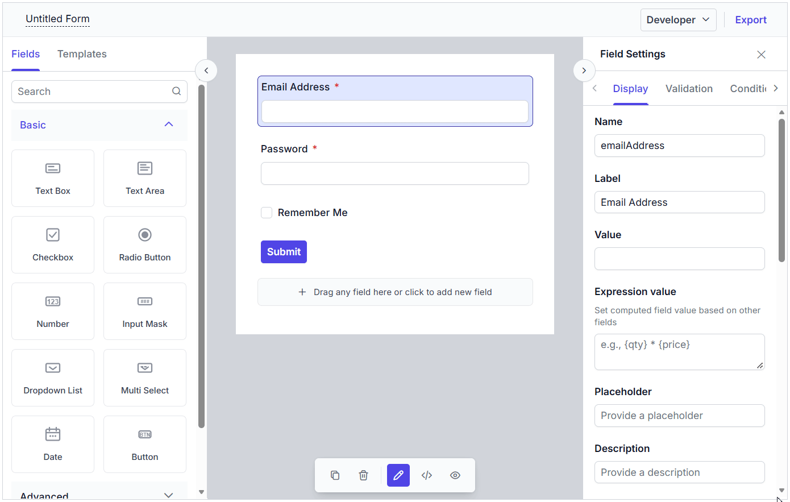

# Preview Tab in Vue Form Builder component

The Form Builder provides a preview tab that lets you view the generated form as it will appear to end users. It also includes a JSON code preview to review the form schema created by the builder.

## Preview the form

You can switch to the **Preview** tab to see a live preview of the form. This view reflects the current form configuration and helps you validate the layout, labels, and field behavior before exporting or publishing the form.

## Disabling the preview

The preview option can be disabled by setting the `enablePreview` property to `false`. The default value is `true`.




<template>
  <ejs-formbuilder :enablePreview="false" ref="formObj">
  </ejs-formbuilder>
</template>





<template>
  <ejs-formbuilder :enablePreview="false" ref="formObj">
  </ejs-formbuilder>
</template>




The output will appear as follows:

## JSON code preview

You can switch to the **JSON** tab to view the form schema as a JSON object. This code preview is useful for reviewing the generated schema and understanding the structure used by the Form Builder.

The **Copy** button in the JSON code preview copies the created form schema JSON object to the clipboard so that you can reuse it in another application or pass it to the Form Renderer control.

## Build and preview workflow

Use the **Build** tab to create or edit the form, then switch to **Preview** to validate the rendered form. If you need the schema representation, open **JSON** and use **Copy** to copy the generated form schema.
