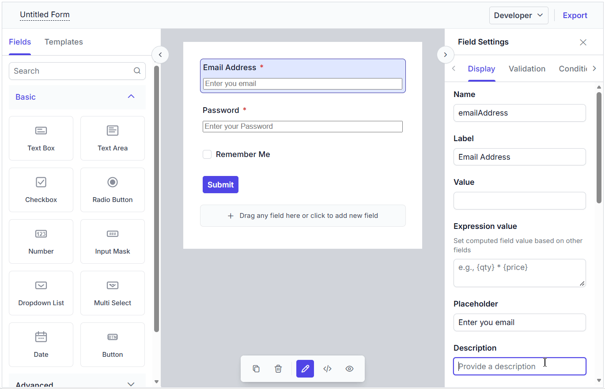

# Templates in Angular Form Builder component

Templates can be used in the Form Builder control to display third-party components within the form. This feature lets you configure the form schema with the properties of the third-party component.

This section explains how to use templates in the Form Builder component.

## Adding Templates

Templates can be added to the Form Builder by configuring the third-party control in the `<e-toolboxitemsetting>`.
Use the `<e-toolboxitemsetting>` directive inside `<e-toolboxitemsettings>` to define custom templates. Bind the `type` property to a `FormWidgetType` value to target a specific widget type, and pass the custom UI using the `:template` prop.

Multiple `<e-toolboxitemsetting>` entries can be added to register templates for different widget types.

Once a field is dragged onto the design canvas, the custom template renders automatically.




<template>
    

        <ejs-form-builder id="form-builder-control" ref="formObj" :schema="schema">
            <e-toolboxitemsettings>
                <e-toolboxitemsetting :type="formType" :template="'textboxTemplate'" />
            </e-toolboxitemsettings>
            <template v-slot:textboxTemplate="{ data }">
                <input :id="`form-builder-control-${data.fieldData?.id || data.id}`" class="e-input"
                    :type="data.fieldData?.textboxType || data.textboxType || 'text'"
                    :name="data.fieldData?.name || data.name" :placeholder="data.fieldData?.placeholder"
                    :value="data.value || ''" @input="setFieldValue(data, $event)" />
            </template>
        </ejs-form-builder>
    

</template>





<template>
    

        <ejs-form-builder id="form-builder-control" ref="formObj" :schema="schema">
            <e-toolboxitemsettings>
                <e-toolboxitemsetting :type="formType" :template="'textboxTemplate'" />
            </e-toolboxitemsettings>
            <template v-slot:textboxTemplate="{ data }">
                <input :id="`form-builder-control-${data.fieldData?.id || data.id}`" class="e-input"
                    :type="data.fieldData?.textboxType || data.textboxType || 'text'"
                    :name="data.fieldData?.name || data.name" :placeholder="data.fieldData?.placeholder"
                    :value="data.value || ''" @input="setFieldValue(data, $event)" />
            </template>
        </ejs-form-builder>
    

</template>




In the Preview tab, the templates are displayed so that you can validate the created form.

## Adding properties of the template in property panel

The properties of third party components can be added to the property panel using the `setProperty` method in the Form Builder. For more details, see this [documentation](./property-panel#adding-a-new-property-in-the-property-panel)

## Exporting templates

When the form schema is exported, the template itself is not included in the schema. However, a `templateId` property is added to the form schema to notify Form Renderer that a template is mapped to the corresponding element. This value is configured via the `templateId` property on `<e-toolboxitemsetting>`.

In Form Renderer, additional configuration is required as described in the [documentation](http://ej2.syncfusion.com/vue/documentation/form-renderer/templates) to render templates in the form.