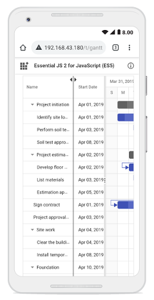

# Column resizing in Vue Gantt Chart Component

Column width can be adjusted by clicking and dragging the right edge of a column header. While dragging, the column width updates immediately. Each column can also be auto‑resized by double‑clicking the right edge of the column header, which adjusts the width to fit the widest cell content.

To enable column resizing, set the [columns.allowResizing](https://ej2.syncfusion.com/vue/documentation/api/gantt/column#allowresizing) property to `true`. The following example shows how to enable the column resizing feature in the Gantt Chart component.

To use column resizing, inject the `Resize` module in the `provide` section.












> You can disable resizing for a specific column by setting the [columns.allowResizing](https://ej2.syncfusion.com/vue/documentation/api/gantt/column#allowresizing) property to `false`.

## Defining minimum and maximum column width

Column resizing can be restricted between minimum and maximum widths using the [columns.minWidth](https://ej2.syncfusion.com/vue/documentation/api/gantt/column#minwidth) and [columns.maxWidth](https://ej2.syncfusion.com/vue/documentation/api/gantt/column#maxwidth) properties.

In the following example, the minimum and maximum widths are defined for the `Duration` and `Task Name` columns.












## Touch interaction

When the right edge of a column header cell is tapped, a floating handler appears above the right border of the column. To [resize](https://ej2.syncfusion.com/vue/documentation/gantt/columns/column-resizing) the column, drag the floating handler as needed.

The following screenshot represents column resizing in the Gantt Chart component on a touch device.

