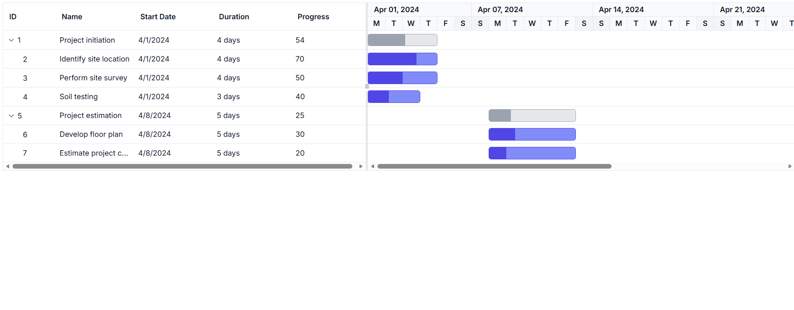

# Getting Started with the Vue Gantt Chart Component in Vue 3

This article provides a step-by-step guide for setting up a [Vite](https://vitejs.dev) project with a JavaScript environment and integrating the Syncfusion<sup style="font-size:70%">&reg;</sup> Vue Gantt Chart component using the [Composition API](https://vuejs.org/guide/introduction.html#composition-api).

The `Composition API` is a new feature introduced in Vue.js 3 that provides an alternative way to organize and reuse component logic. It allows developers to write components as functions that use smaller, reusable functions called composition functions to manage their properties and behavior.

## Prerequisites

[System requirements for Syncfusion<sup style="font-size:70%">&reg;</sup> Vue UI components](https://ej2.syncfusion.com/vue/documentation/system-requirements)

## Setup the Vite project

A recommended approach for beginning with Vue is to scaffold a project using [Vite](https://vitejs.dev). To create a new Vite project, use one of the commands that are specific to either NPM or Yarn.

```bash
npm create vite@latest
```

or

```bash
yarn create vite
```

Using one of the above commands will lead you to set up additional configurations for the project as below:

1.Define the project name: The name of the project can be specified directly. For this article, the project name is set as `my-project`.

```bash
? Project name: » my-project
```

2.Select `Vue` as the framework. It will create a Vue 3 project.

```bash
? Select a framework: » - Use arrow-keys. Return to submit.
Vanilla
> Vue
  React
  Preact
  Lit
  Svelte
  Others
```

3.Choose `JavaScript` as the framework variant to build this Vite project using JavaScript and Vue.

```bash
? Select a variant: » - Use arrow-keys. Return to submit.
> JavaScript
  TypeScript
  Customize with create-vue ↗
  Nuxt ↗
```

4.Install dependencies and start the development server.

```bash
Install with npm and start now?: Yes
```

Since you selected `Yes`, the development server should start automatically. If you selected `No`, please follow these steps to set up and start the project manually:

```bash
cd my-project
npm install
```

or

```bash
cd my-project
yarn install
```

Now that `my-project` is ready to run with default settings, let's add Syncfusion<sup style="font-size:70%">&reg;</sup> components to the project.

## Add Syncfusion<sup style="font-size:70%">&reg;</sup> Vue packages

Syncfusion<sup style="font-size:70%">&reg;</sup> Vue component packages are available at [npmjs.com](https://www.npmjs.com/search?q=ej2-vue). To use Syncfusion<sup style="font-size:70%">&reg;</sup> Vue components in the project, install the corresponding npm package.

This article uses the [Vue Gantt Chart component](https://www.syncfusion.com/vue-components/vue-Gantt) as an example. To use the Vue Gantt Chart component in the project, the `@syncfusion/ej2-vue-gantt` package needs to be installed using the following command:

```bash
npm install @syncfusion/ej2-vue-gantt
```

or

```bash
yarn add @syncfusion/ej2-vue-gantt
```

## Import Syncfusion<sup style="font-size:70%">&reg;</sup> CSS styles

In this article, `Tailwind3` theme is applied using CSS styles, which are available in installed packages. The necessary `Tailwind3` CSS styles for the Gantt Chart component and its dependents were imported into the `<style>` section of **src/App.vue** file.

### Using local style

Import the needed css styles for the Gantt Chart component along with dependency styles in the `<style>` section of the `src/App.vue` file as follows.

```css
<style>
@import "../node_modules/@syncfusion/ej2-base/styles/tailwind3.css";
@import "../node_modules/@syncfusion/ej2-gantt/styles/tailwind3.css";
@import "../node_modules/@syncfusion/ej2-grids/styles/tailwind3.css";
@import "../node_modules/@syncfusion/ej2-treegrid/styles/tailwind3.css";
@import "../node_modules/@syncfusion/ej2-layouts/styles/tailwind3.css";
@import "../node_modules/@syncfusion/ej2-popups/styles/tailwind3.css";
</style>

```
> **Note:** When using features like editing, toolbar, filtering, or dialogs, you need to import additional component styles:
> ```css
> /* For editing, toolbar, and dialog features */
> @import "../node_modules/@syncfusion/ej2-calendars/styles/tailwind3.css";
> @import "../node_modules/@syncfusion/ej2-dropdowns/styles/tailwind3.css";
> @import "../node_modules/@syncfusion/ej2-inputs/styles/tailwind3.css";
> @import "../node_modules/@syncfusion/ej2-buttons/styles/tailwind3.css";
> @import "../node_modules/@syncfusion/ej2-navigations/styles/tailwind3.css";
> @import "../node_modules/@syncfusion/ej2-notifications/styles/tailwind3.css";
> 
> /* For rich text editor in dialog notes tab */
> @import "../node_modules/@syncfusion/ej2-richtexteditor/styles/tailwind3.css";
> ```

## Create sample data
Define a simple task list with hierarchical relationships. Each task must have a `StartDate` and either a `Duration` or `EndDate` to render properly.

```js
const data = [
  { TaskID: 1, TaskName: 'Project initiation', StartDate: new Date('2024-04-01'), EndDate: new Date('2024-04-15') },
  { TaskID: 2, TaskName: 'Identify site location', StartDate: new Date('2024-04-01'), Duration: 4, Progress: 70, ParentID: 1 },
  { TaskID: 3, TaskName: 'Perform site survey', StartDate: new Date('2024-04-01'), Duration: 4, Progress: 50, ParentID: 1 },
  { TaskID: 4, TaskName: 'Soil testing', StartDate: new Date('2024-04-01'), Duration: 3, Progress: 40, ParentID: 1 },
  { TaskID: 5, TaskName: 'Project estimation', StartDate: new Date('2024-04-08'), EndDate: new Date('2024-04-18') },
  { TaskID: 6, TaskName: 'Develop floor plan', StartDate: new Date('2024-04-08'), Duration: 5, Progress: 30, ParentID: 5 },
  { TaskID: 7, TaskName: 'Estimate project cost', StartDate: new Date('2024-04-08'), Duration: 5, Progress: 20, ParentID: 5 }
]
```
## Configure task fields

```js
const taskFields = {
  id: 'TaskID',
  name: 'TaskName',
  startDate: 'StartDate',
  duration: 'Duration',
  progress: 'Progress',
  parentID: 'ParentID'
};
```
### Field mapping reference

| Property | Description | Required |
|----------|-------------|----------|
| `id` | Unique task identifier | Yes |
| `name` | Task display name | Yes |
| `startDate` | Task start date | Yes |
| `duration` | Task duration in days | Yes |
| `progress` | Task completion percentage (0-100) | No |
| `parentID` | Parent task ID for hierarchy | No |

## Render the Gantt component

Follow the steps below to add the Vue Gantt Chart component using the Composition API:

First, import and register the Gantt component in the `<script>` section of the `src/App.vue` file. When using the Composition API, include the `setup` attribute in the `<script>` tag to enable it.

To display the Gantt Chart, bind your task data using the `dataSource` property and map the corresponding fields using the `taskFields` property.




<template>
  <ejs-gantt 
    :dataSource="data"
    :taskFields="taskFields"
  >
  </ejs-gantt>
</template>

<script setup>
  // Import and register the Gantt component
  import { GanttComponent as EjsGantt} from '@syncfusion/ej2-vue-gantt';
  const data = [
    {TaskID: 1, TaskName: 'Project initiation', StartDate: new Date('2024-04-01'), EndDate: new Date('2024-04-15')},
    {TaskID: 2, TaskName: 'Identify site location', StartDate: new Date('2024-04-01'), Duration: 4, Progress: 70, ParentID: 1},
    {TaskID: 3, TaskName: 'Perform site survey', StartDate: new Date('2024-04-01'), Duration: 4, Progress: 50, ParentID: 1},
    {TaskID: 4, TaskName: 'Soil testing', StartDate: new Date('2024-04-01'), Duration: 3, Progress: 40, ParentID: 1},
    {TaskID: 5, TaskName: 'Project estimation', StartDate: new Date('2024-04-08'), EndDate: new Date('2024-04-18')},
    {TaskID: 6, TaskName: 'Develop floor plan', StartDate: new Date('2024-04-08'), Duration: 5, Progress: 30, ParentID: 5},
    {TaskID: 7, TaskName: 'Estimate project cost', StartDate: new Date('2024-04-08'), Duration: 5, Progress: 20, ParentID: 5}
  ];
  const taskFields = {
    id: 'TaskID',
    name: 'TaskName',
    startDate: 'StartDate',
    duration: 'Duration',
    progress: 'Progress',
    parentID: 'ParentID'
  };
</script>

<style>
@import "../node_modules/@syncfusion/ej2-base/styles/tailwind3.css";
@import "../node_modules/@syncfusion/ej2-gantt/styles/tailwind3.css";
@import "../node_modules/@syncfusion/ej2-grids/styles/tailwind3.css";
@import "../node_modules/@syncfusion/ej2-treegrid/styles/tailwind3.css";
@import "../node_modules/@syncfusion/ej2-layouts/styles/tailwind3.css";
@import "../node_modules/@syncfusion/ej2-popups/styles/tailwind3.css";
</style>




## Running the application

Run the application using the following command.

```bash
npm run dev
```

## Output

You will see a Gantt Chart with:

- Task hierarchy with parent-child relationships
- Timeline view showing task bars
- Progress indicators on each task
- Automatically calculated dates based on duration

The chart displays two parent tasks ("Project initiation" and "Project estimation") with their subtasks shown in a tree structure. Task bars are rendered on the timeline, sized according to their duration and start dates.

## Next Steps

- **[Key Elements](./key-elements)** - Learn about UI components and interactions
- **[Feature Modules](./module)** - Enable advanced features with module injection
- **[Overview](./overview)** - Explore all available features



Web server will be initiated, Open the quick start app in the browser at port `localhost:8080`.
