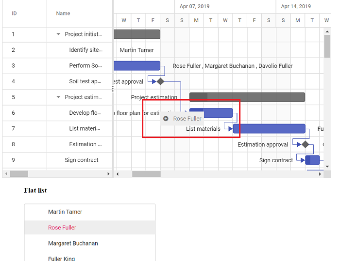

# Drag and drop from another in Vue Gantt Chart Component

In the Gantt Chart, it is possible to drag a record from another component and drop it into the Gantt Chart while updating the Gantt record. Here, an item is dragged from the `TreeView` component to the Gantt Chart, and that item is updated as a resource for the Gantt record. We can achieve this by using the [nodeDragStop](https://ej2.syncfusion.com/vue/documentation/api/treeview#nodedragstop) event of the `TreeView` control.

To learn about Gantt Chart Drag and Drop, you can check on this video:










        


The following screenshot shows dropping a record from another component into the Gantt Chart, and **Rose Fuller** is added as a resource for the task **Develop floor plan estimation**.

