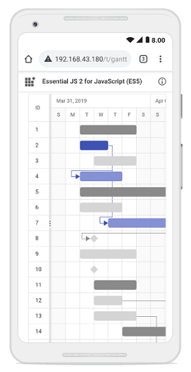

# Managing tasks in Vue Gantt component

The Gantt component has options to dynamically insert, delete, and update tasks in the project. The primary key column is necessary to manage the tasks and perform CRUD operations in Gantt. To define the primary key, set the [`columns.isPrimaryKey`](https://ej2.syncfusion.com/vue/documentation/api/gantt/column/#isprimarykey) property to `true` in the particular column.

To use CRUD, inject the [`Edit`](https://ej2.syncfusion.com/vue/documentation/api/gantt/#editmodule) module in the `provide` section.

`Note:` If the [`Edit`](https://ej2.syncfusion.com/vue/documentation/api/gantt/#editmodule) module is not injected, you cannot edit the tasks through the TreeGrid cells.

The following code example demonstrates how to enable cell editing in the Gantt component.









        


`Note:` When the edit mode is set to `Auto`, on performing double-click action on TreeGrid side, the cells will be changed to editable mode and on performing double-click action on chart side, the edit dialog will appear for editing the task details.

## Cell edit type and its params

The [`columns.editType`](https://ej2.syncfusion.com/vue/documentation/api/gantt/column/#edittype) is used to define the edit type for any particular column.
You can set the [`columns.editType`](https://ej2.syncfusion.com/vue/documentation/api/gantt/column/#edittype) based on data type of the column.

* `numericedit` - [`NumericTextBox`](https://ej2.syncfusion.com/vue/documentation/numerictextbox/getting-started) component for integers, double, and decimal data types.

* `defaultedit` - [`TextBox`](https://ej2.syncfusion.com/vue/documentation/textbox/getting-started) component for string data type.

* `dropdownedit` - [`DropDownList`](https://ej2.syncfusion.com/vue/documentation/drop-down-list/getting-started/) component to show all unique values related to that field.

* `booleanedit` - [`CheckBox`](https://ej2.syncfusion.com/vue/documentation/check-box/getting-started/) component for boolean data type.

* `datepickeredit` - [`DatePicker`](https://ej2.syncfusion.com/vue/documentation/datepicker/getting-started) component for date data type.

* `datetimepickeredit` - [`DateTimePicker`](https://ej2.syncfusion.com/vue/documentation/datetimepicker/getting-started/) component for date time data type.

Also, you can customize the behavior of the editor component through the [`columns.edit.params`](https://ej2.syncfusion.com/vue/documentation/api/gantt/column/#edit).

The following table describes cell edit type component and their corresponding edit params of the column.

Edit Type |Component |Example
-----|-----|-----
`numericedit` | [`NumericTextBox`](https://ej2.syncfusion.com/vue/documentation/numerictextbox/getting-started) | params: { decimals: 2, value: 5 }
`dropdownedit` | [`DropDownList`](https://ej2.syncfusion.com/vue/documentation/drop-down-list/getting-started/) | params: { value: 'Germany' }
`booleanedit` | [`Checkbox`](https://ej2.syncfusion.com/vue/documentation/check-box/getting-started/) | params: { checked: true}
`datepickeredit` | [`DatePicker`](https://ej2.syncfusion.com/vue/documentation/datepicker/getting-started) | params: { format:'dd.MM.yyyy' }
`datetimepickeredit` | [`DateTimePicker`](https://ej2.syncfusion.com/vue/documentation/datetimepicker/getting-started/) | params: { value: new Date() }









        


## Cell edit template

The cell edit template is used to create a custom component for a particular column by invoking the following functions:

* `create` - It is used to create the element at the time of initialization.

* `write` - It is used to create the custom component or assign default value at the time of editing.

* `read` - It is used to read the value from the component at the time of save.

* `destroy` - It is used to destroy the component.









        


## Disable editing for particular column

You can disable editing for particular columns, by using the [`columns.allowEditing`](https://ej2.syncfusion.com/vue/documentation/api/gantt/column/#allowediting) property.

In the following demo, editing is disabled for the `TaskName` column.









        


## Read-only Gantt

In Gantt, all create, update, delete operations can be disabled by setting the `readOnly` property as `true`. The following sample demonstrates, rendering the Gantt chart as read only.









        


## Troubleshoot: Editing works only when primary key column is defined

Editing feature requires a primary key column for CRUD operations. While defining columns in Gantt using the [`columns`](https://ej2.syncfusion.com/vue/documentation/api/gantt/#columns) property, it is mandatory that any one of the columns, must be a primary column. By default, the [`id`](https://ej2.syncfusion.com/vue/documentation/api/gantt/taskFields/#id) column will be the primary key column.  If [`id`](https://ej2.syncfusion.com/vue/documentation/api/gantt/taskFields/#id) column is not defined, we need to enable [`isPrimaryKey`](https://ej2.syncfusion.com/vue/documentation/api/gantt/column/#isprimarykey) for any one of the columns defined in the [`columns`](https://ej2.syncfusion.com/vue/documentation/api/gantt/#columns) property.

## Open new task dialog with default values

You can set default values when new task dialog opens using [actionBegin](https://ej2.syncfusion.com/vue/documentation/api/gantt/#actionbegin) event when `requestType` is `beforeOpenAddDialog`.









        


## Customize control in add/edit dialog

In Gantt Chart, the controls such as form elements, grid and RTE in add and edit dialog can be customized by using [additionalParams](https://ej2.syncfusion.com/vue/documentation/api/gantt/addDialogFieldSettingsModel/#additionalParams) property.

### Customize general tab of dialog

The form element in the `General` tab of the add/edit dialog can be added or removed by using the [fields](https://ej2.syncfusion.com/vue/documentation/api/gantt/addDialogFieldSettings/#fields) property within the [addDialogFields](https://ej2.syncfusion.com/vue/documentation/api/gantt/addDialogFieldSettings/) and [editDialogFields](https://ej2.syncfusion.com/vue/documentation/api/gantt/editDialogFieldSettings/) settings respectively.

The controls of the `fields` can be customized by using the [edit](https://ej2.syncfusion.com/vue/documentation/gantt/managing-tasks/managing-tasks#cell-edit-template) template feature.

In the below sample, `General` tab is customized using the `fields` property. The fields **TaskID**, **TaskName** and **newInput** are added in both `addDialogFields` and `editDialogFields` settings.









        


### Customize dependency, segments and resources tab of dialog

You can customize the dependency, segments, and resource tabs of the dialog box using the [additionalParams](https://ej2.syncfusion.com/vue/documentation/api/gantt/addDialogFieldSettingsModel/#additionalParams) property within the [addDialogFields](https://ej2.syncfusion.com/vue/documentation/api/gantt/addDialogFieldSettings/) and [editDialogFields](https://ej2.syncfusion.com/vue/documentation/api/gantt/editDialogFieldSettings/) settings respectively. This customization involves defining properties from the [grid](https://ej2.syncfusion.com/vue/documentation/api/grid/) within the `additionalParams` property.

In the example below: 
* The `dependency` tab enables [sorting](https://ej2.syncfusion.com/vue/documentation/api/grid/#allowsorting) and [toolbar](https://ej2.syncfusion.com/vue/documentation/api/grid/#toolbar) options. 
* The `segments` tab enables `sorting` and `toolbar` options and includes a new column `newData` defined with a specified [field](https://ej2.syncfusion.com/vue/documentation/api/grid/columnModel/#field).
* The `resources` tab defines a new column `Segment Task`  with specific properties such as `field`, [width](https://ej2.syncfusion.com/vue/documentation/api/grid/columnModel/#width) and [headerText](https://ej2.syncfusion.com/vue/documentation/api/grid/columnModel/#headertext).
These customizations are applied to both `addDialogFields` and `editDialogFields` settings.









        


### Customize note dialog tab

You can customize the note dialog tab using the [additionalParams](https://ej2.syncfusion.com/vue/documentation/api/gantt/addDialogFieldSettingsModel/#additionalParams) property within the [addDialogFields](https://ej2.syncfusion.com/vue/documentation/api/gantt/addDialogFieldSettings/) and [editDialogFields](https://ej2.syncfusion.com/vue/documentation/api/gantt/editDialogFieldSettings/) settings respectively. This customization involves defining properties from the [RTE](https://ej2.syncfusion.com/vue/documentation/api/rich-text-editor/) module within the `additionalParams` property.

In the following example, the `notes` tab is customized with the [inlinemode](https://ej2.syncfusion.com/vue/documentation/api/rich-text-editor/#inlinemode) property enabled, allowing for in-place editing. Additionally, the `OnSelection` property is enabled, which opens the toolbar inline upon selecting text.









        


## Touch interaction

The Gantt control editing actions can be achieved using the double tap and tap and drag actions on a element.

The following table describes different types of editing modes available in Gantt.

Action |Description
-----|-----
[`Cell editing`](managing-tasks/#cell-editing) | To perform `double tap` on a specific cell, initiate the cell to be in edit state.
[`Dialog editing`](managing-tasks/#dialog-editing) | To perform `double tap` on a specific row, initiate the edit dialog to be opened.
[`Taskbar editing`](managing-tasks/#taskbar-editing) | Taskbar editing action is initiated using the `tap` action on the taskbar.   **Parent taskbar** : Once you tap on the parent taskbar, it will be changed to editing state. Perform only dragging action on parent taskbar editing.      **Child taskbar** : Once you tap the child taskbar, it will be changed to editing state.      **Dragging taskbar** : To drag a taskbar to the left or right in editing state.     **Resizing taskbar** : To resize a taskbar, drag the left/right resize icon.     **Progress resizing** : To change the progress, drag the progress resize icon to the left or right direction.

### Task dependency editing

You can `tap` the left/right connector point to initiate [`task dependencies`](managing-tasks/#task-dependencies) edit mode and again tap another taskbar to establish the dependency line between two taskbars.

The following table explains the taskbar state in dependency edit mode.

Taskbar state |Description
-----|-----
`Parent taskbar` | You cannot create dependency relationship to parent tasks.   
`Taskbar without dependency` |  If you tap a valid child taskbar, it will create `FS` type dependency line between tasks, otherwise exits from task dependency edit mode.   
`Taskbar with dependency` | If you tap the second taskbar, which has already been directly connected, it will ask to remove it.   
`Removing dependency` | Once you tap the taskbar with direct dependency, then confirmation dialog will be shown for removing dependency.   









        


>Note: In mobile device, you cannot create dependency other than `FS` by taskbar editing. By using cell/dialog editing, you can add all type of dependencies.

## Taskbar editing tooltip

The taskbar editing tooltip can be customized using the [`tooltipSettings.editing`](https://ej2.syncfusion.com/vue/documentation/api/gantt/tooltipSettings/#editing) property. The following code example shows how to customize the taskbar editing tooltip in Gantt.









        
