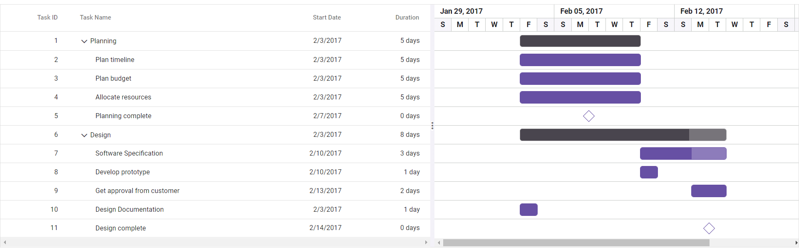

# Getting Started with the Vue Gantt Chart in the Quasar Framework

This article provides a step-by-step guide for setting up a [Quasar](https://quasar.dev) project and integrating the Syncfusion<sup style="font-size:70%">&reg;</sup> Vue Gantt Chart component using the [Composition API](https://vuejs.org/guide/introduction.html#composition-api).

The `Quasar` Framework is a Vue.js-based open-source framework that empowers developers to create high-performance and responsive applications across various platforms, such as web, mobile, and desktop.

## Prerequisites

[System requirements for Syncfusion<sup style="font-size:70%">&reg;</sup> Vue Gantt Chart component](../system-requirements)

## Set up the Quasar project

To initiate the creation of a new [Quasar](https://quasar.dev/start/quick-start/) project, use the following commands:

```bash
npm init quasar
```

This command prompts additional configurations. Follow the steps outlined in the images below:


This generates the necessary files and prompts for project dependency installation. Respond with 'yes' to proceed with npm install, as shown in the image below:


Navigate to your project directory:

```bash
cd quasar-project
```

Now that `quasar-project` is ready to run with default settings, let's add  Vue Gantt Chart component to the project.


## Add Syncfusion<sup style="font-size:70%">&reg;</sup> Vue packages

Syncfusion<sup style="font-size:70%">&reg;</sup> Vue component packages are available at [npmjs.com](https://www.npmjs.com/search?q=ej2-vue). To use Syncfusion<sup style="font-size:70%">&reg;</sup> Vue components in the project, install the corresponding npm package.

This article uses the [Vue Gantt Chart component](https://www.syncfusion.com/vue-components/vue-gantt-chart) as an example. To use the Vue Gantt Chart component in the project, the `@syncfusion/ej2-vue-gantt` package needs to be installed using the following command:

```bash
npm install @syncfusion/ej2-vue-gantt --save
```

## Import Syncfusion<sup style="font-size:70%">&reg;</sup> CSS styles

You can import themes for the Syncfusion<sup style="font-size:70%">&reg;</sup> Vue Gantt component in various ways, such as using CSS or SASS styles from npm packages, CDN, CRG and [Theme Studio](https://ej2.syncfusion.com/vue/documentation/appearance/theme-studio). Refer to the [themes topic](https://ej2.syncfusion.com/vue/documentation/appearance/theme) to learn more about built-in themes and different ways to refer to themes in a Vue project.

In this article, the `Tailwind3` theme is applied using CSS styles, which are available in installed packages. The necessary `Tailwind3` CSS styles for the Gantt Chart component and its dependents were imported into the `<style>` section of the **src/app.vue** file.




<style>
@import "../node_modules/@syncfusion/ej2-base/styles/tailwind3.css";
@import "../node_modules/@syncfusion/ej2-buttons/styles/tailwind3.css";
@import "../node_modules/@syncfusion/ej2-calendars/styles/tailwind3.css";
@import "../node_modules/@syncfusion/ej2-dropdowns/styles/tailwind3.css";
@import "../node_modules/@syncfusion/ej2-inputs/styles/tailwind3.css";
@import "../node_modules/@syncfusion/ej2-navigations/styles/tailwind3.css";
@import "../node_modules/@syncfusion/ej2-popups/styles/tailwind3.css";
@import "../node_modules/@syncfusion/ej2-splitbuttons/styles/tailwind3.css";
@import "../node_modules/@syncfusion/ej2-layouts/styles/tailwind3.css";
@import "../node_modules/@syncfusion/ej2-grids/styles/tailwind3.css";
@import "../node_modules/@syncfusion/ej2-treegrid/styles/tailwind3.css";
@import "../node_modules/@syncfusion/ej2-vue-gantt/styles/tailwind3.css";
</style>




> The order of importing CSS styles should be in line with their dependency graph.

## Add the Syncfusion<sup style="font-size:70%">&reg;</sup> Vue component

Follow the below steps to add the Vue Gantt Chart component:

1\. First, add the `setup` attribute to the `script` tag to indicate that Vue will be using the `Composition API`. And import the Gantt Chart component and its child directives in the `script` section of the **src/app.vue** file.




<script setup>
   import { GanttComponent as EjsGantt, ColumnsDirective as EColumns, ColumnDirective as EColumn } from '@syncfusion/ej2-vue-gantt';
</script>



   
2\. Then, define the Gantt Chart component in the **src/app.vue** file, as shown below:




<template>
  <ejs-gantt :dataSource='data' :treeColumnIndex='1' child='subtasks' :taskFields= 'taskFields'>
        <e-columns>
            <e-column field='TaskID' headerText='Task ID' textAlign='Right' width=70></e-column>
            <e-column field='TaskName' headerText='Task Name' textAlign='Left' width=200></e-column>
            <e-column field='StartDate' headerText='Start Date' textAlign='Right' format='yMd' width=90></e-column>
            <e-column field='Duration' headerText='Duration' textAlign='Right' width=80></e-column>
       </e-columns>
    </ejs-gantt>
</template>




3\. Declare the values for the `dataSource` property in the `script` section.




<script setup>
    const data = [{
         TaskID: 1,
         TaskName: 'Planning',
         StartDate: new Date('02/03/2017'),
         EndDate: new Date('02/07/2017'),
         Progress: 100,
         Duration: 5,
         subtasks: [
             { TaskID: 2, TaskName: 'Plan timeline', StartDate: new Date('02/03/2017'), EndDate: new Date('02/07/2017'), Duration: 5, Progress: 100,},
             { TaskID: 3, TaskName: 'Plan budget', StartDate: new Date('02/03/2017'), EndDate: new Date('02/07/2017'), Duration: 5, Progress: 100, },
             { TaskID: 4, TaskName: 'Allocate resources', StartDate: new Date('02/03/2017'), EndDate: new Date('02/07/2017'), Duration: 5, Progress: 100, },
             { TaskID: 5, TaskName: 'Planning complete', StartDate: new Date('02/07/2017'), EndDate: new Date('02/07/2017'), Duration: 0, Progress: 0, }
         ]
     },
     {
         TaskID: 6,
         TaskName: 'Design',
         StartDate: new Date('02/10/2017'),
         EndDate: new Date('02/14/2017'),
         Duration: 3,
         Progress: 86,
         subtasks: [
             { TaskID: 7, TaskName: 'Software Specification', StartDate: new Date('02/10/2017'), EndDate: new Date('02/12/2017'), Duration: 3, Progress: 60, },
             { TaskID: 8, TaskName: 'Develop prototype', StartDate: new Date('02/10/2017'), EndDate: new Date('02/12/2017'), duration: 3, Progress: 100,},
             { TaskID: 9, TaskName: 'Get approval from customer', startDate: new Date('02/13/2017'), EndDate: new Date('02/14/2017'), Duration: 2, Progress: 100, },
             { TaskID: 10, TaskName: 'Design Documentation', startDate: new Date('02/13/2017'), endDate: new Date('02/14/2017'), duration: 2, Progress: 100, },
             { TaskID: 11, TaskName: 'Design complete', StartDate: new Date('02/14/2017'), EndDate: new Date('02/14/2017'), Duration: 0, Progress: 0,  }
         ]
     }];
     const taskFields = {
        id: 'TaskID',
        name: 'TaskName',
        startDate: 'StartDate',
        endDate: 'EndDate',
        duration: 'Duration',
        progress: 'Progress',
        child: 'subtasks',
     };
</script>





Here is the summarized code for the above steps in the **src/app.vue** file:



<template>
  <ejs-gantt :dataSource='data' :treeColumnIndex='1' child='subtasks' :taskFields= 'taskFields'>
        <e-columns>
            <e-column field='TaskID' headerText='Task ID' textAlign='Right' width=70></e-column>
            <e-column field='TaskName' headerText='Task Name' textAlign='Left' width=200></e-column>
            <e-column field='StartDate' headerText='Start Date' textAlign='Right' format='yMd' width=90></e-column>
            <e-column field='Duration' headerText='Duration' textAlign='Right' width=80></e-column>
       </e-columns>
    </ejs-gantt>
</template>

<script setup>
    import { GanttComponent as EjsGantt, ColumnsDirective as EColumns, ColumnDirective as EColumn } from '@syncfusion/ej2-vue-gantt';
    const data = [{
         TaskID: 1,
         TaskName: 'Planning',
         StartDate: new Date('02/03/2017'),
         EndDate: new Date('02/07/2017'),
         Progress: 100,
         Duration: 5,
         subtasks: [
             { TaskID: 2, TaskName: 'Plan timeline', StartDate: new Date('02/03/2017'), EndDate: new Date('02/07/2017'), Duration: 5, Progress: 100,},
             { TaskID: 3, TaskName: 'Plan budget', StartDate: new Date('02/03/2017'), EndDate: new Date('02/07/2017'), Duration: 5, Progress: 100, },
             { TaskID: 4, TaskName: 'Allocate resources', StartDate: new Date('02/03/2017'), EndDate: new Date('02/07/2017'), Duration: 5, Progress: 100, },
             { TaskID: 5, TaskName: 'Planning complete', StartDate: new Date('02/07/2017'), EndDate: new Date('02/07/2017'), Duration: 0, Progress: 0, }
         ]
     },
     {
         TaskID: 6,
         TaskName: 'Design',
         StartDate: new Date('02/10/2017'),
         EndDate: new Date('02/14/2017'),
         Duration: 3,
         Progress: 86,
         subtasks: [
             { TaskID: 7, TaskName: 'Software Specification', StartDate: new Date('02/10/2017'), EndDate: new Date('02/12/2017'), Duration: 3, Progress: 60, },
             { TaskID: 8, TaskName: 'Develop prototype', StartDate: new Date('02/10/2017'), EndDate: new Date('02/12/2017'), duration: 3, Progress: 100,},
             { TaskID: 9, TaskName: 'Get approval from customer', startDate: new Date('02/13/2017'), EndDate: new Date('02/14/2017'), Duration: 2, Progress: 100, },
             { TaskID: 10, TaskName: 'Design Documentation', startDate: new Date('02/13/2017'), endDate: new Date('02/14/2017'), duration: 2, Progress: 100, },
             { TaskID: 11, TaskName: 'Design complete', StartDate: new Date('02/14/2017'), EndDate: new Date('02/14/2017'), Duration: 0, Progress: 0,  }
         ]
     }];
     const taskFields = {
        id: 'TaskID',
        name: 'TaskName',
        startDate: 'StartDate',
        endDate: 'EndDate',
        duration: 'Duration',
        progress: 'Progress',
        child: 'subtasks',
     };
</script>

<style>
@import "../node_modules/@syncfusion/ej2-base/styles/tailwind3.css";
@import "../node_modules/@syncfusion/ej2-buttons/styles/tailwind3.css";
@import "../node_modules/@syncfusion/ej2-calendars/styles/tailwind3.css";
@import "../node_modules/@syncfusion/ej2-dropdowns/styles/tailwind3.css";
@import "../node_modules/@syncfusion/ej2-inputs/styles/tailwind3.css";
@import "../node_modules/@syncfusion/ej2-navigations/styles/tailwind3.css";
@import "../node_modules/@syncfusion/ej2-popups/styles/tailwind3.css";
@import "../node_modules/@syncfusion/ej2-splitbuttons/styles/tailwind3.css";
@import "../node_modules/@syncfusion/ej2-layouts/styles/tailwind3.css";
@import "../node_modules/@syncfusion/ej2-grids/styles/tailwind3.css";
@import "../node_modules/@syncfusion/ej2-treegrid/styles/tailwind3.css";
@import "../node_modules/@syncfusion/ej2-vue-gantt/styles/tailwind3.css";
</style>




## Run the project

To run the project, use the following command:

```bash
npm run dev
```

The output will appear as follows:

