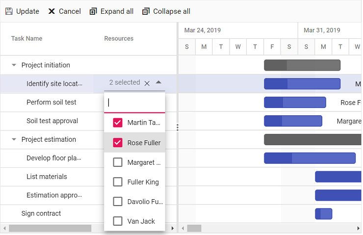
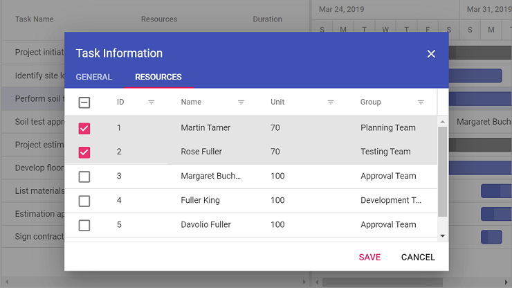

# Resources in Vue Gantt component

In Gantt, the resources are represented by staff, equipment and materials etc. In Gantt control you can show or allocate the resources (human resources) for each task.

## Resource collection

The resource collection contains details about resources that are used in the project. Resources are JSON object that contains id, name, unit and group of the resources and this collection is mapped to the Gantt control using the [`resources`](https://ej2.syncfusion.com/vue/documentation/api/gantt/#resources) property. These resource fields are mapped to the Gantt control using the [`resourceFields`](https://ej2.syncfusion.com/vue/documentation/api/gantt/#resourceFields) property.

Resource fields | Description
-----|-----
[`id`](https://ej2.syncfusion.com/vue/documentation/api/gantt/resourceFields/#id) | This field is used to assign resources to the tasks.
[`name`](https://ej2.syncfusion.com/vue/documentation/api/gantt/resourceFields/#name) | This field is used to map the resource names. These names are displayed as one of Gantt columns and also can display as labels using the [`labelSettings`](https://ej2.syncfusion.com/vue/documentation/api/gantt/labelSettings) property.
[`unit`](https://ej2.syncfusion.com/vue/documentation/api/gantt/resourceFields/#unit) | It indicates the amount of work that can be done by a resource for the task in a day.
[`group`](https://ej2.syncfusion.com/vue/documentation/api/gantt/resourceFields/#group) | This field is used to group the resources and the tasks assigned to that particular resource into category.

The following code snippets shows resource collection and how it assigned to Gantt control.

```ts

var projectResources: object[] =  resources: [
    { resourceId: 1, resourceName: 'Martin Tamer', resourceGroup: 'Planning Team', resourceUnit: 50},
    { resourceId: 2, resourceName: 'Rose Fuller', resourceGroup: 'Testing Team', resourceUnit: 70 },
    { resourceId: 3, resourceName: 'Margaret Buchanan', resourceGroup: 'Approval Team' },
    { resourceId: 4, resourceName: 'Fuller King', resourceGroup: 'Development Team' },
    { resourceId: 5, resourceName: 'Davolio Fuller', resourceGroup: 'Approval Team' },
    { resourceId: 6, resourceName: 'Van Jack', resourceGroup: 'Development Team', resourceUnit: 40 },
];

export default {
  data: function() {
      return{
            resourceFields: {
                id: 'resourceId', //resource Id Mapping
                name: 'resourceName', //resource Name mapping
                unit: 'resourceUnit', //resource Unit mapping
                group: 'resourceGroup' //resource Group mapping
            },
             resources: projectResources //resource collection dataSource
        };
    },
};  

```

## Assign resource

We can assign resources for a task at initial load, using the resource id value of the resources as a collection. This collection is mapped from the dataSource to the Gantt control using the [`resourceInfo`](https://ej2.syncfusion.com/vue/documentation/api/gantt/taskFields/#resourceinfo) property.

Resources are assigned to tasks in following ways.

### Assign resource alone

If the unit is not specified for specific resource, the amount of work done will be consider as 100% by default. In such cases, the resource unit will not be displayed in Gantt UI.

```

  { TaskID: 2, TaskName: 'Identify site location', StartDate: new Date('04/02/2019'), Duration: 0, Progress: 50, resources: [1] }

```


### Assign resources with unit

We can assign the quantity of work done by the resources for the specific task as like below code snippet.

```

{ TaskID: 3, TaskName: 'Perform soil test', StartDate: new Date('03/29/2019'), Duration: 4,
    resources: [{resourceId: 2, eUnit: 70}, {resourceId: 1, Unit: 70}] }

```

When resource unit is defined in resource collection, the amount of work done by that particular resource will be same for all the tasks.

The following code snippet shows how to assign the resource for each task and map to Gantt control.









        


## Add/Edit resource collection

By using cell/ dialog edit option, we can add/remove the multiple resources for a particular task. Resource Unit can be change for a each task on resource tab in edit dialog by double click on the unit cell.





## Custom background colors for resource column and taskbar

In the Gantt Component, you can customize the background colors of the resource column and taskbars based on the resources assigned to each task. This customization enhances the readability and usability of the Gantt chart.

To achieve this, utilize the [template](https://ej2.syncfusion.com/vue/documentation/api/gantt/column/#template) property for the resource column and the [queryTaskbarInfo](https://ej2.syncfusion.com/vue/documentation/api/gantt#querytaskbarinfo) event. The `template` property allows you to define a custom template for the resource column, while the `queryTaskbarInfo` event to modify the taskbar properties, including background colors.

The following code snippet demonstrates how to customize the background colors of the taskbar and resource column according to the assigned resources:









        
