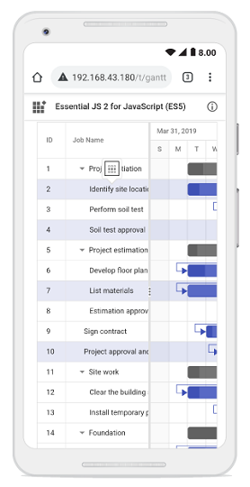

# Selection in Vue Gantt component

Selection provides an option to highlight a row or a cell. It can be done using arrow keys or by scrolling down the mouse. To disable selection in the Gantt component, set the [`allowSelection`](https://ej2.syncfusion.com/vue/documentation/api/gantt/#allowselection) to `false`.

To select data, inject the [`Selection`](https://ej2.syncfusion.com/vue/documentation/api/gantt/#selectionmodule) module in the `provide` section.

The Gantt component supports two types of selection that can be set by using the [`selectionSettings.type`](https://ej2.syncfusion.com/vue/documentation/api/gantt/selectionSettings/#type) property. They are:

* `Single`: Sets a single value by default and allows only selection of a single row or a cell.
* `Multiple`: Allows you to select multiple rows or cells. To perform the multi-selection, press and hold the CTRL key and click the desired rows or cells.

To learn about Gantt Chart Selection, you can check on this video:


## Selection mode

The Gantt component supports three types of selection modes that can be set by using the [`selectionSettings.mode`](https://ej2.syncfusion.com/vue/documentation/api/gantt/selectionSettings/#mode). They are:

* `Row`: Allows you to select only rows, and the row value is set by default.
* `Cell`: Allows you to select only cells.
* `Both`: Allows you to select rows and cells at the same time.









        


## Toggle selection

The toggle selection allows you to select and deselect a specific row or cell. To enable toggle selection, set the `enableToggle` property of the selectionSettings to `true`. If you click the selected row or cell, then it will be deselected and vice versa. By default, the `enableToggle` property is set to `false`.









        


## Clear selection

You can clear the selected cells and selected rows by using a method called [`clearSelection`](https://ej2.syncfusion.com/vue/documentation/api/gantt/#clearselection). The following code example demonstrates how to clear the selected rows in Gantt Chart.









        


## Get selected row indexes and records

You can get the selected row indexes by using the [`getSelectedRowIndexes`](https://ej2.syncfusion.com/vue/documentation/api/gantt/#getselectedrowindexes) method. And by using [`getSelectedRecords`](https://ej2.syncfusion.com/vue/documentation/api/gantt/#getSelectedRecords) method, you can get the selected record details.









        


## Multiple Selection based on condition

You can select multiple rows based on condition by using the [`selectRows`](https://ej2.syncfusion.com/vue/documentation/api/grid/#selectrows) method.

In the following code, the rows which contains `TaskId` value as 3 and 4 are selected at initial rendering.









        


## Touch interaction

The touch interaction feature in the Gantt component allows you to easily interact with the Gantt chart on touch screen devices. This feature is particularly useful for enhancing usability on mobile devices and tablets, making it easier to navigate and interact with the Gantt chart's content using touch gestures.

[`Single Row Selection`](selection/#selection-mode) :  When you tap on a row using a touch screen, the tapped row is automatically selected. This offers a straightforward way to select single rows with a touch interface.

[`Multiple Row Selection`](selection/#multiple-row-selection) : To select multiple rows, you can utilize the multi-row selection feature. When you tap on a row, a popup is displayed, indicating the option for multi-row selection. Tap on the popup, and then proceed to tap on the desired rows you want to select. This allows you to select and interact with multiple rows simultaneously, as shown in the following image:

