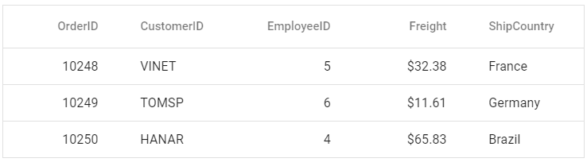

# Getting Started with Vue UI Components with the Nuxt Framework

This article provides a step-by-step guide for setting up a [Nuxt](https://nuxt.com/) project and integrating the Syncfusion<sup style="font-size:70%">&reg;</sup> Vue components using the [Composition API](https://vuejs.org/guide/introduction.html#composition-api).

`Nuxt.js` is a powerful framework for building universal Vue.js applications. It is built on top of `Vue.js` and provides a higher-level structure and conventions to simplify the development of Vue applications.

## Prerequisites

[System requirements for Syncfusion<sup style="font-size:70%">&reg;</sup> Vue UI components](../system-requirements)

## Set up the Nuxt project

To initiate the creation of a new [Nuxt](https://nuxt.com/) project, use the following commands:

```bash
npx nuxi@latest init my-project

cd my-project

npm install
```

Now that `my-project` is ready to run with default settings, let's add Syncfusion<sup style="font-size:70%">&reg;</sup> components to the project.

## Add Syncfusion<sup style="font-size:70%">&reg;</sup> Vue packages

Syncfusion<sup style="font-size:70%">&reg;</sup> Vue component packages are available at [npmjs.com](https://www.npmjs.com/search?q=ej2-vue). To use Syncfusion<sup style="font-size:70%">&reg;</sup> Vue components in the project, install the corresponding npm package.

This article uses the [Vue Grid component](https://www.syncfusion.com/vue-components/vue-grid) as an example. To use the Vue Grid component in the project, the `@syncfusion/ej2-vue-grids` package needs to be installed using the following command:

```bash
npm install @syncfusion/ej2-vue-grids --save
```

## Configure transpilation for Syncfusion<sup style="font-size:70%">&reg;</sup> packages

Syncfusion<sup style="font-size:70%">&reg;</sup> packages utilize the ESM syntax, while Nuxt apps operate with the common JS syntax. To enable transpilation of Syncfusion<sup style="font-size:70%">&reg;</sup> packages, include the following configuration in the **nuxt.config.ts** file:




``` ts
export default defineNuxtConfig({
  build: {
    transpile: [/@syncfusion/]
  }
})
```




## Import Syncfusion<sup style="font-size:70%">&reg;</sup> CSS styles

Syncfusion<sup style="font-size:70%">&reg;</sup> Vue component themes can be applied using CSS or SASS from the [npm theme packages](https://ej2.syncfusion.com/vue/documentation/appearance/theme#theme-packages). Additionally, CDN, CRG, or [Theme Studio](https://ej2.syncfusion.com/vue/documentation/appearance/theme-studio). Refer to the [themes topic](https://ej2.syncfusion.com/vue/documentation/appearance/theme) to learn more about built-in themes and different ways to refer to themes in a Vue project.

This example uses the `Material 3` theme for the Grid component from the theme package. To install the [Material 3](https://www.npmjs.com/package/@syncfusion/ej2-material3-theme) theme package, use the following command:




npm install @syncfusion/ej2-material3-theme --save




The necessary `Material3` CSS styles for the Grid component have been imported into the `<style>` section of the **App.vue** file.




<style>
  @import "../node_modules/@syncfusion/ej2-material3-theme/styles/grid/index.css";
</style>




## Add the Syncfusion<sup style="font-size:70%">&reg;</sup> Vue component

Add the Vue Grid component to the **App.vue** file using the `Composition API` with the following steps:

1\. Add the `setup` attribute to the `script` tag to indicate that Vue will be using the `Composition API`, import the Grid component, and declare the data values in the `script` section of the **App.vue** file.




<script setup>
import { GridComponent as EjsGrid, ColumnsDirective as EColumns, ColumnDirective as EColumn } from '@syncfusion/ej2-vue-grids';

const data = [
  {
    OrderID: 10248, CustomerID: 'VINET', EmployeeID: 5, ShipCountry: 'France', Freight: 32.38 
  },
  {
    OrderID: 10249, CustomerID: 'TOMSP', EmployeeID: 6, ShipCountry: 'Germany', Freight: 11.61 
  },
  {
    OrderID: 10250, CustomerID: 'HANAR', EmployeeID: 4, ShipCountry: 'Brazil', Freight: 65.83 
  }
];
</script>




2\. In the `template` section, define the Grid component with the [dataSource](https://ej2.syncfusion.com/vue/documentation/api/grid/index-default#datasource) property and column definitions.




<template>
  <ejs-grid :dataSource='data'>
    <e-columns>
      <e-column field='OrderID' width='100' textAlign="Right"></e-column>
      <e-column field='CustomerID' width='100'></e-column>
      <e-column field='EmployeeID' width='100' textAlign="Right"></e-column>
      <e-column field='Freight' width='100' format="C2" textAlign="Right"></e-column>
      <e-column field='ShipCountry' width='100'></e-column>
    </e-columns>
  </ejs-grid>
</template>




## Run the project

To run the project, use the following command:

```bash
npm run dev
```

The output will appear as follows:

