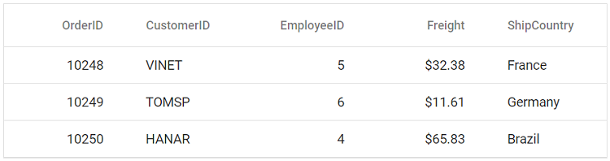

# Getting Started with Vue UI Components with Vite and PNPM

This article provides a step-by-step guide for setting up a [Vite](https://vitejs.dev/) project with a JavaScript environment and integrating the Syncfusion<sup style="font-size:70%">&reg;</sup> Vue components using [PNPM](https://pnpm.io/)

`PNPM` is an alternative package manager for Node. js that shares dependencies between packages and provides hard links to save disc space usage and installation times.

## Prerequisites

[System requirements for Syncfusion<sup style="font-size:70%">&reg;</sup> Vue UI components](../system-requirements)

## Set up the Vite project using PNPM

To initiate the creation of a new [Vite](https://vitejs.dev/) project with [PNPM](https://pnpm.io/), use the below commands:

```bash
npm install -g pnpm

pnpm create vite@latest
```

Using the above command will lead you to set up additional configurations for the project as below:

1\. Define the project name: We can specify the name of the project directly. Let's specify the name of the project as `my-project` for this article.

```bash
? Project name: » my-project
```

2\. Select `Vue` as the framework. It will create a Vue 3 project.

```bash
? Select a framework: » - Use arrow-keys. Return to submit.
  Vanilla
> Vue
  React
  Preact
  Lit
  Svelte
  Others
```

3\. Choose `JavaScript` as framework variant to build this Vite project using JavaScript and Vue.

```bash
? Select a variant: » - Use arrow-keys. Return to submit.
> JavaScript
  TypeScript
  Customize with create-vue ↗
  Nuxt ↗
```

4\. Upon completing the aforementioned steps to create `my-project`, run the following command to install its dependencies:

```bash
cd my-project

pnpm install
```

Now that `my-project` is ready to run with default settings, let's add Syncfusion<sup style="font-size:70%">&reg;</sup> components to the project.

## Add Syncfusion<sup style="font-size:70%">&reg;</sup> Vue packages

Syncfusion<sup style="font-size:70%">&reg;</sup> Vue component packages are available at [npmjs.com](https://www.npmjs.com/search?q=ej2-vue). To use Syncfusion<sup style="font-size:70%">&reg;</sup> Vue components in the project, install the corresponding npm package.

This article uses the [Vue Grid component](https://www.syncfusion.com/vue-components/vue-grid) as an example. To use the Vue Grid component in the project, the `@syncfusion/ej2-vue-grids` package needs to be installed using the following command:

```bash
pnpm install @syncfusion/ej2-vue-grids --save
```

## Import Syncfusion<sup style="font-size:70%">&reg;</sup> CSS styles

You can import themes for the Syncfusion<sup style="font-size:70%">&reg;</sup> Vue component in various ways, such as using CSS or SASS styles from npm packages, CDN, CRG and [Theme Studio](https://ej2.syncfusion.com/vue/documentation/appearance/theme-studio/). Refer to [themes topic](https://ej2.syncfusion.com/vue/documentation/appearance/theme/) to learn more about built-in themes and different ways to refer to themes in a Vue project.

In this article, the `Material` theme is applied using CSS styles, which are available in installed packages. The necessary `Material` CSS styles for the Grid component and its dependents were imported into the `<style>` section of the **src/App.vue** file.


The dependency packages for Syncfusion<sup style="font-size:70%">&reg;</sup> in a PNPM vite project are situated within the `.pnpm/node_modules` directory.




<style>
  @import "../node_modules/.pnpm/node_modules/@syncfusion/ej2-base/styles/material.css";
  @import "../node_modules/.pnpm/node_modules/@syncfusion/ej2-buttons/styles/material.css";
  @import "../node_modules/.pnpm/node_modules/@syncfusion/ej2-calendars/styles/material.css";
  @import "../node_modules/.pnpm/node_modules/@syncfusion/ej2-dropdowns/styles/material.css";
  @import "../node_modules/.pnpm/node_modules/@syncfusion/ej2-inputs/styles/material.css";
  @import "../node_modules/.pnpm/node_modules/@syncfusion/ej2-navigations/styles/material.css";
  @import "../node_modules/.pnpm/node_modules/@syncfusion/ej2-popups/styles/material.css";
  @import "../node_modules/.pnpm/node_modules/@syncfusion/ej2-splitbuttons/styles/material.css";
  @import "../node_modules/.pnpm/node_modules/@syncfusion/ej2-grids/styles/material.css";
</style>




> The order of importing CSS styles should be in line with its dependency graph.

## Add Syncfusion<sup style="font-size:70%">&reg;</sup> Vue component

Follow the below steps to add the Vue Grid component using the [Composition API](https://vuejs.org/guide/introduction.html#composition-api):

1\. First, add the `setup` attribute to the `script` tag to indicate that Vue will be using the `Composition API`. And import the Grid component in the `script` section of the **src/App.vue** file.




<script setup>
  import { GridComponent as EjsGrid, ColumnsDirective as EColumns, ColumnDirective as EColumn } from '@syncfusion/ej2-vue-grids';
</script>



   
2\. In the `template` section, define the Grid component with the [dataSource](https://ej2.syncfusion.com/vue/documentation/api/grid#datasource) property and column definitions.




<template>
  <ejs-grid :dataSource='data'>
    <e-columns>
      <e-column field='OrderID' width='100' textAlign="Right"></e-column>
      <e-column field='CustomerID' width='100'></e-column>
      <e-column field='EmployeeID' width='100' textAlign="Right"></e-column>
      <e-column field='Freight' width='100' format="C2" textAlign="Right"></e-column>
      <e-column field='ShipCountry' width='100'></e-column>
    </e-columns>
  </ejs-grid>
</template>




3\. Declare the values for the `dataSource` property in the `script` section.




<script setup>
  const data = [
    { OrderID: 10248, CustomerID: 'VINET', EmployeeID: 5, ShipCountry: 'France', Freight: 32.38 },
    { OrderID: 10249, CustomerID: 'TOMSP', EmployeeID: 6, ShipCountry: 'Germany', Freight: 11.61 },
    { OrderID: 10250, CustomerID: 'HANAR', EmployeeID: 4, ShipCountry: 'Brazil', Freight: 65.83 }
  ];
</script>




Here is the summarized code for the above steps in the **src/App.vue** file:




<template>
  <ejs-grid :dataSource='data'>
    <e-columns>
      <e-column field='OrderID' width='100' textAlign="Right"></e-column>
      <e-column field='CustomerID' width='100'></e-column>
      <e-column field='EmployeeID' width='100' textAlign="Right"></e-column>
      <e-column field='Freight' width='100' format="C2" textAlign="Right"></e-column>
      <e-column field='ShipCountry' width='100'></e-column>
    </e-columns>
  </ejs-grid>
</template>

<script setup>
  // Import component and its directives
  import { GridComponent as EjsGrid, ColumnsDirective as EColumns, ColumnDirective as EColumn } from '@syncfusion/ej2-vue-grids';
  const data = [
    { OrderID: 10248, CustomerID: 'VINET', EmployeeID: 5, ShipCountry: 'France', Freight: 32.38 },
    { OrderID: 10249, CustomerID: 'TOMSP', EmployeeID: 6, ShipCountry: 'Germany', Freight: 11.61 },
    { OrderID: 10250, CustomerID: 'HANAR', EmployeeID: 4, ShipCountry: 'Brazil', Freight: 65.83 }
  ];
</script>

<style>
  @import "../node_modules/.pnpm/node_modules/@syncfusion/ej2-base/styles/material.css";
  @import "../node_modules/.pnpm/node_modules/@syncfusion/ej2-buttons/styles/material.css";
  @import "../node_modules/.pnpm/node_modules/@syncfusion/ej2-calendars/styles/material.css";
  @import "../node_modules/.pnpm/node_modules/@syncfusion/ej2-dropdowns/styles/material.css";
  @import "../node_modules/.pnpm/node_modules/@syncfusion/ej2-inputs/styles/material.css";
  @import "../node_modules/.pnpm/node_modules/@syncfusion/ej2-navigations/styles/material.css";
  @import "../node_modules/.pnpm/node_modules/@syncfusion/ej2-popups/styles/material.css";
  @import "../node_modules/.pnpm/node_modules/@syncfusion/ej2-splitbuttons/styles/material.css";
  @import "../node_modules/.pnpm/node_modules/@syncfusion/ej2-grids/styles/material.css";
</style>




## Run the project

To run the project, use the following command:

```bash
pnpm dev
```

The output will appear as follows:



## See also

* [Getting Started with Vue UI Components using Composition API and JavaScript](./vue-3-js-composition)
* [Getting Started with Vue UI Components using Composition API and TypeScript](./vue-3-ts-composition)
* [Getting Started with Vue UI Components using Options API and JavaScript](./vue-3-js-options)
* [Getting Started with Vue UI Components using Options API and TypeScript](./vue-3-ts-options)