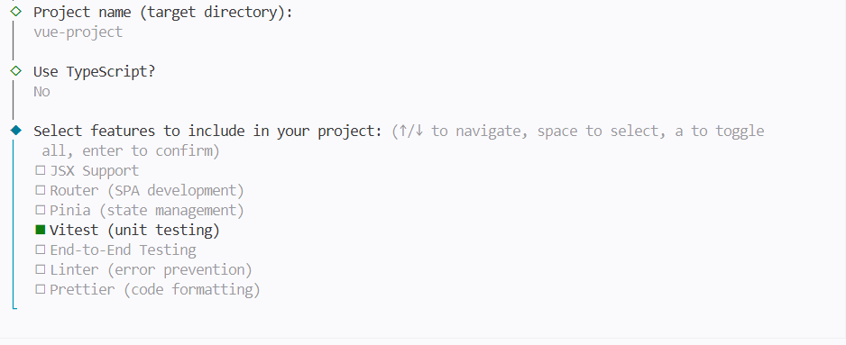
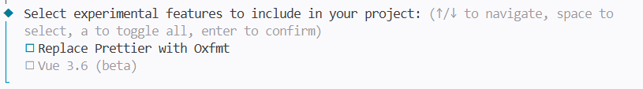
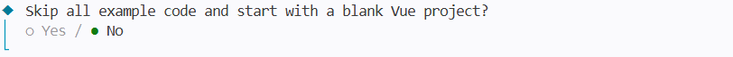

# Getting started with testing Vue UI components in the Vitest project

This article provides a step-by-step guide for setting up a [Vitest](https://vitest.dev) project, integrating Syncfusion<sup style="font-size:70%">&reg;</sup> Vue components, and perform comprehensive testing of the components.

`Vitest` is a blazing fast unit test framework powered by [Vite](https://vite.dev) that makes it easy to write and run tests for your Vue.js components. It is designed to be fast, easy to use, and compatible with Jest.

## Prerequisites

[System requirements for Syncfusion<sup style="font-size:70%">&reg;</sup> Vue UI components](../system-requirements)

## Set up the Vitest project

To initiate the creation of a new `Vitest` project, use the following [create vue](https://vuejs.org/guide/quick-start.html#creating-a-vue-application) command.

```bash
npm create vue@latest
```

Using the above commands will lead you to set up additional configurations for the project:

1\. Define the project name (you can choose any name, for example my-project) and enable unit testing by selecting Yes for Vitest to automatically configure the project.



These are the additional options while creating a vue application 





If you want to skip the example code, select 'yes' if don't want to skip the code select 'no'.

3\. Upon completing the aforementioned steps to create  `my-project`, run the following command to install its dependencies:

```bash
cd my-project
npm install
```

4\. The default setup of `Vitest` utilizes `JSDOM`, which may not fully support all the APIs available in the `window` object. However, Syncfusion<sup style="font-size:70%">&reg;</sup> Vue components rely on certain APIs of the `window` object internally. Therefore, in order to ensure compatibility, it is necessary to configure `Vitest` with `happy-dom`. To install it, execute the following command:

```bash
npm i happy-dom --save-dev
```

5\. To add the `happy-dom` environment in the **vitest.config.js** file, replace the existing `JSDOM` value in the environment option with `happy-dom`. This will ensure that the `happy-dom` environment is used for your Vitest project.




test: {
  environment: 'happy-dom'
}




Now that `my-project` is ready to run with default settings, let's add Syncfusion<sup style="font-size:70%">&reg;</sup> components to the project.

## Add the Syncfusion<sup style="font-size:70%">&reg;</sup> packages

Syncfusion<sup style="font-size:70%">&reg;</sup> Vue component packages are available at [npmjs.com](https://www.npmjs.com/search?q=ej2-vue). To use Syncfusion<sup style="font-size:70%">&reg;</sup> Vue components in the project, install the corresponding npm package.

This article uses the [Vue Grid component](https://www.syncfusion.com/vue-components/vue-grid) as an example. To use the Vue Grid component in the project, the `@syncfusion/ej2-vue-grids` package needs to be installed using the following command:

```bash
npm install @syncfusion/ej2-vue-grids --save
```

## Add the Syncfusion<sup style="font-size:70%">&reg;</sup> Vue component

Follow the below steps to add the Vue Grid component:

1\. First, define the Grid component with the [dataSource](https://ej2.syncfusion.com/vue/documentation/api/grid/index-default#datasource) property and column definitions in the **src/components/HelloWorld.vue** file.




<template>
  <ejs-grid :dataSource="data">
    <e-columns>
      <e-column field='OrderID'></e-column>
      <e-column field='CustomerID'></e-column>
      <e-column field='EmployeeID'></e-column>
      <e-column field='ShipCountry'></e-column>
      <e-column field='Freight'></e-column>
    </e-columns>
  </ejs-grid>
</template>

<script>
import { GridComponent, ColumnsDirective, ColumnDirective } from '@syncfusion/ej2-vue-grids';

export default {
  components: {
    'ejs-grid': GridComponent,
    'e-columns': ColumnsDirective,
    'e-column': ColumnDirective
  },
  data() {
    return {
      data: [
        {
          OrderID: 10248, CustomerID: 'VINET', EmployeeID: 5, ShipCountry: 'France', Freight: 32.38
        },
        {
          OrderID: 10249, CustomerID: 'TOMSP', EmployeeID: 6, ShipCountry: 'Germany', Freight: 11.61
        },
        {
          OrderID: 10250, CustomerID: 'HANAR', EmployeeID: 4, ShipCountry: 'Brazil', Freight: 65.83
        }
      ]
    }
  }
};
</script>




2\. Next, add the unit testing cases for the component using the `Vitest` framework in the **src/components/tests/HelloWorld.spec.js** file.




import { describe, it, expect, vi, beforeEach } from 'vitest'
import { mount } from '@vue/test-utils'
import HelloWorld from '../HelloWorld.vue'

describe('EJSGrid', () => {

  beforeEach(() => {
    Object.defineProperty(window, 'crypto', {
      value: {
        getRandomValues: vi.fn((arr) => arr),
      },
      configurable: true,
    });
  });

  it('Rows render correctly', async () => {
    const wrapper = mount(HelloWorld);

    // Wait untill the component mount completely
    await new Promise((res) => setTimeout(res, 50));
    const rows = wrapper.findAll('.e-row');
    expect(rows.length).toBe(wrapper.vm.data.length);
    wrapper.unmount();
  });

  it('Columns render correctly', async () => {
    const wrapper = mount(HelloWorld);

    // Wait untill the component mount completely
    await new Promise((res) => setTimeout(res, 50));
    const colHeader = wrapper.findAll('.e-headertext');

    for (let i = 0; i < Object.keys(wrapper.vm.data[0]).length; i++) {
      expect(colHeader[i].element.innerText).toBe(Object.keys(wrapper.vm.data[0])[i]);
    }

    wrapper.unmount();
  });
});




## Run the project

To run the project, use the following command:

```bash
npm run test:unit
```

The output will appear as follows:

```bash
 DEV  v4.1.6 D:/Testing/vitest

 ✓ src/components/__tests__/HelloWorld.spec.js (2 tests) 231ms
   ✓ EJSGrid (2)
     ✓ Rows render correctly 141ms
     ✓ Columns render correctly 88ms

 Test Files  1 passed (1)
      Tests  2 passed (2)
   Start at  12:00:34
   Duration  1.80s (transform 133ms, setup 0ms, import 598ms, tests 231ms, environment 489ms)

 PASS  Waiting for file changes...
 press h to show help, press q to quit
```