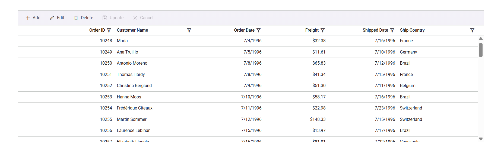
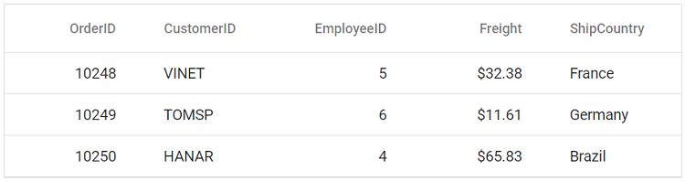

# Getting Started with Vue using JavaScript and Composition API

This article provides a step-by-step guide for setting up a [Vite](https://vite.dev/) project with a JavaScript environment and integrating the Syncfusion&reg; Vue components using the [Composition API](https://vuejs.org/guide/introduction.html#composition-api).

The `Composition API` is a new feature introduced in Vue.js 3 that provides an alternative way to organize and reuse component logic. It allows developers to write components as functions that use smaller, reusable functions called composition functions to manage their properties and behavior.





## Prerequisites

- [Node.js 24+](https://nodejs.org/en) (LTS recommended).
- Syncfusion CLI.

## Install the Syncfusion CLI 

Install the Syncfusion CLI globally using the following command:



npm install -g @syncfusion/cli



## Set up the Vite project using Syncfusion CLI

You can create a Vue application with [Vite](https://vite.dev/) using the Syncfusion CLI. The CLI provides two ways to create a project:

### Non-interactive mode

Non-interactive mode allows you to create a project directly using a single command with the required command-line arguments.



sf new my-project --framework vue --template grid



In this mode, the project configuration is passed directly in the command. The above command creates a Vue application with Vite and configured it with the Syncfusion&reg; Grid component. The generated project uses the JavaScript and the Composition API.

### Interactive mode

Interactive mode guides you through the project creation process with step-by-step prompts.



sf



When you run the `sf` command, the CLI prompts you to select the required project configuration options. To create a Vue application with Vite and the Syncfusion&reg; Grid component, select the following options:




√ Project name? ... my-project
√ Choose Framework: » Vue
√ Choose Language: » JavaScript
√ Choose Template: » Grid
√ Choose Theme: » Material3
√ Choose Style Format: » CSS
√ Would you like to integrate the Syncfusion MCP Server (AI Assistant) into this project? ... no
√ Would you like to install Syncfusion Component Skills for AI-powered development? ... no
√ Install dependencies and start app now? ... no




The above selections generate a Vue application with Vite and configure it with the Syncfusion&reg; Grid component. You can choose different values for language, theme, style format, MCP setup, and skills installation based on your project requirements.

The Syncfusion&reg; CLI creates the project with a predefined template. After the project is generated, you can customize or replace the component code based on your application requirements.

## Run the project

Once the project is created, navigate to the project directory and run the following commands in your terminal.



cd my-project
npm install
npm run dev



The output will appear as follows:





## Prerequisites

[System requirements for Syncfusion&reg; Vue UI components](../system-requirements)

## Set up the Vite project

A recommended approach for beginning with Vue is to scaffold a project using [Vite](https://vite.dev/). To create a new Vite project, use one of the commands that are specific to either NPM or Yarn.




npm create vite@latest




yarn create vite




Using one of the above commands will lead you to set up additional configurations for the project as below:

1. **Project name** - Type: `my-project` (or any name you want)

2. **Select framework** - Choose: **Vue**

3. **Select variant** - Choose: **JavaScript**

4. **Install with npm and start now?** - Choose: No

5. **Go to your project and install packages:**




cd my-project
npm install




cd my-project
yarn install




Now that `my-project` is ready to run with default settings, let's add Syncfusion&reg; components to the project.

## Add Syncfusion&reg; Vue packages

Syncfusion&reg; Vue component packages are available at [npmjs.com](https://www.npmjs.com/search?q=ej2-vue). To use Syncfusion&reg; Vue components in the project, install the corresponding npm package.

This article uses the [Vue Grid component](https://www.syncfusion.com/vue-components/vue-grid) as an example. To use the Vue Grid component in the project, the `@syncfusion/ej2-vue-grids` package needs to be installed using the following command:




npm install @syncfusion/ej2-vue-grids --save




yarn add @syncfusion/ej2-vue-grids




## Import Syncfusion&reg; CSS styles

Syncfusion&reg; Vue component themes can be applied using CSS or SASS from the [npm theme packages](https://ej2.syncfusion.com/vue/documentation/appearance/theme#theme-packages). Additionally, CDN, CRG, or [Theme Studio](https://ej2.syncfusion.com/vue/documentation/appearance/theme-studio).

This example uses the `Material 3` theme for the Grid component from the theme package. To install the [Material 3](https://www.npmjs.com/package/@syncfusion/ej2-material3-theme) theme package, use the following command:




npm install @syncfusion/ej2-material3-theme --save




yarn add @syncfusion/@syncfusion/ej2-material3-theme




The necessary CSS styles for the Grid component were imported into the `




## Add Syncfusion&reg; Vue component

Follow the below steps to add the Vue Grid component using `Composition API`:

1.First, add the `setup` attribute to the `script` tag to indicate that Vue will be using the `Composition API`. And import the Grid component in the `script` section of the **src/App.vue** file.






   
2.Define the Grid component with the dataSource property and column definitions. Declare the values for the dataSource property.




<template>
  <ejs-grid :dataSource='data'>
    <e-columns>
      <e-column field='OrderID' width='100' textAlign="Right"></e-column>
      <e-column field='CustomerID' width='100'></e-column>
      <e-column field='EmployeeID' width='100' textAlign="Right"></e-column>
      <e-column field='Freight' width='100' format="C2" textAlign="Right"></e-column>
      <e-column field='ShipCountry' width='100'></e-column>
    </e-columns>
  </ejs-grid>
</template>




## Run the project

To run the project, use the following command:




npm run dev




yarn run dev




The output will appear as follows:





## See also

* [Getting Started with Vue UI Components using Composition API and TypeScript](./vue-3-ts-composition)
* [Getting Started with Vue UI Components using Options API and JavaScript](./vue-3-js-options)
* [Getting Started with Vue UI Components using Options API and TypeScript](./vue-3-ts-options)
