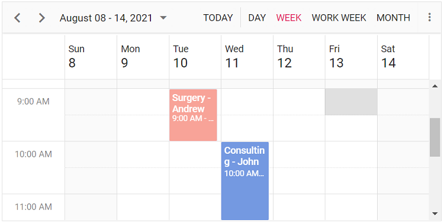

# Getting Started with Vue UI Components with TypeScript and Options API

This article provides a step-by-step guide for setting up a [Vite](https://vitejs.dev/) project with a TypeScript environment and integrating the Syncfusion Vue components using the [Options API](https://vuejs.org/guide/introduction.html#options-api).

The `Options API` is the traditional way of writing Vue.js components, where the component logic is organized into a series of options that define the component's properties and behavior. These options include data, methods, computed properties, watchers, lifecycle hooks, and more.

## Prerequisites

[System requirements for Syncfusion Vue UI components](../system-requirements)

## Set up the Vite project

A recommended approach for beginning with Vue is to scaffold a project using [Vite](https://vitejs.dev/). To create a new Vite project, use one of the commands that are specific to either NPM or Yarn.

```bash
npm create vite@latest
```

or

```bash
yarn create vite
```

Using one of the above commands will lead you to set up additional configurations for the project:

1.Define the project name: We can specify the name of the project directly. Let's specify the name of the project as `my-project` for this article.

```bash
? Project name: » my-project
```

2.Select `Vue` as the framework. It will creates a Vue 3 project.

```bash
? Select a framework: » - Use arrow-keys. Return to submit.
  Vanilla
> Vue
  React
  Preact
  Lit
  Svelte
  Others
```

3.Choose `TypeScript` as framework variant to build this Vite project using TypeScript and Vue.

```bash
? Select a variant: » - Use arrow-keys. Return to submit.
  JavaScript
> TypeScript
  Customize with create-vue ↗
  Nuxt ↗
```

4.Upon completing the aforementioned steps to create the `my-project`, run the following command to install its dependencies:

```bash
cd my-project
npm install
```

or

```bash
cd my-project
yarn install
```

Now that `my-project` is ready to run with default settings, let's add Syncfusion components to the project.

## Add Syncfusion Vue packages

Syncfusion Vue component packages are available at [npmjs.com](https://www.npmjs.com/search?q=ej2-vue). To use Syncfusion Vue components in the project, install the corresponding npm package.

This article uses the [Vue Schedule component](https://www.syncfusion.com/vue-components/vue-scheduler) as an example. To use the Vue Schedule component in the project, the `@syncfusion/ej2-vue-schedule` package needs to be installed using the following command:

```bash
npm install @syncfusion/ej2-vue-schedule --save
```

or

```bash
yarn add @syncfusion/ej2-vue-schedule
```

## Import Syncfusion CSS styles

You can import themes for the Syncfusion Vue component in various ways, such as using CSS or SASS styles from npm packages, CDN, [CRG](https://ej2.syncfusion.com/javascript/documentation/common/custom-resource-generator/) and [Theme Studio](https://ej2.syncfusion.com/vue/documentation/appearance/theme-studio/). Refer to [themes topic](https://ej2.syncfusion.com/vue/documentation/appearance/theme/) to know more about built-in themes and different ways to refer to themes in a Vue project.

In this article, `Material` theme is applied using CSS styles, which are available in installed packages. The necessary `Material` CSS styles for the Schedule component and its dependents were imported into the `<style>` section of **src/App.vue** file.

To import the necessary CSS styles for the Schedule component, as well as its dependent styles, into the `src/App.vue` file, you can use the provided code snippet within the `<style>` section. Let's import the `Material` theme for the Schedule component.




<style>
@import '../node_modules/@syncfusion/ej2-base/styles/material.css';
@import '../node_modules/@syncfusion/ej2-buttons/styles/material.css';
@import '../node_modules/@syncfusion/ej2-calendars/styles/material.css';
@import '../node_modules/@syncfusion/ej2-dropdowns/styles/material.css';
@import '../node_modules/@syncfusion/ej2-inputs/styles/material.css';
@import '../node_modules/@syncfusion/ej2-navigations/styles/material.css';
@import '../node_modules/@syncfusion/ej2-popups/styles/material.css';
@import '../node_modules/@syncfusion/ej2-vue-schedule/styles/material.css';
</style>




> The order of importing CSS styles should be in line with its dependency graph.

## Add Syncfusion Vue component

Follow the below steps to add the Vue Schedule component using `Options API`:

1.First, import the Schedule component in the `script` section of the **src/App.vue** file.




<script>
  import { ScheduleComponent as EjsSchedule, ViewsDirective as EViews, ViewDirective as EView, ResourcesDirective as EResources, ResourceDirective as EResource, EventSettingsModel, Day, Week, WorkWeek, Month, Agenda, DragAndDrop, Resize } from "@syncfusion/ej2-vue-schedule";
</script>




2.The next step is to register the Schedule component and its child directives in Vue.




import { ScheduleComponent, ViewsDirective, ViewDirective, ResourcesDirective, ResourceDirective, EventSettingsModel, Day, Week, WorkWeek, Month, Agenda, DragAndDrop, Resize } from "@syncfusion/ej2-vue-schedule";
//Component registration
export default {
  name: "App",
  // Declaring component and its directives
  components: {
    'ejs-schedule': ScheduleComponent,
    'e-views': ViewsDirective,
    'e-view': ViewDirective,
    'e-resources': ResourcesDirective,
    'e-resource': ResourceDirective
  }
}




3.In the `template` section, define the Schedule component with appointments. To populate the empty Scheduler with appointments, define either the local JSON data or remote data through the [dataSource](https://ej2.syncfusion.com/vue/documentation/api/schedule/eventSettingsModel/#datasource) property available within the [eventSettings](https://ej2.syncfusion.com/vue/documentation/api/schedule#eventsettings) option. Additionally, it is necessary to include the start and end time fields to define any appointments.




<template>
  <div id='app'>
    <ejs-schedule height='550px' width='100%' :selectedDate='selectedDate' :eventSettings='eventSettings'>
      <e-views>
        <e-view option='Day'></e-view>
        <e-view option='Week' startHour='07:00' endHour='15:00'></e-view>
        <e-view option='WorkWeek' startHour='10:00' endHour='18:00'></e-view>
        <e-view option='Month' showWeekend=false></e-view>
        <e-view option='Agenda'></e-view>
      </e-views>
      <e-resources>
        <e-resource field="OwnerId" title="Owner" name="Owners" :dataSource="ownerDataSource" textField="OwnerText"
          idField="Id" colorField="OwnerColor">
        </e-resource>
      </e-resources>
    </ejs-schedule>
  </div>
</template>




4.Declare the values for the `dataSource` property in the `script` section.




<script lang="ts">
export default {
  name: "App",
  ...
  data() {
    return {
      ...
      eventSettings: {
        dataSource: [
          {
            Id: 1,
            Subject: 'Surgery - Andrew',
            EventType: 'Confirmed',
            StartTime: new Date(2021, 7, 10, 9, 0),
            EndTime: new Date(2021, 7, 10, 10, 0),
            OwnerId: 2
          },
          {
            Id: 2,
            Subject: 'Consulting - John',
            EventType: 'Confirmed',
            StartTime: new Date(2021, 7, 11, 10, 0),
            EndTime: new Date(2021, 7, 11, 11, 30),
            OwnerId: 3
          },
          {
            Id: 3,
            Subject: 'Therapy - Robert',
            EventType: 'Requested',
            StartTime: new Date(2021, 7, 12, 11, 30),
            EndTime: new Date(2021, 7, 12, 12, 30),
            OwnerId: 1
          }
        ]
      } as EventSettingsModel,
    };
  }
  ...
};
</script>




5.To generate a Schedule with particular views, need to inject the relevant modules into the Schedule. This can be accomplished by utilizing the `provide` method within the `src/App.vue` file.




<script lang="ts">
  export default {
    name: "App",
    ...
    provide: {
      schedule: [Day, Week, WorkWeek, Month, Agenda, DragAndDrop, Resize]
    }
  };
</script>




Here is the summarized code for the above steps in the **src/App.vue** file:




<template>
  <div id='app'>
    <ejs-schedule height='550px' width='100%' :selectedDate='selectedDate' :eventSettings='eventSettings'>
      <e-views>
        <e-view option='Day'></e-view>
        <e-view option='Week' startHour='07:00' endHour='15:00'></e-view>
        <e-view option='WorkWeek' startHour='10:00' endHour='18:00'></e-view>
        <e-view option='Month' showWeekend=false></e-view>
        <e-view option='Agenda'></e-view>
      </e-views>
      <e-resources>
        <e-resource field="OwnerId" title="Owner" name="Owners" :dataSource="ownerDataSource" textField="OwnerText"
          idField="Id" colorField="OwnerColor">
        </e-resource>
      </e-resources>
    </ejs-schedule>
  </div>
</template>

<script lang="ts">
import { ScheduleComponent, ViewsDirective, ViewDirective, ResourcesDirective, ResourceDirective, Day, Week, WorkWeek, Month, Agenda, DragAndDrop, Resize, EventSettingsModel } from "@syncfusion/ej2-vue-schedule";

export default {
  name: "App",
  // Declaring component and its directives
  components: {
    'ejs-schedule': ScheduleComponent,
    'e-views': ViewsDirective,
    'e-view': ViewDirective,
    'e-resources': ResourcesDirective,
    'e-resource': ResourceDirective
  },
  // Bound properties declaration
  data() {
    return {
      selectedDate: new Date(2021, 7, 12) as Date,
      allowMultiple: true as Boolean,
      ownerDataSource: [
        { OwnerText: 'Nancy', Id: 1, OwnerColor: '#ffaa00' },
        { OwnerText: 'Steven', Id: 2, OwnerColor: '#f8a398' },
        { OwnerText: 'Michael', Id: 3, OwnerColor: '#7499e1' }] as Record<string, any>[],
      eventSettings: {
        dataSource: [
          {
            Id: 1,
            Subject: 'Surgery - Andrew',
            EventType: 'Confirmed',
            StartTime: new Date(2021, 7, 10, 9, 0),
            EndTime: new Date(2021, 7, 10, 10, 0),
            OwnerId: 2
          },
          {
            Id: 2,
            Subject: 'Consulting - John',
            EventType: 'Confirmed',
            StartTime: new Date(2021, 7, 11, 10, 0),
            EndTime: new Date(2021, 7, 11, 11, 30),
            OwnerId: 3
          },
          {
            Id: 3,
            Subject: 'Therapy - Robert',
            EventType: 'Requested',
            StartTime: new Date(2021, 7, 12, 11, 30),
            EndTime: new Date(2021, 7, 12, 12, 30),
            OwnerId: 1
          }
        ]
      } as EventSettingsModel,
    };
  },
  provide: {
    schedule: [Day, Week, WorkWeek, Month, Agenda, DragAndDrop, Resize]
  }
};
</script>

<style>
@import '../node_modules/@syncfusion/ej2-base/styles/material.css';
@import '../node_modules/@syncfusion/ej2-buttons/styles/material.css';
@import '../node_modules/@syncfusion/ej2-calendars/styles/material.css';
@import '../node_modules/@syncfusion/ej2-dropdowns/styles/material.css';
@import '../node_modules/@syncfusion/ej2-inputs/styles/material.css';
@import '../node_modules/@syncfusion/ej2-navigations/styles/material.css';
@import '../node_modules/@syncfusion/ej2-popups/styles/material.css';
@import '../node_modules/@syncfusion/ej2-vue-schedule/styles/material.css';
</style>




## Run the project

To run the project, use the following command:

```bash
npm run dev
```

or

```bash
yarn run dev
```

The output will appear as follows:



## See also

* [Getting Started with Vue UI Components using Composition API and JavaScript](./vue3-js-composition.md)
* [Getting Started with Vue UI Components using Composition API and TypeScript](./vue3-ts-composition.md)
* [Getting Started with Vue UI Components using Options API and JavaScript](./vite-vue.md)