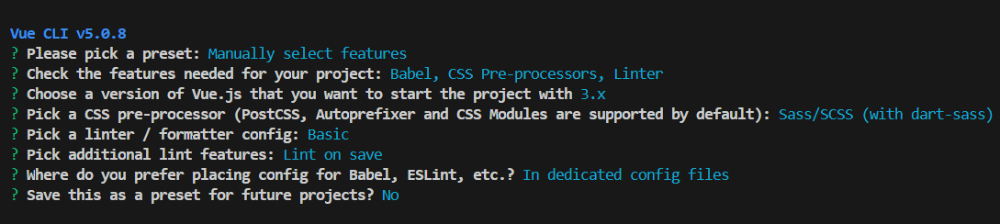

# Getting Started with Syncfusion<sup style="font-size:70%">&reg;</sup> Vue UI Components in Vue 3 with Vue CLI and SCSS

This section explains how to use Syncfusion<sup style="font-size:70%">&reg;</sup> Vue components in Vue 3 application with SCSS styling. To get started with Vue 3 using Composition API and Vite, refer to the [getting started with Vue 3 Composition API](./vue-3-js-composition) section.

> Note: Vue CLI is now in maintenance mode. For new projects, we recommend using [Vite](https://vite.dev/) with the official [create-vue](https://github.com/vuejs/create-vue) scaffolding tool.

## Prerequisites

[System requirements for Syncfusion<sup style="font-size:70%">&reg;</sup> Vue UI components](../system-requirements)

## Create the Vue 3 application

To create a Vue 3 application using Vue CLI with SCSS support, use the [vue create](https://cli.vuejs.org/#getting-started) command.

```bash
npm install -g @vue/cli
vue create quickstart
cd quickstart
npm run serve
```

Initiating a new project prompts us to choose the type of project to be used for the current application. Select the option `Manually select features` from the menu and then select the required features as shown in the following screenshot.



> **Recommended Alternative:** For new projects, consider using [Vite](https://vite.dev/) with `npm create vue@latest`, which provides faster development experience and modern tooling with built-in SCSS support.


## Add Syncfusion<sup style="font-size:70%">&reg;</sup> packages

Once the Vue 3 application is created, install the required Syncfusion<sup style="font-size:70%">&reg;</sup> Vue component package in the application. All the available Syncfusion<sup style="font-size:70%">&reg;</sup> Vue packages are published in the [npmjs.com](https://www.npmjs.com/search?q=ej2-vue) registry. Choose the component to be installed. In this article, the Grid component is used as an example.

Check out the [installation and upgrade](../installation-and-upgrade/installation) section to learn about the different ways of installing the packages. Here, the Grid component package is installed using the following `npm` command.

```bash
npm install @syncfusion/ej2-vue-grids --save
```

## Register the Syncfusion<sup style="font-size:70%">&reg;</sup> Vue component

Import the Grid component along with the required child directives from the installed packages into the `<script>` section of the `src/App.vue` file. Register the Grid component along with the required child directives using following code.




  import { GridComponent, ColumnsDirective, ColumnDirective } from '@syncfusion/ej2-vue-grids';
  // Component registration
  export default {
    name: "App",
    components: {
      'ejs-grid' : GridComponent,
      'e-columns' : ColumnsDirective,
      'e-column' : ColumnDirective
    }
  }




Now, the Grid and column directives are registered to use it in this application.

## Add Syncfusion<sup style="font-size:70%">&reg;</sup> Vue component to the application

Add the Vue Grid to the `<template>` section of the `App.vue` file in the `src` directory. To display the Grid with records, add the Grid component and bind the [dataSource](https://ej2.syncfusion.com/vue/documentation/api/grid/#datasource) to it. Here, the simple data is mapped to the `dataSource` property.




  <template>
    <ejs-grid :dataSource="data">
      <e-columns>
        <e-column field="OrderID" headerText="Order ID" textAlign="Right" :isPrimaryKey="true" width="100"></e-column>
        <e-column field="CustomerID" headerText="Customer ID"  width="80"></e-column>
        <e-column field="ShipCountry" headerText="Ship Country" width="90"></e-column>
      </e-columns>
    </ejs-grid>
  </template>
  <script>
    import { GridComponent, ColumnsDirective, ColumnDirective} from "@syncfusion/ej2-vue-grids";

    export default {
      name: "App",
      // Declaring component and its directives
      components: {
        "ejs-grid": GridComponent,
        "e-columns": ColumnsDirective,
        "e-column": ColumnDirective,
      },
      // Bound properties declarations
      data() {
        return {
          data: [
            {
              OrderID: 10248,
              CustomerID: "VINET",
              ShipCountry: "France",
            },
            {
              OrderID: 10249,
              CustomerID: "TOMSP",
              ShipCountry: "Germany",
            },
          ],
        };
      },
    };
  </script>




## Adding SCSS reference

Add the styles of Grid component to the `<style>` section of the `App.vue` file as follows.




<style lang="scss">
// syncfusion styles
@use "../node_modules/@syncfusion/ej2-base/styles/material3" as *;
@use "../node_modules/@syncfusion/ej2-vue-grids/styles/material3" as *;
</style>




## Adding includePaths option

While using scss files for style reference, you need to configure the `includePaths` in sass-loader options in the `vue.config.js` like below:




const path = require('path');
module.exports = defineConfig({
  .....
  .....
  css: {
    loaderOptions: {
      sass: {
        sassOptions: {
          includePaths: [path.resolve(__dirname, './node_modules/@syncfusion')]
        }
      }
    }
  },
  .....
  .....
});




## Run the application

Run the application using the following command.

```bash
npm run serve
```

Web server will be initiated. Open the quick start app in the browser at port `localhost:8080`.


Refer the following sample, [vue3-grid-getting-started](https://github.com/SyncfusionExamples/vue3-grid-getting-started).

## See also

* [Getting Started with Vue UI Components using Composition API and JavaScript](./vue-3-js-composition)
* [Getting Started with Vue UI Components using Options API and JavaScript](./vue-3-js-options)
* [Getting Started with Vue UI Components using Composition API and TypeScript](./vue-3-ts-composition)
