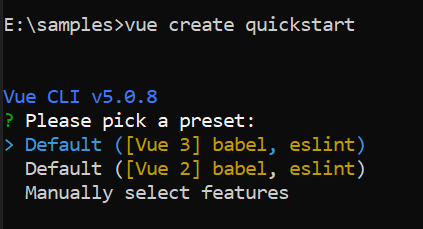
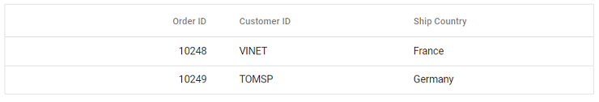

# Getting Started with Syncfusion<sup style="font-size:70%">&reg;</sup> Vue UI Components in Vue 3 with Vue CLI

This section explains how to use Syncfusion<sup style="font-size:70%">&reg;</sup> Vue components in Vue 3 application using Vue CLI. For modern setup with Vite and Composition API, refer to the [Getting Started with Composition API](./vue-3-js-composition) section.

> Note: Vue CLI is now in maintenance mode. For new projects, we recommend using [Vite](https://vite.dev/) with the official [create-vue](https://github.com/vuejs/create-vue) scaffolding tool.

## Prerequisites

[System requirements for Syncfusion<sup style="font-size:70%">&reg;</sup> Vue UI components](../system-requirements)

## Create the Vue 3 application

To create a Vue 3 application using Vue CLI, use the [vue create](https://cli.vuejs.org/#getting-started) command.

```bash
npm install -g @vue/cli
vue create quickstart
cd quickstart
npm run serve
```

Initiating a new project prompts us to choose the type of project to be used for the current application. Select the option `Default ([Vue 3] babel, eslint)` from the menu.



> **Recommended Alternative:** For new projects, consider using [Vite](https://vite.dev/) with `npm create vue@latest`, which provides faster development experience and modern tooling.

## Add Syncfusion<sup style="font-size:70%">&reg;</sup> packages

Once the Vue 3 application is created, install the required Syncfusion<sup style="font-size:70%">&reg;</sup> Vue component package in the application. All the available Syncfusion<sup style="font-size:70%">&reg;</sup> Vue packages are published in the [npmjs.com](https://www.npmjs.com/search?q=ej2-vue) registry. Choose the component to be installed. In this article, the Grid component is used as an example.

Check out the [installation and upgrade](../installation-and-upgrade/installation) section to learn about the different ways of installing the packages. Here, the Grid component package is installed using the following `npm` command.

```bash
npm install @syncfusion/ej2-vue-grids --save
```

## Import the Syncfusion<sup style="font-size:70%">&reg;</sup> CSS styles

After installing the Syncfusion<sup style="font-size:70%">&reg;</sup> component packages in the application, add the required theme based on the components used.

Check out the [themes](https://ej2.syncfusion.com/vue/documentation/appearance/theme) section to know more about built-in themes and different ways (npm packages, CDN and CRG) to refer the themes in the Vue application.

Here the themes are referred through the installed npm packages which contains the built-in themes of Syncfusion<sup style="font-size:70%">&reg;</sup> Vue component. Let's import the `Material3` theme for the Grid component and its dependencies to the `<style>` section of the `App.vue` file as follows.




<style>
  @import "../node_modules/@syncfusion/ej2-base/styles/material3.css";
  @import "../node_modules/@syncfusion/ej2-buttons/styles/material3.css";
  @import "../node_modules/@syncfusion/ej2-calendars/styles/material3.css";
  @import "../node_modules/@syncfusion/ej2-dropdowns/styles/material3.css";
  @import "../node_modules/@syncfusion/ej2-inputs/styles/material3.css";
  @import "../node_modules/@syncfusion/ej2-navigations/styles/material3.css";
  @import "../node_modules/@syncfusion/ej2-popups/styles/material3.css";
  @import "../node_modules/@syncfusion/ej2-splitbuttons/styles/material3.css";
  @import "../node_modules/@syncfusion/ej2-vue-grids/styles/material3.css";
</style>




> Grid components use other Syncfusion<sup style="font-size:70%">&reg;</sup> components as well, so CSS references for the dependent component must be added in order to use all grid functionalities. The order of importing CSS styles should be in line with its dependency graph.

## Register the Syncfusion<sup style="font-size:70%">&reg;</sup> Vue component

Import the Grid component along with the required child directives from the installed packages into the `<script>` section of the `src/App.vue` file. Register the Grid component along with the required child directives using the Options API as follows:




  import { GridComponent, ColumnsDirective, ColumnDirective } from '@syncfusion/ej2-vue-grids';
  // Component registration
  export default {
    name: "App",
    components: {
      'ejs-grid': GridComponent,
      'e-columns': ColumnsDirective,
      'e-column': ColumnDirective
    }
  }




Now, the Grid and column directives are registered to use it in this application.

> **Modern Alternative:** For improved development experience, consider using the [Composition API](./vue-3-js-composition) with direct component imports instead of global registration.

## Add Syncfusion<sup style="font-size:70%">&reg;</sup> Vue component to the application

Add the Vue Grid to the `<template>` section of the `App.vue` file in the `src` directory. To display the Grid with records, add the Grid component and bind the [dataSource](https://ej2.syncfusion.com/vue/documentation/api/grid/#datasource) to it. Here, the simple data is mapped to the `dataSource` property.




  <template>
    <ejs-grid :dataSource="data">
      <e-columns>
        <e-column field="OrderID" headerText="Order ID" textAlign="Right" :isPrimaryKey="true" width="100"></e-column>
        <e-column field="CustomerID" headerText="Customer ID"  width="80"></e-column>
        <e-column field="ShipCountry" headerText="Ship Country" width="90"></e-column>
      </e-columns>
    </ejs-grid>
  </template>
  <script>
    import { GridComponent, ColumnsDirective, ColumnDirective} from "@syncfusion/ej2-vue-grids";

    export default {
      name: "App",
      // Declaring component and its directives
      components: {
        "ejs-grid": GridComponent,
        "e-columns": ColumnsDirective,
        "e-column": ColumnDirective,
      },
      // Bound properties declarations
      data() {
        return {
          data: [
            {
              OrderID: 10248,
              CustomerID: "VINET",
              ShipCountry: "France",
            },
            {
              OrderID: 10249,
              CustomerID: "TOMSP",
              ShipCountry: "Germany",
            },
          ],
        };
      },
    };
  </script>
  <style>
    @import "../node_modules/@syncfusion/ej2-base/styles/material3.css";
    @import "../node_modules/@syncfusion/ej2-buttons/styles/material3.css";
    @import "../node_modules/@syncfusion/ej2-calendars/styles/material3.css";
    @import "../node_modules/@syncfusion/ej2-dropdowns/styles/material3.css";
    @import "../node_modules/@syncfusion/ej2-inputs/styles/material3.css";
    @import "../node_modules/@syncfusion/ej2-navigations/styles/material3.css";
    @import "../node_modules/@syncfusion/ej2-popups/styles/material3.css";
    @import "../node_modules/@syncfusion/ej2-splitbuttons/styles/material3.css";
    @import "../node_modules/@syncfusion/ej2-vue-grids/styles/material3.css";
  </style>




## Run the application

Run the application using the following command:

```bash
npm run serve
```

Web server will be initiated. Open the quick start app in the browser at port `localhost:8080`.



Refer the following sample, [vue3-grid-getting-started](https://github.com/SyncfusionExamples/vue3-grid-getting-started).

## Migration from Vue 2 to Vue 3

### Registering Vue component

It is required to register the component and any child directives used within the component separately in Vue 3. The difference in registering components in Vue 2 and Vue 3 can be found below.

* Component registration in Vue 2

 
 

  import * as Vue from 'vue';
  import { GridPlugin } from '@syncfusion/ej2-vue-grids';
  // Registering component and directives as a single plugin.
  Vue.use(ButtonPlugin);
  
  
  

* Component registration in Vue 3

  
  

    import { GridComponent, ColumnsDirective, ColumnDirective } from '@syncfusion/ej2-vue-grids';
      //Component registration
    export default {
      name: "App",
      components: {
        'ejs-grid' : GridComponent,
        'e-columns' : ColumnsDirective,
        'e-column' : ColumnDirective
      }
    }
  
  
    

In the above code, `ejs-grid` denotes the Grid component tag.`e-columns` and `e-column` denotes the child column directives tag which is used for Column definition declaration.

>Registering the child directives is not needed if they are not used.

### Template usage:

Before using the template in the Vue application, enable the [runtime compiler](https://vuejs.org/v2/guide/installation.html#Runtime-Compiler-vs-Runtime-only). Create the `Vue.config.js` file in the root folder if it does  not exist and add the following code

```js
module.exports = {
    runtimeCompiler: true
  }
```

Due to changes in the [Vue 3 API](https://vuejs.org/api/application.html#createapp), the registration of templates in Vue 3 is different from Vue 2.

|    Vue 2                                             |    Vue 3      |
|:--------------------------------------------------------:|:-------------------:|
|    declare templates using `Vue.component` module. |    Use the `createApp` method from Vue to declare templates.|


In template declaration, the component name must match the property binding name. In the following example, the Grid column `template` property is assigned with the name `colTemplate`.

  
  
    <template>
      <ejs-grid ref='grid' :dataSource="data" height=310 >
        <e-columns>
          <e-column headerText='Employee Name' width='150' textAlign='Center' :template='colTemplate'></e-column>
          <e-column field='EmployeeID' width='125' textAlign='Right'></e-column>
        </e-columns>
      </ejs-grid>
    <template>

    <script>
    import { GridComponent, ColumnsDirective, ColumnDirective} from "@syncfusion/ej2-vue-grids";
    import { createApp } from "vue";

    const app = createApp();

    // Template declaration
    var colVue = app.component('colTemplate', {
      data: () => ({}),
      template:`<b>Name:{{data.EmployeeID}}</b>`});

    export default {
      data() {
        return {
          data:  [
            {
              EmployeeID: 10248,
              EmployeeName: "VINET"
            },
            {
              EmployeeID: 10249,
              EmployeeName: "TOMSP"
            },
          ],
          colTemplate: function() {
            return { template: colVue };
          }
        };
      }
    };
    </script>
    <style>
      @import "../node_modules/@syncfusion/ej2-base/styles/material3.css";
      @import "../node_modules/@syncfusion/ej2-buttons/styles/material3.css";
      @import "../node_modules/@syncfusion/ej2-calendars/styles/material3.css";
      @import "../node_modules/@syncfusion/ej2-dropdowns/styles/material3.css";
      @import "../node_modules/@syncfusion/ej2-inputs/styles/material3.css";
      @import "../node_modules/@syncfusion/ej2-navigations/styles/material3.css";
      @import "../node_modules/@syncfusion/ej2-popups/styles/material3.css";
      @import "../node_modules/@syncfusion/ej2-splitbuttons/styles/material3.css";
      @import "../node_modules/@syncfusion/ej2-vue-grids/styles/material3.css";
    </style>
  
  
  

### Using Syncfusion<sup style="font-size:70%">&reg;</sup> Vue components inside template properties

To use other Syncfusion<sup style="font-size:70%">&reg;</sup> Vue components inside the templates, register the components in the template declaration also.

The following sample uses the Button component within the grid's template property. To use the Button component within the template, register the Button component in the template declaration.

  
  

      <template>
        <ejs-grid ref='grid' :dataSource="data">
          <e-columns>
            <e-column headerText='EmployeeName' width='150' textAlign='Center' :template='colTemplate'></e-column>
            <e-column field='EmployeeID' width='125' textAlign='Right'></e-column>
          </e-columns>
        </ejs-grid>
      </template>

      <script>
      import { ButtonComponent } from "@syncfusion/ej2-vue-buttons";
      import {GridComponent, ColumnsDirective,ColumnDirective } from "@syncfusion/ej2-vue-grids";
      import { createApp } from "vue";

      const app = createApp();

      // Template declaration
      var colVue = app.component('colTemplate', {
        data: () => ({}),
        template: `
        <ejs-Button cssClass="e-primary">{{data.EmployeeName}}</ejs-Button>`,
        // Declaring component which is used inside template property
        components: {
          "ejs-Button" : ButtonComponent
        }
      });

      export default {
        name: 'Vue3-App',
        components: {
          "ejs-grid": GridComponent,
          "e-columns": ColumnsDirective,
          "e-column": ColumnDirective,
        },
        data() {
          return {
            data: [
              {
                EmployeeID: 10248,
                EmployeeName: "VINET"
              },
              {
                EmployeeID: 10249,
                EmployeeName: "TOMSP"
              },
            ],
            colTemplate: function() {
              return { template: colVue };
            }
          };
        }
      };
      </script>
      <style>
        @import "../node_modules/@syncfusion/ej2-base/styles/material3.css";
        @import "../node_modules/@syncfusion/ej2-buttons/styles/material3.css";
        @import "../node_modules/@syncfusion/ej2-calendars/styles/material3.css";
        @import "../node_modules/@syncfusion/ej2-dropdowns/styles/material3.css";
        @import "../node_modules/@syncfusion/ej2-inputs/styles/material3.css";
        @import "../node_modules/@syncfusion/ej2-navigations/styles/material3.css";
        @import "../node_modules/@syncfusion/ej2-popups/styles/material3.css";
        @import "../node_modules/@syncfusion/ej2-splitbuttons/styles/material3.css";
        @import "../node_modules/@syncfusion/ej2-vue-grids/styles/material3.css";
      </style>
  
  
  

## See also

* [Getting Started with Vue UI Components using Composition API and JavaScript](./vue-3-js-composition)
* [Getting Started with Vue UI Components using Composition API and TypeScript](./vue-3-ts-composition)
* [Getting Started with Vue UI Components using Options API and TypeScript](./vue-3-ts-options)
* [Getting started with Vue component using direct script](https://ej2.syncfusion.com/vue/documentation/getting-started/direct-scripts)
