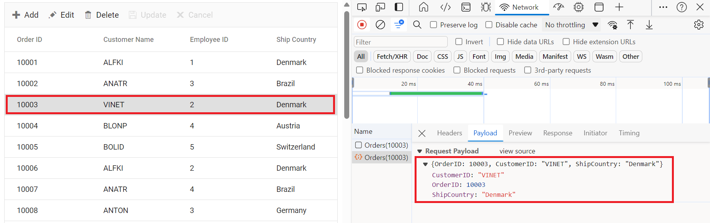

# CustomAdaptor in Syncfusion Vue Grid

The `CustomAdaptor` in the Syncfusion Vue Grid allows to create their own custom adaptors by extending the built-in adaptors. The custom adaptor involves handling the query process, requests, and responses of the built-in adaptor. The `CustomAdaptor` can be used to extend OData V4 services, enabling efficient data fetching and manipulation. By default, there are three built-in methods available for `CustomAdaptor`.

## Types of CustomAdaptor methods

There are three types of methods in custom adaptors.

### ProcessQuery

The `ProcessQuery` method handles the execution of a query sent to a [dataSource](https://ej2.syncfusion.com/vue/documentation/api/grid/#datasource), such as a database or custom data service. This query is responsible for performing operations like data retrieval, insertion, updating, or deletion. The `ProcessQuery` method accepts two arguments: 

* `DataManager`: Used to modify the URL dynamically.

* `Query`: Allows setting additional parameter values or modifying queries such as sorting, filtering, and grouping, etc.

**DataManager**


**Query**


```
processQuery(dm, query): Object {
    dm.dataSource.url = 'https://localhost:xxxx/odata/orders'; //Change the url.
    query.addParams('Syncfusion in Vue Grid', 'true'); // Add the additional parameter.
    return super.processQuery.apply(this, arguments);
}
```

### beforeSend

The `beforeSend` method is executed before a request is sent to the server. This function allows modifying parameters, request headers, and data, or performing validation before the request is processed. It accepts three arguments:

* `DataManager`: Provides the `dataSource` and `adaptor` value.

* `Request`: Used to send custom headers, such as setting the `Authorization` header.

* `Settings`: An optional argument that allows additional configurations.

**DataManager**


**Request**


**Settings**


```
beforeSend(dm, request, settings) {
    request.headers.set('Authorization', `true`);
    super.beforeSend(dm, request, settings);
}
```

### processResponse

The `processResponse` method handles the response received from the server after an asynchronous request. It is responsible for parsing the response data, managing errors, and preparing the data for further processing. This method can accept multiple optional arguments, allowing customization based on specific requirements.

```
 processResponse() {
    let i = 0;
    const original = super.processResponse.apply(this, arguments);
    /* Adding serial number */
    if (original.result) {
		original.result.forEach((item) => setValue('SNo', ++i, item));
    }
    return original;
}
```
This guide provides detailed instructions on binding data and performing CRUD (Create, Read, Update and Delete) actions using the `CustomAdaptor` by extending the `ODataV4Adaptor` in your Grid.

## Creating an Custom service

To configure a server with Syncfusion Vue Grid, you need to follow the below steps:

**1. Project Creation:**

Open Visual Studio and create an Vue and ASP.NET Core project named **CustomAdaptor**. To create an Vue and ASP.NET Core application, follow the documentation [link](https://learn.microsoft.com/en-us/visualstudio/javascript/tutorial-asp-net-core-with-vue?view=vs-2022) for detailed steps.

**2. Install NuGet Packages**

Using the NuGet package manager in Visual Studio (Tools → NuGet Package Manager → Manage NuGet Packages for Solution), install the `Microsoft.AspNetCore.OData` NuGet package.

**3. Model Class Creation:**

Create a model class named **OrdersDetails.cs** in the server-side **Models** folder to represent the order data.




using System.ComponentModel.DataAnnotations;

namespace ODataV4Adaptor.Server.Models
{
  public class OrdersDetails
  {
    public static List<OrdersDetails> order = new List<OrdersDetails>();
    public OrdersDetails()
    {

    }
    public OrdersDetails(
    int OrderID, string CustomerId, int EmployeeID, string ShipCountry)
    {
      this.OrderID = OrderID;
      this.CustomerID = CustomerId;
      this.EmployeeID = EmployeeID;
      this.ShipCountry = ShipCountry;
    }   

    public static List<OrdersDetails> GetAllRecords()
    {
      if (order.Count() == 0)
      {
        int code = 10000;
        for (int i = 1; i < 10; i++)
        {
          order.Add(new OrdersDetails(code + 1, "ALFKI", i + 0, "Denmark"));
          order.Add(new OrdersDetails(code + 2, "ANATR", i + 2, "Brazil"));
          order.Add(new OrdersDetails(code + 3, "ANTON", i + 1, "Germany"));
          order.Add(new OrdersDetails(code + 4, "BLONP", i + 3, "Austria"));
          order.Add(new OrdersDetails(code + 5, "BOLID", i + 4, "Switzerland"));
          code += 5;
        }
      }
      return order;
    }
    [Key]
    public int? OrderID { get; set; }
    public string? CustomerID { get; set; }
    public int? EmployeeID { get; set; }
    public string? ShipCountry { get; set; }
  }
}




**4. Build the Entity Data Model**

To construct the Entity Data Model for your OData service, utilize the `ODataConventionModelBuilder` to define the model's structure. Start by creating an instance of the `ODataConventionModelBuilder`, then register the entity set **Orders** using the `EntitySet<T>` method, where `OrdersDetails` represents the CLR type containing order details.  

```
// Create an ODataConventionModelBuilder to build the OData model.
var modelBuilder = new ODataConventionModelBuilder();

// Register the "Orders" entity set with the OData model builder.
modelBuilder.EntitySet<OrdersDetails>("Orders");
```
**5. Register the OData Services**

Once the Entity Data Model is built, you need to register the OData services in your ASP.NET Core application. Here's how:

```
// Add controllers with OData support to the service collection.
builder.Services.AddControllers().AddOData(
    options => options
        .Count()
        .AddRouteComponents("odata", modelBuilder.GetEdmModel()));
```

**6. Add controllers**

Finally, add controllers to expose the OData endpoints. Here's an example:

```
using Microsoft.AspNetCore.Mvc;
using Microsoft.AspNetCore.OData.Query;
using ODataV4Adaptor.Server.Models;

namespace ODataV4Adaptor.Server.Controllers
{
    [Route("[controller]")]
    [ApiController]
    public class OrdersController : ControllerBase
    {
        /// <summary>
        /// Retrieves all orders.
        /// </summary>
        /// <returns>The collection of orders.</returns>
        [HttpGet]
        [EnableQuery]
        public IActionResult Get()
        {
            var data = OrdersDetails.GetAllRecords().AsQueryable();
            return Ok(data);
        }
    }
}
```

**7. Run the Application:**

Run the application in Visual Studio. It will be accessible on a URL like **https://localhost:xxxx**. 

After running the application, you can verify that the server-side API controller is successfully returning the order data in the URL(https://localhost:xxxx/odata/Orders). Here **xxxx** denotes the port number.

## Connecting Syncfusion Vue Grid to an custom service extending the ODataV4 service

To integrate the Syncfusion Grid into your Vue and ASP.NET Core project using Visual Studio, follow the below steps:

**Step 1: Install Syncfusion Package**

Open your terminal in the project's client folder and install the required Syncfusion packages using npm:

```
npm install @syncfusion/ej2-Vue-grids --save
npm install @syncfusion/ej2-data --save
```

**Step 2: Clean Up App.vue and main.css**

Remove unnecessary default codes in `App.vue` and `main.css`.

**Step 3: Adding CSS reference**

Include the necessary CSS files in your `App.Vue` file to style the Syncfusion Vue component:




@import '../node_modules/@syncfusion/ej2-base/styles/material.css';
@import '../node_modules/@syncfusion/ej2-buttons/styles/material.css';
@import '../node_modules/@syncfusion/ej2-calendars/styles/material.css';
@import '../node_modules/@syncfusion/ej2-dropdowns/styles/material.css';
@import '../node_modules/@syncfusion/ej2-inputs/styles/material.css';
@import '../node_modules/@syncfusion/ej2-navigations/styles/material.css';
@import '../node_modules/@syncfusion/ej2-popups/styles/material.css';
@import '../node_modules/@syncfusion/ej2-splitbuttons/styles/material.css';
@import '../node_modules/@syncfusion/ej2-vue-grids/styles/material.css';




**Step 4: Adding Custom Adaptor**

Create a component file (e.g., App.vue). Then, import `DataManager` and `ODataV4Adaptor` from `@syncfusion/ej2-data`. Extend the `ODataV4Adaptor` class to define custom adaptor. This adaptor implements three key methods: `processQuery`, `beforeSend`, and `processResponse`.

* The `processQuery` method modifies the API endpoint URL and sets additional parameters required for executing the query.

* The `beforeSend` method adds custom headers, such as the `Authorization` header, before sending the request.

* The `processResponse` method customizes the response by modifying data, such as adding a new field (`SNo`) to the dataset.




import { DataManager, ODataV4Adaptor, Query } from '@syncfusion/ej2-data';
import { setValue } from '@syncfusion/ej2-base';
export default class CustomAdaptor extends ODataV4Adaptor {
  processQuery(dm, query) {
   dm.dataSource.url = 'https://localhost:xxxx/odata/orders'; //Change the url.
   query.addParams('Syncfusion in Vue Grid', 'true'); // Add the additional parameter.
   return super.processQuery.apply(this, arguments);
  }
  beforeSend(dm, request, settings) {
   request.headers.set('Authorization', `true`);
   super.beforeSend(dm, request, settings);
  }
  processResponse() {
   let i = 0;
   const original = super.processResponse.apply(this, arguments);
   // Adding serial number.
   if (original.result) {
	  original.result.forEach((item) => setValue('SNo', ++i, item));
   }
   return original;
  }
}




**Step 5: To add the Grid using Composition API or Options API, follow these steps:**

In your component file (e.g., App.vue), import `DataManager` from `@syncfusion/ej2-data` and `CustomAdaptor` from `./customadaptor` file. Create a `DataManager` instance specifying the URL of your API endpoint(https:localhost:xxxx/odata/Orders) using the `url` property. Then, set `CustomAdaptor` as the adaptor to handle data requests.




<template>
  <div id="app">
   <ejs-grid :dataSource='data'>
    <e-columns>
     <e-column field="SNo" headerText="SNo" width="120" textAlign='Right'></e-column>
     <e-column field='OrderID' headerText='Order ID' width='120' textAlign='Right' isPrimaryKey="true"></e-column>
     <e-column field='CustomerID' headerText='Customer ID' width='160'></e-column>
     <e-column field='EmployeeID' headerText='Employee ID' width='150' textAlign='Right'></e-column>
     <e-column field='ShipCountry' headerText='Ship Country' width='150'></e-column>
    </e-columns>
   </ejs-grid>
  </div>
</template>

<script setup>
import { provide } from "vue";
import { GridComponent as EjsGrid, ColumnDirective as EColumn, ColumnsDirective as EColumns } from "@syncfusion/ej2-vue-grids";
import { DataManager } from "@syncfusion/ej2-data";
import CustomAdaptor from './customadaptor';
const data = new DataManager({
  url: 'https://localhost:xxxx/odata/Orders',
  adaptor: new CustomAdaptor(),
});
</script>
<style>
 @import "../node_modules/@syncfusion/ej2-base/styles/tailwind.css";
 @import "../node_modules/@syncfusion/ej2-buttons/styles/tailwind.css";
 @import "../node_modules/@syncfusion/ej2-calendars/styles/tailwind.css";
 @import "../node_modules/@syncfusion/ej2-dropdowns/styles/tailwind.css";
 @import "../node_modules/@syncfusion/ej2-inputs/styles/tailwind.css";
 @import "../node_modules/@syncfusion/ej2-navigations/styles/tailwind.css";
 @import "../node_modules/@syncfusion/ej2-popups/styles/tailwind.css";
 @import "../node_modules/@syncfusion/ej2-splitbuttons/styles/tailwind.css";
 @import "../node_modules/@syncfusion/ej2-vue-grids/styles/tailwind.css";
</style>





<template>
 <ejs-grid :dataSource='data'>
  <e-columns>
   <e-column field="SNo" headerText="SNo" width="120" textAlign='Right'></e-column>
   <e-column field='OrderID' headerText='Order ID' width='120' isPrimaryKey="true" textAlign='Right'></e-column>
   <e-column field='CustomerID' headerText='Customer ID' width='160'></e-column>
   <e-column field='EmployeeID' headerText='Employee ID' width='150' textAlign='Right'></e-column>
   <e-column field='ShipCountry' headerText='Ship Country' width='150'></e-column>
  </e-columns>
 </ejs-grid>
</template>

<script>
import { GridComponent, ColumnsDirective, ColumnDirective } from '@syncfusion/ej2-vue-grids';
import { DataManager } from '@syncfusion/ej2-data';
import CustomAdaptor from './customadaptor';
export default {
  name: "App",
  components: {
	'ejs-grid': GridComponent,
	'e-columns': ColumnsDirective,
	'e-column': ColumnDirective
  },
  data() {
	return {
	  data: new DataManager({
	   url: 'https://localhost:xxxx/odata/Orders',
	   adaptor: new CustomAdaptor(),
	  }),
	};
  },
};
</script>
<style>
  @import "../node_modules/@syncfusion/ej2-base/styles/tailwind.css";
  @import "../node_modules/@syncfusion/ej2-buttons/styles/tailwind.css";
  @import "../node_modules/@syncfusion/ej2-calendars/styles/tailwind.css";
  @import "../node_modules/@syncfusion/ej2-dropdowns/styles/tailwind.css";
  @import "../node_modules/@syncfusion/ej2-inputs/styles/tailwind.css";
  @import "../node_modules/@syncfusion/ej2-navigations/styles/tailwind.css";
  @import "../node_modules/@syncfusion/ej2-popups/styles/tailwind.css";
  @import "../node_modules/@syncfusion/ej2-splitbuttons/styles/tailwind.css";
  @import "../node_modules/@syncfusion/ej2-vue-grids/styles/tailwind.css";
</style>




> Replace https://localhost:xxxx/odata/Orders with the actual **URL** of your API endpoint that provides the data in a consumable format (e.g., JSON).

Run the application in Visual Studio. It will be accessible on a URL like **https://localhost:xxxx**.

> Ensure your API service is configured to handle CORS (Cross-Origin Resource Sharing) if necessary.

```
  [program.cs]
  builder.Services.AddCors(options =>
  {
    options.AddDefaultPolicy(builder =>
    {
      builder.AllowAnyOrigin().AllowAnyMethod().AllowAnyHeader();
    });
  });
  var app = builder.Build();
  app.UseCors();
```

## Handling filtering operation

To enable filtering in your web application using the custom adaptor, extend the OData support in your service configuration. This involves adding the `Filter` method within the OData setup, allowing data to be filtered based on specified criteria. Once configured, clients can use the **$filter** query option in requests to retrieve specific data entries.




// Create a new instance of the web application builder.
var builder = WebApplication.CreateBuilder(args);

// Create an ODataConventionModelBuilder to build the OData model.
var modelBuilder = new ODataConventionModelBuilder();

// Register the "Orders" entity set with the OData model builder.
modelBuilder.EntitySet<OrdersDetails>("Orders");

// Add services to the container.

// Add controllers with OData support to the service collection.
builder.Services.AddControllers().AddOData(
    options => options
        .Count()
        .Filter() // Use Filter method for filtering.
        .AddRouteComponents("odata", modelBuilder.GetEdmModel()));





<template>
 <div id="app">
  <ejs-grid :dataSource='data' :allowFiltering='true'>
   <e-columns>
    <e-column field='OrderID' headerText='Order ID' width='120' textAlign='Right' isPrimaryKey="true"></e-column>
    <e-column field='CustomerID' headerText='Customer ID' width='160'></e-column>
    <e-column field='EmployeeID' headerText='Employee ID' width='150' textAlign='Right'></e-column>
    <e-column field='ShipCountry' headerText='Ship Country' width='150'></e-column>
   </e-columns>
  </ejs-grid>
 </div>
</template>

<script setup>
 import { provide } from "vue";
 import { GridComponent as EjsGrid, ColumnDirective as EColumn, ColumnsDirective as EColumns, Filter  } from "@syncfusion/ej2-vue-grids";
 import { DataManager } from "@syncfusion/ej2-data";
 import CustomAdaptor from './customadaptor';
 const data = new DataManager({
  url: 'https://localhost:xxxx/odata/Orders',
  adaptor: new CustomAdaptor(),
 });
 provide('grid', [Filter]);
</script>
<style>
 @import "../node_modules/@syncfusion/ej2-base/styles/tailwind.css";
 @import "../node_modules/@syncfusion/ej2-buttons/styles/tailwind.css";
 @import "../node_modules/@syncfusion/ej2-calendars/styles/tailwind.css";
 @import "../node_modules/@syncfusion/ej2-dropdowns/styles/tailwind.css";
 @import "../node_modules/@syncfusion/ej2-inputs/styles/tailwind.css";
 @import "../node_modules/@syncfusion/ej2-navigations/styles/tailwind.css";
 @import "../node_modules/@syncfusion/ej2-popups/styles/tailwind.css";
 @import "../node_modules/@syncfusion/ej2-splitbuttons/styles/tailwind.css";
 @import "../node_modules/@syncfusion/ej2-vue-grids/styles/tailwind.css";
</style>





<template>
 <ejs-grid :dataSource='data' :allowFiltering='true'>
  <e-columns>
   <e-column field='OrderID' headerText='Order ID' width='120' textAlign='Right' isPrimaryKey="true"></e-column>
   <e-column field='CustomerID' headerText='Customer ID' width='160'></e-column>
   <e-column field='EmployeeID' headerText='Employee ID' width='150' textAlign='Right'></e-column>
   <e-column field='ShipCountry' headerText='Ship Country' width='150'></e-column>
  </e-columns>
 </ejs-grid>
</template>

<script>
import { GridComponent, ColumnsDirective, ColumnDirective, Filter } from '@syncfusion/ej2-vue-grids';
import { DataManager } from '@syncfusion/ej2-data';
import CustomAdaptor from './customadaptor';
export default {
 name: "App",
 components: {
  'ejs-grid': GridComponent,
  'e-columns': ColumnsDirective,
  'e-column': ColumnDirective
 },
 data() {
  return {
   data: new DataManager({
   url: 'https://localhost:xxxx/odata/Orders',
   adaptor: new CustomAdaptor(),
   }),
  };
},
provide: {
 grid: [Filter]
}
};
</script>
<style>
 @import "../node_modules/@syncfusion/ej2-base/styles/tailwind.css";
 @import "../node_modules/@syncfusion/ej2-buttons/styles/tailwind.css";
 @import "../node_modules/@syncfusion/ej2-calendars/styles/tailwind.css";
 @import "../node_modules/@syncfusion/ej2-dropdowns/styles/tailwind.css";
 @import "../node_modules/@syncfusion/ej2-inputs/styles/tailwind.css";
 @import "../node_modules/@syncfusion/ej2-navigations/styles/tailwind.css";
 @import "../node_modules/@syncfusion/ej2-popups/styles/tailwind.css";
 @import "../node_modules/@syncfusion/ej2-splitbuttons/styles/tailwind.css";
 @import "../node_modules/@syncfusion/ej2-vue-grids/styles/tailwind.css";
</style>




**Single column filtering**


**Multi column filtering**


## Handling searching operation

To enable search functionality in your web application using the custom adaptor, extend the OData support in your service configuration. This requires adding the `Filter` method within the OData setup, allowing data to be filtered based on specified criteria. Once configured, clients can use the **$filter** query option in their requests to search for specific data entries.




// Create a new instance of the web application builder.
var builder = WebApplication.CreateBuilder(args);

// Create an ODataConventionModelBuilder to build the OData model.
var modelBuilder = new ODataConventionModelBuilder();

// Register the orders entity set with the OData model builder.
modelBuilder.EntitySet<OrdersDetails>("Orders");

// Add services to the container.

// Add controllers with OData support to the service collection.
builder.Services.AddControllers().AddOData(
    options => options
        .Count()
        .Filter() // Use Filter method for searching.
        .AddRouteComponents("odata", modelBuilder.GetEdmModel()));





<template>
 <div id="app">
  <ejs-grid :dataSource='data' :toolbar='toolbarOptions'>
   <e-columns>
    <e-column field='OrderID' headerText='Order ID' width='120' textAlign='Right' isPrimaryKey="true"></e-column>
    <e-column field='CustomerID' headerText='Customer ID' width='160'></e-column>
    <e-column field='EmployeeID' headerText='Employee ID' width='150' textAlign='Right'></e-column>
    <e-column field='ShipCountry' headerText='Ship Country' width='150'></e-column>
   </e-columns>
  </ejs-grid>
 </div>
</template>

<script setup>
 import { provide } from "vue";
 import { GridComponent as EjsGrid, ColumnDirective as EColumn, ColumnsDirective as EColumns, Toolbar,  Search } from "@syncfusion/ej2-vue-grids";
 import { DataManager } from "@syncfusion/ej2-data";
 import CustomAdaptor from './customadaptor';
 const data = new DataManager({
  url: 'https://localhost:xxxx/odata/Orders',
  adaptor: new CustomAdaptor(),
 });
 const toolbarOptions = ['Search'];
 provide('grid', [Toolbar, Search ]);
</script>
<style>
 @import "../node_modules/@syncfusion/ej2-base/styles/tailwind.css";
 @import "../node_modules/@syncfusion/ej2-buttons/styles/tailwind.css";
 @import "../node_modules/@syncfusion/ej2-calendars/styles/tailwind.css";
 @import "../node_modules/@syncfusion/ej2-dropdowns/styles/tailwind.css";
 @import "../node_modules/@syncfusion/ej2-inputs/styles/tailwind.css";
 @import "../node_modules/@syncfusion/ej2-navigations/styles/tailwind.css";
 @import "../node_modules/@syncfusion/ej2-popups/styles/tailwind.css";
 @import "../node_modules/@syncfusion/ej2-splitbuttons/styles/tailwind.css";
 @import "../node_modules/@syncfusion/ej2-vue-grids/styles/tailwind.css";
</style>





<template>
 <ejs-grid :dataSource='data' :toolbar='toolbarOptions'>
  <e-columns>
   <e-column field='OrderID' headerText='Order ID' width='120' textAlign='Right' isPrimaryKey="true"></e-column>
   <e-column field='CustomerID' headerText='Customer ID' width='160'></e-column>
   <e-column field='EmployeeID' headerText='Employee ID' width='150' textAlign='Right'></e-column>
   <e-column field='ShipCountry' headerText='Ship Country' width='150'></e-column>
  </e-columns>
 </ejs-grid>
</template>

<script>
 import { GridComponent, ColumnsDirective, ColumnDirective, Toolbar, Search  } from '@syncfusion/ej2-vue-grids';
 import { DataManager } from '@syncfusion/ej2-data';
 import CustomAdaptor from './customadaptor';
 export default {
  name: "App",
  components: {
   'ejs-grid': GridComponent,
   'e-columns': ColumnsDirective,
   'e-column': ColumnDirective
  },
  data() {
   return {
    data: new DataManager({
     url: 'https://localhost:xxxx/odata/Orders',
     adaptor: new CustomAdaptor(),
    }),
    toolbarOptions: ['Search']
   };
  },
  provide: {
   grid: [Toolbar, Search ]
  }
 };
</script>
<style>
 @import "../node_modules/@syncfusion/ej2-base/styles/tailwind.css";
 @import "../node_modules/@syncfusion/ej2-buttons/styles/tailwind.css";
 @import "../node_modules/@syncfusion/ej2-calendars/styles/tailwind.css";
 @import "../node_modules/@syncfusion/ej2-dropdowns/styles/tailwind.css";
 @import "../node_modules/@syncfusion/ej2-inputs/styles/tailwind.css";
 @import "../node_modules/@syncfusion/ej2-navigations/styles/tailwind.css";
 @import "../node_modules/@syncfusion/ej2-popups/styles/tailwind.css";
 @import "../node_modules/@syncfusion/ej2-splitbuttons/styles/tailwind.css";
 @import "../node_modules/@syncfusion/ej2-vue-grids/styles/tailwind.css";
</style>





## Handling sorting operation

To enable sorting operations in your web application using the custom adaptor, first configure the custom adaptor to extend OData support in your service collection. This involves adding the `OrderBy` method within the OData setup, allowing data to be sorted based on specified criteria. Once enabled, clients can use the **$orderby** query option in their requests to sort data entries by desired attributes.




// Create a new instance of the web application builder. 
var builder = WebApplication.CreateBuilder(args);

// Create an ODataConventionModelBuilder to build the OData model.
var modelBuilder = new ODataConventionModelBuilder();

// Register the "Orders" entity set with the OData model builder.
modelBuilder.EntitySet<OrdersDetails>("Orders");

// Add services to the container.

// Add controllers with OData support to the service collection.
builder.Services.AddControllers().AddOData(
    options => options
        .Count()
        .OrderBy() // Use this method for sorting.
        .AddRouteComponents("odata", modelBuilder.GetEdmModel()));





<template>
 <div id="app">
  <ejs-grid :dataSource='data' :allowSorting='true'>
   <e-columns>
    <e-column field='OrderID' headerText='Order ID' width='120' textAlign='Right' isPrimaryKey="true"></e-column>
    <e-column field='CustomerID' headerText='Customer ID' width='160'></e-column>
    <e-column field='EmployeeID' headerText='Employee ID' width='150' textAlign='Right'></e-column>
    <e-column field='ShipCountry' headerText='Ship Country' width='150'></e-column>
   </e-columns>
  </ejs-grid>
 </div>
</template>

<script setup>
 import { provide } from "vue";
 import { GridComponent as EjsGrid, ColumnDirective as EColumn, ColumnsDirective as EColumns, Sort} from "@syncfusion/ej2-vue-grids";
 import { DataManager } from "@syncfusion/ej2-data";
 import CustomAdaptor from './customadaptor';
 const data = new DataManager({
  url: 'https://localhost:xxxx/odata/Orders',
  adaptor: new CustomAdaptor(),
 });
 provide('grid', [Sort]);
</script>
<style>
 @import "../node_modules/@syncfusion/ej2-base/styles/tailwind.css";
 @import "../node_modules/@syncfusion/ej2-buttons/styles/tailwind.css";
 @import "../node_modules/@syncfusion/ej2-calendars/styles/tailwind.css";
 @import "../node_modules/@syncfusion/ej2-dropdowns/styles/tailwind.css";
 @import "../node_modules/@syncfusion/ej2-inputs/styles/tailwind.css";
 @import "../node_modules/@syncfusion/ej2-navigations/styles/tailwind.css";
 @import "../node_modules/@syncfusion/ej2-popups/styles/tailwind.css";
 @import "../node_modules/@syncfusion/ej2-splitbuttons/styles/tailwind.css";
 @import "../node_modules/@syncfusion/ej2-vue-grids/styles/tailwind.css";
</style>





<template>
 <ejs-grid :dataSource='data' :allowSorting='true'>
  <e-columns>
   <e-column field='OrderID' headerText='Order ID' width='120' textAlign='Right' isPrimaryKey="true"></e-column>
   <e-column field='CustomerID' headerText='Customer ID' width='160'></e-column>
   <e-column field='EmployeeID' headerText='Employee ID' width='150' textAlign='Right'></e-column>
   <e-column field='ShipCountry' headerText='Ship Country' width='150'></e-column>
  </e-columns>
 </ejs-grid>
</template>

<script>
 import { GridComponent, ColumnsDirective, ColumnDirective, Sort } from '@syncfusion/ej2-vue-grids';
 import { DataManager } from '@syncfusion/ej2-data';
 import CustomAdaptor from './customadaptor';
 export default {
  name: "App",
  components: {
   'ejs-grid': GridComponent,
   'e-columns': ColumnsDirective,
   'e-column': ColumnDirective
  },
  data() {
   return {
    data: new DataManager({
     url: 'https://localhost:xxxx/odata/Orders',
     adaptor: new CustomAdaptor(),
    })
   };
  },
  provide: {
   grid: [Sort]
  }
 };
</script>
<style>
 @import "../node_modules/@syncfusion/ej2-base/styles/tailwind.css";
 @import "../node_modules/@syncfusion/ej2-buttons/styles/tailwind.css";
 @import "../node_modules/@syncfusion/ej2-calendars/styles/tailwind.css";
 @import "../node_modules/@syncfusion/ej2-dropdowns/styles/tailwind.css";
 @import "../node_modules/@syncfusion/ej2-inputs/styles/tailwind.css";
 @import "../node_modules/@syncfusion/ej2-navigations/styles/tailwind.css";
 @import "../node_modules/@syncfusion/ej2-popups/styles/tailwind.css";
 @import "../node_modules/@syncfusion/ej2-splitbuttons/styles/tailwind.css";
 @import "../node_modules/@syncfusion/ej2-vue-grids/styles/tailwind.css";
</style>




**Single column sorting**


**Multi column sorting**


## Handling paging operation

To implement paging in your web application using the CustomAdaptor with OData, use the `SetMaxTop` method in your OData setup to define the maximum number of records returned per request. Once configured, clients can utilize the **$skip** and **$top** query options to specify the number of records to skip and retrieve, respectively. 




// Create a new instance of the web application builder.
var builder = WebApplication.CreateBuilder(args);

// Create an ODataConventionModelBuilder to build the OData model.
var modelBuilder = new ODataConventionModelBuilder();

// Register the "Orders" entity set with the OData model builder.
modelBuilder.EntitySet<OrdersDetails>("Orders");

// Add services to the container.

// Add controllers with OData support to the service collection.
builder.Services.AddControllers().AddOData(
    options => options
        .Count()
        .SetMaxTop(null)
        .AddRouteComponents("odata", modelBuilder.GetEdmModel()));




<template>
 <div id="app">
  <ejs-grid :dataSource='data' :allowPaging="true">
   <e-columns>
    <e-column field='OrderID' headerText='Order ID' width='120' textAlign='Right' isPrimaryKey="true"></e-column>
    <e-column field='CustomerID' headerText='Customer ID' width='160'></e-column>
    <e-column field='EmployeeID' headerText='Employee ID' width='150' textAlign='Right'></e-column>
    <e-column field='ShipCountry' headerText='Ship Country' width='150'></e-column>
   </e-columns>
  </ejs-grid>
 </div>
</template>

<script setup>
 import { provide } from "vue";
 import { GridComponent as EjsGrid, ColumnDirective as EColumn, ColumnsDirective as EColumns, Page} from "@syncfusion/ej2-vue-grids";
 import { DataManager } from "@syncfusion/ej2-data";
 import CustomAdaptor from './customadaptor';
 const data = new DataManager({
  url: 'https://localhost:xxxx/odata/Orders',
  adaptor: new CustomAdaptor(),
 });
 provide('grid', [Page]);
</script>
<style>
 @import "../node_modules/@syncfusion/ej2-base/styles/tailwind.css";
 @import "../node_modules/@syncfusion/ej2-buttons/styles/tailwind.css";
 @import "../node_modules/@syncfusion/ej2-calendars/styles/tailwind.css";
 @import "../node_modules/@syncfusion/ej2-dropdowns/styles/tailwind.css";
 @import "../node_modules/@syncfusion/ej2-inputs/styles/tailwind.css";
 @import "../node_modules/@syncfusion/ej2-navigations/styles/tailwind.css";
 @import "../node_modules/@syncfusion/ej2-popups/styles/tailwind.css";
 @import "../node_modules/@syncfusion/ej2-splitbuttons/styles/tailwind.css";
 @import "../node_modules/@syncfusion/ej2-vue-grids/styles/tailwind.css";
</style>




<template>
 <ejs-grid :dataSource='data' :allowPaging="true">
  <e-columns>
   <e-column field='OrderID' headerText='Order ID' width='120' textAlign='Right' isPrimaryKey="true"></e-column>
   <e-column field='CustomerID' headerText='Customer ID' width='160'></e-column>
   <e-column field='EmployeeID' headerText='Employee ID' width='150'  textAlign='Right'></e-column>
   <e-column field='ShipCountry' headerText='Ship Country' width='150'></e-column>
  </e-columns>
 </ejs-grid>
</template>

<script>
 import { GridComponent, ColumnsDirective, ColumnDirective, Page } from '@syncfusion/ej2-vue-grids';
 import { DataManager } from '@syncfusion/ej2-data';
 import CustomAdaptor from './customadaptor';
 export default {
  name: "App",
  components: {
   'ejs-grid': GridComponent,
   'e-columns': ColumnsDirective,
   'e-column': ColumnDirective
  },
  data() {
   return {
    data: new DataManager({
     url: 'https://localhost:xxxx/odata/Orders',
     adaptor: new CustomAdaptor(),
    })
   };
  },
  provide: {
   grid: [Page]
  }
 };
</script>
<style>
 @import "../node_modules/@syncfusion/ej2-base/styles/tailwind.css";
 @import "../node_modules/@syncfusion/ej2-buttons/styles/tailwind.css";
 @import "../node_modules/@syncfusion/ej2-calendars/styles/tailwind.css";
 @import "../node_modules/@syncfusion/ej2-dropdowns/styles/tailwind.css";
 @import "../node_modules/@syncfusion/ej2-inputs/styles/tailwind.css";
 @import "../node_modules/@syncfusion/ej2-navigations/styles/tailwind.css";
 @import "../node_modules/@syncfusion/ej2-popups/styles/tailwind.css";
 @import "../node_modules/@syncfusion/ej2-splitbuttons/styles/tailwind.css";
 @import "../node_modules/@syncfusion/ej2-vue-grids/styles/tailwind.css";
</style>





## Handling CRUD operations

To manage CRUD (Create, Read, Update and Delete) operations using CustomAdaptor, follow the provided guide for configuring the Syncfusion Vue Grid for [editing](https://ej2.syncfusion.com/vue/documentation/grid/editing/edit) and utilize the sample implementation of the `OrdersController` in your server application. This controller processes HTTP requests for CRUD operations, including GET, POST, PATCH, and DELETE.

To enable CRUD operations in the Grid within an Vue application, follow the below steps:




<template>
 <div id="app">
  <ejs-grid :dataSource='data' :editSettings='editSettings' height='270' :toolbar='toolbar'>
   <e-columns>
    <e-column field='OrderID' headerText='Order ID' textAlign='Right' :isPrimaryKey='true' :validationRules='orderIDRules' width=100></e-column>
    <e-column field='CustomerID' headerText='Customer ID' :validationRules='customerIDRules' width=120></e-column>
    <e-column field='EmployeeID' headerText='Employee ID' width='150' textAlign='Right'></e-column>
    <e-column field='ShipCountry' headerText='Ship Country' width='150'></e-column>
   </e-columns>
  </ejs-grid>
 </div>
</template>

<script setup>
 import { provide } from "vue";
 import { GridComponent as EjsGrid, ColumnDirective as EColumn, ColumnsDirective as EColumns, Toolbar, Edit } from "@syncfusion/ej2-vue-grids";
 import { DataManager } from "@syncfusion/ej2-data";
 import CustomAdaptor from './customadaptor';
 const data = new DataManager({
  url: 'https://localhost:xxxx/odata/Orders',
  adaptor: new CustomAdaptor(),
 });
 const orderIDRules= { required: true, number: true };
 const customerIDRules= { required: true };
 const editSettings = { allowEditing: true, allowAdding: true, allowDeleting: true };
 const toolbar = ['Add', 'Edit', 'Delete', 'Update', 'Cancel'];
 provide('grid', [Toolbar, Edit ]);
</script>
<style>
 @import "../node_modules/@syncfusion/ej2-base/styles/tailwind.css";
 @import "../node_modules/@syncfusion/ej2-buttons/styles/tailwind.css";
 @import "../node_modules/@syncfusion/ej2-calendars/styles/tailwind.css";
 @import "../node_modules/@syncfusion/ej2-dropdowns/styles/tailwind.css";
 @import "../node_modules/@syncfusion/ej2-inputs/styles/tailwind.css";
 @import "../node_modules/@syncfusion/ej2-navigations/styles/tailwind.css";
 @import "../node_modules/@syncfusion/ej2-popups/styles/tailwind.css";
 @import "../node_modules/@syncfusion/ej2-splitbuttons/styles/tailwind.css";
 @import "../node_modules/@syncfusion/ej2-vue-grids/styles/tailwind.css";
</style>





<template>
 <ejs-grid :dataSource='data' :editSettings='editSettings' height='270' :toolbar='toolbar'>
  <e-columns>
   <e-column field='OrderID' headerText='Order ID' textAlign='Right' :isPrimaryKey='true' :validationRules='orderIDRules' width=100></e-column>
   <e-column field='CustomerID' headerText='Customer ID' :validationRules='customerIDRules' width=120></e-column>
   <e-column field='EmployeeID' headerText='Employee ID' width='150' textAlign='Right'></e-column>
   <e-column field='ShipCountry' headerText='Ship Country' width='150'></e-column>
  </e-columns>
 </ejs-grid>
</template>

<script>
 import { GridComponent, ColumnsDirective, ColumnDirective, Toolbar, Edit  } from '@syncfusion/ej2-vue-grids';
 import { DataManager } from '@syncfusion/ej2-data';
 import CustomAdaptor from './customadaptor';
 export default {
  name: "App",
  components: {
   'ejs-grid': GridComponent,
   'e-columns': ColumnsDirective,
   'e-column': ColumnDirective
  },
  data() {
   return {
    data: new DataManager({
     url: 'https://localhost:xxxx/odata/Orders',
     adaptor: new CustomAdaptor(),
    }),
    orderIDRules: { required: true, number: true },
    customerIDRules: { required: true },
    editSettings: { allowEditing: true, allowAdding: true, allowDeleting: true },
    toolbar: ['Add', 'Edit', 'Delete', 'Update', 'Cancel']
   };
  },
  provide: {
   grid: [Toolbar, Edit ]
  }
 };
</script>
<style>
 @import "../node_modules/@syncfusion/ej2-base/styles/tailwind.css";
 @import "../node_modules/@syncfusion/ej2-buttons/styles/tailwind.css";
 @import "../node_modules/@syncfusion/ej2-calendars/styles/tailwind.css";
 @import "../node_modules/@syncfusion/ej2-dropdowns/styles/tailwind.css";
 @import "../node_modules/@syncfusion/ej2-inputs/styles/tailwind.css";
 @import "../node_modules/@syncfusion/ej2-navigations/styles/tailwind.css";
 @import "../node_modules/@syncfusion/ej2-popups/styles/tailwind.css";
 @import "../node_modules/@syncfusion/ej2-splitbuttons/styles/tailwind.css";
 @import "../node_modules/@syncfusion/ej2-vue-grids/styles/tailwind.css";
</style>




> Normal/Inline editing is the default edit [mode](https://ej2.syncfusion.com/vue/documentation/api/grid/editSettings/#mode) for the Grid. To enable CRUD operations, ensure that the [isPrimaryKey](https://ej2.syncfusion.com/vue/documentation/api/grid/column/#isprimarykey) property is set to **true** for a specific Grid column, ensuring that its value is unique.

**Insert Record**

To insert a new record into your Syncfusion Vue Grid, you can utilize the `HttpPost` method in your server application. Below is a sample implementation of inserting a record using the **OrdersController**:

```
/// <summary>
/// Inserts a new order to the collection.
/// </summary>
/// <param name="addRecord">The order to be inserted.</param>
/// <returns>It returns the newly inserted record detail.</returns>
[HttpPost]
[EnableQuery]
public IActionResult Post([FromBody] OrdersDetails addRecord)
{
    if (order == null)
    {
        return BadRequest("Null order");
    }

    OrdersDetails.GetAllRecords().Insert(0, addRecord);
    return Ok(addRecord);
}
```


**Update Record**

Updating a record in the Syncfusion Vue Grid can be achieved by utilizing the `HttpPatch` method in your controller. Here's a sample implementation of updating a record:

```
/// <summary>
/// Updates an existing order.
/// </summary>
/// <param name="key">The ID of the order to update.</param>
/// <param name="updateRecord">The updated order details.</param>
/// <returns>It returns the updated order details.</returns>
[HttpPatch("{key}")]
public IActionResult Patch(int key, [FromBody] OrdersDetails updatedOrder)
{
    if (updatedOrder == null)
    {
        return BadRequest("No records");
    }
    var existingOrder = OrdersDetails.GetAllRecords().FirstOrDefault(o => o.OrderID == key);
    if (existingOrder != null)
    {
        // If the order exists, update its properties
        existingOrder.CustomerID = updatedOrder.CustomerID ?? existingOrder.CustomerID;
        existingOrder.EmployeeID = updatedOrder.EmployeeID ?? existingOrder.EmployeeID;
        existingOrder.ShipCountry = updatedOrder.ShipCountry ?? existingOrder.ShipCountry;
    }
    return Ok(existingOrder);
}
```


**Delete Record**

To delete a record from your Syncfusion Vue Grid, you can utilize the `HttpDelete` method in your controller. Below is a sample implementation:

```
/// <summary>
/// Deletes an order.
/// </summary>
/// <param name="key">The key of the order to be deleted.</param>
/// <returns>The deleted order.</returns>
[HttpDelete("{key}")]
public IActionResult Delete(int key)
{
    var order = OrdersDetails.GetAllRecords().FirstOrDefault(o => o.OrderID == key);
    if (order != null)
    {
        OrdersDetails.GetAllRecords().Remove(order);
    }
    return Ok(order);
}
```

