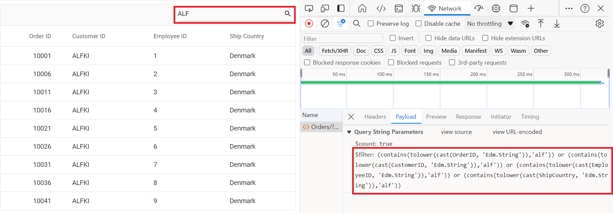
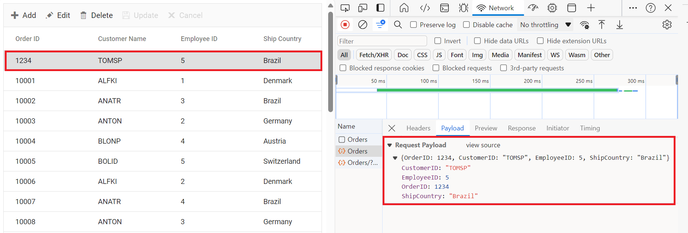
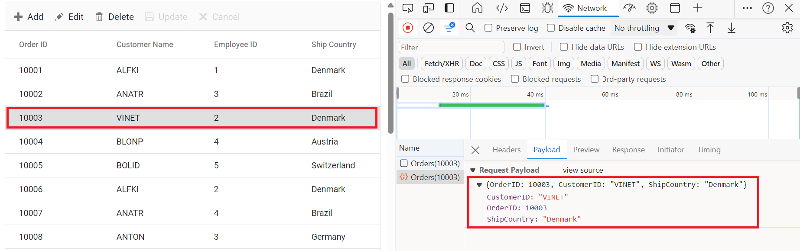

# ODataV4Adaptor in Syncfusion<sup style="font-size:70%">&reg;</sup> Vue Grid Component

The `ODataV4Adaptor` in the Syncfusion<sup style="font-size:70%">&reg;</sup> Vue Grid Component allows seamless integration of the Vue Grid with ODataV4 v4 services, enabling efficient data fetching and manipulation. This guide provides detailed instructions on binding data and performing CRUD (Create, Read, Update, Delete) actions using the `ODataV4Adaptor` in your Syncfusion<sup style="font-size:70%">&reg;</sup> Vue Grid Component.

## Creating an ODataV4 service

To configure a server with Syncfusion<sup style="font-size:70%">&reg;</sup> Vue Grid, you need to follow the below steps:

**1. Project Creation:**

Open Visual Studio and create an Vue and ASP.NET Core project named **ODataV4Adaptor**. To create an Vue and ASP.NET Core application, follow the documentation [link](https://learn.microsoft.com/en-us/visualstudio/javascript/tutorial-asp-net-core-with-vue?view=vs-2022) for detailed steps.

**2. Install NuGet Packages**

Using the NuGet package manager in Visual Studio (Tools → NuGet Package Manager → Manage NuGet Packages for Solution), install the `Microsoft.AspNetCore.OData` NuGet package.

**3. Model Class Creation:**

Create a model class named **OrdersDetails.cs** in the server-side **Models** folder to represent the order data.




using System.ComponentModel.DataAnnotations;

namespace ODataV4Adaptor.Server.Models
{
 public class OrdersDetails
    {
        public static List<OrdersDetails> order = new List<OrdersDetails>();
        public OrdersDetails()
        {

        }
        public OrdersDetails(
        int OrderID, string CustomerId, int EmployeeId, string ShipCountry)
        {
            this.OrderID = OrderID;
            this.CustomerID = CustomerId;
            this.EmployeeID = EmployeeId;
            this.ShipCountry = ShipCountry;
        }

        public static List<OrdersDetails> GetAllRecords()
        {
            if (order.Count() == 0)
            {
                int code = 10000;
                for (int i = 1; i < 10; i++)
                {
                    order.Add(new OrdersDetails(code + 1, "ALFKI", i + 0,  "Denmark"));
                    order.Add(new OrdersDetails(code + 2, "ANATR", i + 2, "Brazil"));
                    order.Add(new OrdersDetails(code + 3, "ANTON", i + 1, "Germany"));
                    order.Add(new OrdersDetails(code + 4, "BLONP", i + 3, "Austria"));
                    order.Add(new OrdersDetails(code + 5, "BOLID", i + 4, "Switzerland"));
                    code += 5;
                }
            }
            return order;
        }
        [Key]
        public int? OrderID { get; set; }
        public string? CustomerID { get; set; }
        public int? EmployeeID { get; set; }
        public string? ShipCountry { get; set; }
    }
}




**4. Build the Entity Data Model**

To construct the Entity Data Model for your ODataV4 service, utilize the `ODataConventionModelBuilder` to define the model's structure. Start by creating an instance of the `ODataConventionModelBuilder`, then register the entity set **Orders** using the `EntitySet<T>` method, where `OrdersDetails` represents the CLR type containing order details. 

```cs
// Create an ODataConventionModelBuilder to build the ODataV4 model
var modelBuilder = new ODataConventionModelBuilder();

// Register the "Orders" entity set with the ODataV4 model builder
modelBuilder.EntitySet<OrdersDetails>("Orders");
```

**5. Register the ODataV4 Services**

Once the Entity Data Model is built, you need to register the ODataV4 services in your ASP.NET Core application. Here's how:

```cs
// Add controllers with ODataV4 support to the service collection
builder.Services.AddControllers().AddOData(
    options => options
        .Count()
        .AddRouteComponents("odata", modelBuilder.GetEdmModel()));
```
**6. Add controllers**

Finally, add controllers to expose the ODataV4 endpoints. Here's an example:

```cs
using Microsoft.AspNetCore.Mvc;
using Microsoft.AspNetCore.OData.Query;
using ODataV4Adaptor.Server.Models;

namespace ODataV4Adaptor.Server.Controllers
{
    [Route("[controller]")]
    [ApiController]
    public class OrdersController : ControllerBase
    {
        /// <summary>
        /// Retrieves all orders.
        /// </summary>
        /// <returns>The collection of orders.</returns>
        [HttpGet]
        [EnableQuery]
        public IActionResult Get()
        {
            var data = OrdersDetails.GetAllRecords().AsQueryable();
            return Ok(data);
        }
    }
}
```
**4. Run the Application:**

Run the application in Visual Studio. It will be accessible on a URL like **https://localhost:xxxx**. 

After running the application, you can verify that the server-side API controller is successfully returning the order data in the URL(https://localhost:xxxx/odata/Orders). Here **xxxx** denotes the port number.

## Connecting Syncfusion<sup style="font-size:70%">&reg;</sup> Vue Grid to an ODataV4 service

To integrate the Syncfusion<sup style="font-size:70%">&reg;</sup> Grid component into your Vue and ASP.NET Core project using Visual Studio, follow the steps below:

**Step 1:** Install Syncfusion<sup style="font-size:70%">&reg;</sup> Package

Open your terminal in the project’s client folder and install the required Syncfusion<sup style="font-size:70%">&reg;</sup> packages using npm:

```bash
npm install @syncfusion/ej2-vue-grids --save
npm install @syncfusion/ej2-data --save
```

**Step 2:** Clean Up App.vue and main.css

Remove unnecessary default codes in `App.vue` and `main.css`.

**Step 3:** Adding CSS Reference

Include the necessary CSS files in your `App.Vue` file to style the Syncfusion<sup style="font-size:70%">&reg;</sup> Vue component:

```css
@import '../node_modules/@syncfusion/ej2-base/styles/tailwind.css';
@import '../node_modules/@syncfusion/ej2-buttons/styles/tailwind.css';
@import '../node_modules/@syncfusion/ej2-calendars/styles/tailwind.css';
@import '../node_modules/@syncfusion/ej2-dropdowns/styles/tailwind.css';
@import '../node_modules/@syncfusion/ej2-inputs/styles/tailwind.css';
@import '../node_modules/@syncfusion/ej2-navigations/styles/tailwind.css';
@import '../node_modules/@syncfusion/ej2-popups/styles/tailwind.css';
@import '../node_modules/@syncfusion/ej2-splitbuttons/styles/tailwind.css';
@import '../node_modules/@syncfusion/ej2-vue-grids/styles/tailwind.css';
```

**Step 4:** Adding Syncfusion<sup style="font-size:70%">&reg;</sup> Vue Grid Component

To add the Vue Grid component using **Composition API** or **Options API**, follow these steps:

In your `App.vue`, import `DataManager` and `ODataV4Adaptor` from` @syncfusion/ej2-data`. Create a `DataManager` instance specifying the URL of your API endpoint(https:localhost:xxxx/odata/Orders) using the `url` property and set the adaptor `ODataV4Adaptor`.

The following example demonstrates how to bind remote data to the grid component using `DataManager`.



<template>
	<div id="app">
		<ejs-grid :dataSource='data'>
			<e-columns>
				<e-column field='OrderID' headerText='Order ID' width='120' textAlign='Right' isPrimaryKey="true"></e-column>
				<e-column field='CustomerID' headerText='Customer ID' width='160'></e-column>
				<e-column field='ShipCity' headerText='Ship City' width='150'></e-column>
				<e-column field='ShipCountry' headerText='Ship Country' width='150'></e-column>
			</e-columns>
		</ejs-grid>
	</div>
</template>
<script setup>
	import { provide } from "vue";
	import { GridComponent as EjsGrid, ColumnDirective as EColumn, ColumnsDirective as EColumns } from "@syncfusion/ej2-vue-grids";
	import { DataManager, ODataV4Adaptor } from "@syncfusion/ej2-data";

	const data = new DataManager({
		url: 'https://localhost:xxxx/odata/Orders',
		adaptor: new ODataV4Adaptor(),
	});

</script>
<style>
	@import "../node_modules/@syncfusion/ej2-base/styles/tailwind.css";
	@import "../node_modules/@syncfusion/ej2-buttons/styles/tailwind.css";
	@import "../node_modules/@syncfusion/ej2-calendars/styles/tailwind.css";
	@import "../node_modules/@syncfusion/ej2-dropdowns/styles/tailwind.css";
	@import "../node_modules/@syncfusion/ej2-inputs/styles/tailwind.css";
	@import "../node_modules/@syncfusion/ej2-navigations/styles/tailwind.css";
	@import "../node_modules/@syncfusion/ej2-popups/styles/tailwind.css";
	@import "../node_modules/@syncfusion/ej2-splitbuttons/styles/tailwind.css";
	@import "../node_modules/@syncfusion/ej2-vue-grids/styles/tailwind.css";
</style>


<template>
	<ejs-grid :dataSource='data'>
		<e-columns>
			<e-column field='OrderID' headerText='Order ID' width='120' textAlign='Right' isPrimaryKey="true"></e-column>
			<e-column field='CustomerID' headerText='Customer ID' width='160'></e-column>
			<e-column field='ShipCity' headerText='Ship City' width='150'></e-column>
			<e-column field='ShipCountry' headerText='Ship Country' width='150'></e-column>
		</e-columns>
	</ejs-grid>
</template>

<script>
	import { GridComponent, ColumnsDirective, ColumnDirective } from '@syncfusion/ej2-vue-grids';
	import { DataManager, ODataV4Adaptor } from '@syncfusion/ej2-data';
	export default {
		name: "App",
		components: {
			'ejs-grid': GridComponent,
			'e-columns': ColumnsDirective,
			'e-column': ColumnDirective
		},
		data() {
			return {
				data: new DataManager({
					url: 'https://localhost:xxxx/odata/Orders',
					adaptor: new ODataV4Adaptor(),
				}),
			};
		},
	};
</script>

<style>
	@import "../node_modules/@syncfusion/ej2-base/styles/tailwind.css";
	@import "../node_modules/@syncfusion/ej2-buttons/styles/tailwind.css";
	@import "../node_modules/@syncfusion/ej2-calendars/styles/tailwind.css";
	@import "../node_modules/@syncfusion/ej2-dropdowns/styles/tailwind.css";
	@import "../node_modules/@syncfusion/ej2-inputs/styles/tailwind.css";
	@import "../node_modules/@syncfusion/ej2-navigations/styles/tailwind.css";
	@import "../node_modules/@syncfusion/ej2-popups/styles/tailwind.css";
	@import "../node_modules/@syncfusion/ej2-splitbuttons/styles/tailwind.css";
	@import "../node_modules/@syncfusion/ej2-vue-grids/styles/tailwind.css";
</style>




> Replace https://localhost:xxxx/odata/Orders with the actual **URL** of your API endpoint that provides the data in a consumable format (e.g., JSON).

Run the application in Visual Studio. It will be accessible on a URL like **https://localhost:xxxx**.

> Ensure your API service is configured to handle CORS (Cross-Origin Resource Sharing) if necessary.
  ```cs
  [program.cs]
  builder.Services.AddCors(options =>
  {
    options.AddDefaultPolicy(builder =>
    {
      builder.AllowAnyOrigin().AllowAnyMethod().AllowAnyHeader();
    });
  });
  var app = builder.Build();
  app.UseCors();
  ```

> You can find the complete sample of ODataV4Adaptor in the [GitHub](https://github.com/SyncfusionExamples/Binding-data-from-remote-service-to-vue-data-grid) link.

## Handling searching operation

To enable search operations in your web application using ODataV4, you first need to configure the ODataV4 support in your service collection. This involves adding the `Filter` method within the ODataV4 setup, allowing you to filter data based on specified criteria. Once enabled, clients can utilize the **$filter** query option in their requests to search for specific data entries.



// Create a new instance of the web application builder
var builder = WebApplication.CreateBuilder(args);

// Create an ODataConventionModelBuilder to build the ODataV4 model
var modelBuilder = new ODataConventionModelBuilder();

// Register the "Orders" entity set with the ODataV4 model builder
modelBuilder.EntitySet<OrdersDetails>("Orders");

// Add services to the container.

// Add controllers with ODataV4 support to the service collection
builder.Services.AddControllers().AddOData(
    options => options
        .Count()
        .Filter() //searching
        .AddRouteComponents("odata", modelBuilder.GetEdmModel()));


<template>
	<div id="app">
		<ejs-grid :dataSource='data' :toolbar="toolbar">
			<e-columns>
				<e-column field='OrderID' headerText='Order ID' width='120' textAlign='Right' isPrimaryKey="true"></e-column>
				<e-column field='CustomerID' headerText='Customer ID' width='160'></e-column>
				<e-column field='ShipCity' headerText='Ship City' width='150'></e-column>
				<e-column field='ShipCountry' headerText='Ship Country' width='150'></e-column>
			</e-columns>
		</ejs-grid>
	</div>
</template>
<script setup>
	import { provide } from "vue";
	import { GridComponent as EjsGrid, ColumnDirective as EColumn, ColumnsDirective as EColumns, Toolbar } from "@syncfusion/ej2-vue-grids";
	import { DataManager, ODataV4Adaptor } from "@syncfusion/ej2-data";

	const data = new DataManager({
		url: 'https://localhost:xxxx/odata/Orders',
		adaptor: new ODataV4Adaptor(),
	});
	const toolbar = ['Search'];

	provide('grid', [Toolbar]);

</script>
<style>
	@import "../node_modules/@syncfusion/ej2-base/styles/tailwind.css";
	@import "../node_modules/@syncfusion/ej2-buttons/styles/tailwind.css";
	@import "../node_modules/@syncfusion/ej2-calendars/styles/tailwind.css";
	@import "../node_modules/@syncfusion/ej2-dropdowns/styles/tailwind.css";
	@import "../node_modules/@syncfusion/ej2-inputs/styles/tailwind.css";
	@import "../node_modules/@syncfusion/ej2-navigations/styles/tailwind.css";
	@import "../node_modules/@syncfusion/ej2-popups/styles/tailwind.css";
	@import "../node_modules/@syncfusion/ej2-splitbuttons/styles/tailwind.css";
	@import "../node_modules/@syncfusion/ej2-vue-grids/styles/tailwind.css";
</style>


<template>
	<ejs-grid :dataSource='data' :toolbar="toolbar">
		<e-columns>
			<e-column field='OrderID' headerText='Order ID' width='120' textAlign='Right' isPrimaryKey="true"></e-column>
			<e-column field='CustomerID' headerText='Customer ID' width='160'></e-column>
			<e-column field='ShipCity' headerText='Ship City' width='150'></e-column>
			<e-column field='ShipCountry' headerText='Ship Country' width='150'></e-column>
		</e-columns>
	</ejs-grid>
</template>

<script>
	import { GridComponent, ColumnsDirective, ColumnDirective, Toolbar } from '@syncfusion/ej2-vue-grids';
	import { DataManager, ODataV4Adaptor } from '@syncfusion/ej2-data';
	export default {
		name: "App",
		components: {
			'ejs-grid': GridComponent,
			'e-columns': ColumnsDirective,
			'e-column': ColumnDirective
		},
		data() {
			return {
				data: new DataManager({
					url: 'https://localhost:xxxx/odata/Orders',
					adaptor: new ODataV4Adaptor(),
				}),
				toolbar: ['Search'],
			};
		},
		provide: {
			grid: [Toolbar]
		}
	};
</script>

<style>
	@import "../node_modules/@syncfusion/ej2-base/styles/tailwind.css";
	@import "../node_modules/@syncfusion/ej2-buttons/styles/tailwind.css";
	@import "../node_modules/@syncfusion/ej2-calendars/styles/tailwind.css";
	@import "../node_modules/@syncfusion/ej2-dropdowns/styles/tailwind.css";
	@import "../node_modules/@syncfusion/ej2-inputs/styles/tailwind.css";
	@import "../node_modules/@syncfusion/ej2-navigations/styles/tailwind.css";
	@import "../node_modules/@syncfusion/ej2-popups/styles/tailwind.css";
	@import "../node_modules/@syncfusion/ej2-splitbuttons/styles/tailwind.css";
	@import "../node_modules/@syncfusion/ej2-vue-grids/styles/tailwind.css";
</style>





## Handling filtering operation

To enable filter operations in your web application using ODataV4, you first need to configure the ODataV4 support in your service collection. This involves adding the `Filter` method within the ODataV4 setup, allowing you to filter data based on specified criteria. Once enabled, clients can utilize the **$filter** query option in your requests to filter for specific data entries.



// Create a new instance of the web application builder
var builder = WebApplication.CreateBuilder(args);

// Create an ODataConventionModelBuilder to build the ODataV4 model
var modelBuilder = new ODataConventionModelBuilder();

// Register the "Orders" entity set with the ODataV4 model builder
modelBuilder.EntitySet<OrdersDetails>("Orders");

// Add services to the container.

// Add controllers with ODataV4 support to the service collection
builder.Services.AddControllers().AddOData(
    options => options
        .Count()
        .Filter() // filtering
        .AddRouteComponents("odata", modelBuilder.GetEdmModel()));


<template>
	<div id="app">
		<ejs-grid :dataSource='data' :allowFiltering="true">
			<e-columns>
				<e-column field='OrderID' headerText='Order ID' width='120' textAlign='Right' isPrimaryKey="true"></e-column>
				<e-column field='CustomerID' headerText='Customer ID' width='160'></e-column>
				<e-column field='ShipCity' headerText='Ship City' width='150'></e-column>
				<e-column field='ShipCountry' headerText='Ship Country' width='150'></e-column>
			</e-columns>
		</ejs-grid>
	</div>
</template>
<script setup>
	import { provide } from "vue";
	import { GridComponent as EjsGrid, ColumnDirective as EColumn, ColumnsDirective as EColumns, Filter } from "@syncfusion/ej2-vue-grids";
	import { DataManager, ODataV4Adaptor } from "@syncfusion/ej2-data";

	const data = new DataManager({
		url: 'https://localhost:xxxx/odata/Orders',
		adaptor: new ODataV4Adaptor(),
	});

	provide('grid', [Filter]);

</script>
<style>
	@import "../node_modules/@syncfusion/ej2-base/styles/tailwind.css";
	@import "../node_modules/@syncfusion/ej2-buttons/styles/tailwind.css";
	@import "../node_modules/@syncfusion/ej2-calendars/styles/tailwind.css";
	@import "../node_modules/@syncfusion/ej2-dropdowns/styles/tailwind.css";
	@import "../node_modules/@syncfusion/ej2-inputs/styles/tailwind.css";
	@import "../node_modules/@syncfusion/ej2-navigations/styles/tailwind.css";
	@import "../node_modules/@syncfusion/ej2-popups/styles/tailwind.css";
	@import "../node_modules/@syncfusion/ej2-splitbuttons/styles/tailwind.css";
	@import "../node_modules/@syncfusion/ej2-vue-grids/styles/tailwind.css";
</style>


<template>
	<ejs-grid :dataSource='data' :allowFiltering="true">
		<e-columns>
			<e-column field='OrderID' headerText='Order ID' width='120' textAlign='Right' isPrimaryKey="true"></e-column>
			<e-column field='CustomerID' headerText='Customer ID' width='160'></e-column>
			<e-column field='ShipCity' headerText='Ship City' width='150'></e-column>
			<e-column field='ShipCountry' headerText='Ship Country' width='150'></e-column>
		</e-columns>
	</ejs-grid>
</template>

<script>
	import { GridComponent, ColumnsDirective, ColumnDirective, Filter } from '@syncfusion/ej2-vue-grids';
	import { DataManager, ODataV4Adaptor } from '@syncfusion/ej2-data';
	export default {
		name: "App",
		components: {
			'ejs-grid': GridComponent,
			'e-columns': ColumnsDirective,
			'e-column': ColumnDirective
		},
		data() {
			return {
				data: new DataManager({
					url: 'https://localhost:xxxx/odata/Orders',
					adaptor: new ODataV4Adaptor(),
				}),
			};
		},
		provide: {
			grid: [Filter]
		}
	};
</script>

<style>
	@import "../node_modules/@syncfusion/ej2-base/styles/tailwind.css";
	@import "../node_modules/@syncfusion/ej2-buttons/styles/tailwind.css";
	@import "../node_modules/@syncfusion/ej2-calendars/styles/tailwind.css";
	@import "../node_modules/@syncfusion/ej2-dropdowns/styles/tailwind.css";
	@import "../node_modules/@syncfusion/ej2-inputs/styles/tailwind.css";
	@import "../node_modules/@syncfusion/ej2-navigations/styles/tailwind.css";
	@import "../node_modules/@syncfusion/ej2-popups/styles/tailwind.css";
	@import "../node_modules/@syncfusion/ej2-splitbuttons/styles/tailwind.css";
	@import "../node_modules/@syncfusion/ej2-vue-grids/styles/tailwind.css";
</style>




Single column filtering

Multi column filtering


## Handling sorting operation

To enable sorting operations in your web application using ODataV4, you first need to configure the ODataV4 support in your service collection. This involves adding the `OrderBy` method within the ODataV4 setup, allowing you to sort data based on specified criteria. Once enabled, clients can utilize the **$orderby** query option in their requests to sort data entries according to desired attributes.



// Create a new instance of the web application builder
var builder = WebApplication.CreateBuilder(args);

// Create an ODataConventionModelBuilder to build the ODataV4 model
var modelBuilder = new ODataConventionModelBuilder();

// Register the "Orders" entity set with the ODataV4 model builder
modelBuilder.EntitySet<OrdersDetails>("Orders");

// Add services to the container.

// Add controllers with ODataV4 support to the service collection
builder.Services.AddControllers().AddOData(
    options => options
        .Count()
        .OrderBy() // sorting
        .AddRouteComponents("odata", modelBuilder.GetEdmModel()));


<template>
	<div id="app">
		<ejs-grid :dataSource='data' :allowSorting="true">
			<e-columns>
				<e-column field='OrderID' headerText='Order ID' width='120' textAlign='Right' isPrimaryKey="true"></e-column>
				<e-column field='CustomerID' headerText='Customer ID' width='160'></e-column>
				<e-column field='ShipCity' headerText='Ship City' width='150'></e-column>
				<e-column field='ShipCountry' headerText='Ship Country' width='150'></e-column>
			</e-columns>
		</ejs-grid>
	</div>
</template>
<script setup>
	import { provide } from "vue";
	import { GridComponent as EjsGrid, ColumnDirective as EColumn, ColumnsDirective as EColumns, Sort } from "@syncfusion/ej2-vue-grids";
	import { DataManager, ODataV4Adaptor } from "@syncfusion/ej2-data";

	const data = new DataManager({
		url: 'https://localhost:xxxx/odata/Orders',
		adaptor: new ODataV4Adaptor(),
	});
	provide('grid', [Sort]);

</script>
<style>
	@import "../node_modules/@syncfusion/ej2-base/styles/tailwind.css";
	@import "../node_modules/@syncfusion/ej2-buttons/styles/tailwind.css";
	@import "../node_modules/@syncfusion/ej2-calendars/styles/tailwind.css";
	@import "../node_modules/@syncfusion/ej2-dropdowns/styles/tailwind.css";
	@import "../node_modules/@syncfusion/ej2-inputs/styles/tailwind.css";
	@import "../node_modules/@syncfusion/ej2-navigations/styles/tailwind.css";
	@import "../node_modules/@syncfusion/ej2-popups/styles/tailwind.css";
	@import "../node_modules/@syncfusion/ej2-splitbuttons/styles/tailwind.css";
	@import "../node_modules/@syncfusion/ej2-vue-grids/styles/tailwind.css";
</style>


<template>
	<ejs-grid :dataSource='data' :allowSorting="true">
		<e-columns>
			<e-column field='OrderID' headerText='Order ID' width='120' textAlign='Right' isPrimaryKey="true"></e-column>
			<e-column field='CustomerID' headerText='Customer ID' width='160'></e-column>
			<e-column field='ShipCity' headerText='Ship City' width='150'></e-column>
			<e-column field='ShipCountry' headerText='Ship Country' width='150'></e-column>
		</e-columns>
	</ejs-grid>
</template>

<script>
	import { GridComponent, ColumnsDirective, ColumnDirective, Sort } from '@syncfusion/ej2-vue-grids';
	import { DataManager, ODataV4Adaptor } from '@syncfusion/ej2-data';
	export default {
		name: "App",
		components: {
			'ejs-grid': GridComponent,
			'e-columns': ColumnsDirective,
			'e-column': ColumnDirective
		},
		data() {
			return {
				data: new DataManager({
					url: 'https://localhost:xxxx/odata/Orders',
					adaptor: new ODataV4Adaptor(),
				}),
			};
		},
		provide: {
			grid: [Sort]
		}
	};
</script>

<style>
	@import "../node_modules/@syncfusion/ej2-base/styles/tailwind.css";
	@import "../node_modules/@syncfusion/ej2-buttons/styles/tailwind.css";
	@import "../node_modules/@syncfusion/ej2-calendars/styles/tailwind.css";
	@import "../node_modules/@syncfusion/ej2-dropdowns/styles/tailwind.css";
	@import "../node_modules/@syncfusion/ej2-inputs/styles/tailwind.css";
	@import "../node_modules/@syncfusion/ej2-navigations/styles/tailwind.css";
	@import "../node_modules/@syncfusion/ej2-popups/styles/tailwind.css";
	@import "../node_modules/@syncfusion/ej2-splitbuttons/styles/tailwind.css";
	@import "../node_modules/@syncfusion/ej2-vue-grids/styles/tailwind.css";
</style>




*Single column sorting*


*Multi column sorting*


## Handling paging operation

To implement paging operations in your web application using ODataV4, you can utilize the `SetMaxTop` method within your ODataV4 setup to limit the maximum number of records that can be returned per request. While you configure the maximum limit, clients can utilize the **$skip** and **$top** query options in their requests to specify the number of records to skip and the number of records to take, respectively. 




// Create a new instance of the web application builder
var builder = WebApplication.CreateBuilder(args);

// Create an ODataConventionModelBuilder to build the ODataV4 model
var modelBuilder = new ODataConventionModelBuilder();

// Register the "Orders" entity set with the ODataV4 model builder
modelBuilder.EntitySet<OrdersDetails>("Orders");

// Add services to the container.

// Add controllers with ODataV4 support to the service collection

var recordCount= OrdersDetails.GetAllRecords().Count;

builder.Services.AddControllers().AddOData(
    options => options
    .Count()
    .SetMaxTop(recordCount)
    .AddRouteComponents(
        "odata",
        modelBuilder.GetEdmModel()));



<template>
	<div id="app">
		<ejs-grid :dataSource='data' :allowPaging="true">
			<e-columns>
				<e-column field='OrderID' headerText='Order ID' width='120' textAlign='Right' isPrimaryKey="true"></e-column>
				<e-column field='CustomerID' headerText='Customer ID' width='160'></e-column>
				<e-column field='ShipCity' headerText='Ship City' width='150'></e-column>
				<e-column field='ShipCountry' headerText='Ship Country' width='150'></e-column>
			</e-columns>
		</ejs-grid>
	</div>
</template>
<script setup>
	import { provide } from "vue";
	import { GridComponent as EjsGrid, ColumnDirective as EColumn, ColumnsDirective as EColumns, Page } from "@syncfusion/ej2-vue-grids";
	import { DataManager, ODataV4Adaptor } from "@syncfusion/ej2-data";

	const data = new DataManager({
		url: 'https://localhost:xxxx/odata/Orders',
		adaptor: new ODataV4Adaptor(),
	});

	provide('grid', [Page]);

</script>
<style>
	@import "../node_modules/@syncfusion/ej2-base/styles/tailwind.css";
	@import "../node_modules/@syncfusion/ej2-buttons/styles/tailwind.css";
	@import "../node_modules/@syncfusion/ej2-calendars/styles/tailwind.css";
	@import "../node_modules/@syncfusion/ej2-dropdowns/styles/tailwind.css";
	@import "../node_modules/@syncfusion/ej2-inputs/styles/tailwind.css";
	@import "../node_modules/@syncfusion/ej2-navigations/styles/tailwind.css";
	@import "../node_modules/@syncfusion/ej2-popups/styles/tailwind.css";
	@import "../node_modules/@syncfusion/ej2-splitbuttons/styles/tailwind.css";
	@import "../node_modules/@syncfusion/ej2-vue-grids/styles/tailwind.css";
</style>


<template>
	<ejs-grid :dataSource='data' :allowPaging="true">
		<e-columns>
			<e-column field='OrderID' headerText='Order ID' width='120' textAlign='Right' isPrimaryKey="true"></e-column>
			<e-column field='CustomerID' headerText='Customer ID' width='160'></e-column>
			<e-column field='ShipCity' headerText='Ship City' width='150'></e-column>
			<e-column field='ShipCountry' headerText='Ship Country' width='150'></e-column>
		</e-columns>
	</ejs-grid>
</template>

<script>
	import { GridComponent, ColumnsDirective, ColumnDirective, Page } from '@syncfusion/ej2-vue-grids';
	import { DataManager, ODataV4Adaptor } from '@syncfusion/ej2-data';
	export default {
		name: "App",
		components: {
			'ejs-grid': GridComponent,
			'e-columns': ColumnsDirective,
			'e-column': ColumnDirective
		},
		data() {
			return {
				data: new DataManager({
					url: 'https://localhost:xxxx/odata/Orders',
					adaptor: new ODataV4Adaptor(),
				}),
			};
		},
		provide: {
			grid: [Page]
		}
	};
</script>

<style>
	@import "../node_modules/@syncfusion/ej2-base/styles/tailwind.css";
	@import "../node_modules/@syncfusion/ej2-buttons/styles/tailwind.css";
	@import "../node_modules/@syncfusion/ej2-calendars/styles/tailwind.css";
	@import "../node_modules/@syncfusion/ej2-dropdowns/styles/tailwind.css";
	@import "../node_modules/@syncfusion/ej2-inputs/styles/tailwind.css";
	@import "../node_modules/@syncfusion/ej2-navigations/styles/tailwind.css";
	@import "../node_modules/@syncfusion/ej2-popups/styles/tailwind.css";
	@import "../node_modules/@syncfusion/ej2-splitbuttons/styles/tailwind.css";
	@import "../node_modules/@syncfusion/ej2-vue-grids/styles/tailwind.css";
</style>





## Handling CRUD operations

To manage CRUD (Create, Read, Update, Delete) operations using the ODataV4Adaptor, follow the provided guide for configuring the Syncfusion<sup style="font-size:70%">&reg;</sup> Grid for [editing](https://ej2.syncfusion.com/vue/documentation/grid/editing/edit) and utilize the sample implementation of the `OrdersController` in your server application. This controller handles HTTP requests for CRUD operations such as GET, POST, PATCH, and DELETE.

To enable CRUD operations in the Syncfusion<sup style="font-size:70%">&reg;</sup> Grid component within an Vue application, follow the below steps:



<template>
	<div id="app">
		<ejs-grid :dataSource='data' :toolbar="toolbar" :editSettings="editSettings">
			<e-columns>
				<e-column field='OrderID' headerText='Order ID' width='120' textAlign='Right' isPrimaryKey="true"></e-column>
				<e-column field='CustomerID' headerText='Customer ID' width='160'></e-column>
				<e-column field='ShipCity' headerText='Ship City' width='150'></e-column>
				<e-column field='ShipCountry' headerText='Ship Country' width='150'></e-column>
			</e-columns>
		</ejs-grid>
	</div>
</template>
<script setup>
	import { provide } from "vue";
	import { GridComponent as EjsGrid, ColumnDirective as EColumn, ColumnsDirective as EColumns, Edit, Toolbar } from "@syncfusion/ej2-vue-grids";
	import { DataManager, WebApiAdaptor } from "@syncfusion/ej2-data";

	const data = new DataManager({
		url: 'https://localhost:xxxx/odata/Orders',
		adaptor: new WebApiAdaptor(),
	});
	const editSettings = { allowEditing: true, allowAdding: true, allowDeleting: true };
	const toolbar = ['Add', 'Update', 'Delete', 'Cancel', 'Search'];

	provide('grid', [Edit, Toolbar]);

</script>
<style>
	@import "../node_modules/@syncfusion/ej2-base/styles/tailwind.css";
	@import "../node_modules/@syncfusion/ej2-buttons/styles/tailwind.css";
	@import "../node_modules/@syncfusion/ej2-calendars/styles/tailwind.css";
	@import "../node_modules/@syncfusion/ej2-dropdowns/styles/tailwind.css";
	@import "../node_modules/@syncfusion/ej2-inputs/styles/tailwind.css";
	@import "../node_modules/@syncfusion/ej2-navigations/styles/tailwind.css";
	@import "../node_modules/@syncfusion/ej2-popups/styles/tailwind.css";
	@import "../node_modules/@syncfusion/ej2-splitbuttons/styles/tailwind.css";
	@import "../node_modules/@syncfusion/ej2-vue-grids/styles/tailwind.css";
</style>


<template>
	<ejs-grid :dataSource='data' :toolbar="toolbar" :editSettings="editSettings">
		<e-columns>
			<e-column field='OrderID' headerText='Order ID' width='120' textAlign='Right' isPrimaryKey="true"></e-column>
			<e-column field='CustomerID' headerText='Customer ID' width='160'></e-column>
			<e-column field='ShipCity' headerText='Ship City' width='150'></e-column>
			<e-column field='ShipCountry' headerText='Ship Country' width='150'></e-column>
		</e-columns>
	</ejs-grid>
</template>

<script>
	import { GridComponent, ColumnsDirective, ColumnDirective, Toolbar, Edit, Sort, Page, Filter } from '@syncfusion/ej2-vue-grids';
	import { DataManager, WebApiAdaptor } from '@syncfusion/ej2-data';
	export default {
		name: "App",
		components: {
			'ejs-grid': GridComponent,
			'e-columns': ColumnsDirective,
			'e-column': ColumnDirective
		},
		data() {
			return {
				data: new DataManager({
					url: 'https://localhost:xxxx/odata/Orders',
					adaptor: new WebApiAdaptor(),
				}),
				toolbar: ['Add', 'Update', 'Delete', 'Cancel', 'Search'],
				editSettings: { allowAdding: true, allowDeleting: true, allowEditing: true },
			};
		},
		provide: {
			grid: [Toolbar, Edit]
		}
	};
</script>

<style>
	@import "../node_modules/@syncfusion/ej2-base/styles/tailwind.css";
	@import "../node_modules/@syncfusion/ej2-buttons/styles/tailwind.css";
	@import "../node_modules/@syncfusion/ej2-calendars/styles/tailwind.css";
	@import "../node_modules/@syncfusion/ej2-dropdowns/styles/tailwind.css";
	@import "../node_modules/@syncfusion/ej2-inputs/styles/tailwind.css";
	@import "../node_modules/@syncfusion/ej2-navigations/styles/tailwind.css";
	@import "../node_modules/@syncfusion/ej2-popups/styles/tailwind.css";
	@import "../node_modules/@syncfusion/ej2-splitbuttons/styles/tailwind.css";
	@import "../node_modules/@syncfusion/ej2-vue-grids/styles/tailwind.css";
</style>




> Normal/Inline editing is the default edit [mode](https://ej2.syncfusion.com/vue/documentation/api/grid/editSettings/#mode) for the Grid component. To enable CRUD operations, ensure that the [isPrimaryKey](https://ej2.syncfusion.com/vue/documentation/api/grid/column/#isprimarykey) property is set to **true** for a specific Grid column, ensuring that its value is unique.

**Insert Record**

To insert a new record into your Syncfusion<sup style="font-size:70%">&reg;</sup> Grid, you can utilize the `HttpPost` method in your server application. Below is a sample implementation of inserting a record using the **OrdersController**:

```cs
/// <summary>
/// Inserts a new order to the collection.
/// </summary>
/// <param name="addRecord">The order to be inserted.</param>
/// <returns>It returns the newly inserted record detail.</returns>
[HttpPost]
[EnableQuery]
public IActionResult Post([FromBody] OrdersDetails addRecord)
{
    if (addRecord == null)
    {
      return BadRequest("Null order");
    }
    OrdersDetails.GetAllRecords().Insert(0, addRecord);
    return Json(addRecord);
}
```



**Update Record**

Updating a record in the Syncfusion<sup style="font-size:70%">&reg;</sup> Grid can be achieved by utilizing the `HttpPatch` method in your controller. Here's a sample implementation of updating a record:

```cs
/// <summary>
/// Updates an existing order.
/// </summary>
/// <param name="key">The ID of the order to update.</param>
/// <param name="updateRecord">The updated order details.</param>
/// <returns>It returns the updated order details.</returns>
[HttpPatch("{key}")]
public IActionResult Patch(int key, [FromBody] OrdersDetails updateRecord)
{
    if (updateRecord == null)
    {
        return BadRequest("No records");
    }
    var existingOrder = OrdersDetails.GetAllRecords().FirstOrDefault(order => order.OrderID == key);
    if (existingOrder != null)
    {
        // If the order exists, update its properties
        existingOrder.CustomerID = updateRecord.CustomerID ?? existingOrder.CustomerID;
        existingOrder.EmployeeID = updateRecord.EmployeeID ?? existingOrder.EmployeeID;
        existingOrder.ShipCountry = updateRecord.ShipCountry ?? existingOrder.ShipCountry;
    }
    return Json(updateRecord);
}
```


**Delete Record**

To delete a record from your Syncfusion<sup style="font-size:70%">&reg;</sup> Grid, you can utilize the `HttpDelete` method in your controller. Below is a sample implementation:

```cs
/// <summary>
/// Deletes an order.
/// </summary>
/// <param name="key">The ID of the order to delete.</param>
/// <returns>It returns the deleted record detail</returns>
[HttpDelete("{key}")]
public IActionResult Delete(int key)
{
    var deleteRecord = OrdersDetails.GetAllRecords().FirstOrDefault(order => order.OrderID == key);
    if (deleteRecord != null)
    {
        OrdersDetails.GetAllRecords().Remove(deleteRecord);
    }
    return Json(deleteRecord);
}
```


> You can find the complete sample for the ODataV4Adaptor in [GitHub](https://github.com/SyncfusionExamples/Binding-data-from-remote-service-to-vue-data-grid) link.

## Odata with custom url

The Syncfusion<sup style="font-size:70%">&reg;</sup> ODataV4 adaptor extends support for calling customized URLs to accommodate data retrieval and CRUD actions as per your application's requirements. However, when utilizing a custom URL with the ODataV4 adaptor, it's Essential<sup style="font-size:70%">&reg;</sup> to modify the routing configurations in your application's route configuration file to align with your custom URL. You can invoke the custom URL by the following methods in the Datamanager

**Configuring Custom URLs**

To work with custom URLs for CRUD operations in the Syncfusion<sup style="font-size:70%">&reg;</sup> Grid, you can use the following properties:

* insertUrl: Specifies the custom URL for inserting new records.
* removeUrl: Specifies the custom URL for deleting records.
* updateUrl: Specifies the custom URL for updating records.
* batchUrl: Specifies the custom URL for batch editing operations.

> Ensure that the routing configurations on the server-side are properly updated to handle these custom URLs.

The following code example describes the above behavior.



<template>
	<div id="app">
		<ejs-grid :dataSource='data' :toolbar="toolbar" :editSettings="editSettings">
			<e-columns>
				<e-column field='OrderID' headerText='Order ID' width='120' textAlign='Right' isPrimaryKey="true"></e-column>
				<e-column field='CustomerID' headerText='Customer ID' width='160'></e-column>
				<e-column field='ShipCity' headerText='Ship City' width='150'></e-column>
				<e-column field='ShipCountry' headerText='Ship Country' width='150'></e-column>
			</e-columns>
		</ejs-grid>
	</div>
</template>
<script setup>
	import { provide } from "vue";
	import { GridComponent as EjsGrid, ColumnDirective as EColumn, ColumnsDirective as EColumns, Edit, Toolbar } from "@syncfusion/ej2-vue-grids";
	import { DataManager, ODataV4Adaptor } from "@syncfusion/ej2-data";

	const data = new DataManager({
        url: 'https://localhost:xxxx/odata/Orders', // replace with hosted server link
        insertUrl: 'https://localhost:xxxx/odata/OrdersInsert', // custom url to insert record
        updateUrl: 'https://localhost:xxxx/odata/OrdersUpdate', // custom url to update record
        removeUrl: 'https://localhost:xxxx/odata/OrdersRemove', // custom url to remove record
		adaptor: new ODataV4Adaptor(),
	});
	const editSettings = { allowEditing: true, allowAdding: true, allowDeleting: true };
	const toolbar = ['Add', 'Update', 'Delete', 'Cancel', 'Search'];

	provide('grid', [Edit, Toolbar]);

</script>
<style>
	@import "../node_modules/@syncfusion/ej2-base/styles/tailwind.css";
	@import "../node_modules/@syncfusion/ej2-buttons/styles/tailwind.css";
	@import "../node_modules/@syncfusion/ej2-calendars/styles/tailwind.css";
	@import "../node_modules/@syncfusion/ej2-dropdowns/styles/tailwind.css";
	@import "../node_modules/@syncfusion/ej2-inputs/styles/tailwind.css";
	@import "../node_modules/@syncfusion/ej2-navigations/styles/tailwind.css";
	@import "../node_modules/@syncfusion/ej2-popups/styles/tailwind.css";
	@import "../node_modules/@syncfusion/ej2-splitbuttons/styles/tailwind.css";
	@import "../node_modules/@syncfusion/ej2-vue-grids/styles/tailwind.css";
</style>


<template>
	<ejs-grid :dataSource='data' :toolbar="toolbar" :editSettings="editSettings">
		<e-columns>
			<e-column field='OrderID' headerText='Order ID' width='120' textAlign='Right' isPrimaryKey="true"></e-column>
			<e-column field='CustomerID' headerText='Customer ID' width='160'></e-column>
			<e-column field='ShipCity' headerText='Ship City' width='150'></e-column>
			<e-column field='ShipCountry' headerText='Ship Country' width='150'></e-column>
		</e-columns>
	</ejs-grid>
</template>

<script>
	import { GridComponent, ColumnsDirective, ColumnDirective, Toolbar, Edit, Sort, Page, Filter } from '@syncfusion/ej2-vue-grids';
	import { DataManager, ODataV4Adaptor } from '@syncfusion/ej2-data';
	export default {
		name: "App",
		components: {
			'ejs-grid': GridComponent,
			'e-columns': ColumnsDirective,
			'e-column': ColumnDirective
		},
		data() {
			return {
				data: new DataManager({
					url: 'https://localhost:xxxx/odata/Orders', // replace with hosted server link
					insertUrl: 'https://localhost:xxxx/odata/OrdersInsert', // custom url to insert record
					updateUrl: 'https://localhost:xxxx/odata/OrdersUpdate', // custom url to update record
					removeUrl: 'https://localhost:xxxx/odata/OrdersRemove', // custom url to remove record
					adaptor: new ODataV4Adaptor(),
				}),
				toolbar: ['Add', 'Update', 'Delete', 'Cancel', 'Search'],
				editSettings: { allowAdding: true, allowDeleting: true, allowEditing: true },
			};
		},
		provide: {
			grid: [Toolbar, Edit]
		}
	};
</script>

<style>
	@import "../node_modules/@syncfusion/ej2-base/styles/tailwind.css";
	@import "../node_modules/@syncfusion/ej2-buttons/styles/tailwind.css";
	@import "../node_modules/@syncfusion/ej2-calendars/styles/tailwind.css";
	@import "../node_modules/@syncfusion/ej2-dropdowns/styles/tailwind.css";
	@import "../node_modules/@syncfusion/ej2-inputs/styles/tailwind.css";
	@import "../node_modules/@syncfusion/ej2-navigations/styles/tailwind.css";
	@import "../node_modules/@syncfusion/ej2-popups/styles/tailwind.css";
	@import "../node_modules/@syncfusion/ej2-splitbuttons/styles/tailwind.css";
	@import "../node_modules/@syncfusion/ej2-vue-grids/styles/tailwind.css";
</style>




For batch editing, you can specify a custom batch URL as follows:



<template>
	<div id="app">
		<ejs-grid :dataSource='data' :toolbar="toolbar" :editSettings="editSettings">
			<e-columns>
				<e-column field='OrderID' headerText='Order ID' width='120' textAlign='Right' isPrimaryKey="true"></e-column>
				<e-column field='CustomerID' headerText='Customer ID' width='160'></e-column>
				<e-column field='ShipCity' headerText='Ship City' width='150'></e-column>
				<e-column field='ShipCountry' headerText='Ship Country' width='150'></e-column>
			</e-columns>
		</ejs-grid>
	</div>
</template>
<script setup>
	import { provide } from "vue";
	import { GridComponent as EjsGrid, ColumnDirective as EColumn, ColumnsDirective as EColumns, Edit, Toolbar } from "@syncfusion/ej2-vue-grids";
	import { DataManager, ODataV4Adaptor } from "@syncfusion/ej2-data";

	const data = new DataManager({
		url: 'https://localhost:xxxx/odata/Orders',  // xxxx represents port number
		batchUrl: 'https://localhost:xxxx/odata/OrdersBatchUpdate', // custom url for batch update
		adaptor: new ODataV4Adaptor(),
	});
	const editSettings = { allowEditing: true, allowAdding: true, allowDeleting: true };
	const toolbar = ['Add', 'Update', 'Delete', 'Cancel', 'Search'];

	provide('grid', [Edit, Toolbar]);

</script>
<style>
	@import "../node_modules/@syncfusion/ej2-base/styles/tailwind.css";
	@import "../node_modules/@syncfusion/ej2-buttons/styles/tailwind.css";
	@import "../node_modules/@syncfusion/ej2-calendars/styles/tailwind.css";
	@import "../node_modules/@syncfusion/ej2-dropdowns/styles/tailwind.css";
	@import "../node_modules/@syncfusion/ej2-inputs/styles/tailwind.css";
	@import "../node_modules/@syncfusion/ej2-navigations/styles/tailwind.css";
	@import "../node_modules/@syncfusion/ej2-popups/styles/tailwind.css";
	@import "../node_modules/@syncfusion/ej2-splitbuttons/styles/tailwind.css";
	@import "../node_modules/@syncfusion/ej2-vue-grids/styles/tailwind.css";
</style>


<template>
	<ejs-grid :dataSource='data' :toolbar="toolbar" :editSettings="editSettings">
		<e-columns>
			<e-column field='OrderID' headerText='Order ID' width='120' textAlign='Right' isPrimaryKey="true"></e-column>
			<e-column field='CustomerID' headerText='Customer ID' width='160'></e-column>
			<e-column field='ShipCity' headerText='Ship City' width='150'></e-column>
			<e-column field='ShipCountry' headerText='Ship Country' width='150'></e-column>
		</e-columns>
	</ejs-grid>
</template>

<script>
	import { GridComponent, ColumnsDirective, ColumnDirective, Toolbar, Edit, Sort, Page, Filter } from '@syncfusion/ej2-vue-grids';
	import { DataManager, ODataV4Adaptor } from '@syncfusion/ej2-data';
	export default {
		name: "App",
		components: {
			'ejs-grid': GridComponent,
			'e-columns': ColumnsDirective,
			'e-column': ColumnDirective
		},
		data() {
			return {
				data: new DataManager({
					url: 'https://localhost:xxxx/odata/Orders', // xxxx represents port number
					batchUrl: 'https://localhost:xxxx/odata/OrdersBatchUpdate', // custom url for batch update
					adaptor: new ODataV4Adaptor(),
				}),
				toolbar: ['Add', 'Update', 'Delete', 'Cancel', 'Search'],
				editSettings: { allowAdding: true, allowDeleting: true, allowEditing: true },
			};
		},
		provide: {
			grid: [Toolbar, Edit]
		}
	};
</script>

<style>
	@import "../node_modules/@syncfusion/ej2-base/styles/tailwind.css";
	@import "../node_modules/@syncfusion/ej2-buttons/styles/tailwind.css";
	@import "../node_modules/@syncfusion/ej2-calendars/styles/tailwind.css";
	@import "../node_modules/@syncfusion/ej2-dropdowns/styles/tailwind.css";
	@import "../node_modules/@syncfusion/ej2-inputs/styles/tailwind.css";
	@import "../node_modules/@syncfusion/ej2-navigations/styles/tailwind.css";
	@import "../node_modules/@syncfusion/ej2-popups/styles/tailwind.css";
	@import "../node_modules/@syncfusion/ej2-splitbuttons/styles/tailwind.css";
	@import "../node_modules/@syncfusion/ej2-vue-grids/styles/tailwind.css";
</style>


