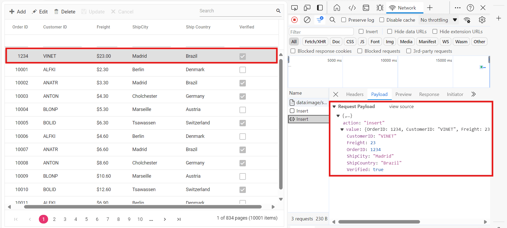
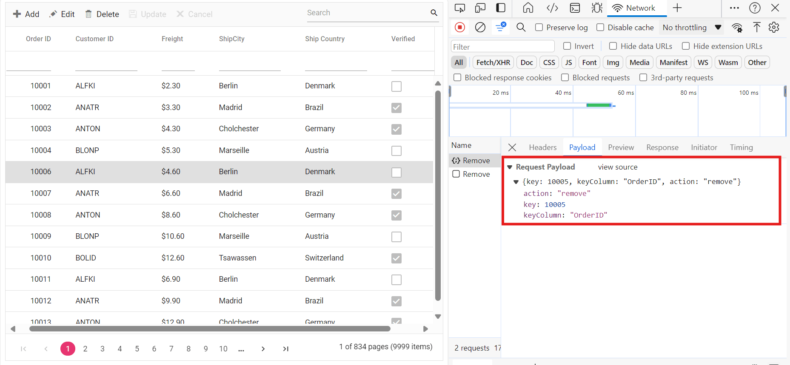

# Binding and perform CRUD operation using RemoteSaveAdaptor

The RemoteSaveAdaptor in Syncfusion<sup style="font-size:70%">&reg;</sup> Vue Grid Component allows you to perform grid actions such as sorting, filtering, searching and paging primarily on the client-side while handling CRUD operations, such as updating, inserting, and removing data, on the server-side for data persistence. This approach optimizes your experience by minimizing unnecessary server interactions.

Ensure your server-side implementation in ASP.NET Core handles CRUD operations. Here is an example of how you can set up your ASP.NET Core controller to handle these operations:

**Server-Side Implementation**

To configure a server with Syncfusion<sup style="font-size:70%">&reg;</sup> Vue Grid, you need to follow the below steps:

**1. Project Creation:**

Open Visual Studio and create an Vue and ASP.NET Core project named **RemoteSaveAdaptor**. To create an Vue and ASP.NET Core application, follow the documentation [link](https://learn.microsoft.com/en-us/visualstudio/javascript/tutorial-asp-net-core-with-vue?view=vs-2022) for detailed steps.

**2. Model Class Creation:**

Create a model class named **OrdersDetails.cs** in the server-side **Models** folder to represent the order data.

```cs
using System.ComponentModel.DataAnnotations;

namespace RemoteSaveAdaptor.Server.Models
{
  public class OrdersDetails
  {
    public static List<OrdersDetails> order = new List<OrdersDetails>();
    public OrdersDetails()
    {

    }
    public OrdersDetails(int OrderID, string CustomerId, int EmployeeId, double Freight, bool Verified, DateTime OrderDate, string ShipCity, string ShipName, string ShipCountry, DateTime ShippedDate, string ShipAddress)
    {
      this.OrderID = OrderID;
      this.CustomerID = CustomerId;
      this.EmployeeID = EmployeeId;
      this.Freight = Freight;
      this.ShipCity = ShipCity;
      this.Verified = Verified;
      this.OrderDate = OrderDate;
      this.ShipName = ShipName;
      this.ShipCountry = ShipCountry;
      this.ShippedDate = ShippedDate;
      this.ShipAddress = ShipAddress;
    }

    public static List<OrdersDetails> GetAllRecords()
    {
      if (order.Count() == 0)
      {
        int code = 10000;
        for (int i = 1; i <= 2000; i++)
        {
          order.Add(new OrdersDetails(code + 1, "ALFKI", i + 0, 2.3 * i, false, new DateTime(1991, 05, 15), "Berlin", "Simons bistro", "Denmark", new DateTime(1996, 7, 16), "Kirchgasse 6"));
          order.Add(new OrdersDetails(code + 2, "ANATR", i + 2, 3.3 * i, true, new DateTime(1990, 04, 04), "Madrid", "Queen Cozinha", "Brazil", new DateTime(1996, 9, 11), "Avda. Azteca 123"));
          order.Add(new OrdersDetails(code + 3, "ANTON", i + 1, 4.3 * i, true, new DateTime(1957, 11, 30), "Cholchester", "Frankenversand", "Germany", new DateTime(1996, 10, 7), "Carrera 52 con Ave. Bolívar #65-98 Llano Largo"));
          order.Add(new OrdersDetails(code + 4, "BLONP", i + 3, 5.3 * i, false, new DateTime(1930, 10, 22), "Marseille", "Ernst Handel", "Austria", new DateTime(1996, 12, 30), "Magazinweg 7"));
          order.Add(new OrdersDetails(code + 5, "BOLID", i + 4, 6.3 * i, true, new DateTime(1953, 02, 18), "Tsawassen", "Hanari Carnes", "Switzerland", new DateTime(1997, 12, 3), "1029 - 12th Ave. S."));
          code += 5;
        }
      }
      return order;
    }
    [Key]
    public int? OrderID { get; set; }
    public string CustomerID { get; set; }
    public int? EmployeeID { get; set; }
    public double? Freight { get; set; }
    public string ShipCity { get; set; }
    public bool Verified { get; set; }
    public DateTime OrderDate { get; set; }
    public string ShipName { get; set; }
    public string ShipCountry { get; set; }
    public DateTime ShippedDate { get; set; }
    public string ShipAddress { get; set; }
  }
}

```

**3. API Controller Creation:**

Create a file named `OrdersController.cs` under the **Controllers** folder. This controller will handle data communication with the Vue Grid component.

```cs
using Microsoft.AspNetCore.Mvc;
using RemoteSaveAdaptor.Server.Models;

namespace RemoteSaveAdaptor.Server.Controllers
{
  [ApiController]
  public class OrdersController : Controller
  {
    [HttpPost]
    [Route("api/[controller]")]
    public object Post()
    {
      // Retrieve data from the data source (e.g., database)
      IQueryable<OrdersDetails> DataSource = GetOrderData().AsQueryable();

      // Get the total records count
      int totalRecordsCount = DataSource.Count();

      // Return data based on the request
      return new { result = DataSource, count = totalRecordsCount };
    }

    [HttpGet]
    [Route("api/[controller]")]
    public List<OrdersDetails> GetOrderData()
    {
      var data = OrdersDetails.GetAllRecords().ToList();
      return data;
    }
  }
}
```

The below class is used to structure data sent during CRUD operations.

```cs
  public class CRUDModel<T> where T : class
  {
    public string? action { get; set; }
    public string? keyColumn { get; set; }
    public object? key { get; set; }
    public T? value { get; set; }
    public List<T>? added { get; set; }
    public List<T>? changed { get; set; }
    public List<T>? deleted { get; set; }
    public IDictionary<string, object>? @params { get; set; }
  }
```

**Insert operation:**

To insert a new record, utilize the [insertUrl](https://help.syncfusion.com/cr/aspnetmvc-js2/Syncfusion.EJ2.DataManager.html#Syncfusion_EJ2_DataManager_InsertUrl) property to specify the controller action mapping URL for the insert operation. Implement the `Insert` method in the API controller to handle the insertion of new records.The newly added record details are bound to the **newRecord** parameter.



```cs
  /// <summary>
  /// Inserts a new data item into the data collection.
  /// </summary>
  /// <param name="addRecord">The order to be inserted.</param>
  /// <returns>It returns the newly inserted record detail.</returns>
  [HttpPost]
  [Route("api/Orders/Insert")]
  public ActionResult Insert([FromBody] CRUDModel<OrdersDetails> newRecord)
  {
      if (newRecord.value !=null)
      {
          OrdersDetails.GetAllRecords().Insert(0, newRecord.value);
      }
      
      return Json(newRecord.value);
  }
```

**Update operation:**

For updating existing records, use the [updateUrl](https://help.syncfusion.com/cr/aspnetmvc-js2/Syncfusion.EJ2.DataManager.html#Syncfusion_EJ2_DataManager_UpdateUrl) property to specify the controller action mapping URL for the update operation. Implement the Update method in the API controller to handle record updates. The updated record details are bound to the **updatedRecord** parameter.


```cs
  /// <summary>
  /// Updates an existing order.
  /// </summary>
  /// <param name="updateRecord">The updated order details.</param>
  /// <returns>It returns the updated order details.</returns>
  [HttpPost]
  [Route("api/Orders/Update")]
  public object Update([FromBody] CRUDModel<OrdersDetails> updatedRecord)
  {
    var updatedOrder = updatedRecord.value;
    if (updatedOrder != null)
    {
      var data = OrdersDetails.GetAllRecords().FirstOrDefault(or => or.OrderID == updatedOrder.OrderID);
      if (data != null)
      {
        // Update the existing record
        data.OrderID = updatedOrder.OrderID;
        data.CustomerID = updatedOrder.CustomerID;
        data.Freight = updatedOrder.Freight;
        data.ShipCity = updatedOrder.ShipCity;
        data.ShipCountry = updatedOrder.ShipCountry;
        data.Verified = updatedOrder.Verified;
        // Update other properties similarly
      }
    }
    return updatedRecord;
  }
```

**Delete operation**

To delete existing records, use the [removeUrl](https://help.syncfusion.com/cr/aspnetmvc-js2/Syncfusion.EJ2.DataManager.html#Syncfusion_EJ2_DataManager_RemoveUrl) property to specify the controller action mapping URL for the delete operation. The primary key value of the deleted record is bound to the **deletedRecord** parameter.



```cs
  /// <summary>
  /// Deletes an order.
  /// </summary>
  /// <param name="deletedRecord">It contains the specific record detail which is need to be removed.</param>
  /// <returns>It returns the deleted record detail</returns>
  [HttpPost]
  [Route("api/Orders/Remove")]
  public object Remove([FromBody] CRUDModel<OrdersDetails> deletedRecord)
  {
      int orderId = int.Parse(deletedRecord.key.ToString()); // get key value from the deletedRecord
      var data = OrdersDetails.GetAllRecords().FirstOrDefault(orderData => orderData.OrderID == orderId);
      if (data != null)
      {
          // Remove the record from the data collection
          OrdersDetails.GetAllRecords().Remove(data);
      }
      return deletedRecord;
  }
```

**4. Run the Application:**

Run the application in Visual Studio. It will be accessible on a URL like **https://localhost:xxxx**. 

After running the application, you can verify that the server-side API controller is successfully returning the order data in the URL(https://localhost:xxxx/api/Orders). Here **xxxx** denotes the port number.

**Connecting syncfusion<sup style="font-size:70%">&reg;</sup> vue grid to an api service**

To integrate the <sup style="font-size:70%">&reg;</sup> Grid component into your Vue and ASP.NET Core project using Visual Studio, follow the steps below:

**Step 1:** Install Syncfusion<sup style="font-size:70%">&reg;</sup> Package

Open your terminal in the project’s client folder and install the required Syncfusion<sup style="font-size:70%">&reg;</sup> packages using npm:

```bash
npm install @syncfusion/ej2-vue-grids --save
npm install @syncfusion/ej2-data --save
```

**Step 2:** Clean Up App.vue and main.css

Remove unnecessary default codes in `App.vue` and `main.css`.

**Step 3:** Adding CSS Reference

Include the necessary CSS files in your `App.Vue` file to style the Syncfusion<sup style="font-size:70%">&reg;</sup> Vue component:

```css
@import '../node_modules/@syncfusion/ej2-base/styles/material3.css';
@import '../node_modules/@syncfusion/ej2-buttons/styles/material3.css';
@import '../node_modules/@syncfusion/ej2-calendars/styles/material3.css';
@import '../node_modules/@syncfusion/ej2-dropdowns/styles/material3.css';
@import '../node_modules/@syncfusion/ej2-inputs/styles/material3.css';
@import '../node_modules/@syncfusion/ej2-navigations/styles/material3.css';
@import '../node_modules/@syncfusion/ej2-popups/styles/material3.css';
@import '../node_modules/@syncfusion/ej2-splitbuttons/styles/material3.css';
@import '../node_modules/@syncfusion/ej2-vue-grids/styles/material3.css';
```

**Step 4:** Adding Syncfusion<sup style="font-size:70%">&reg;</sup> Vue Grid Component

In your `App.vue`, import `DataManager` and `RemoteSaveAdaptor` from` @syncfusion/ej2-data`. Create a `DataManager` instance by following these steps:

  * **Assign RemoteSaveAdaptor:** Set the `adaptor` property within the  [dataSource](https://ej2.syncfusion.com/vue/documentation/api/grid/#datasource) configuration to new RemoteSaveAdaptor(). This enables server-side CRUD operations for your grid.

  * **Set DataSource Property:** Configure the `dataSource` property of your Syncfusion<sup style="font-size:70%">&reg;</sup> Vue Grid with a JSON object.

  * **CRUD Operations Mapping:** CRUD operations within the grid can be mapped to server-side controller actions using specific properties:
      * **insertUrl**: Specifies the URL for inserting new data.
      * **removeUrl**: Specifies the URL for removing existing data.
      * **updateUrl**: Specifies the URL for updating existing data.
      * **crudUrl**: Specifies a single URL for all CRUD operations.
      * **batchUrl**: Specifies the URL for batch editing.

In this example, data is fetched by the server and assign it to the `dataSource` property.


<template>
	<div id="app">
		<ejs-grid :dataSource='data' :toolbar="toolbar" :editSettings="editSettings" :allowFiltering="true" allowSorting="true" allowPaging="true">
			<e-columns>
				<e-column field='OrderID' headerText='Order ID' width='120' textAlign='Right' isPrimaryKey="true"></e-column>
				<e-column field='CustomerID' headerText='Customer ID' width='160'></e-column>
				<e-column field='ShipCity' headerText='Ship City' width='150'></e-column>
				<e-column field='ShipCountry' headerText='Ship Country' width='150'></e-column>
			</e-columns>
		</ejs-grid>
	</div>
</template>

<script setup>
	import { provide, onMounted, ref, computed } from "vue";
	import { GridComponent as EjsGrid, ColumnDirective as EColumn, ColumnsDirective as EColumns, Page, Edit, Sort, Filter, Toolbar } from "@syncfusion/ej2-vue-grids";
	import { DataManager, RemoteSaveAdaptor } from "@syncfusion/ej2-data";

	var data = ref(null);

	const editSettings = { allowEditing: true, allowAdding: true, allowDeleting: true };
	const toolbar = ['Add', 'Edit', 'Update', 'Delete', 'Search'];

	const fetchData = () => {
		fetch("https://localhost:xxxx/api/orders") // Replace with your API endpoint
			.then(response => response.json())
			.then(value => {
				data.value = new DataManager({
					json: value,
					insertUrl: 'https://localhost:xxxx/api/Orders/Insert',
					updateUrl: 'https://localhost:xxxx/api/Orders/Update',
					removeUrl: 'https://localhost:xxxx/api/Orders/Remove',
					adaptor: new RemoteSaveAdaptor(),
				});
			})
			.catch(error => {
				console.error(error);
			});
	}

	onMounted(fetchData);

	provide('grid', [Sort, Edit, Filter, Page, Toolbar]);

</script>

<style>
	@import "../node_modules/@syncfusion/ej2-base/styles/material3.css";
	@import "../node_modules/@syncfusion/ej2-buttons/styles/material3.css";
	@import "../node_modules/@syncfusion/ej2-calendars/styles/material3.css";
	@import "../node_modules/@syncfusion/ej2-dropdowns/styles/material3.css";
	@import "../node_modules/@syncfusion/ej2-inputs/styles/material3.css";
	@import "../node_modules/@syncfusion/ej2-navigations/styles/material3.css";
	@import "../node_modules/@syncfusion/ej2-popups/styles/material3.css";
	@import "../node_modules/@syncfusion/ej2-splitbuttons/styles/material3.css";
	@import "../node_modules/@syncfusion/ej2-vue-grids/styles/material3.css";
</style>



<template>
    <ejs-grid :dataSource='data' :toolbar="toolbar" :editSettings="editSettings" :allowFiltering="true" allowSorting="true" allowPaging="true">
        <e-columns>
            <e-column field='OrderID' headerText='Order ID' width='120' textAlign='Right' isPrimaryKey="true"></e-column>
            <e-column field='CustomerID' headerText='Customer ID' width='160'></e-column>
            <e-column field='ShipCity' headerText='Ship City' width='150'></e-column>
            <e-column field='ShipCountry' headerText='Ship Country' width='150'></e-column>
        </e-columns>
    </ejs-grid>
</template>

<script>
    import { GridComponent, ColumnsDirective, ColumnDirective, Toolbar, Edit, Sort, Page, Filter } from '@syncfusion/ej2-vue-grids';
    import { DataManager, RemoteSaveAdaptor } from '@syncfusion/ej2-data';
    export default {
        name: "App",
        components: {
            'ejs-grid': GridComponent,
            'e-columns': ColumnsDirective,
            'e-column': ColumnDirective
        },
        data() {
            return {
                data: [],
                toolbar: ['Add', 'Edit', 'Update', 'Delete', 'Cancel', 'Search'],
                editSettings: { allowAdding: true, allowDeleting: true, allowEditing: true },
                allowPaging: true,
                allowFiltering: true,
                allowSorting: true
            };
        },
        methods: {
            fetchData() {
                fetch("https://localhost:xxxx/api/orders") // Replace with your API endpoint
                    .then(response => response.json())
                    .then(value => {
                        this.data = new DataManager({
                            json: value,
                            insertUrl: 'https://localhost:xxxx/api/Orders/Insert',
                            updateUrl: 'https://localhost:xxxx/api/Orders/Update',
                            removeUrl: 'https://localhost:xxxx/api/Orders/Remove',
                            adaptor: new RemoteSaveAdaptor(),
                        }),
                    })
                    .catch(error => {
                        console.error(error);
                    });
            }
        },
        mounted() {
            this.fetchData(); // Call fetchData when the component is mounted
        },
        provide: {
            grid: [Toolbar, Edit, Sort, Page, Filter]
        }
    };
</script>

<style>
    @import "../node_modules/@syncfusion/ej2-base/styles/material3.css";
    @import "../node_modules/@syncfusion/ej2-buttons/styles/material3.css";
    @import "../node_modules/@syncfusion/ej2-calendars/styles/material3.css";
    @import "../node_modules/@syncfusion/ej2-dropdowns/styles/material3.css";
    @import "../node_modules/@syncfusion/ej2-inputs/styles/material3.css";
    @import "../node_modules/@syncfusion/ej2-navigations/styles/material3.css";
    @import "../node_modules/@syncfusion/ej2-popups/styles/material3.css";
    @import "../node_modules/@syncfusion/ej2-splitbuttons/styles/material3.css";
    @import "../node_modules/@syncfusion/ej2-vue-grids/styles/material3.css";
</style>




> Replace https://localhost:xxxx/api/orders with the actual **URL** of your API endpoint that provides the data in a consumable format (e.g., JSON).

Run the application in Visual Studio. It will be accessible on a URL like **https://localhost:xxxx**.

> Ensure your API service is configured to handle CORS (Cross-Origin Resource Sharing) if necessary.
  ```cs
  [program.cs]
  builder.Services.AddCors(options =>
  {
    options.AddDefaultPolicy(builder =>
    {
      builder.AllowAnyOrigin().AllowAnyMethod().AllowAnyHeader();
    });
  });
  var app = builder.Build();
  app.UseCors();
  ```

> You can find the complete sample for the RemoteSaveAdaptor in [GitHub](https://github.com/SyncfusionExamples/Binding-data-from-remote-service-to-vue-data-grid) repository.