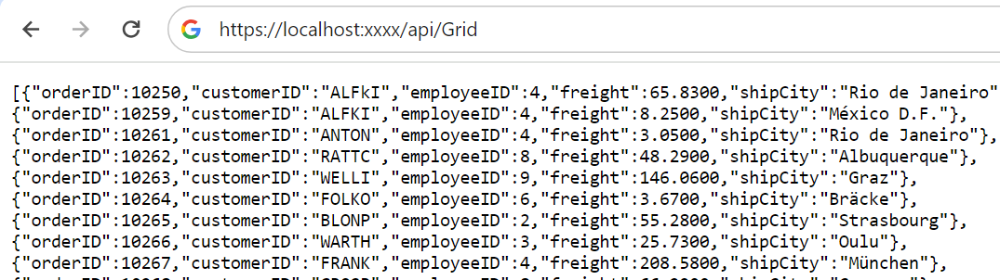
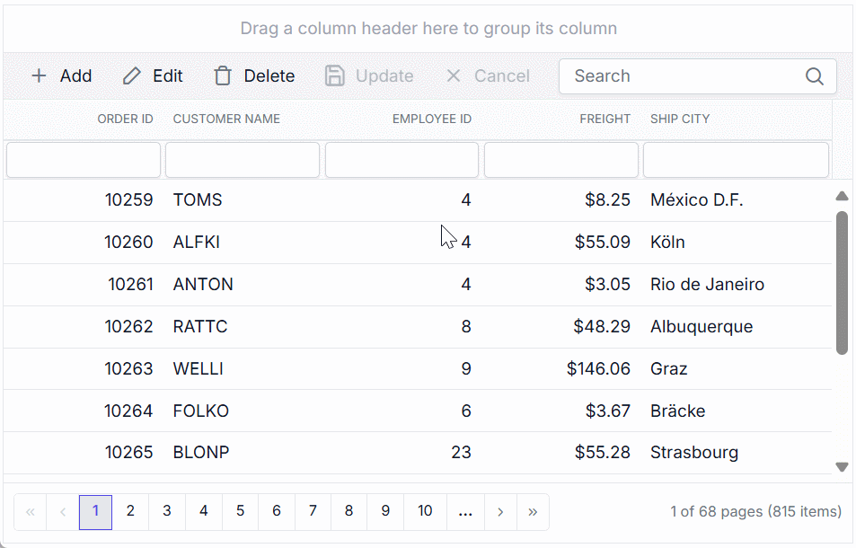

# Connecting SQL Server data to Syncfusion Vue Grid using Entity Framework

This section describes how to connect and retrieve data from a Microsoft SQL Server database using [Entity Framework](https://learn.microsoft.com/en-us/ef/core/) and bind it to the Syncfusion Vue Grid.

Microsoft SQL Server database can be bound to the Grid using **Entity Framework** in different ways (i.e.) using [dataSource](https://ej2.syncfusion.com/vue/documentation/api/grid/#datasource) property, custom adaptor and remote data binding using various adaptors. In this documentation, two approaches will be examined to connect a Microsoft SQL Server database to a Grid using **Entity Framework**. Both the approaches have capability to handle data and CRUD operations with built-in methods as well as can be customized as per your own.

**Entity Framework**

Entity Framework is an open-source [ORM framework](https://en.wikipedia.org/wiki/Object-relational_mapping) for .NET applications supported by Microsoft. It enables developers to work with data using objects of domain specific classes without focusing on the underlying database tables and columns where this data is stored. With the Entity Framework, developers can work at a higher level of abstraction when they deal with data, and can create and maintain data-oriented applications with less code compared with traditional applications.

**1. Using UrlAdaptor**

The [UrlAdaptor](https://ej2.syncfusion.com/vue/documentation/grid/connecting-to-adaptors/url-adaptor) serves as the base adaptor for facilitating communication between remote data services and an UI component. It enables the remote binding of data to the Syncfusion Vue Grid by connecting to an existing pre-configured API service linked to the Microsoft SQL Server databaset5uf5. While the Grid supports various adaptors to fulfill this requirement, including [Web API](https://ej2.syncfusion.com/vue/documentation/grid/connecting-to-adaptors/web-api-adaptor), [ODataV4](https://ej2.syncfusion.com/vue/documentation/grid/connecting-to-adaptors/odatav4-adaptor), [UrlAdaptor](https://ej2.syncfusion.com/vue/documentation/grid/connecting-to-adaptors/url-adaptor), and [GraphQL](https://ej2.syncfusion.com/vue/documentation/grid/connecting-to-adaptors/graphql-adaptor), the `UrlAdaptor` is particularly useful for the scenarios where a custom API service with unique logic for handling data and CRUD operations is in place. This approach allows for custom handling of data and CRUD operations, and the resultant data returned in the `result` and `count` format for display in the Grid.

**2. Using CustomAdaptor**

The `CustomAdaptor` serves as a mediator between the UI component and the database for data binding. While the data source from the database can be directly bound to the Grid locally using the `dataSource` property, the `CustomAdaptor` approach is preferred as it allows for customization of both data operations and CRUD operations according to specific requirements. In this approach, for every action in the Grid, a corresponding request with action details is sent to the `CustomAdaptor`. The Grid provides predefined methods to perform data operations such as **searching**, **filtering**, **sorting**, **aggregation**, **paging** and **grouping**. Alternatively, your own custom methods can be employed to execute operations and return the data in the `result` and `count` format for displaying in the Grid. Additionally, for CRUD operations, predefined methods can be overridden to provide custom functionality. Further details on this can be found in the latter part of the documentation.

## Binding data using Entity Framework from Microsoft SQL Server via an API service.

This section describes step by step process how to use Entity Framework to retrieve data from a Microsoft SQL Server using an API service and bind it to the Syncfusion Vue Grid.

### Creating an API service

**1.** Open Visual Studio and create an Vue and ASP.NET Core project named **Grid_EntityFramework**. To create an Vue and ASP.NET Core application, follow the documentation [link](https://learn.microsoft.com/en-us/visualstudio/javascript/tutorial-asp-net-core-with-vue?view=vs-2022) for detailed steps.

**2.** To use Entity Framework and access the Microsoft SQL Server database in our Vue application, need to install the [Microsoft.EntityFrameworkCore.SqlServer](https://www.nuget.org/packages/Microsoft.EntityFrameworkCore.SqlServer/) and [Microsoft.EntityFrameworkCore](https://www.nuget.org/packages/Microsoft.EntityFrameworkCore) NuGet packages. To add **Microsoft.EntityFrameworkCore** and **Microsoft.EntityFrameworkCore.SqlServer** in the app, open the NuGet package manager in Visual Studio (Tools → NuGet Package Manager → Manage NuGet Packages for Solution), search and install it.

**3.** Create an API controller (aka, GridController.cs) file under **Controllers** folder that helps to establish data communication with the Syncfusion Vue Grid.

**4.** In the API controller (aka, GridController), a connection is established to Microsoft SQL Server within the **GetOrderData()** method using **OrderDbContext**. This class extends **DbContext** and is configured to connect to a Microsoft SQL Server database using the provided connection string. It includes a **DbSet<Orders>** property, enabling interaction with the **Orders** table in the database. The method retrieves all orders from the database asynchronously and returns them as a list of `Orders` objects as shown in the following code snippet.




using Microsoft.AspNetCore.Mvc;
using System.Collections.Generic;
using System.ComponentModel.DataAnnotations;
using System.Data;
using Syncfusion.EJ2.Base;
using Microsoft.EntityFrameworkCore;
using Microsoft.EntityFrameworkCore.Metadata.Internal;

namespace Grid_EntityFramework.Server.Controllers
{
  [ApiController]
  public class GridController : ControllerBase
  {
    string ConnectionString = @"<Enter a valid connection string>";

    /// <summary>
    /// Processes the DataManager request to perform searching, filtering, sorting, and paging operations.
    /// </summary>
    /// <param name="DataManagerRequest">Contains the details of the data operation requested.</param>
    /// <returns>Returns a JSON object with the filtered, sorted, and paginated data along with the total record count.</returns>
    [HttpPost]
    [Route("api/[controller]")]
    public object Post([FromBody] DataManagerRequest DataManagerRequest)
    {
      // Retrieve data from the data source (e.g., database).
      IQueryable<Orders> DataSource = GetOrderData().AsQueryable();

      // Get the total count of records.
      int totalRecordsCount = DataSource.Count();

      // Return data based on the request.
      return new { result = DataSource, count = totalRecordsCount };
    }

    /// <summary>
    /// Retrieves the order data from the database.
    /// </summary>
    /// <returns>Returns a list of orders fetched from the database.</returns>
    [HttpGet]
    [Route("api/[controller]")]
    public List<Orders> GetOrderData()
    {
      using (OrderDbContext Context = new OrderDbContext(ConnectionString))
      {
        // Retrieve orders from the orders DbSet and convert to list asynchronously.
        List<Orders> orders = Context.Orders.ToList();
        return orders;
      }
    }

    // Create a class that inherits from DbContext(Entity Framework Core).
    public class OrderDbContext : DbContext
    {
      // Declare a private variable to store the connection string.
      private readonly string _ConnectionString;

      // Define a constructor that accepts a connection string.
      public OrderDbContext(string ConnectionString)
      {
        // Store the provided connection string.
        _ConnectionString = ConnectionString;
      }

      // Override the onConfiguring method to tell EF Core to use SQL server.
      protected override void OnConfiguring(DbContextOptionsBuilder optionsBuilder)
      {
        // Use the connection string to configure the database connection.
        optionsBuilder.UseSqlServer(_ConnectionString);
      }
      
      // Define a DbSet to represent the orders table in the database.
      public DbSet<Orders> Orders { get; set; }
    }
        
    public class Orders
    {
      [Key]
      public int? OrderID { get; set; }
      public string? CustomerID { get; set; }
      public int? EmployeeID { get; set; }
      public decimal Freight { get; set; }
      public string? ShipCity { get; set; }
    }
  }
}




**5.** Run the application and it will be hosted within the URL `https://localhost:xxxx`.

**6.** Finally, the retrieved data from Microsoft SQL Server database using Entity Framework which is in the form of list can be found in an API controller available in the URL link `https://localhost:xxxx/api/Grid`, as shown in the browser page below.



### Connecting Syncfusion Vue Grid to an API service

To integrate the Syncfusion Vue Grid into your Vue and ASP.NET Core project using Visual Studio, follow the below steps:

**Step 1: Install Syncfusion Package**

Open your terminal in the project client folder and install the required Syncfusion packages using npm:

```bash
npm install @syncfusion/ej2-vue-grids --save
npm install @syncfusion/ej2-data --save
```

**Step 2: Clean Up App.vue and main.css**

Remove unnecessary default codes in `App.vue` and `main.css`.

**Step 3: Adding CSS reference**

Include the necessary CSS files in your `App.Vue` file to style the Syncfusion Vue Grid:

```css
@import '../node_modules/@syncfusion/ej2-base/styles/tailwind.css';
@import '../node_modules/@syncfusion/ej2-buttons/styles/tailwind.css';
@import '../node_modules/@syncfusion/ej2-calendars/styles/tailwind.css';
@import '../node_modules/@syncfusion/ej2-dropdowns/styles/tailwind.css';
@import '../node_modules/@syncfusion/ej2-inputs/styles/tailwind.css';
@import '../node_modules/@syncfusion/ej2-navigations/styles/tailwind.css';
@import '../node_modules/@syncfusion/ej2-popups/styles/tailwind.css';
@import '../node_modules/@syncfusion/ej2-splitbuttons/styles/tailwind.css';
@import '../node_modules/@syncfusion/ej2-vue-grids/styles/tailwind.css';
```

**Step 4: Adding Syncfusion Vue Grid**

To add the Grid using **Composition API** or **Options API**, follow these steps:

**1.** In your component file (e.g., **App.vue**), import [DataManager](https://ej2.syncfusion.com/vue/documentation/data/vue-3-getting-started) and `UrlAdaptor` from `@syncfusion/ej2-data`. Create a `DataManager` instance specifying the URL of your API endpoint(https:localhost:xxxx/api/Grid) using the `url` property and set the adaptor `UrlAdaptor`.

**2.** The `DataManager` offers multiple adaptor options to connect with remote database based on an API service. Below is an example of the `UrlAdaptor` configuration where an API service are set up to return the resulting data in the `result` and `count` format.

**3.** The `UrlAdaptor` acts as the base adaptor for interacting with remote data service. Most of the built-in adaptors are derived from the `UrlAdaptor`.




<template>
  <div id="app">
    <ejs-grid :dataSource='data' height="348">
      <e-columns>
        <e-column field='OrderID' headerText='Order ID' width='100' textAlign='Right'></e-column>
        <e-column field='CustomerID' headerText='Customer Name' width='100'></e-column>
        <e-column field='EmployeeID' headerText='Employee ID' textAlign='Right' width='100'></e-column>
        <e-column field='Freight' headerText='Freight' format='C2' textAlign='Right' width='100'></e-column>
        <e-column field='ShipCity' headerText='Ship City' width='120'></e-column>
      </e-columns>
    </ejs-grid>
  </div> 
</template>
<script setup>
  import { provide } from "vue";
  import { GridComponent as EjsGrid, ColumnDirective as EColumn, ColumnsDirective as EColumns } from "@syncfusion/ej2-vue-grids";
  import { DataManager, UrlAdaptor } from "@syncfusion/ej2-data";
  const data = new DataManager({
    url: 'https://localhost:xxxx/api/Grid', // Replace your hosted link.
    adaptor: new UrlAdaptor(),
  });
</script>
<style>
	@import "../node_modules/@syncfusion/ej2-base/styles/tailwind.css";
	@import "../node_modules/@syncfusion/ej2-buttons/styles/tailwind.css";
	@import "../node_modules/@syncfusion/ej2-calendars/styles/tailwind.css";
	@import "../node_modules/@syncfusion/ej2-dropdowns/styles/tailwind.css";
	@import "../node_modules/@syncfusion/ej2-inputs/styles/tailwind.css";
	@import "../node_modules/@syncfusion/ej2-navigations/styles/tailwind.css";
	@import "../node_modules/@syncfusion/ej2-popups/styles/tailwind.css";
	@import "../node_modules/@syncfusion/ej2-splitbuttons/styles/tailwind.css";
	@import "../node_modules/@syncfusion/ej2-vue-grids/styles/tailwind.css";
</style>





<template>
  <div id="app">
    <ejs-grid :dataSource='data' height="348">
      <e-columns>
        <e-column field='OrderID' headerText='Order ID' width='100' textAlign='Right'></e-column>
        <e-column field='CustomerID' headerText='Customer Name' width='100'></e-column>
        <e-column field='EmployeeID' headerText='Employee ID' textAlign='Right' width='100'></e-column>
        <e-column field='Freight' headerText='Freight' format='C2' textAlign='Right' width='100'></e-column>
        <e-column field='ShipCity' headerText='Ship City' width='120'></e-column>
      </e-columns>
    </ejs-grid>
  </div> 
</template>
<script>
  import { GridComponent, ColumnsDirective, ColumnDirective } from '@syncfusion/ej2-vue-grids';
  import { DataManager, UrlAdaptor } from '@syncfusion/ej2-data';
  export default {
    name: "App",
    components: {
      'ejs-grid': GridComponent,
      'e-columns': ColumnsDirective,
      'e-column': ColumnDirective
    },
    data() {
      return {
        data: new DataManager({
          url: 'https://localhost:xxxx/api/Grid', // Replace your hosted link.
          adaptor: new UrlAdaptor(),
        }),
      };
    },
  };
</script>
<style>
	@import "../node_modules/@syncfusion/ej2-base/styles/tailwind.css";
	@import "../node_modules/@syncfusion/ej2-buttons/styles/tailwind.css";
	@import "../node_modules/@syncfusion/ej2-calendars/styles/tailwind.css";
	@import "../node_modules/@syncfusion/ej2-dropdowns/styles/tailwind.css";
	@import "../node_modules/@syncfusion/ej2-inputs/styles/tailwind.css";
	@import "../node_modules/@syncfusion/ej2-navigations/styles/tailwind.css";
	@import "../node_modules/@syncfusion/ej2-popups/styles/tailwind.css";
	@import "../node_modules/@syncfusion/ej2-splitbuttons/styles/tailwind.css";
	@import "../node_modules/@syncfusion/ej2-vue-grids/styles/tailwind.css";
</style>





using Microsoft.AspNetCore.Mvc;
using System.Collections.Generic;
using System.ComponentModel.DataAnnotations;
using System.Data;
using Syncfusion.EJ2.Base;
using Microsoft.EntityFrameworkCore;
using Microsoft.EntityFrameworkCore.Metadata.Internal;

namespace Grid_EntityFramework.Server.Controllers
{
  [ApiController]
  public class GridController : ControllerBase
  {
    string ConnectionString = @"<Enter a valid connection string>";

    /// <summary>
    /// Processes the DataManager request to perform searching, filtering, sorting, and paging operations.
    /// </summary>
    /// <param name="DataManagerRequest">Contains the details of the data operation requested.</param>
    /// <returns>Returns a JSON object with the filtered, sorted, and paginated data along with the total record count.</returns>
    [HttpPost]
    [Route("api/[controller]")]
    public object Post([FromBody] DataManagerRequest DataManagerRequest)
    {
      // Retrieve data from the data source (e.g., database).
      IQueryable<Orders> DataSource = GetOrderData().AsQueryable();

      // Get the total count of records.
      int totalRecordsCount = DataSource.Count();

      // Return data based on the request.
      return new { result = DataSource, count = totalRecordsCount };
    }

    /// <summary>
    /// Retrieves the order data from the database.
    /// </summary>
    /// <returns>Returns a list of orders fetched from the database.</returns>
    [HttpGet]
    [Route("api/[controller]")]
    public List<Orders> GetOrderData()
    {
      using (OrderDbContext Context = new OrderDbContext(ConnectionString))
      {
        // Retrieve orders from the orders DbSet and convert to list asynchronously.
        List<Orders> orders = Context.Orders.ToList();
        return orders;
      }
    }

    // Create a class that inherits from DbContext(Entity Framework Core).
    public class OrderDbContext : DbContext
    {
      // Declare a private variable to store the connection string.
      private readonly string _ConnectionString;

      // Define a constructor that accepts a connection string.
      public OrderDbContext(string ConnectionString)
      {
        // Store the provided connection string.
        _ConnectionString = ConnectionString;
      }

      // Override the onConfiguring method to tell EF Core to use SQL server.
      protected override void OnConfiguring(DbContextOptionsBuilder optionsBuilder)
      {
        // Use the connection string to configure the database connection.
        optionsBuilder.UseSqlServer(_ConnectionString);
      }
      
      // Define a DbSet to represent the orders table in the database.
      public DbSet<Orders> Orders { get; set; }
    }
        
    public class Orders
    {
      [Key]
      public int? OrderID { get; set; }
      public string? CustomerID { get; set; }
      public int? EmployeeID { get; set; }
      public decimal Freight { get; set; }
      public string? ShipCity { get; set; }
    }
  }
}




> Replace https://localhost:xxxx/api/Grid with the actual **URL** of your API endpoint that provides the data in a consumable format (e.g., JSON).

**4.** Run the application in Visual Studio. It will be accessible via a URL like **https://localhost:xxxx**.

> Ensure your API service is configured to handle CORS (Cross-Origin Resource Sharing), if necessary.
```cs
[program.cs]
builder.Services.AddCors(options =>
{
  options.AddDefaultPolicy(builder =>
  {
    builder.AllowAnyOrigin().AllowAnyMethod().AllowAnyHeader();
  });
});
var app = builder.Build();
app.UseCors();
```

> * The Syncfusion Vue Grid provides built-in support for handling various data operations such as searching, sorting, filtering, aggregate and paging on the server-side. These operations can be handled using methods such as `PerformSearching`, `PerformFiltering`, `PerformSorting`, `PerformTake` and `PerformSkip` available in the [Syncfusion.EJ2.AspNet.Core](https://www.nuget.org/packages/Syncfusion.EJ2.AspNet.Core/) package. Let’s explore how to manage these data operations using the `UrlAdaptor`.
> * In an API service project, add `Syncfusion.EJ2.AspNet.Core` by opening the NuGet package manager in Visual Studio (Tools → NuGet Package Manager → Manage NuGet Packages for Solution), search and install it.
> * To access `DataManagerRequest` and `QueryableOperation`, import `Syncfusion.EJ2.Base` in `GridController.cs` file.

### Handling searching operation

To handle searching operation, ensure that your API endpoint supports custom searching criteria. Implement the searching logic on the server-side using the `PerformSearching` method from the `QueryableOperation` class. This allows the custom data source to undergo searching based on the criteria specified in the incoming `DataManagerRequest` object.




/// <summary>
/// Processes the DataManager request to perform searching operation.
/// </summary>
/// <param name="DataManagerRequest">Contains the details of the data operation requested.</param>
/// <returns>Returns a JSON object with the searched data along with the total record count.</returns>
[HttpPost]
[Route("api/[controller]")]
public object Post([FromBody] DataManagerRequest DataManagerRequest) 
{
  // Retrieve data from the data source (e.g., database).
  IQueryable<Orders> DataSource = GetOrderData().AsQueryable();

  // Initialize QueryableOperation instance.
  QueryableOperation queryableOperation = new QueryableOperation(); 

  // Handling searching operation.
  if(DataManagerRequest.Search != null && DataManagerRequest.Search.Count > 0) 
  {
    DataSource = queryableOperation.PerformSearching(DataSource, DataManagerRequest.Search);
    // Add custom logic here if needed and remove above method.
  }

  // Get the total count of records.
  int totalRecordsCount = DataSource.Count();

  // Return data based on the request.
  return new { result = DataSource, count = totalRecordsCount };
}





<template>
  <div id="app">
    <ejs-grid :dataSource='data' :toolbar='toolbar' height="348">
      <e-columns>
        <e-column field='OrderID' headerText='Order ID' width='100' textAlign='Right'></e-column>
        <e-column field='CustomerID' headerText='Customer Name' width='100'></e-column>
        <e-column field='EmployeeID' headerText='Employee ID' textAlign='Right' width='100'></e-column>
        <e-column field='Freight' headerText='Freight' format='C2' textAlign='Right' width='100'></e-column>
        <e-column field='ShipCity' headerText='Ship City' width='120'></e-column>
      </e-columns>
    </ejs-grid>
  </div> 
</template>
<script setup>
  import { provide } from "vue";
  import { GridComponent as EjsGrid, ColumnDirective as EColumn, ColumnsDirective as EColumns, Toolbar } from "@syncfusion/ej2-vue-grids";
  import { DataManager, UrlAdaptor } from "@syncfusion/ej2-data";
  const data = new DataManager({
    url: 'https://localhost:xxxx/api/Grid',
    adaptor: new UrlAdaptor(),
  });
  const toolbar = ['Search'];
  provide('grid', [Toolbar]);
</script>
<style>
	@import "../node_modules/@syncfusion/ej2-base/styles/tailwind.css";
	@import "../node_modules/@syncfusion/ej2-buttons/styles/tailwind.css";
	@import "../node_modules/@syncfusion/ej2-calendars/styles/tailwind.css";
	@import "../node_modules/@syncfusion/ej2-dropdowns/styles/tailwind.css";
	@import "../node_modules/@syncfusion/ej2-inputs/styles/tailwind.css";
	@import "../node_modules/@syncfusion/ej2-navigations/styles/tailwind.css";
	@import "../node_modules/@syncfusion/ej2-popups/styles/tailwind.css";
	@import "../node_modules/@syncfusion/ej2-splitbuttons/styles/tailwind.css";
	@import "../node_modules/@syncfusion/ej2-vue-grids/styles/tailwind.css";
</style>





<template>
  <div id="app">
    <ejs-grid :dataSource='data' :toolbar='toolbar' height="348">
      <e-columns>
        <e-column field='OrderID' headerText='Order ID' width='100' textAlign='Right'></e-column>
        <e-column field='CustomerID' headerText='Customer Name' width='100'></e-column>
        <e-column field='EmployeeID' headerText='Employee ID' textAlign='Right' width='100'></e-column>
        <e-column field='Freight' headerText='Freight' format='C2' textAlign='Right' width='100'></e-column>
        <e-column field='ShipCity' headerText='Ship City' width='120'></e-column>
      </e-columns>
    </ejs-grid>
  </div> 
</template>
<script>
  import { GridComponent, ColumnsDirective, ColumnDirective, Toolbar } from '@syncfusion/ej2-vue-grids';
  import { DataManager, UrlAdaptor } from '@syncfusion/ej2-data';
  export default {
    name: "App",
    components: {
      'ejs-grid': GridComponent,
      'e-columns': ColumnsDirective,
      'e-column': ColumnDirective
    },
    data() {
      return {
        data: new DataManager({
          url: 'https://localhost:xxxx/api/Grid',
          adaptor: new UrlAdaptor(),
        }),
        toolbar: ['Search'],
      };
    },
    provide: {
      grid: [Toolbar]
    }
  };
</script>
<style>
	@import "../node_modules/@syncfusion/ej2-base/styles/tailwind.css";
	@import "../node_modules/@syncfusion/ej2-buttons/styles/tailwind.css";
	@import "../node_modules/@syncfusion/ej2-calendars/styles/tailwind.css";
	@import "../node_modules/@syncfusion/ej2-dropdowns/styles/tailwind.css";
	@import "../node_modules/@syncfusion/ej2-inputs/styles/tailwind.css";
	@import "../node_modules/@syncfusion/ej2-navigations/styles/tailwind.css";
	@import "../node_modules/@syncfusion/ej2-popups/styles/tailwind.css";
	@import "../node_modules/@syncfusion/ej2-splitbuttons/styles/tailwind.css";
	@import "../node_modules/@syncfusion/ej2-vue-grids/styles/tailwind.css";
</style>




### Handling filtering operation

To handle filtering operation, ensure that your API endpoint supports custom filtering criteria. Implement the filtering logic on the server-side using the `PerformFiltering` method from the `QueryableOperation` class. This allows the custom data source to undergo filtering based on the criteria specified in the incoming `DataManagerRequest` object.




/// <summary>
/// Processes the DataManager request to perform filtering operation.
/// </summary>
/// <param name="DataManagerRequest">Contains the details of the data operation requested.</param>
/// <returns>Returns a JSON object with the filtered data along with the total record count.</returns>
[HttpPost]
[Route("api/[controller]")]
public object Post([FromBody] DataManagerRequest DataManagerRequest) 
{
  // Retrieve data from the data source (e.g., database).
  IQueryable<Orders> DataSource = GetOrderData().AsQueryable();

  // Initialize QueryableOperation instance.
  QueryableOperation queryableOperation = new QueryableOperation(); 

  // Handling filtering operation.
  if (DataManagerRequest.Where != null && DataManagerRequest.Where.Count > 0) 
  {
    foreach (WhereFilter condition in DataManagerRequest.Where) 
    {
      foreach (WhereFilter predicate in condition.predicates) 
      {
        DataSource = queryableOperation.PerformFiltering(DataSource, DataManagerRequest.Where, predicate.Operator);
        // Add custom logic here if needed and remove above method.
      }
    }
  }

  // Get the total count of records.
  int totalRecordsCount = DataSource.Count();  

  // Return data based on the request.
  return new { result = DataSource, count = totalRecordsCount };
}





<template>
  <div id="app">
    <ejs-grid :dataSource='data' :allowFiltering='true' height="348">
      <e-columns>
        <e-column field='OrderID' headerText='Order ID' width='100' textAlign='Right'></e-column>
        <e-column field='CustomerID' headerText='Customer Name' width='100'></e-column>
        <e-column field='EmployeeID' headerText='Employee ID' textAlign='Right' width='100'></e-column>
        <e-column field='Freight' headerText='Freight' format='C2' textAlign='Right' width='100'></e-column>
        <e-column field='ShipCity' headerText='Ship City' width='120'></e-column>
      </e-columns>
    </ejs-grid>
  </div> 
</template>
<script setup>
  import { provide } from "vue";
  import { GridComponent as EjsGrid, ColumnDirective as EColumn, ColumnsDirective as EColumns, Filter } from "@syncfusion/ej2-vue-grids";
  import { DataManager, UrlAdaptor } from "@syncfusion/ej2-data";
  const data = new DataManager({
    url: 'https://localhost:xxxx/api/Grid',
    adaptor: new UrlAdaptor(),
  });
  provide('grid', [Filter]);
</script>
<style>
	@import "../node_modules/@syncfusion/ej2-base/styles/tailwind.css";
	@import "../node_modules/@syncfusion/ej2-buttons/styles/tailwind.css";
	@import "../node_modules/@syncfusion/ej2-calendars/styles/tailwind.css";
	@import "../node_modules/@syncfusion/ej2-dropdowns/styles/tailwind.css";
	@import "../node_modules/@syncfusion/ej2-inputs/styles/tailwind.css";
	@import "../node_modules/@syncfusion/ej2-navigations/styles/tailwind.css";
	@import "../node_modules/@syncfusion/ej2-popups/styles/tailwind.css";
	@import "../node_modules/@syncfusion/ej2-splitbuttons/styles/tailwind.css";
	@import "../node_modules/@syncfusion/ej2-vue-grids/styles/tailwind.css";
</style>





<template>
  <div id="app">
    <ejs-grid :dataSource='data' :allowFiltering='true' height="348">
      <e-columns>
        <e-column field='OrderID' headerText='Order ID' width='100' textAlign='Right'></e-column>
        <e-column field='CustomerID' headerText='Customer Name' width='100'></e-column>
        <e-column field='EmployeeID' headerText='Employee ID' textAlign='Right' width='100'></e-column>
        <e-column field='Freight' headerText='Freight' format='C2' textAlign='Right' width='100'></e-column>
        <e-column field='ShipCity' headerText='Ship City' width='120'></e-column>
      </e-columns>
    </ejs-grid>
  </div> 
</template>
<script>
  import { GridComponent, ColumnsDirective, ColumnDirective, Filter } from '@syncfusion/ej2-vue-grids';
  import { DataManager, UrlAdaptor } from '@syncfusion/ej2-data';
  export default {
    name: "App",
    components: {
      'ejs-grid': GridComponent,
      'e-columns': ColumnsDirective,
      'e-column': ColumnDirective
    },
    data() {
      return {
        data: new DataManager({
          url: 'https://localhost:xxxx/api/Grid',
          adaptor: new UrlAdaptor(),
        }),
      };
    },
    provide: {
      grid: [Filter]
    }
  };
</script>
<style>
	@import "../node_modules/@syncfusion/ej2-base/styles/tailwind.css";
	@import "../node_modules/@syncfusion/ej2-buttons/styles/tailwind.css";
	@import "../node_modules/@syncfusion/ej2-calendars/styles/tailwind.css";
	@import "../node_modules/@syncfusion/ej2-dropdowns/styles/tailwind.css";
	@import "../node_modules/@syncfusion/ej2-inputs/styles/tailwind.css";
	@import "../node_modules/@syncfusion/ej2-navigations/styles/tailwind.css";
	@import "../node_modules/@syncfusion/ej2-popups/styles/tailwind.css";
	@import "../node_modules/@syncfusion/ej2-splitbuttons/styles/tailwind.css";
	@import "../node_modules/@syncfusion/ej2-vue-grids/styles/tailwind.css";
</style>




### Handling sorting operation

To handle sorting operation, ensure that your API endpoint supports custom sorting criteria. Implement the sorting logic on the server-side using the `PerformSorting` method from the `QueryableOperation` class. This allows the custom data source to undergo sorting based on the criteria specified in the incoming `DataManagerRequest` object.




/// <summary>
/// Processes the DataManager request to perform sorting operation.
/// </summary>
/// <param name="DataManagerRequest">Contains the details of the data operation requested.</param>
/// <returns>Returns a JSON object with the sorted data along with the total record count.</returns>
[HttpPost]
[Route("api/[controller]")]
public object Post([FromBody] DataManagerRequest DataManagerRequest) 
{
  // Retrieve data from the data source (e.g., database).
  IQueryable<Orders> DataSource = GetOrderData().AsQueryable();

  // Initialize QueryableOperation instance. 
  QueryableOperation queryableOperation = new QueryableOperation(); 

  // Handling sorting operation.
  if(DataManagerRequest.Sorted != null && DataManagerRequest.Sorted.Count > 0) 
  {
    DataSource = queryableOperation.PerformSorting(DataSource, DataManagerRequest.Sorted);
    // Add custom logic here if needed and remove above method.
  }

  // Get the total count of records.
  int totalRecordsCount = DataSource.Count();

  // Return data based on the request.
  return new { result = DataSource, count = totalRecordsCount };
}





<template>
  <div id="app">
    <ejs-grid :dataSource='data' :allowSorting='true' height="348">
      <e-columns>
        <e-column field='OrderID' headerText='Order ID' width='100' textAlign='Right'></e-column>
        <e-column field='CustomerID' headerText='Customer Name' width='100'></e-column>
        <e-column field='EmployeeID' headerText='Employee ID' textAlign='Right' width='100'></e-column>
        <e-column field='Freight' headerText='Freight' format='C2' textAlign='Right' width='100'></e-column>
        <e-column field='ShipCity' headerText='Ship City' width='120'></e-column>
      </e-columns>
    </ejs-grid>
  </div> 
</template>
<script setup>
  import { provide } from "vue";
  import { GridComponent as EjsGrid, ColumnDirective as EColumn, ColumnsDirective as EColumns, Sort } from "@syncfusion/ej2-vue-grids";
  import { DataManager, UrlAdaptor } from "@syncfusion/ej2-data";
  const data = new DataManager({
    url: 'https://localhost:xxxx/api/Grid',
    adaptor: new UrlAdaptor(),
  });
  provide('grid', [Sort]);
</script>
<style>
	@import "../node_modules/@syncfusion/ej2-base/styles/tailwind.css";
	@import "../node_modules/@syncfusion/ej2-buttons/styles/tailwind.css";
	@import "../node_modules/@syncfusion/ej2-calendars/styles/tailwind.css";
	@import "../node_modules/@syncfusion/ej2-dropdowns/styles/tailwind.css";
	@import "../node_modules/@syncfusion/ej2-inputs/styles/tailwind.css";
	@import "../node_modules/@syncfusion/ej2-navigations/styles/tailwind.css";
	@import "../node_modules/@syncfusion/ej2-popups/styles/tailwind.css";
	@import "../node_modules/@syncfusion/ej2-splitbuttons/styles/tailwind.css";
	@import "../node_modules/@syncfusion/ej2-vue-grids/styles/tailwind.css";
</style>





<template>
  <div id="app">
    <ejs-grid :dataSource='data' :allowSorting='true' height="348">
      <e-columns>
        <e-column field='OrderID' headerText='Order ID' width='100' textAlign='Right'></e-column>
        <e-column field='CustomerID' headerText='Customer Name' width='100'></e-column>
        <e-column field='EmployeeID' headerText='Employee ID' textAlign='Right' width='100'></e-column>
        <e-column field='Freight' headerText='Freight' format='C2' textAlign='Right' width='100'></e-column>
        <e-column field='ShipCity' headerText='Ship City' width='120'></e-column>
      </e-columns>
    </ejs-grid>
  </div> 
</template>
<script>
  import { GridComponent, ColumnsDirective, ColumnDirective, Sort } from '@syncfusion/ej2-vue-grids';
  import { DataManager, UrlAdaptor } from '@syncfusion/ej2-data';
  export default {
    name: "App",
    components: {
      'ejs-grid': GridComponent,
      'e-columns': ColumnsDirective,
      'e-column': ColumnDirective
    },
    data() {
      return {
        data: new DataManager({
          url: 'https://localhost:xxxx/api/Grid',
          adaptor: new UrlAdaptor(),
        }),
      };
    },
    provide: {
      grid: [Sort]
    }
  };
</script>
<style>
	@import "../node_modules/@syncfusion/ej2-base/styles/tailwind.css";
	@import "../node_modules/@syncfusion/ej2-buttons/styles/tailwind.css";
	@import "../node_modules/@syncfusion/ej2-calendars/styles/tailwind.css";
	@import "../node_modules/@syncfusion/ej2-dropdowns/styles/tailwind.css";
	@import "../node_modules/@syncfusion/ej2-inputs/styles/tailwind.css";
	@import "../node_modules/@syncfusion/ej2-navigations/styles/tailwind.css";
	@import "../node_modules/@syncfusion/ej2-popups/styles/tailwind.css";
	@import "../node_modules/@syncfusion/ej2-splitbuttons/styles/tailwind.css";
	@import "../node_modules/@syncfusion/ej2-vue-grids/styles/tailwind.css";
</style>




### Handling paging operation

To handle paging operation, ensure that your API endpoint supports custom paging criteria. Implement the paging logic on the server-side using the `PerformTake` and `PerformSkip` method from the `QueryableOperation` class. This allows the custom data source to undergo paging based on the criteria specified in the incoming `DataManagerRequest` object.




/// <summary>
/// Processes the DataManager request to perform paging operation.
/// </summary>
/// <param name="DataManagerRequest">Contains the details of the data operation requested.</param>
/// <returns>Returns a JSON object with the paginated data along with the total record count.</returns>
[HttpPost]
[Route("api/[controller]")]
public object Post([FromBody] DataManagerRequest DataManagerRequest) 
{
  // Retrieve data from the data source (e.g., database).
  IQueryable<Orders> DataSource = GetOrderData().AsQueryable();

  // Initialize QueryableOperation instance.
  QueryableOperation queryableOperation = new QueryableOperation(); 

  // Get the total count of records.
  int totalRecordsCount = DataSource.Count();
  
  // Handling paging operation.
  if (DataManagerRequest.Skip != 0) 
  {
    DataSource = queryableOperation.PerformSkip(DataSource, DataManagerRequest.Skip);
    // Add custom logic here if needed and remove above method.
  }
  if (DataManagerRequest.Take != 0) 
  {
    DataSource = queryableOperation.PerformTake(DataSource, DataManagerRequest.Take);
    // Add custom logic here if needed and remove above method.
  }

  // Return data based on the request.
  return new { result = DataSource, count = totalRecordsCount };
}





<template>
  <div id="app">
    <ejs-grid :dataSource='data' :allowPaging='true' height="348">
      <e-columns>
        <e-column field='OrderID' headerText='Order ID' width='100' textAlign='Right'></e-column>
        <e-column field='CustomerID' headerText='Customer Name' width='100'></e-column>
        <e-column field='EmployeeID' headerText='Employee ID' textAlign='Right' width='100'></e-column>
        <e-column field='Freight' headerText='Freight' format='C2' textAlign='Right' width='100'></e-column>
        <e-column field='ShipCity' headerText='Ship City' width='120'></e-column>
      </e-columns>
    </ejs-grid>
  </div> 
</template>
<script setup>
  import { provide } from "vue";
  import { GridComponent as EjsGrid, ColumnDirective as EColumn, ColumnsDirective as EColumns, Page } from "@syncfusion/ej2-vue-grids"; 
  import { DataManager, UrlAdaptor } from "@syncfusion/ej2-data";
  const data = new DataManager({
    url: 'https://localhost:xxxx/api/Grid',
    adaptor: new UrlAdaptor(),
  });
  provide('grid', [Page]);
</script>
<style>
	@import "../node_modules/@syncfusion/ej2-base/styles/tailwind.css";
	@import "../node_modules/@syncfusion/ej2-buttons/styles/tailwind.css";
	@import "../node_modules/@syncfusion/ej2-calendars/styles/tailwind.css";
	@import "../node_modules/@syncfusion/ej2-dropdowns/styles/tailwind.css";
	@import "../node_modules/@syncfusion/ej2-inputs/styles/tailwind.css";
	@import "../node_modules/@syncfusion/ej2-navigations/styles/tailwind.css";
	@import "../node_modules/@syncfusion/ej2-popups/styles/tailwind.css";
	@import "../node_modules/@syncfusion/ej2-splitbuttons/styles/tailwind.css";
	@import "../node_modules/@syncfusion/ej2-vue-grids/styles/tailwind.css";
</style>





<template>
  <div id="app">
    <ejs-grid :dataSource='data' :allowPaging='true' height="348">
      <e-columns>
        <e-column field='OrderID' headerText='Order ID' width='100' textAlign='Right'></e-column>
        <e-column field='CustomerID' headerText='Customer Name' width='100'></e-column>
        <e-column field='EmployeeID' headerText='Employee ID' textAlign='Right' width='100'></e-column>
        <e-column field='Freight' headerText='Freight' format='C2' textAlign='Right' width='100'></e-column>
        <e-column field='ShipCity' headerText='Ship City' width='120'></e-column>
      </e-columns>
    </ejs-grid>
  </div> 
</template>
<script>
  import { GridComponent, ColumnsDirective, ColumnDirective, Page } from '@syncfusion/ej2-vue-grids';
  import { DataManager, UrlAdaptor } from '@syncfusion/ej2-data';
  export default {
    name: "App",
    components: {
      'ejs-grid': GridComponent,
      'e-columns': ColumnsDirective,
      'e-column': ColumnDirective
    },
    data() {
      return {
        data: new DataManager({
          url: 'https://localhost:xxxx/api/Grid',
          adaptor: new UrlAdaptor(),
        }),
      };
    },
    provide: {
      grid: [Page]
    }
  };
</script>
<style>
	@import "../node_modules/@syncfusion/ej2-base/styles/tailwind.css";
	@import "../node_modules/@syncfusion/ej2-buttons/styles/tailwind.css";
	@import "../node_modules/@syncfusion/ej2-calendars/styles/tailwind.css";
	@import "../node_modules/@syncfusion/ej2-dropdowns/styles/tailwind.css";
	@import "../node_modules/@syncfusion/ej2-inputs/styles/tailwind.css";
	@import "../node_modules/@syncfusion/ej2-navigations/styles/tailwind.css";
	@import "../node_modules/@syncfusion/ej2-popups/styles/tailwind.css";
	@import "../node_modules/@syncfusion/ej2-splitbuttons/styles/tailwind.css";
	@import "../node_modules/@syncfusion/ej2-vue-grids/styles/tailwind.css";
</style>




### Handling CRUD operations

The Syncfusion Vue Grid seamlessly integrates CRUD (Create, Read, Update, and Delete) operations with server-side controller actions through specific properties: `insertUrl`, `removeUrl`, `updateUrl` and `batchUrl`. These properties enable the Grid to communicate with the data service for every Grid action, facilitating server-side operations.

**CRUD Operations Mapping**

CRUD operations within the Grid can be mapped to server-side controller actions using specific properties:

1. **insertUrl**: Specifies the URL for inserting new data.
2. **removeUrl**: Specifies the URL for removing existing data.
3. **updateUrl**: Specifies the URL for updating existing data.
4. **batchUrl**: Specifies the URL for batch editing.

To enable editing in Grid, refer to the editing [documentation](https://ej2.syncfusion.com/vue/documentation/grid/editing/edit). In the below example, the inline edit [mode](https://ej2.syncfusion.com/vue/documentation/api/grid/editSettings/#mode) is enabled and [toolbar](https://helpej2.syncfusion.com/vue/documentation/api/grid/#toolbar) property is configured to display toolbar items for editing purposes.




<template>
  <div id="app">
    <ejs-grid :dataSource='data' :editSettings='editSettings' :toolbar='toolbar' height="348">
      <e-columns>
        <e-column field='OrderID' headerText='Order ID' width='100' textAlign='Right' isPrimaryKey='true' isIdentity='true'></e-column>
        <e-column field='CustomerID' headerText='Customer Name' :validationRules='customerIDRules' width='100'></e-column>
        <e-column field='EmployeeID' headerText='Employee ID' :validationRules='employeeIDRules' textAlign='Right' width='100'></e-column>
        <e-column field='Freight' headerText='Freight' :validationRules='freightRules' format='C2' textAlign='Right' width='100'></e-column>
        <e-column field='ShipCity' headerText='Ship City' :validationRules='shipCityRules' width='120'></e-column>
      </e-columns>
    </ejs-grid>
  </div> 
</template>
<script setup>
  import { provide } from "vue";
  import { GridComponent as EjsGrid, ColumnDirective as EColumn, ColumnsDirective as EColumns, Toolbar, Edit } from "@syncfusion/ej2-vue-grids";
  import { DataManager, UrlAdaptor } from "@syncfusion/ej2-data";
  const data = new DataManager({
    url: 'https://localhost:xxxx/api/Grid',
    insertUrl: 'https://localhost:xxxx/api/Grid/Insert',
    updateUrl: 'https://localhost:xxxx/api/Grid/Update',
    removeUrl: 'https://localhost:xxxx/api/Grid/Remove',
    // Enable batch URL when batch editing is enabled.
    //batchUrl: 'https://localhost:xxxx/api/Grid/BatchUpdate',
    adaptor: new UrlAdaptor(),
  });
  const editSettings = { allowEditing: true, allowAdding: true, allowDeleting: true };
  const toolbar = ['Add', 'Edit', 'Delete', 'Update', 'Cancel'];
  const customerIDRules= { required: true };
  const employeeIDRules= { required: true, number: true };
  const freightRules= { required: true, min: 1, max: 1000 };
  const shipCityRules= { required: true };
  provide('grid', [Toolbar, Edit]);
</script>
<style>
	@import "../node_modules/@syncfusion/ej2-base/styles/tailwind.css";
	@import "../node_modules/@syncfusion/ej2-buttons/styles/tailwind.css";
	@import "../node_modules/@syncfusion/ej2-calendars/styles/tailwind.css";
	@import "../node_modules/@syncfusion/ej2-dropdowns/styles/tailwind.css";
	@import "../node_modules/@syncfusion/ej2-inputs/styles/tailwind.css";
	@import "../node_modules/@syncfusion/ej2-navigations/styles/tailwind.css";
	@import "../node_modules/@syncfusion/ej2-popups/styles/tailwind.css";
	@import "../node_modules/@syncfusion/ej2-splitbuttons/styles/tailwind.css";
	@import "../node_modules/@syncfusion/ej2-vue-grids/styles/tailwind.css";
</style>





<template>
  <div id="app">
    <ejs-grid :dataSource='data' :editSettings='editSettings' :toolbar='toolbar' height="348">
      <e-columns>
        <e-column field='OrderID' headerText='Order ID' width='100' textAlign='Right' isPrimaryKey='true' isIdentity='true'></e-column>
        <e-column field='CustomerID' headerText='Customer Name' :validationRules='customerIDRules' width='100'></e-column>
        <e-column field='EmployeeID' headerText='Employee ID' :validationRules='employeeIDRules' textAlign='Right' width='100'></e-column>
        <e-column field='Freight' headerText='Freight' :validationRules='freightRules' format='C2' textAlign='Right' width='100'></e-column>
        <e-column field='ShipCity' headerText='Ship City' :validationRules='shipCityRules' width='120'></e-column>
      </e-columns>
    </ejs-grid>
  </div> 
</template>
<script>
  import { GridComponent, ColumnsDirective, ColumnDirective, Toolbar, Edit } from '@syncfusion/ej2-vue-grids';
  import { DataManager, UrlAdaptor } from '@syncfusion/ej2-data';
  export default {
    name: "App",
    components: {
      'ejs-grid': GridComponent,
      'e-columns': ColumnsDirective,
      'e-column': ColumnDirective
    },
    data() {
      return {
        data: new DataManager({
          url: 'https://localhost:xxxx/api/Grid',
          insertUrl: 'https://localhost:xxxx/api/Grid/Insert',
          updateUrl: 'https://localhost:xxxx/api/Grid/Update',
          removeUrl: 'https://localhost:xxxx/api/Grid/Remove',
          // Enable batch URL when batch editing is enabled.
          //batchUrl: 'https://localhost:xxxx/api/Grid/BatchUpdate',
          adaptor: new UrlAdaptor(),
        }),        
        editSettings: { allowAdding: true, allowDeleting: true, allowEditing: true },
        toolbar: ['Add', 'Edit', 'Delete', 'Update', 'Cancel'],
        customerIDRules: { required: true },
        employeeIDRules:{ required: true, number: true },
        freightRules: { required: true, min: 1, max: 1000 },
        shipCityRules: { required: true },
      };
    },
    provide: {
      grid: [Toolbar, Edit]
    }
  };
</script>
<style>
	@import "../node_modules/@syncfusion/ej2-base/styles/tailwind.css";
	@import "../node_modules/@syncfusion/ej2-buttons/styles/tailwind.css";
	@import "../node_modules/@syncfusion/ej2-calendars/styles/tailwind.css";
	@import "../node_modules/@syncfusion/ej2-dropdowns/styles/tailwind.css";
	@import "../node_modules/@syncfusion/ej2-inputs/styles/tailwind.css";
	@import "../node_modules/@syncfusion/ej2-navigations/styles/tailwind.css";
	@import "../node_modules/@syncfusion/ej2-popups/styles/tailwind.css";
	@import "../node_modules/@syncfusion/ej2-splitbuttons/styles/tailwind.css";
	@import "../node_modules/@syncfusion/ej2-vue-grids/styles/tailwind.css";
</style>




> * Normal/Inline editing is the default edit [mode](https://ej2.syncfusion.com/vue/documentation/api/grid/editSettings/#mode) for the Grid. To enable CRUD operations, ensure that the [isPrimaryKey](https://ej2.syncfusion.com/vue/documentation/api/grid/column/#isprimarykey) property is set to **true** for a specific Grid column, ensuring that its value is unique.
> * If database has an auto generated column, ensure to define [isIdentity](https://ej2.syncfusion.com/vue/documentation/api/grid/column/#isidentity) property of Grid column to disable them during adding or editing operations.

**Insert Operation:**

To insert a new row, simply click the **Add** toolbar button. The new record edit form will be displayed as shown below. Upon clicking the **Update** toolbar button, record will inserted into the **Orders** table by calling the following **POST** method of an API. Utilizing `Entity Framework` simplifies database tasks by managing database connections and queries through object-oriented programming, making it easier to work with databases in C# code, as shown in the following code snippet.




/// <summary>
/// Inserts a new data item into the data collection.
/// </summary>
/// <param name="value">It contains the new record detail which is need to be inserted.</param>
/// <returns>Returns void.</returns>
[HttpPost]
[Route("api/[controller]/Insert")]
public void Insert([FromBody] CRUDModel<Orders> value) 
{
  using (OrderDbContext Context = new OrderDbContext(ConnectionString))
  {
    // Add the provided order to the orders DbSet.
    Context.Orders.Add(value.value);

    // Save changes to the database.
    Context.SaveChanges();
  }

  // Add custom logic here if needed and remove above method.
}

// Create a class that inherits from DbContext(Entity Framework Core).
public class OrderDbContext : DbContext
{
  // Declare a private variable to store the connection string.
  private readonly string _ConnectionString;

  // Define a constructor that accepts a connection string.
  public OrderDbContext(string ConnectionString)
  {
    // Store the provided connection string.
    _ConnectionString = ConnectionString;
  }

  // Override the onConfiguring method to tell EF Core to use SQL server.
  protected override void OnConfiguring(DbContextOptionsBuilder optionsBuilder)
  {
    // Use the connection string to configure the database connection.
    optionsBuilder.UseSqlServer(_ConnectionString);
  }

  // Define a DbSet to represent the orders table in the database.
  public DbSet<Orders> Orders { get; set; }
}

public class CRUDModel<T> where T : class
{
  public string? action { get; set; }
  public string? keyColumn { get; set; }
  public object? key { get; set; }
  public T? value { get; set; }
  public List<T>? added { get; set; }
  public List<T>? changed { get; set; }
  public List<T>? deleted { get; set; }
  public IDictionary<string, object>? @params { get; set; }
}




**Update Operation:**

To edit a row, first select desired row and click the **Edit** toolbar button. The edit form will be displayed and proceed to modify any column value as per your requirement. Clicking the **Update** toolbar button will update the edit record in the **Orders** table by involving the following **Post** method of an API. Utilizing `Entity Framework` simplifies database tasks by managing database connections and queries through object-oriented programming, making it easier to work with databases in C# code, as shown in the following code snippet.




/// <summary>
/// Update a existing data item from the data collection.
/// </summary>
/// <param name="value">It contains the updated record detail which is need to be updated.</param>
/// <returns>Returns void.</returns>
[HttpPost]
[Route("api/[controller]/Update")]
public void Update([FromBody] CRUDModel<Orders> value) 
{
  using (OrderDbContext Context = new OrderDbContext(ConnectionString))
  {
    Orders existingOrder = Context.Orders.Find(value.value.OrderID);
    if (existingOrder != null)
    {
      // Update the existing order with the new values.
      Context.Entry(existingOrder).CurrentValues.SetValues(value.value);

      // Save changes to the database.
      Context.SaveChanges();
    }
  }

  // Add custom logic here if needed and remove above method.
}

// Create a class that inherits from DbContext(Entity Framework Core).
public class OrderDbContext : DbContext
{
  // Declare a private variable to store the connection string.
  private readonly string _ConnectionString;

  // Define a constructor that accepts a connection string.
  public OrderDbContext(string ConnectionString)
  {
    // Store the provided connection string.
    _ConnectionString = ConnectionString;
  }

  // Override the onConfiguring method to tell EF Core to use SQL server.
  protected override void OnConfiguring(DbContextOptionsBuilder optionsBuilder)
  {
    // Use the connection string to configure the database connection.
    optionsBuilder.UseSqlServer(_ConnectionString);
  }

  // Define a DbSet to represent the orders table in the database.
  public DbSet<Orders> Orders { get; set; }
}

public class CRUDModel<T> where T : class
{
  public string? action { get; set; }
  public string? keyColumn { get; set; }
  public object? key { get; set; }
  public T? value { get; set; }
  public List<T>? added { get; set; }
  public List<T>? changed { get; set; }
  public List<T>? deleted { get; set; }
  public IDictionary<string, object>? @params { get; set; }
}




**Delete Operation:**

To delete a row, simply select the desired row and click the **Delete** toolbar button. This action will trigger a **DELETE** request to an API, containing the primary key value of the selected record. As a result corresponding record will be removed from the **Orders** table. Utilizing `Entity Framework` simplifies database tasks by managing database connections and queries through object-oriented programming, making it easier to work with databases in C# code, as shown in the following code snippet.




/// <summary>
/// Remove a specific data item from the data collection.
/// </summary>
/// <param name="value">It contains the specific record detail which is need to be removed.</param>
/// <return>Returns void.</return>
[HttpPost]
[Route("api/[controller]/Remove")]
public void Remove([FromBody] CRUDModel<Orders> value) 
{
  int OrderId = Convert.ToInt32(value.key.ToString());
  using (OrderDbContext Context = new OrderDbContext(ConnectionString))
  {
    Orders Order = Context.Orders.Find(OrderId);
    if (Order != null)
    {
      // Remove the order from the orders DbSet.
      Context.Orders.Remove(Order);

      // Save changes to the database.
      Context.SaveChanges();
    }
  }

  // Add custom logic here if needed and remove above method.
}

// Create a class that inherits from DbContext(Entity Framework Core).
public class OrderDbContext : DbContext
{
  // Declare a private variable to store the connection string.
  private readonly string _ConnectionString;

  // Define a constructor that accepts a connection string.
  public OrderDbContext(string ConnectionString)
  {
    // Store the provided connection string.
    _ConnectionString = ConnectionString;
  }

  // Override the onConfiguring method to tell EF Core to use SQL server.
  protected override void OnConfiguring(DbContextOptionsBuilder optionsBuilder)
  {
    // Use the connection string to configure the database connection.
    optionsBuilder.UseSqlServer(_ConnectionString);
  }

  // Define a DbSet to represent the orders table in the database.
  public DbSet<Orders> Orders { get; set; }
}

public class CRUDModel<T> where T : class
{
  public string? action { get; set; }
  public string? keyColumn { get; set; }
  public object? key { get; set; }
  public T? value { get; set; }
  public List<T>? added { get; set; }
  public List<T>? changed { get; set; }
  public List<T>? deleted { get; set; }
  public IDictionary<string, object>? @params { get; set; }
}




**Batch Operation:**

To perform batch operation, define the edit [mode](https://ej2.syncfusion.com/vue/documentation/api/grid/editSettings/#mode) as `Batch` and specify the `batchUrl` property in the `DataManager`. Use the **Add** toolbar button to insert new row in batch editing mode. To edit a cell, double-click the desired cell and update the value as required. To delete a record, simply select the record and press the **Delete** toolbar button. Now, all CRUD operations will be executed in batch editing mode. Clicking the **Update** toolbar button will update the newly added, edited, or deleted records from the **Orders** table using a single API **POST** request.




/// <summary>
/// Batch update (Insert, Update, and Delete) a collection of data items from the data collection.
/// </summary>
/// <param name="value">The set of information along with details about the CRUD actions to be executed from the database.</param>
/// <returns>Returns void.</returns>
[HttpPost]
[Route("api/[controller]/BatchUpdate")]
public IActionResult BatchUpdate([FromBody] CRUDModel<Orders> value) 
{
  using (OrderDbContext Context = new OrderDbContext(ConnectionString))
  {
    if (value.changed != null && value.changed.Count > 0)
    {
      foreach (Orders Record in (IEnumerable<Orders>)value.changed)
      {
        // Update the changed records.
        Context.Orders.UpdateRange(Record);
      }
    }

    if (value.added != null && value.added.Count > 0)
    {
      foreach (Orders Record in (IEnumerable<Orders>)value.added)
      {
        foreach (Orders order in value.added)
        {
          // This ensures EF does not try to insert OrderID.
          order.OrderID = default; 
        }
        // Add new records.
        Context.Orders.AddRange(value.added);
      }
    }

    if (value.deleted != null && value.deleted.Count > 0)
    {
      foreach (Orders Record in (IEnumerable<Orders>)value.deleted)
      {
        // Find and delete the records.
        Orders ExistingOrder = Context.Orders.Find(Record.OrderID);
        if (ExistingOrder != null)
        {
          Context.Orders.Remove(ExistingOrder);
        }
      }
    }

    // Save changes to the database.
    Context.SaveChanges();
  }
  return new JsonResult(value);
}

// Create a class that inherits from DbContext(Entity Framework Core).
public class OrderDbContext : DbContext
{
  // Declare a private variable to store the connection string.
  private readonly string _ConnectionString;

  // Define a constructor that accepts a connection string.
  public OrderDbContext(string ConnectionString)
  {
    // Store the provided connection string.
    _ConnectionString = ConnectionString;
  }

  // Override the onConfiguring method to tell EF Core to use SQL server.
  protected override void OnConfiguring(DbContextOptionsBuilder optionsBuilder)
  {
    // Use the connection string to configure the database connection.
    optionsBuilder.UseSqlServer(_ConnectionString);
  }

  // Define a DbSet to represent the orders table in the database.
  public DbSet<Orders> Orders { get; set; }
}

public class CRUDModel<T> where T : class
{
  public string? action { get; set; }
  public string? keyColumn { get; set; }
  public object? key { get; set; }
  public T? value { get; set; }
  public List<T>? added { get; set; }
  public List<T>? changed { get; set; }
  public List<T>? deleted { get; set; }
  public IDictionary<string, object>? @params { get; set; }
}




When you run the application, the resultant Syncfusion Vue Grid will look like this



> Please find the sample in this [GitHub location](https://github.com/SyncfusionExamples/connecting-databases-to-vue-grid/tree/master/Binding%20SQL%20database%20using%20EF%20and%20UrlAdaptor).

## Binding data from Microsoft SQL Server using Entity Framework with CustomAdaptor

This section describes step by step process how to use Entity Framework to retrieve data from a Microsoft SQL Server using `CustomAdaptor` and bind it to the Syncfusion Vue Grid.

**1.** To create a simple Grid, the procedure is explained in the above-mentioned topic on [Connecting Syncfusion Vue Grid to an API service](#connecting-syncfusion-vue-grid-to-an-api-service)

**2.** To use `Entity Framework` and access the Microsoft SQL Server database in our Vue application, we need to install the [Microsoft.EntityFrameworkCore](https://www.nuget.org/packages/Microsoft.EntityFrameworkCore) and [Microsoft.EntityFrameworkCore.SqlServer ](https://www.nuget.org/packages/Microsoft.EntityFrameworkCore.SqlServer/) NuGet packages. To add **Microsoft.EntityFrameworkCore** and **Microsoft.EntityFrameworkCore.SqlServer** in the app, open the NuGet package manager in Visual Studio (Tools → NuGet Package Manager → Manage NuGet Packages for Solution), search and install it.

**3.** If you intend to inject your own service into the `CustomAdaptor` and utilize it, you can achieve this as follows:

  * Create a `CustomAdaptor` that extends the `UrlAdaptor` class.
  * Override the `processResponse` method to process server responses.

**4.** Within the `processResponse` method of `CustomAdaptor`, fetch data by calling the **GetOrderData** method.

  * In this **GetOrderData** method, a connection is established to Microsoft SQL Server using **OrderDbContext**. This class extends **DbContext** and is configured to connect to a SQL Server database using the provided connection string. It includes a **DbSet<Orders>** property, enabling interaction with the **Orders** table in the database. The method retrieves all orders from the database asynchronously and returns them as a list of `Orders` objects.

  * Finally, return the response as a **result** and **count** pair object in the `processResponse` method to bind the data to the Grid.




<template>
  <div id="app">
    <ejs-grid :dataSource='data' height="348">
      <e-columns>
        <e-column field='OrderID' headerText='Order ID' width='100' textAlign='Right'></e-column>
        <e-column field='CustomerID' headerText='Customer Name' width='100'></e-column>
        <e-column field='EmployeeID' headerText='Employee ID' textAlign='Right' width='100'></e-column>
        <e-column field='Freight' headerText='Freight' format='C2' textAlign='Right' width='100'></e-column>
        <e-column field='ShipCity' headerText='Ship City' width='120'></e-column>
      </e-columns>
    </ejs-grid>
  </div> 
</template>
<script setup>
  import { provide } from "vue";
  import { GridComponent as EjsGrid, ColumnDirective as EColumn, ColumnsDirective as EColumns } from "@syncfusion/ej2-vue-grids";
  import { DataManager } from "@syncfusion/ej2-data";
  import { CustomAdaptor } from './CustomAdaptor';
  const data = new DataManager({
    url: 'https://localhost:xxxx/api/Grid',
    adaptor: new CustomAdaptor(),
  });
</script>
<style>
	@import "../node_modules/@syncfusion/ej2-base/styles/tailwind.css";
	@import "../node_modules/@syncfusion/ej2-buttons/styles/tailwind.css";
	@import "../node_modules/@syncfusion/ej2-calendars/styles/tailwind.css";
	@import "../node_modules/@syncfusion/ej2-dropdowns/styles/tailwind.css";
	@import "../node_modules/@syncfusion/ej2-inputs/styles/tailwind.css";
	@import "../node_modules/@syncfusion/ej2-navigations/styles/tailwind.css";
	@import "../node_modules/@syncfusion/ej2-popups/styles/tailwind.css";
	@import "../node_modules/@syncfusion/ej2-splitbuttons/styles/tailwind.css";
	@import "../node_modules/@syncfusion/ej2-vue-grids/styles/tailwind.css";
</style>





<template>
  <div id="app">
    <ejs-grid :dataSource='data' height="348">
      <e-columns>
        <e-column field='OrderID' headerText='Order ID' width='100' textAlign='Right'></e-column>
        <e-column field='CustomerID' headerText='Customer Name' width='100'></e-column>
        <e-column field='EmployeeID' headerText='Employee ID' textAlign='Right' width='100'></e-column>
        <e-column field='Freight' headerText='Freight' format='C2' textAlign='Right' width='100'></e-column>
        <e-column field='ShipCity' headerText='Ship City' width='120'></e-column>
      </e-columns>
    </ejs-grid>
  </div> 
</template>
<script>
  import { GridComponent, ColumnsDirective, ColumnDirective } from '@syncfusion/ej2-vue-grids';
  import { DataManager } from '@syncfusion/ej2-data';
  import { CustomAdaptor } from './CustomAdaptor';
  export default {
    name: "App",
    components: {
      'ejs-grid': GridComponent,
      'e-columns': ColumnsDirective,
      'e-column': ColumnDirective
    },
    data() {
      return {
        data: new DataManager({
          url: 'https://localhost:xxxx/api/Grid',
          adaptor: new CustomAdaptor(),
        }), 
      };
    }
  };
</script>
<style>
	@import "../node_modules/@syncfusion/ej2-base/styles/tailwind.css";
	@import "../node_modules/@syncfusion/ej2-buttons/styles/tailwind.css";
	@import "../node_modules/@syncfusion/ej2-calendars/styles/tailwind.css";
	@import "../node_modules/@syncfusion/ej2-dropdowns/styles/tailwind.css";
	@import "../node_modules/@syncfusion/ej2-inputs/styles/tailwind.css";
	@import "../node_modules/@syncfusion/ej2-navigations/styles/tailwind.css";
	@import "../node_modules/@syncfusion/ej2-popups/styles/tailwind.css";
	@import "../node_modules/@syncfusion/ej2-splitbuttons/styles/tailwind.css";
	@import "../node_modules/@syncfusion/ej2-vue-grids/styles/tailwind.css";
</style>





import {UrlAdaptor} from '@syncfusion/ej2-data';

export class CustomAdaptor extends UrlAdaptor {
  processResponse() {
    const original = super.processResponse(...arguments);
    return original;
  }
}





using Microsoft.AspNetCore.Mvc;
using System.Collections.Generic;
using System.ComponentModel.DataAnnotations;
using System.Data;
using Syncfusion.EJ2.Base;
using Microsoft.EntityFrameworkCore;
using Microsoft.EntityFrameworkCore.Metadata.Internal;

namespace Grid_EntityFramework.Server.Controllers
{
  [ApiController]
  public class GridController : ControllerBase
  {
    string ConnectionString = @"<Enter a valid connection string>";

    /// <summary>
    /// Processes the DataManager request to perform searching, filtering, sorting, and paging operations.
    /// </summary>
    /// <param name="DataManagerRequest">Contains the details of the data operation requested.</param>
    /// <returns>Returns a JSON object with the filtered, sorted, and paginated data along with the total record count.</returns>
    [HttpPost]
    [Route("api/[controller]")]
    public object Post([FromBody] DataManagerRequest DataManagerRequest)
    {
      // Retrieve data from the data source (e.g., database).
      IQueryable<Orders> DataSource = GetOrderData().AsQueryable();

      // Get the total count of records.
      int totalRecordsCount = DataSource.Count();

      // Return data based on the request.
      return new { result = DataSource, count = totalRecordsCount };
    }

    /// <summary>
    /// Retrieves the order data from the database.
    /// </summary>
    /// <returns>Returns a list of orders fetched from the database.</returns>
    [HttpGet]
    [Route("api/[controller]")]
    public List<Orders> GetOrderData()
    {
      using (OrderDbContext Context = new OrderDbContext(ConnectionString))
      {
        // Retrieve orders from the orders DbSet and convert to list asynchronously.
        List<Orders> orders = Context.Orders.ToList();
        return orders;
      }
    }

    // Create a class that inherits from DbContext(Entity Framework Core).
    public class OrderDbContext : DbContext
    {
      // Declare a private variable to store the connection string.
      private readonly string _ConnectionString;

      // Define a constructor that accepts a connection string.
      public OrderDbContext(string ConnectionString)
      {
        // Store the provided connection string.
        _ConnectionString = ConnectionString;
      }

      // Override the onConfiguring method to tell EF Core to use SQL server.
      protected override void OnConfiguring(DbContextOptionsBuilder optionsBuilder)
      {
        // Use the connection string to configure the database connection.
        optionsBuilder.UseSqlServer(_ConnectionString);
      }
      
      // Define a DbSet to represent the orders table in the database.
      public DbSet<Orders> Orders { get; set; }
    }
        
    public class Orders
    {
      [Key]
      public int? OrderID { get; set; }
      public string? CustomerID { get; set; }
      public int? EmployeeID { get; set; }
      public decimal Freight { get; set; }
      public string? ShipCity { get; set; }
    }
  }
}




> The `DataManagerRequest` encompasses details about the Grid actions such as searching, filtering, sorting, aggregate, paging and grouping.

### Handling searching operation

When utilizing the `CustomAdaptor` in Vue, managing the searching operation involves overriding the `processResponse` method of the `UrlAdaptor` class.

In the code example below, searching a custom data source can be accomplished by employing the built-in `PerformSearching` method of the `QueryableOperation` class. Alternatively, you can implement your own method for searching operation and bind the resultant data to the Syncfusion Vue Grid.




/// <summary>
/// Processes the DataManager request to perform searching operation.
/// </summary>
/// <param name="DataManagerRequest">Contains the details of the data operation requested.</param>
/// <returns>Returns a JSON object with the searched data along with the total record count.</returns>
[HttpPost]
[Route("api/[controller]")]
public object Post([FromBody] DataManagerRequest DataManagerRequest) 
{
  // Retrieve data from the data source (e.g., database).
  IQueryable<Orders> DataSource = GetOrderData().AsQueryable();

  // Initialize QueryableOperation instance.
  QueryableOperation queryableOperation = new QueryableOperation(); 

  // Handling searching operation.
  if (DataManagerRequest.Search != null && DataManagerRequest.Search.Count > 0)
  {
    DataSource = queryableOperation.PerformSearching(DataSource, DataManagerRequest.Search);
    // Add custom logic here if needed and remove above method.
  }

  // Get the total count of records.
  int totalRecordsCount = DataSource.Count();

  // Return data based on the request.
  return new { result = DataSource, count = totalRecordsCount };
}





import {UrlAdaptor} from '@syncfusion/ej2-data';

export class CustomAdaptor extends UrlAdaptor {
  processResponse() {
    // Calling base class processResponse function.
    const original = super.processResponse(...arguments);
    return original;
  }
}





<template>
  <div id="app">
    <ejs-grid :dataSource='data' :toolbar='toolbar' height="348">
      <e-columns>
        <e-column field='OrderID' headerText='Order ID' width='100' textAlign='Right'></e-column>
        <e-column field='CustomerID' headerText='Customer Name' width='100'></e-column>
        <e-column field='EmployeeID' headerText='Employee ID' textAlign='Right' width='100'></e-column>
        <e-column field='Freight' headerText='Freight' format='C2' textAlign='Right' width='100'></e-column>
        <e-column field='ShipCity' headerText='Ship City' width='120'></e-column>
      </e-columns>
    </ejs-grid>
  </div> 
</template>
<script setup>
  import { provide } from "vue";
  import { GridComponent as EjsGrid, ColumnDirective as EColumn, ColumnsDirective as EColumns, Toolbar } from "@syncfusion/ej2-vue-grids";
  import { DataManager } from "@syncfusion/ej2-data";
  import { CustomAdaptor } from './CustomAdaptor';
  const data = new DataManager({
    url: 'https://localhost:xxxx/api/Grid',
    adaptor: new CustomAdaptor(),
  });
  const toolbar = ['Search'];
  provide('grid', [Toolbar]);
</script>
<style>
	@import "../node_modules/@syncfusion/ej2-base/styles/tailwind.css";
	@import "../node_modules/@syncfusion/ej2-buttons/styles/tailwind.css";
	@import "../node_modules/@syncfusion/ej2-calendars/styles/tailwind.css";
	@import "../node_modules/@syncfusion/ej2-dropdowns/styles/tailwind.css";
	@import "../node_modules/@syncfusion/ej2-inputs/styles/tailwind.css";
	@import "../node_modules/@syncfusion/ej2-navigations/styles/tailwind.css";
	@import "../node_modules/@syncfusion/ej2-popups/styles/tailwind.css";
	@import "../node_modules/@syncfusion/ej2-splitbuttons/styles/tailwind.css";
	@import "../node_modules/@syncfusion/ej2-vue-grids/styles/tailwind.css";
</style>





<template>
  <div id="app">
    <ejs-grid :dataSource='data' :toolbar='toolbar' height="348">
      <e-columns>
        <e-column field='OrderID' headerText='Order ID' width='100' textAlign='Right'></e-column>
        <e-column field='CustomerID' headerText='Customer Name' width='100'></e-column>
        <e-column field='EmployeeID' headerText='Employee ID' textAlign='Right' width='100'></e-column>
        <e-column field='Freight' headerText='Freight' format='C2' textAlign='Right' width='100'></e-column>
        <e-column field='ShipCity' headerText='Ship City' width='120'></e-column>
      </e-columns>
    </ejs-grid>
  </div> 
</template>
<script>
  import { GridComponent, ColumnsDirective, ColumnDirective, Toolbar } from '@syncfusion/ej2-vue-grids';
  import { DataManager } from '@syncfusion/ej2-data';
  import { CustomAdaptor } from './CustomAdaptor';
  export default {
    name: "App",
    components: {
      'ejs-grid': GridComponent,
      'e-columns': ColumnsDirective,
      'e-column': ColumnDirective
    },
    data() {
      return {
        data: new DataManager({
          url: 'https://localhost:xxxx/api/Grid',
          adaptor: new CustomAdaptor(),
        }),
        toolbar: ['Search'],
      };
    },
    provide: {
      grid: [Toolbar]
    }
  };
</script>
<style>
	@import "../node_modules/@syncfusion/ej2-base/styles/tailwind.css";
	@import "../node_modules/@syncfusion/ej2-buttons/styles/tailwind.css";
	@import "../node_modules/@syncfusion/ej2-calendars/styles/tailwind.css";
	@import "../node_modules/@syncfusion/ej2-dropdowns/styles/tailwind.css";
	@import "../node_modules/@syncfusion/ej2-inputs/styles/tailwind.css";
	@import "../node_modules/@syncfusion/ej2-navigations/styles/tailwind.css";
	@import "../node_modules/@syncfusion/ej2-popups/styles/tailwind.css";
	@import "../node_modules/@syncfusion/ej2-splitbuttons/styles/tailwind.css";
	@import "../node_modules/@syncfusion/ej2-vue-grids/styles/tailwind.css";
</style>




### Handling filtering operation

When utilizing the `CustomAdaptor` in Vue, managing the filtering operation involves overriding the `processResponse` method of the `UrlAdaptor` class.

In the code example below, filtering a custom data source can be achieved by utilizing the built-in `PerformFiltering` method of the `QueryableOperation` class. Alternatively, you can implement your own method for filtering operation and bind the resulting data to the Syncfusion Vue Grid.




/// <summary>
/// Processes the DataManager request to perform filtering operation.
/// </summary>
/// <param name="DataManagerRequest">Contains the details of the data operation requested.</param>
/// <returns>Returns a JSON object with the filtered data along with the total record count.</returns>
[HttpPost]
[Route("api/[controller]")]
public object Post([FromBody] DataManagerRequest DataManagerRequest) 
{
  // Retrieve data from the data source (e.g., database).
  IQueryable<Orders> DataSource = GetOrderData().AsQueryable();

  // Initialize QueryableOperation instance.
  QueryableOperation queryableOperation = new QueryableOperation(); 

  // Handling filtering operation.
  if (DataManagerRequest.Where != null && DataManagerRequest.Where.Count > 0) 
  {
    foreach (WhereFilter condition in DataManagerRequest.Where)
    {
      foreach (WhereFilter predicate in condition.predicates)
      {
        DataSource = queryableOperation.PerformFiltering(DataSource, DataManagerRequest.Where, predicate.Operator);
        // Add custom logic here if needed and remove above method.
      }
    }
  }

  // Get the total count of records.
  int totalRecordsCount = DataSource.Count();

  // Return data based on the request.
  return new { result = DataSource, count = totalRecordsCount };
}





import {UrlAdaptor} from '@syncfusion/ej2-data';

export class CustomAdaptor extends UrlAdaptor {
  processResponse() {
    // Calling base class processResponse function.
    const original = super.processResponse(...arguments);
    return original;
  }
}





<template>
  <div id="app">
    <ejs-grid :dataSource='data' :allowFiltering='true' height="348">
      <e-columns>
        <e-column field='OrderID' headerText='Order ID' width='100' textAlign='Right'></e-column>
        <e-column field='CustomerID' headerText='Customer Name' width='100'></e-column>
        <e-column field='EmployeeID' headerText='Employee ID' textAlign='Right' width='100'></e-column>
        <e-column field='Freight' headerText='Freight' format='C2' textAlign='Right' width='100'></e-column>
        <e-column field='ShipCity' headerText='Ship City' width='120'></e-column>
      </e-columns>
    </ejs-grid>
  </div> 
</template>
<script setup>
  import { provide } from "vue";
  import { GridComponent as EjsGrid, ColumnDirective as EColumn, ColumnsDirective as EColumns, Filter } from "@syncfusion/ej2-vue-grids";
  import { DataManager } from "@syncfusion/ej2-data";
  import { CustomAdaptor } from './CustomAdaptor';
  const data = new DataManager({
    url: 'https://localhost:xxxx/api/Grid',
    adaptor: new CustomAdaptor(),
  });
  provide('grid', [Filter]);
</script>
<style>
	@import "../node_modules/@syncfusion/ej2-base/styles/tailwind.css";
	@import "../node_modules/@syncfusion/ej2-buttons/styles/tailwind.css";
	@import "../node_modules/@syncfusion/ej2-calendars/styles/tailwind.css";
	@import "../node_modules/@syncfusion/ej2-dropdowns/styles/tailwind.css";
	@import "../node_modules/@syncfusion/ej2-inputs/styles/tailwind.css";
	@import "../node_modules/@syncfusion/ej2-navigations/styles/tailwind.css";
	@import "../node_modules/@syncfusion/ej2-popups/styles/tailwind.css";
	@import "../node_modules/@syncfusion/ej2-splitbuttons/styles/tailwind.css";
	@import "../node_modules/@syncfusion/ej2-vue-grids/styles/tailwind.css";
</style>





<template>
  <div id="app">
    <ejs-grid :dataSource='data' :allowFiltering='true' height="348">
      <e-columns>
        <e-column field='OrderID' headerText='Order ID' width='100' textAlign='Right'></e-column>
        <e-column field='CustomerID' headerText='Customer Name' width='100'></e-column>
        <e-column field='EmployeeID' headerText='Employee ID' textAlign='Right' width='100'></e-column>
        <e-column field='Freight' headerText='Freight' format='C2' textAlign='Right' width='100'></e-column>
        <e-column field='ShipCity' headerText='Ship City' width='120'></e-column>
      </e-columns>
    </ejs-grid>
  </div> 
</template>
<script>
  import { GridComponent, ColumnsDirective, ColumnDirective, Filter } from '@syncfusion/ej2-vue-grids';
  import { DataManager } from '@syncfusion/ej2-data';
  import { CustomAdaptor } from './CustomAdaptor';
  export default {
    name: "App",
    components: {
      'ejs-grid': GridComponent,
      'e-columns': ColumnsDirective,
      'e-column': ColumnDirective
    },
    data() {
      return {
        data: new DataManager({
          url: 'https://localhost:xxxx/api/Grid',
          adaptor: new CustomAdaptor(),
        }),
      };
    },
    provide: {
      grid: [Filter]
    }
  };
</script>
<style>
	@import "../node_modules/@syncfusion/ej2-base/styles/tailwind.css";
	@import "../node_modules/@syncfusion/ej2-buttons/styles/tailwind.css";
	@import "../node_modules/@syncfusion/ej2-calendars/styles/tailwind.css";
	@import "../node_modules/@syncfusion/ej2-dropdowns/styles/tailwind.css";
	@import "../node_modules/@syncfusion/ej2-inputs/styles/tailwind.css";
	@import "../node_modules/@syncfusion/ej2-navigations/styles/tailwind.css";
	@import "../node_modules/@syncfusion/ej2-popups/styles/tailwind.css";
	@import "../node_modules/@syncfusion/ej2-splitbuttons/styles/tailwind.css";
	@import "../node_modules/@syncfusion/ej2-vue-grids/styles/tailwind.css";
</style>




### Handling sorting operation

When utilizing the `CustomAdaptor` in Vue, managing the sorting operation involves overriding the `processResponse` method of the `UrlAdaptor` class.

In the code example below, sorting a custom data source can be accomplished by employing the built-in `PerformSorting` method of the `QueryableOperation` class. Alternatively, you can implement your own method for sorting operation and bind the resulting data to the Syncfusion Vue Grid.




/// <summary>
/// Processes the DataManager request to perform sorting operation.
/// </summary>
/// <param name="DataManagerRequest">Contains the details of the data operation requested.</param>
/// <returns>Returns a JSON object with the sorted data along with the total record count.</returns>
[HttpPost]
[Route("api/[controller]")]
public object Post([FromBody] DataManagerRequest DataManagerRequest) 
{
  // Retrieve data from the data source (e.g., database).
  IQueryable<Orders> DataSource = GetOrderData().AsQueryable();

  // Initialize QueryableOperation instance.
  QueryableOperation queryableOperation = new QueryableOperation(); 

  // Handling sorting operation.
  if (DataManagerRequest.Sorted != null && DataManagerRequest.Sorted.Count > 0)
  {
    DataSource = queryableOperation.PerformSorting(DataSource, DataManagerRequest.Sorted);
    // Add custom logic here if needed and remove above method.
  }

  // Get the total count of records.
  int totalRecordsCount = DataSource.Count();

  // Return data based on the request.
  return new { result = DataSource, count = totalRecordsCount };
}





import {UrlAdaptor} from '@syncfusion/ej2-data';

export class CustomAdaptor extends UrlAdaptor {
  processResponse() {
    // Calling base class processResponse function.
    const original = super.processResponse(...arguments);
    return original;
  }
}





<template>
  <div id="app">
    <ejs-grid :dataSource='data' :allowSorting='true' height="348">
      <e-columns>
        <e-column field='OrderID' headerText='Order ID' width='100' textAlign='Right'></e-column>
        <e-column field='CustomerID' headerText='Customer Name' width='100'></e-column>
        <e-column field='EmployeeID' headerText='Employee ID' textAlign='Right' width='100'></e-column>
        <e-column field='Freight' headerText='Freight' format='C2' textAlign='Right' width='100'></e-column>
        <e-column field='ShipCity' headerText='Ship City' width='120'></e-column>
      </e-columns>
    </ejs-grid>
  </div> 
</template>
<script setup>
  import { provide } from "vue";
  import { GridComponent as EjsGrid, ColumnDirective as EColumn, ColumnsDirective as EColumns, Sort } from "@syncfusion/ej2-vue-grids";
  import { DataManager } from "@syncfusion/ej2-data";
  import { CustomAdaptor } from './CustomAdaptor';
  const data = new DataManager({
    url: 'https://localhost:xxxx/api/Grid',
    adaptor: new CustomAdaptor(),
  });
  provide('grid', [Sort]);
</script>
<style>
	@import "../node_modules/@syncfusion/ej2-base/styles/tailwind.css";
	@import "../node_modules/@syncfusion/ej2-buttons/styles/tailwind.css";
	@import "../node_modules/@syncfusion/ej2-calendars/styles/tailwind.css";
	@import "../node_modules/@syncfusion/ej2-dropdowns/styles/tailwind.css";
	@import "../node_modules/@syncfusion/ej2-inputs/styles/tailwind.css";
	@import "../node_modules/@syncfusion/ej2-navigations/styles/tailwind.css";
	@import "../node_modules/@syncfusion/ej2-popups/styles/tailwind.css";
	@import "../node_modules/@syncfusion/ej2-splitbuttons/styles/tailwind.css";
	@import "../node_modules/@syncfusion/ej2-vue-grids/styles/tailwind.css";
</style>





<template>
  <div id="app">
    <ejs-grid :dataSource='data' :allowSorting='true' height="348">
      <e-columns>
        <e-column field='OrderID' headerText='Order ID' width='100' textAlign='Right'></e-column>
        <e-column field='CustomerID' headerText='Customer Name' width='100'></e-column>
        <e-column field='EmployeeID' headerText='Employee ID' textAlign='Right' width='100'></e-column>
        <e-column field='Freight' headerText='Freight' format='C2' textAlign='Right' width='100'></e-column>
        <e-column field='ShipCity' headerText='Ship City' width='120'></e-column>
      </e-columns>
    </ejs-grid>
  </div> 
</template>
<script>
  import { GridComponent, ColumnsDirective, ColumnDirective, Sort } from '@syncfusion/ej2-vue-grids';
  import { DataManager } from '@syncfusion/ej2-data';
  import { CustomAdaptor } from './CustomAdaptor';
  export default {
    name: "App",
    components: {
      'ejs-grid': GridComponent,
      'e-columns': ColumnsDirective,
      'e-column': ColumnDirective
    },
    data() {
      return {
        data: new DataManager({
          url: 'https://localhost:xxxx/api/Grid',
          adaptor: new CustomAdaptor(),
        }),
      };
    },
    provide: {
      grid: [Sort]
    }
  };
</script>
<style>
	@import "../node_modules/@syncfusion/ej2-base/styles/tailwind.css";
	@import "../node_modules/@syncfusion/ej2-buttons/styles/tailwind.css";
	@import "../node_modules/@syncfusion/ej2-calendars/styles/tailwind.css";
	@import "../node_modules/@syncfusion/ej2-dropdowns/styles/tailwind.css";
	@import "../node_modules/@syncfusion/ej2-inputs/styles/tailwind.css";
	@import "../node_modules/@syncfusion/ej2-navigations/styles/tailwind.css";
	@import "../node_modules/@syncfusion/ej2-popups/styles/tailwind.css";
	@import "../node_modules/@syncfusion/ej2-splitbuttons/styles/tailwind.css";
	@import "../node_modules/@syncfusion/ej2-vue-grids/styles/tailwind.css";
</style>




### Handling paging operation

When utilizing the `CustomAdaptor` in Vue, managing the paging operation involves overriding the `processResponse` method of the `UrlAdaptor` class.

In the code example below, paging a custom data source can be achieved by utilizing the built-in `PerformTake` and `PerformSkip` method of the `QueryableOperation` class. Alternatively, you can use your own method for paging operation and bind the resulting data to the Syncfusion Vue Grid.




/// <summary>
/// Processes the DataManager request to perform paging operation.
/// </summary>
/// <param name="DataManagerRequest">Contains the details of the data operation requested.</param>
/// <returns>Returns a JSON object with the paginated data along with the total record count.</returns>
[HttpPost]
[Route("api/[controller]")]
public object Post([FromBody] DataManagerRequest DataManagerRequest) 
{
  // Retrieve data from the data source (e.g., database).
  IQueryable<Orders> DataSource = GetOrderData().AsQueryable();

  // Initialize QueryableOperation instance.
  QueryableOperation queryableOperation = new QueryableOperation(); 

  // Get the total count of records.
  int totalRecordsCount = DataSource.Count();

  // Handling paging operation.
  if (DataManagerRequest.Skip != 0)
  {
    DataSource = queryableOperation.PerformSkip(DataSource, DataManagerRequest.Skip);
    // Add custom logic here if needed and remove above method.
  }
  if (DataManagerRequest.Take != 0)
  {
    DataSource = queryableOperation.PerformTake(DataSource, DataManagerRequest.Take);
    // Add custom logic here if needed and remove above method.
  }

  // Return data based on the request.
  return new { result = DataSource, count = totalRecordsCount };
}





import {UrlAdaptor} from '@syncfusion/ej2-data';

export class CustomAdaptor extends UrlAdaptor {
  processResponse() {
    // Calling base class processResponse function.
    const original = super.processResponse(...arguments);
    return original;
  }
}





<template>
  <div id="app">
    <ejs-grid :dataSource='data' :allowPaging='true' height="348">
      <e-columns>
        <e-column field='OrderID' headerText='Order ID' width='100' textAlign='Right'></e-column>
        <e-column field='CustomerID' headerText='Customer Name' width='100'></e-column>
        <e-column field='EmployeeID' headerText='Employee ID' textAlign='Right' width='100'></e-column>
        <e-column field='Freight' headerText='Freight' format='C2' textAlign='Right' width='100'></e-column>
        <e-column field='ShipCity' headerText='Ship City' width='120'></e-column>
      </e-columns>
    </ejs-grid>
  </div> 
</template>
<script setup>
  import { provide } from "vue";
  import { GridComponent as EjsGrid, ColumnDirective as EColumn, ColumnsDirective as EColumns, Page } from "@syncfusion/ej2-vue-grids"; 
  import { DataManager } from "@syncfusion/ej2-data";
  import { CustomAdaptor } from './CustomAdaptor';
  const data = new DataManager({
    url: 'https://localhost:xxxx/api/Grid',
    adaptor: new CustomAdaptor(),
  });
  provide('grid', [Page]);
</script>
<style>
	@import "../node_modules/@syncfusion/ej2-base/styles/tailwind.css";
	@import "../node_modules/@syncfusion/ej2-buttons/styles/tailwind.css";
	@import "../node_modules/@syncfusion/ej2-calendars/styles/tailwind.css";
	@import "../node_modules/@syncfusion/ej2-dropdowns/styles/tailwind.css";
	@import "../node_modules/@syncfusion/ej2-inputs/styles/tailwind.css";
	@import "../node_modules/@syncfusion/ej2-navigations/styles/tailwind.css";
	@import "../node_modules/@syncfusion/ej2-popups/styles/tailwind.css";
	@import "../node_modules/@syncfusion/ej2-splitbuttons/styles/tailwind.css";
	@import "../node_modules/@syncfusion/ej2-vue-grids/styles/tailwind.css";
</style>





<template>
  <div id="app">
    <ejs-grid :dataSource='data' :allowPaging='true' height="348">
      <e-columns>
        <e-column field='OrderID' headerText='Order ID' width='100' textAlign='Right'></e-column>
        <e-column field='CustomerID' headerText='Customer Name' width='100'></e-column>
        <e-column field='EmployeeID' headerText='Employee ID' textAlign='Right' width='100'></e-column>
        <e-column field='Freight' headerText='Freight' format='C2' textAlign='Right' width='100'></e-column>
        <e-column field='ShipCity' headerText='Ship City' width='120'></e-column>
      </e-columns>
    </ejs-grid>
  </div> 
</template>
<script>
  import { GridComponent, ColumnsDirective, ColumnDirective, Page } from '@syncfusion/ej2-vue-grids';
  import { DataManager } from '@syncfusion/ej2-data';
  import { CustomAdaptor } from './CustomAdaptor';
  export default {
    name: "App",
    components: {
      'ejs-grid': GridComponent,
      'e-columns': ColumnsDirective,
      'e-column': ColumnDirective
    },
    data() {
      return {
        data: new DataManager({
          url: 'https://localhost:xxxx/api/Grid',
          adaptor: new CustomAdaptor(),
        }),
      };
    },
    provide: {
      grid: [Page]
    }
  };
</script>
<style>
	@import "../node_modules/@syncfusion/ej2-base/styles/tailwind.css";
	@import "../node_modules/@syncfusion/ej2-buttons/styles/tailwind.css";
	@import "../node_modules/@syncfusion/ej2-calendars/styles/tailwind.css";
	@import "../node_modules/@syncfusion/ej2-dropdowns/styles/tailwind.css";
	@import "../node_modules/@syncfusion/ej2-inputs/styles/tailwind.css";
	@import "../node_modules/@syncfusion/ej2-navigations/styles/tailwind.css";
	@import "../node_modules/@syncfusion/ej2-popups/styles/tailwind.css";
	@import "../node_modules/@syncfusion/ej2-splitbuttons/styles/tailwind.css";
	@import "../node_modules/@syncfusion/ej2-vue-grids/styles/tailwind.css";
</style>




### Handling CRUD operations

To enable editing in the Syncfusion Vue Grid, utilize the [editSettings](https://ej2.syncfusion.com/vue/documentation/api/grid/editSettings/) property. The Grid offers multiple edit modes including the **Inline/Normal**, **Dialog** and **Batch** editing. For more details, refer to the Grid [editing](https://ej2.syncfusion.com/vue/documentation/grid/editing/edit) documentation.

In this scenario, the inline edit [mode](https://ej2.syncfusion.com/vue/documentation/api/grid/editSettings/#mode) and [toolbar](https://ej2.syncfusion.com/vue/documentation/api/grid/#toolbar) property configured to display toolbar items for editing purpose.




<template>
  <div id="app">
    <ejs-grid :dataSource='data' :editSettings='editSettings' :toolbar='toolbar' height="348">
      <e-columns>
        <e-column field='OrderID' headerText='Order ID' width='100' textAlign='Right' isPrimaryKey='true' isIdentity='true'></e-column>
        <e-column field='CustomerID' headerText='Customer Name' :validationRules='customerIDRules' width='100'></e-column>
        <e-column field='EmployeeID' headerText='Employee ID' :validationRules='employeeIDRules' textAlign='Right' width='100'></e-column>
        <e-column field='Freight' headerText='Freight' :validationRules='freightRules' format='C2' textAlign='Right' width='100'></e-column>
        <e-column field='ShipCity' headerText='Ship City' :validationRules='shipCityRules' width='120'></e-column>
      </e-columns>
    </ejs-grid>
  </div> 
</template>
<script setup>
  import { provide } from "vue";
  import { GridComponent as EjsGrid, ColumnDirective as EColumn, ColumnsDirective as EColumns, Toolbar, Edit } from "@syncfusion/ej2-vue-grids";
  import { DataManager } from "@syncfusion/ej2-data";
  import { CustomAdaptor } from './CustomAdaptor';
  const data = new DataManager({
    url: 'https://localhost:xxxx/api/Grid',
    insertUrl: 'https://localhost:xxxx/api/Grid/Insert',
    updateUrl: 'https://localhost:xxxx/api/Grid/Update',
    removeUrl: 'https://localhost:xxxx/api/Grid/Remove',
    // Enable batch URL when batch editing is enabled.
    //batchUrl: 'https://localhost:xxxx/api/Grid/BatchUpdate',
    adaptor: new CustomAdaptor(),
  });
  const editSettings = { allowEditing: true, allowAdding: true, allowDeleting: true };
  const toolbar = ['Add', 'Edit', 'Delete', 'Update', 'Cancel'];
  const customerIDRules= { required: true };
  const employeeIDRules= { required: true, number: true };
  const freightRules= { required: true, min: 1, max: 1000 };
  const shipCityRules= { required: true };
  provide('grid', [Toolbar, Edit]);
</script>
<style>
	@import "../node_modules/@syncfusion/ej2-base/styles/tailwind.css";
	@import "../node_modules/@syncfusion/ej2-buttons/styles/tailwind.css";
	@import "../node_modules/@syncfusion/ej2-calendars/styles/tailwind.css";
	@import "../node_modules/@syncfusion/ej2-dropdowns/styles/tailwind.css";
	@import "../node_modules/@syncfusion/ej2-inputs/styles/tailwind.css";
	@import "../node_modules/@syncfusion/ej2-navigations/styles/tailwind.css";
	@import "../node_modules/@syncfusion/ej2-popups/styles/tailwind.css";
	@import "../node_modules/@syncfusion/ej2-splitbuttons/styles/tailwind.css";
	@import "../node_modules/@syncfusion/ej2-vue-grids/styles/tailwind.css";
</style>





<template>
  <div id="app">
    <ejs-grid :dataSource='data' :editSettings='editSettings' :toolbar='toolbar' height="348">
      <e-columns>
        <e-column field='OrderID' headerText='Order ID' width='100' textAlign='Right' isPrimaryKey='true' isIdentity='true'></e-column>
        <e-column field='CustomerID' headerText='Customer Name' :validationRules='customerIDRules' width='100'></e-column>
        <e-column field='EmployeeID' headerText='Employee ID' :validationRules='employeeIDRules' textAlign='Right' width='100'></e-column>
        <e-column field='Freight' headerText='Freight' :validationRules='freightRules' format='C2' textAlign='Right' width='100'></e-column>
        <e-column field='ShipCity' headerText='Ship City' :validationRules='shipCityRules' width='120'></e-column>
      </e-columns>
    </ejs-grid>
  </div> 
</template>
<script>
  import { GridComponent, ColumnsDirective, ColumnDirective, Toolbar, Edit } from '@syncfusion/ej2-vue-grids';
  import { DataManager } from '@syncfusion/ej2-data';
  import { CustomAdaptor } from './CustomAdaptor';
  export default {
    name: "App",
    components: {
      'ejs-grid': GridComponent,
      'e-columns': ColumnsDirective,
      'e-column': ColumnDirective
    },
    data() {
      return {
        data: new DataManager({
          url: 'https://localhost:xxxx/api/Grid',
          insertUrl: 'https://localhost:xxxx/api/Grid/Insert',
          updateUrl: 'https://localhost:xxxx/api/Grid/Update',
          removeUrl: 'https://localhost:xxxx/api/Grid/Remove',
          // Enable batch URL when batch editing is enabled.
          //batchUrl: 'https://localhost:xxxx/api/Grid/BatchUpdate',
          adaptor: new CustomAdaptor(),
        }),        
        editSettings: { allowAdding: true, allowDeleting: true, allowEditing: true },
        toolbar: ['Add', 'Edit', 'Delete', 'Update', 'Cancel'],
        customerIDRules: { required: true },
        employeeIDRules:{ required: true, number: true },
        freightRules: { required: true, min: 1, max: 1000 },
        shipCityRules: { required: true },
      };
    },
    provide: {
      grid: [Toolbar, Edit]
    }
  };
</script>
<style>
	@import "../node_modules/@syncfusion/ej2-base/styles/tailwind.css";
	@import "../node_modules/@syncfusion/ej2-buttons/styles/tailwind.css";
	@import "../node_modules/@syncfusion/ej2-calendars/styles/tailwind.css";
	@import "../node_modules/@syncfusion/ej2-dropdowns/styles/tailwind.css";
	@import "../node_modules/@syncfusion/ej2-inputs/styles/tailwind.css";
	@import "../node_modules/@syncfusion/ej2-navigations/styles/tailwind.css";
	@import "../node_modules/@syncfusion/ej2-popups/styles/tailwind.css";
	@import "../node_modules/@syncfusion/ej2-splitbuttons/styles/tailwind.css";
	@import "../node_modules/@syncfusion/ej2-vue-grids/styles/tailwind.css";
</style>




> * Normal/Inline editing is the default edit [mode](https://ej2.syncfusion.com/vue/documentation/api/grid/editSettings/#mode) for the Grid. To enable CRUD operations, ensure that the [isPrimaryKey](https://ej2.syncfusion.com/vue/documentation/api/grid/column/#isprimarykey) property is set to **true** for a specific Grid column, ensuring that its value is unique.
> * If database has an auto generated column, ensure to define [isIdentity](https://ej2.syncfusion.com/vue/documentation/api/grid/column/#isidentity) property of Grid column to disable them during adding or editing operations.

The CRUD operations can be performed and customized on our own by overriding the following CRUD methods of the `UrlAdaptor` 

* insert
* remove
* update
* batchRequest

Let’s see how to perform CRUD operations using Entity Framework in Microsoft SQL Server data with Syncfusion Vue Grid.

**Insert Operation:**

To execute the insert operation, you will need to override the `insert` method of the `CustomAdaptor`. Then, integrate the following code snippet into the `CustomAdaptor` class. The below code snippet demonstrated how to handle the insertion of new records within the `insert` method of `CustomAdaptor`. Modify the logic within this method according to the requirements of your application. Utilizing `Entity Framework` simplifies database tasks by managing database connections and queries through object-oriented programming, making it easier to work with databases in C# code, as shown in the following code snippet.




import {UrlAdaptor} from '@syncfusion/ej2-data';

export class CustomAdaptor extends UrlAdaptor {
  processResponse() {
    // Calling base class processResponse function.
    const original = super.processResponse(...arguments);
    return original;
  }

  insert(dm, data) {
    return {
      url: dm.dataSource.insertUrl || dm.dataSource.url,
      data: JSON.stringify({
      __RequestVerificationToken: "Syncfusion",
      value: data,
      action: 'insert'
      }),
      type: 'POST'
    };
  }
}





/// <summary>
/// Inserts a new data item into the data collection.
/// </summary>
/// <param name="value">It contains the new record detail which is need to be inserted.</param>
/// <returns>Returns void.</returns>
[HttpPost]
[Route("api/[controller]/Insert")]
public void Insert([FromBody] CRUDModel<Orders> value) 
{
  using (OrderDbContext Context = new OrderDbContext(ConnectionString))
  {
    // Add the provided order to the orders DbSet.
    Context.Orders.Add(value.value);

    // Save changes to the database.
    Context.SaveChanges();
  }

  // Add custom logic here if needed and remove above method.
}

// Create a class that inherits from DbContext(Entity Framework Core).
public class OrderDbContext : DbContext
{
  // Declare a private variable to store the connection string.
  private readonly string _ConnectionString;

  // Define a constructor that accepts a connection string.
  public OrderDbContext(string ConnectionString)
  {
    // Store the provided connection string.
    _ConnectionString = ConnectionString;
  }

  // Override the onConfiguring method to tell EF Core to use SQL server.
  protected override void OnConfiguring(DbContextOptionsBuilder optionsBuilder)
  {
    // Use the connection string to configure the database connection.
    optionsBuilder.UseSqlServer(_ConnectionString);
  }

  // Define a DbSet to represent the orders table in the database.
  public DbSet<Orders> Orders { get; set; }
}

public class CRUDModel<T> where T : class
{
  public string? action { get; set; }
  public string? keyColumn { get; set; }
  public object? key { get; set; }
  public T? value { get; set; }
  public List<T>? added { get; set; }
  public List<T>? changed { get; set; }
  public List<T>? deleted { get; set; }
  public IDictionary<string, object>? @params { get; set; }
}




**Update Operation:**

To execute the update operation, override the `update` method of the `CustomAdaptor`. Then, integrate the following code snippet into the `CustomAdaptor` class. The below code snippet demonstrated how to handle the updating of existing records within the `update` method of the `CustomAdaptor`. Modify the logic within this method according to the requirements of your application. Utilizing `Entity Framework` simplifies database tasks by managing database connections and queries through object-oriented programming, making it easier to work with databases in C# code, as shown in the following code snippet.




import {UrlAdaptor} from '@syncfusion/ej2-data';

export class CustomAdaptor extends UrlAdaptor {
  processResponse() {
    // Calling base class processResponse function.
    const original = super.processResponse(...arguments);
    return original;
  }

  update(dm, keyField, value) {
    return {
      url: dm.dataSource.updateUrl || dm.dataSource.url,
      data: JSON.stringify({
      __RequestVerificationToken: "Syncfusion",
      value: value,
      action: 'update',
      }),
      type: 'POST',
    };
  }
}





/// <summary>
/// Update a existing data item from the data collection.
/// </summary>
/// <param name="value">It contains the updated record detail which is need to be updated.</param>
/// <returns>Returns void.</returns>
[HttpPost]
[Route("api/[controller]/Update")]
public void Update([FromBody] CRUDModel<Orders> value) 
{
  using (OrderDbContext Context = new OrderDbContext(ConnectionString))
  {
    Orders existingOrder = Context.Orders.Find(value.value.OrderID);
    if (existingOrder != null)
    {
      // Update the existing order with the new values.
      Context.Entry(existingOrder).CurrentValues.SetValues(value.value);

      // Save changes to the database.
      Context.SaveChanges();
    }
  }

  // Add custom logic here if needed and remove above method.
}

// Create a class that inherits from DbContext(Entity Framework Core).
public class OrderDbContext : DbContext
{
  // Declare a private variable to store the connection string.
  private readonly string _ConnectionString;

  // Define a constructor that accepts a connection string.
  public OrderDbContext(string ConnectionString)
  {
    // Store the provided connection string.
    _ConnectionString = ConnectionString;
  }

  // Override the onConfiguring method to tell EF Core to use SQL server.
  protected override void OnConfiguring(DbContextOptionsBuilder optionsBuilder)
  {
    // Use the connection string to configure the database connection.
    optionsBuilder.UseSqlServer(_ConnectionString);
  }

  // Define a DbSet to represent the orders table in the database.
  public DbSet<Orders> Orders { get; set; }
}

public class CRUDModel<T> where T : class
{
  public string? action { get; set; }
  public string? keyColumn { get; set; }
  public object? key { get; set; }
  public T? value { get; set; }
  public List<T>? added { get; set; }
  public List<T>? changed { get; set; }
  public List<T>? deleted { get; set; }
  public IDictionary<string, object>? @params { get; set; }
}




**Delete Operation:**

To perform the delete operation, you need to override the `remove` method of the `CustomAdaptor`. Below is the code snippet that you can add to `CustomAdaptor` class. The below code snippet demonstrated how to handle the deletion of existing records within the `remove` method of `CustomAdaptor`. Modify the logic within this method according to the requirements of your application. Utilizing `Entity Framework` simplifies database tasks by managing database connections and queries through object-oriented programming, making it easier to work with databases in C# code, as shown in the following code snippet.




import {UrlAdaptor} from '@syncfusion/ej2-data';

export class CustomAdaptor extends UrlAdaptor {
  processResponse() {
    // Calling base class processResponse function.
    const original = super.processResponse(...arguments);
    return original;
  }

  remove(dm, keyField, value) {
    return {
      url: dm.dataSource.removeUrl || dm.dataSource.url,
      data: JSON.stringify({
      __RequestVerificationToken: "Syncfusion",
      key: value,
      keyColumn: keyField,
      action: 'remove',
      }),
      type: 'POST',
    };
  }
}





/// <summary>
/// Remove a specific data item from the data collection.
/// </summary>
/// <param name="value">It contains the specific record detail which is need to be removed.</param>
/// <return>Returns void.</return>
[HttpPost]
[Route("api/[controller]/Remove")]
public void Remove([FromBody] CRUDModel<Orders> value) 
{
  int OrderId = Convert.ToInt32(value.key.ToString());
  using (OrderDbContext Context = new OrderDbContext(ConnectionString))
  {
    Orders Order = Context.Orders.Find(OrderId);
    if (Order != null)
    {
      // Remove the order from the orders DbSet.
      Context.Orders.Remove(Order);

      // Save changes to the database.
      Context.SaveChanges();
    }
  }

  // Add custom logic here if needed and remove above method.
}

// Create a class that inherits from DbContext(Entity Framework Core).
public class OrderDbContext : DbContext
{
  // Declare a private variable to store the connection string.
  private readonly string _ConnectionString;

  // Define a constructor that accepts a connection string.
  public OrderDbContext(string ConnectionString)
  {
    // Store the provided connection string.
    _ConnectionString = ConnectionString;
  }

  // Override the onConfiguring method to tell EF Core to use SQL server.
  protected override void OnConfiguring(DbContextOptionsBuilder optionsBuilder)
  {
    // Use the connection string to configure the database connection.
    optionsBuilder.UseSqlServer(_ConnectionString);
  }

  // Define a DbSet to represent the orders table in the database.
  public DbSet<Orders> Orders { get; set; }
}

public class CRUDModel<T> where T : class
{
  public string? action { get; set; }
  public string? keyColumn { get; set; }
  public object? key { get; set; }
  public T? value { get; set; }
  public List<T>? added { get; set; }
  public List<T>? changed { get; set; }
  public List<T>? deleted { get; set; }
  public IDictionary<string, object>? @params { get; set; }
}




**Batch Operation:**

To perform the batch operation, override the `batchRequest` method of the `CustomAdaptor` and add the following code in the `CustomAdaptor`. The below code snippet demonstrated how to handle the batch update request within the `batchRequest` method of `CustomAdaptor`. Modify the logic within this method according to the requirements of your application.




import {UrlAdaptor} from '@syncfusion/ej2-data';

export class CustomAdaptor extends UrlAdaptor {
  processResponse() {
    // Calling base class processResponse function.
    const original = super.processResponse(...arguments);
    return original;
  }

  batchRequest(dm, changes, e) {
    return {
      url: dm.dataSource.batchUrl || dm.dataSource.url,
      data: JSON.stringify({
      __RequestVerificationToken: "Syncfusion",
      added: changes.addedRecords,
      changed: changes.changedRecords,
      deleted: changes.deletedRecords,
      key: e.key,
      action: 'batch',
      }),
      type: 'POST',
    };
  }
}





/// <summary>
/// Batch update (Insert, Update, and Delete) a collection of data items from the data collection.
/// </summary>
/// <param name="value">The set of information along with details about the CRUD actions to be executed from the database.</param>
/// <returns>Returns void.</returns>
[HttpPost]
[Route("api/[controller]/BatchUpdate")]
public IActionResult BatchUpdate([FromBody] CRUDModel<Orders> value) 
{
  using (OrderDbContext Context = new OrderDbContext(ConnectionString))
  {
    if (value.changed != null && value.changed.Count > 0)
    {
      foreach (Orders Record in (IEnumerable<Orders>)value.changed)
      {
        // Update the changed records.
        Context.Orders.UpdateRange(Record);
      }
    }

    if (value.added != null && value.added.Count > 0)
    {
      foreach (Orders Record in (IEnumerable<Orders>)value.added)
      {
        foreach (Orders order in value.added)
        {
          // This ensures EF does not try to insert OrderID.
          order.OrderID = default; 
        }
        // Add new records.
        Context.Orders.AddRange(value.added);
      }
    }

    if (value.deleted != null && value.deleted.Count > 0)
    {
      foreach (Orders Record in (IEnumerable<Orders>)value.deleted)
      {
        // Find and delete the records.
        Orders ExistingOrder = Context.Orders.Find(Record.OrderID);
        if (ExistingOrder != null)
        {
          Context.Orders.Remove(ExistingOrder);
        }
      }
    }

    // Save changes to the database.
    Context.SaveChanges();
  }
  return new JsonResult(value);
}

// Create a class that inherits from DbContext(Entity Framework Core).
public class OrderDbContext : DbContext
{
  // Declare a private variable to store the connection string.
  private readonly string _ConnectionString;

  // Define a constructor that accepts a connection string.
  public OrderDbContext(string ConnectionString)
  {
    // Store the provided connection string.
    _ConnectionString = ConnectionString;
  }

  // Override the onConfiguring method to tell EF Core to use SQL server.
  protected override void OnConfiguring(DbContextOptionsBuilder optionsBuilder)
  {
    // Use the connection string to configure the database connection.
    optionsBuilder.UseSqlServer(_ConnectionString);
  }

  // Define a DbSet to represent the orders table in the database.
  public DbSet<Orders> Orders { get; set; }
}

public class CRUDModel<T> where T : class
{
  public string? action { get; set; }
  public string? keyColumn { get; set; }
  public object? key { get; set; }
  public T? value { get; set; }
  public List<T>? added { get; set; }
  public List<T>? changed { get; set; }
  public List<T>? deleted { get; set; }
  public IDictionary<string, object>? @params { get; set; }
}





> Please find the sample in this [GitHub location](https://github.com/SyncfusionExamples/connecting-databases-to-vue-grid/tree/master/Binding%20SQL%20database%20using%20EF%20and%20CustomAdaptor).