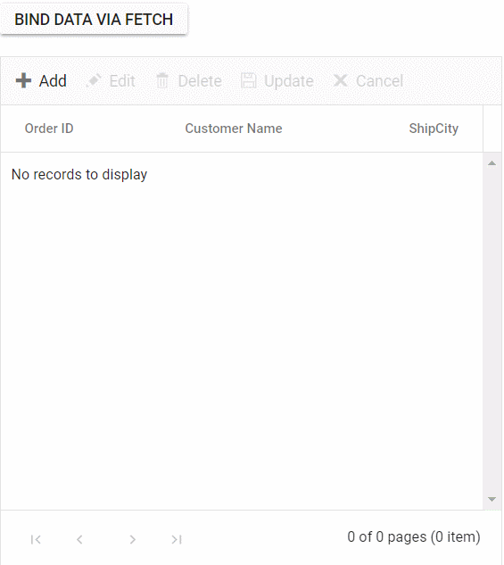

# Local Data Binding in Vue Data Grid

The [Data Grid](https://www.syncfusion.com/vue-components/vue-grid) provides a straightforward way to bind local data, such as arrays or JSON objects, to the grid component. This feature allows data to be displayed and manipulated within the grid without the need for external server calls, making it particularly useful for scenarios involving static or locally stored data.

Assign an array of JavaScript objects to the [dataSource](https://ej2.syncfusion.com/vue/documentation/api/grid#datasource) property.

The following example demonstrates the local data binding feature in the Vue Grid component:









        


## Binding data from excel file

The Data Grid supports importing data from Excel files for display and manipulation within the grid. This streamlines transferring Excel data into a web-based environment. Use the [Uploader](https://ej2.syncfusion.com/vue/documentation/uploader/getting-started) component's [change](https://ej2.syncfusion.com/vue/documentation/api/uploader#change) event to handle the import.

Install the `XLSX` library using the following command:

```bash
npm install xlsx
```

To import Excel data into the Grid, follow these steps:

1. Import excel file using `Uploader` component. 
2. Parse the excel file data using `XLSX` library.
3. Bind the resulting JSON to the grid.

The following example demonstrates importing Excel data into the grid by utilizing the `Uploader` component's `change` event along with the `XLSX` library:









        


## CRUD operations using Fetch requests

The Data Grid provides a seamless way to bind data from external sources using Fetch requests, facilitating CRUD (Create, Read, Update, Delete) operations with data retrieved from a server. This feature is particularly valuable for sending data to a server for database updates and for asynchronously retrieving data without refreshing the entire web page.

To achieve data binding and perform CRUD actions using Fetch requests in the grid, follow these steps::

**Step 1:** Open Visual Studio and create an Vue and ASP.NET Core project named FetchProject. To create an Vue and ASP.NET Core application, follow the documentation [link](https://learn.microsoft.com/en-us/visualstudio/javascript/tutorial-asp-net-core-with-vue?view=vs-2022) for detailed steps.

**Step 2:** Include the Vue Data Grid in the HTML file with the necessary configurations:

```html

<ejs-button cssClass='e-success' @click="click">Bind data via Fetch</ejs-button>

<div style="padding: 20px 17px 0 0">
<ejs-grid ref="grid" :dataSource='data' :editSettings='editSettings' :toolbar='toolbar' allowPaging="true" height="320" :actionBegin="actionBegin" :actionComplete="actionComplete">
    <e-columns>
        <e-column field='OrderID' headerText='Order ID' isPrimaryKey=true width='150'></e-column>
        <e-column field='CustomerID' headerText='Customer Name' width='150'></e-column>
        <e-column field='Freight' headerText='Freight' format="C" width='150'></e-column>
        <e-column field='ShipCity' headerText='ShipCity' width='150' textAlign='Right'></e-column>
    </e-columns>
</ejs-grid>
</div>
```

**Step 3:** To bind data from an external Fetch request, utilize the [dataSource](https://ej2.syncfusion.com/vue/documentation/api/grid#datasource) property of the Grid. Fetch data from the server and provide it to the `dataSource` property using the `onSuccess` event of the Fetch request.

```ts
click: function () {
    const fetchRequest = new fetch("https://localhost:****/Home/Getdata", 'POST');//Use remote server host number instead ****
    fetchRequest.send();
    fetchRequest.onSuccess = (data) => {
        this.$refs.grid.ej2Instances.dataSource = data;
    };
}
```

On the server side, there is a method named "GetData" within the **HomeController** that contains the grid's data source. When the button is clicked, a Fetch request is sent to fetch the data from the server and bind it to the Grid component.

```cs

public class HomeController : Controller
    {        
    public ActionResult Getdata()
        {
            IEnumerable DataSource = OrdersDetails.GetAllRecords();
            return Json(DataSource);
        } 
    }

```

Create a model class named **OrdersDetails.cs** in the server-side Models folder to represent the order data.   

```cs 
public class OrdersDetails
    {
    public OrdersDetails()
        {

        }
    public OrdersDetails(int OrderID, string CustomerId, int EmployeeId, double Freight, bool Verified, DateTime OrderDate, string ShipCity, string ShipName, string ShipCountry, DateTime ShippedDate, string ShipAddress)
    {
        this.OrderID = OrderID;
        this.CustomerID = CustomerId;
        this.EmployeeID = EmployeeId;
        this.Freight = Freight;
        this.ShipCity = ShipCity;
        this.Verified = Verified;
        this.OrderDate = OrderDate;
        this.ShipName = ShipName;
        this.ShipCountry = ShipCountry;
        this.ShippedDate = ShippedDate;
        this.ShipAddress = ShipAddress;
    }
    //Render data in this method
    public static List<OrdersDetails> GetAllRecords()
    {
        List<OrdersDetails> order = new List<OrdersDetails>();
        int code = 10000;
        for (int i = 1; i < 10; i++)
        {
            order.Add(new OrdersDetails(code + 1, "ALFKI", i + 0, 2.3 * i, false, new DateTime(1991, 05, 15), "Berlin", "Simons bistro", "Denmark", new DateTime(1996, 7, 16), "Kirchgasse 6"));
            order.Add(new OrdersDetails(code + 2, "ANATR", i + 2, 3.3 * i, true, new DateTime(1990, 04, 04), "Madrid", "Queen Cozinha", "Brazil", new DateTime(1996, 9, 11), "Avda. Azteca 123"));
            order.Add(new OrdersDetails(code + 3, "ANTON", i + 1, 4.3 * i, true, new DateTime(1957, 11, 30), "Cholchester", "Frankenversand", "Germany", new DateTime(1996, 10, 7), "Carrera 52 con Ave. Bolívar #65-98 Llano Largo"));
            order.Add(new OrdersDetails(code + 4, "BLONP", i + 3, 5.3 * i, false, new DateTime(1930, 10, 22), "Marseille", "Ernst Handel", "Austria", new DateTime(1996, 12, 30), "Magazinweg 7"));
            order.Add(new OrdersDetails(code + 5, "BOLID", i + 4, 6.3 * i, true, new DateTime(1953, 02, 18), "Tsawassen", "Hanari Carnes", "Switzerland", new DateTime(1997, 12, 3), "1029 - 12th Ave. S."));
            code += 5;
        }
        return order;
    }

    public int? OrderID { get; set; }
    public string CustomerID { get; set; }
    public int? EmployeeID { get; set; }
    public double? Freight { get; set; }
    public string ShipCity { get; set; }
    public bool Verified { get; set; }
    public DateTime OrderDate { get; set; }
    public string ShipName { get; set; }
    public string ShipCountry { get; set; }
    public DateTime ShippedDate { get; set; }
    public string ShipAddress { get; set; }
}    
```

**Step 4:** To perform CRUD actions, leverage the [actionBegin](https://ej2.syncfusion.com/vue/documentation/api/grid#actionbegin) event. The default CRUD operations can be canceled by utilizing the `cancel` argument provided by this event. This allows dynamic invocation of server-side methods using Fetch, along with the relevant data received from the `actionBegin` event, to update server data accordingly.

A. To add and save a new record using Fetch requests, follow these steps:

```ts
public flag = false;

actionBegin: function (e) {
    // Initially this.flag needs to be false in order to enter this condition
    if (!this.flag) {
            // Add and edit operations
        if (e.requestType == 'save' && (e.action == 'add')) {
            var editedData = e.data;
                // The default edit operation is cancelled
            e.cancel = true;
            // The updated data can be sent to the server using a Fetch call
            var fetchRequest= new Fetch({
                url: 'https://localhost:****/Home/Insert',  //Use remote server host number instead ****
                type: 'POST',
                contentType: 'application/json; charset=utf-8',
                data: JSON.stringify({ value: editedData })
            });
            fetchRequest.onSuccess = () => {
            // this.flag is enabled to skip this execution when grid ends add/edit
                this.flag = true;
                //The added/edited data will be saved in the Grid
                this.$refs.grid.ej2Instances.endEdit();
            };
            fetchRequest.onFailure = () => {
                // Add/edit failed
                // The this.flag is disabled if operation is failed so that it can enter the condition on next execution
            this.flag = false;
            };
            fetchRequest.send();
        }
    }
}
```

```ts
//insert the record in server side
public ActionResult Insert(OrdersDetails value)
{
    OrdersDetails.GetAllRecords().Insert(0, value);
    return Json(value);
}

```

B. To edit and save a record using an Fetch request, follow these steps:

```ts

        public flag = false;

        actionBegin: function (e) {
            // Initially this.flag needs to be false in order to enter this condition
            if (!this.flag) {
                if (e.requestType == 'save' && (e.action == "edit")) {
                    var editedData = e.data;
                    // The default edit operation is cancelled
                    e.cancel = true;
                    // The updated data can be sent to the server using a Fetch call
                    var fetchRequest = new Fetch({
                        url: 'https://localhost:****/Home/Update', //Use remote server host number instead ****
                        type: 'POST',
                        contentType: 'application/json; charset=utf-8',
                        data: JSON.stringify({ value: editedData })
                    });
                    fetchRequest.onSuccess = () => {
                        // this.flag is enabled to skip this execution when grid ends add/edit
                            this.flag = true;
                        // The added/edited data will be saved in the Grid
                            this.$refs.grid.ej2Instances.endEdit();
                    };
                    fetchRequest.onFailure = () => {
                        // Add/edit failed
                        // The this.flag is disabled if operation is failed so that it can enter the condition on next executio
                        this.flag = false;
                    };
                    fetchRequest.send();
                }
            }   
        }

```

```cs
//update the record in server side
public ActionResult Update(OrdersDetails value)
        {
            var ord = value;
            OrdersDetails val = OrdersDetails.GetAllRecords().Where(or => or.OrderID == ord.OrderID).FirstOrDefault();
            val.OrderID = ord.OrderID;
            val.EmployeeID = ord.EmployeeID;
            val.CustomerID = ord.CustomerID;
            return Json(value);
        }

```

C. To delete a record using an Fetch request, follow these steps:

```ts
public flag = false;

actionBegin: function (e) {
    // Initially this.flag needs to be false in order to enter this condition
    if (!this.flag) {
        if (e.requestType == 'delete') {
            var editedData = e.data;
            // The default delete operation is cancelled
            e.cancel = true;
            // The deleted data can be sent to the server using a Fetch call
            var fetchRequest = new Fetch({
                url: 'https://localhost:****/Home/Delete', //Use remote server host number instead ****
                type: 'POST',
                contentType: 'application/json; charset=utf-8',
                data: JSON.stringify({ key: editedData[0][this.$refs.grid.ej2Instances.getPrimaryKeyFieldNames()[0]] })
            });
            fetchRequest.onSuccess = () => {
            // this.flag is enabled to skip this execution when grid deletes record
                this.flag = true;
            // The deleted data will be removed in the Grid
                this.$refs.grid.ej2Instances.deleteRecord();
            };
            fetchRequest.onFailure = () => {
                // Delete failed
                // The this.flag is disabled if operation is failed so that it can enter the condition on next execution
                this.flag = false;
            };
            fetchRequest.send();
        }  
    }
}

```

```cs
//Delete the record in server side
public ActionResult Delete(int key)
{
    OrdersDetails.GetAllRecords().Remove(OrdersDetails.GetAllRecords().Where(or => or.OrderID == key).FirstOrDefault());
    var data = OrdersDetails.GetAllRecords();
    return Json(data);
}

```

**Step 5:** In the Fetch success event, the Grid's [endEdit](https://ej2.syncfusion.com/vue/documentation/api/grid/index-default#endedit) and [deleteRecord](https://ej2.syncfusion.com/vue/documentation/api/grid/index-default#deleterecord) methods can be utilized to handle the addition, editing, and deletion of corresponding data in the Grid. However, invoking these methods triggers the `actionBegin` event once again to save the changes in the Grid. To prevent this behavior and maintain control over the execution flow, a flag variable can be employed and managed within the `actionComplete` and Fetch failure events. The following code snippet demonstrates this approach:

```ts
        actionComplete: function (e){
            if (e.requestType === 'save' || e.requestType === 'delete') {
                // The this.flag is disabled after operation is successfully performed so that it can enter the condition on next execution
                this.flag = false;
            }
        }

```

The following screenshot represents loading data when the button is clicked and CRUD operations are performed:




<template>
    <div id="app">
        <ejs-button cssClass='e-success' @click="click">Bind data via fetch</ejs-button>
        <div style="padding: 20px 17px 0 0">
            <ejs-grid ref="grid" :editSettings='editSettings' :toolbar='toolbar' allowPaging="true" height="320" :actionBegin="actionBegin" :actionComplete="actionComplete">
                <e-columns>
                    <e-column field='OrderID' headerText='Order ID' isPrimaryKey=true width='150'></e-column>
                    <e-column field='CustomerID' headerText='Customer Name' width='150'></e-column>
                    <e-column field='Freight' headerText='Freight' format="C" width='150'></e-column>
                    <e-column field='ShipCity' headerText='ShipCity' width='150' textAlign='Right'></e-column>
                </e-columns>
            </ejs-grid>
        </div>
    </div>
</template>

<script setup>
import { provide, ref } from "vue";
import { GridComponent as EjsGrid, ColumnDirective as EColumn, ColumnsDirective as EColumns, Page, Edit, Toolbar } from "@syncfusion/ej2-vue-grids";
import { ButtonComponent as EjsButton } from "@syncfusion/ej2-vue-buttons";
import { Fetch } from '@syncfusion/ej2-base';

const grid = ref(null);
let flag = false;
const editSettings = { allowEditing: true, allowAdding: true, allowDeleting: true, mode: 'Normal' };
const toolbar = ['Add', 'Edit', 'Delete', 'Update', 'Cancel'];
const click = function () {
    const fetchRequest = new Fetch("https://localhost:****/Home/Getdata", 'POST'); // Use remote server host number instead ****
    fetchRequest.send();
    fetchRequest.onSuccess = (data) => {
        grid.value.ej2Instances.dataSource = data;
    };
};

const actionBegin = function (e) {
    // Initially this.flag needs to be false in order to enter this condition
    if (!flag) {
        // Add and edit operations
        if (e.requestType === 'save' && (e.action === 'add')) {
            var editedData = e.data;
            // The default edit operation is cancelled
            e.cancel = true;
            // The updated data can be sent to the server using a Fetch call
            const fetchRequest = new Fetch({
                url: 'https://localhost:****/Home/Insert',//Use remote server host number instead ****
                type: 'POST',
                contentType: 'application/json; charset=utf-8',
                data: JSON.stringify({ value: editedData })
            }); // Use remote server host number instead ****
            fetchRequest.onSuccess = () => {
                // this.flag is enabled to skip this execution when grid ends add/edit
                flag = true;
                // The added/edited data will be saved in the Grid
                grid.value.ej2Instances.endEdit();
            };
            fetchRequest.onFailure = () => {
                // Add/edit failed
                // The this.flag is disabled if operation is failed so that it can enter the condition on next execution
                flag = false;
            };
            fetch.send();
        }
        if (e.requestType === 'save' && (e.action === "edit")) {
            var editedData = e.data;
            // The default edit operation is cancelled
            e.cancel = true;
            // The updated data can be sent to the server using a Fetch call
            const fetchRequest = new Fetch({
                url: 'https://localhost:****/Home/Update',//Use remote server host number instead ****
                type: 'POST',
                contentType: 'application/json; charset=utf-8',
                data: JSON.stringify({ value: editedData })
            }); // Use remote server host number instead ****
            fetchRequest.onSuccess = () => {
                // this.flag is enabled to skip this execution when grid ends add/edit
                flag = true;
                // The added/edited data will be saved in the Grid
                grid.value.ej2Instances.endEdit();
            };
            fetchRequest.onFailure = () => {
                // Add/edit failed
                // The this.flag is disabled if operation is failed so that it can enter the condition on next execution
                flag = false;
            };
            fetchRequest.send();
        }

        if (e.requestType === 'delete') {
            var editedData = e.data;
            // The default delete operation is cancelled
            e.cancel = true;
            // The deleted data can be sent to the server using a Fetch call
            const fetchRequest = new Fetch({
                url: 'https://localhost:****/Home/Delete', //Use remote server host number instead ****
                type: 'POST',
                contentType: 'application/json; charset=utf-8',
                data: JSON.stringify({ key: editedData[0][grid.value.ej2Instances.getPrimaryKeyFieldNames()[0]] })
            }); // Use remote server host number instead ****
            fetchRequest.onSuccess = () => {
                // this.flag is enabled to skip this execution when grid deletes record
                flag = true;
                // The deleted data will be removed in the Grid
                grid.value.ej2Instances.deleteRecord();
            };
            fetchRequest.onFailure = () => {
                // Delete failed
                // The this.flag is disabled if operation is failed so that it can enter the condition on next execution
                flag = false;
            };
            fetchRequest.send();
        }
    }
};

const actionComplete = function (e) {
    if (e.requestType === 'save' || e.requestType === 'delete') {
        // The this.flag is disabled after operation is successfully performed so that it can enter the condition on next execution
        flag = false;
    }
};

provide('grid', [Page, Edit, Toolbar]);
</script>

<style>
    @import "../node_modules/@syncfusion/ej2-base/styles/material3.css";
    @import "../node_modules/@syncfusion/ej2-buttons/styles/material3.css";
    @import "../node_modules/@syncfusion/ej2-calendars/styles/material3.css";
    @import "../node_modules/@syncfusion/ej2-dropdowns/styles/material3.css";
    @import "../node_modules/@syncfusion/ej2-inputs/styles/material3.css";
    @import "../node_modules/@syncfusion/ej2-navigations/styles/material3.css";
    @import "../node_modules/@syncfusion/ej2-popups/styles/material3.css";
    @import "../node_modules/@syncfusion/ej2-splitbuttons/styles/material3.css";
    @import "../node_modules/@syncfusion/ej2-vue-grids/styles/material3.css";
    @import "../node_modules/@syncfusion/ej2-vue-grids/styles/material.css";
</style>




<template>
    <div id="app">
        <ejs-button cssClass='e-success' @click="click">Bind data via fetch</ejs-button>
        <div style="padding: 20px 17px 0 0">
            <ejs-grid ref="grid" :editSettings='editSettings' :toolbar='toolbar' allowPaging="true" height="320" :actionBegin="actionBegin" :actionComplete="actionComplete">
                <e-columns>
                    <e-column field='OrderID' headerText='Order ID' isPrimaryKey=true width='150'></e-column>
                    <e-column field='CustomerID' headerText='Customer Name' width='150'></e-column>
                    <e-column field='Freight' headerText='Freight' format="C" width='150'></e-column>
                    <e-column field='ShipCity' headerText='ShipCity' width='150' textAlign='Right'></e-column>
                </e-columns>
            </ejs-grid>
        </div>
    </div>
</template>

<script>
import { GridComponent, ColumnsDirective, ColumnDirective, Page, Edit, Toolbar } from "@syncfusion/ej2-vue-grids";
import { ButtonComponent } from "@syncfusion/ej2-vue-buttons";
import { Fetch } from '@syncfusion/ej2-base';

export default {
    name: "App",
    components: {
        "ejs-grid": GridComponent,
        "e-columns": ColumnsDirective,
        "e-column": ColumnDirective,
        "ejs-button": ButtonComponent
    },
    data() {
        return {
            flag: false,
            editSettings: { allowEditing: true, allowAdding: true, allowDeleting: true, mode: 'Normal' },
            toolbar: ['Add', 'Edit', 'Delete', 'Update', 'Cancel']
        };
    },
    methods: {
        click: function () {
            const fetchRequest = new Fetch("https://localhost:****/Home/Getdata", 'POST'); //Use remote server host number instead ****
            fetchRequest.send();
            fetchRequest.onSuccess = (data) => {
                this.$refs.grid.ej2Instances.dataSource = data;
            };
        },
        actionBegin: function (e) {
            if (!this.flag) {
                if (e.requestType == 'save' && (e.action == 'add')) {
                    var editedData = e.data;
                    e.cancel = true;
                    var fetchRequest = new Fetch({
                        url: 'https://localhost:****/Home/Insert',
                        type: 'POST',
                        contentType: 'application/json; charset=utf-8',
                        data: JSON.stringify({ value: editedData })
                    });
                    fetchRequest.onSuccess = () => {
                        this.flag = true;
                        this.$refs.grid.ej2Instances.endEdit();
                    };
                    fetchRequest.onFailure = () => {
                        this.flag = false;
                    };
                    fetchRequest.send();
                }
                if (e.requestType == 'save' && (e.action == "edit")) {
                    var editedData = e.data;
                    e.cancel = true;
                    var fetchRequest = new Fetch({
                        url: 'https://localhost:****/Home/Update',
                        type: 'POST',
                        contentType: 'application/json; charset=utf-8',
                        data: JSON.stringify({ value: editedData })
                    });
                    fetchRequest.onSuccess = () => {
                        this.flag = true;
                        this.$refs.grid.ej2Instances.endEdit();
                    };
                    fetchRequest.onFailure = () => {
                        this.flag = false;
                    };
                    fetchRequest.send();
                }
                if (e.requestType == 'delete') {
                    var editedData = e.data;
                    e.cancel = true;
                    var fetchRequest = new Fetch({
                        url: 'https://localhost:****/Home/Delete',
                        type: 'POST',
                        contentType: 'application/json; charset=utf-8',
                        data: JSON.stringify({ key: editedData[0][this.$refs.grid.ej2Instances.getPrimaryKeyFieldNames()[0]] })
                    });
                    fetchRequest.onSuccess = () => {
                        this.flag = true;
                        this.$refs.grid.ej2Instances.deleteRecord();
                    };
                    fetchRequest.onFailure = () => {
                        this.flag = false;
                    };
                    fetchRequest.send();
                }
            }
        },
        actionComplete: function (e) {
            if (e.requestType === 'save' || e.requestType === 'delete') {
                this.flag = false;
            }
        }
    },
    provide: {
        grid: [Page, Edit, Toolbar]
    },
};
</script>

<style>
    @import "../node_modules/@syncfusion/ej2-base/styles/material3.css";
    @import "../node_modules/@syncfusion/ej2-buttons/styles/material3.css";
    @import "../node_modules/@syncfusion/ej2-calendars/styles/material3.css";
    @import "../node_modules/@syncfusion/ej2-dropdowns/styles/material3.css";
    @import "../node_modules/@syncfusion/ej2-inputs/styles/material3.css";
    @import "../node_modules/@syncfusion/ej2-navigations/styles/material3.css";
    @import "../node_modules/@syncfusion/ej2-popups/styles/material3.css";
    @import "../node_modules/@syncfusion/ej2-splitbuttons/styles/material3.css";
    @import "../node_modules/@syncfusion/ej2-vue-grids/styles/material3.css";
</style>






using FetchProject.Server.Models;
using Microsoft.AspNetCore.Mvc;

namespace FetchProject.Server.Controllers
{
    public class HomeController : Controller
    {
        public ActionResult Getdata()
        {
            var DataSource = OrdersDetails.GetAllRecords();
            return Json(DataSource);
        }

        public ActionResult Update([FromBody] CRUDModel<OrdersDetails> value)
        {
            var ord = value.value;
            OrdersDetails val = OrdersDetails.GetAllRecords().Where(or => or.OrderID == ord.OrderID).FirstOrDefault();
            val.OrderID = ord.OrderID;
            val.EmployeeID = ord.EmployeeID;
            val.CustomerID = ord.CustomerID;
            val.Freight = ord.Freight;
            val.OrderDate = ord.OrderDate;
            val.ShipCity = ord.ShipCity;
            val.ShipCountry = ord.ShipCountry;

            return Json(value.value);
        }


        //insert the record
        public ActionResult Insert([FromBody] CRUDModel<OrdersDetails> value)
        {

            OrdersDetails.GetAllRecords().Insert(0, value.value);
            return Json(value.value);
        }

        //Delete the record
        public ActionResult Delete(int key)
        {
            OrdersDetails.GetAllRecords().Remove(OrdersDetails.GetAllRecords().Where(or => or.OrderID == key).FirstOrDefault());
            var data = OrdersDetails.GetAllRecords();
            return Json(data);
        }
    }
}
public class CRUDModel<T> where T : class
{
    public string action { get; set; }
    public string table { get; set; }
    public string keyColumn { get; set; }
    public object key { get; set; }
    public T value { get; set; }
    public List<T> added { get; set; }
    public List<T> changed { get; set; }
    public List<T> deleted { get; set; }
    public IDictionary<string, object> @params { get; set; }
}






namespace FetchProject.Server.Models
{
    public class OrdersDetails
    {
        public static List<OrdersDetails> order = new List<OrdersDetails>();
        public OrdersDetails()
        {

        }
        public OrdersDetails(
        int OrderID, string CustomerId, int EmployeeId, double Freight, bool Verified,
        DateTime OrderDate, string ShipCity, string ShipName, string ShipCountry,
        DateTime ShippedDate, string ShipAddress)
        {
            this.OrderID = OrderID;
            this.CustomerID = CustomerId;
            this.EmployeeID = EmployeeId;
            this.Freight = Freight;
            this.ShipCity = ShipCity;
            this.Verified = Verified;
            this.OrderDate = OrderDate;
            this.ShipName = ShipName;
            this.ShipCountry = ShipCountry;
            this.ShippedDate = ShippedDate;
            this.ShipAddress = ShipAddress;
        }

        public static List<OrdersDetails> GetAllRecords()
        {
            List<OrdersDetails> order = new List<OrdersDetails>();
            int code = 10000;
            for (int i = 1; i < 10; i++)
            {
                order.Add(new OrdersDetails(code + 1, "ALFKI", i + 0, 2.3 * i, false, new DateTime(1991, 05, 15), "Berlin", "Simons bistro", "Denmark", new DateTime(1996, 7, 16), "Kirchgasse 6"));
                order.Add(new OrdersDetails(code + 2, "ANATR", i + 2, 3.3 * i, true, new DateTime(1990, 04, 04), "Madrid", "Queen Cozinha", "Brazil", new DateTime(1996, 9, 11), "Avda. Azteca 123"));
                order.Add(new OrdersDetails(code + 3, "ANTON", i + 1, 4.3 * i, true, new DateTime(1957, 11, 30), "Cholchester", "Frankenversand", "Germany", new DateTime(1996, 10, 7), "Carrera 52 con Ave. Bolívar #65-98 Llano Largo"));
                order.Add(new OrdersDetails(code + 4, "BLONP", i + 3, 5.3 * i, false, new DateTime(1930, 10, 22), "Marseille", "Ernst Handel", "Austria", new DateTime(1996, 12, 30), "Magazinweg 7"));
                order.Add(new OrdersDetails(code + 5, "BOLID", i + 4, 6.3 * i, true, new DateTime(1953, 02, 18), "Tsawassen", "Hanari Carnes", "Switzerland", new DateTime(1997, 12, 3), "1029 - 12th Ave. S."));
                code += 5;
            }
            return order;
        }

        public int? OrderID { get; set; }
        public string CustomerID { get; set; }
        public int? EmployeeID { get; set; }
        public double? Freight { get; set; }
        public string ShipCity { get; set; }
        public bool Verified { get; set; }
        public DateTime OrderDate { get; set; }
        public string ShipName { get; set; }
        public string ShipCountry { get; set; }
        public DateTime ShippedDate { get; set; }
        public string ShipAddress { get; set; }
    }
}






    var builder = WebApplication.CreateBuilder(args);

    // Add services to the container.
    builder.Services.AddControllers();
    builder.Services.AddEndpointsApiExplorer();
    builder.Services.AddSwaggerGen();

    builder.Services.AddCors(options =>
    {
        options.AddDefaultPolicy(builder =>
        {
            builder.AllowAnyOrigin().AllowAnyMethod().AllowAnyHeader();
        });
    });

    var app = builder.Build();

    // Configure HTTPS redirection
    app.UseHttpsRedirection();

    // Configure CORS
    app.UseCors();

    app.UseDefaultFiles();
    app.UseStaticFiles();

    // Configure Swagger
    if (app.Environment.IsDevelopment())
    {
        app.UseSwagger();
        app.UseSwaggerUI();
    }

    app.UseAuthorization();

    app.MapControllerRoute(
        name: "default",
        pattern: "{controller=Home}/{action=Index}");

    app.MapFallbackToFile("/index.html");

    app.Run();




        
The following screenshot represents loading data when the button is clicked and CRUD operations are performed:



> A complete sample for binding data and performing CRUD actions through Fetch requests is available on [GitHub](https://github.com/SyncfusionExamples/Binding-data-and-perform-action-in-ej2-vue-grid-using-Fetch-request).

### Display the loading indicator with local data. 

The Vue Data Grid allows the display of a loading indicator while loading local data. This is useful when data loading from a local source is delayed and a visual indication is required to show that data is being fetched.

To display the loading indicator when using local data, set the [showSpinner](https://ej2.syncfusion.com/vue/documentation/api/grid/index-default#showspinner) property to `true`. This property controls the visibility of the loading indicator.

The following example demonstrates displaying the loading indicator in the Vue Data Grid using the [load](https://ej2.syncfusion.com/vue/documentation/api/grid#load) and [created](https://ej2.syncfusion.com/vue/documentation/api/grid#created) events:

```typescript

<template>
  <div id="app">
    <ejs-grid ref="grid" :load='load' :created='created' >
      <e-columns>
        <e-column field='OrderID' headerText='Order ID' textAlign='Right' width=120></e-column>
        <e-column field='CustomerID' headerText='Customer ID' textAlign='Right' width=120></e-column>
        <e-column field='Quantity' headerText='Quantity' textAlign='Right' width=120></e-column>
        <e-column field='CustomerAddress' headerText='Ship Address' textAlign='Right' width=120></e-column>
      </e-columns>
    </ejs-grid>
  </div>
</template>
<script>
import { GridComponent, ColumnsDirective, ColumnDirective,Page} from "@syncfusion/ej2-vue-grids";
import { data } from './datasource.js';

export default {
name: "App",
components: {
"ejs-grid":GridComponent,
"e-columns":ColumnsDirective,
"e-column":ColumnDirective,

},

data() {
  return {
    isDataLoading :true
  };
},
methods: {
  load() {
    if (this.isDataLoading) { 
      this.$refs.grid.ej2Instances.showSpinner();
    }
  },

  created(){
    this.isDataLoading = true;
    this.$refs.grid.ej2Instances.dataSource = data ;
  }
},
provide: {
  grid: [Page]
}
}
</script>
<style>
@import "../node_modules/@syncfusion/ej2-base/styles/material3.css";
@import "../node_modules/@syncfusion/ej2-buttons/styles/material3.css";
@import "../node_modules/@syncfusion/ej2-calendars/styles/material3.css";
@import "../node_modules/@syncfusion/ej2-dropdowns/styles/material3.css";
@import "../node_modules/@syncfusion/ej2-inputs/styles/material3.css";
@import "../node_modules/@syncfusion/ej2-navigations/styles/material3.css";
@import "../node_modules/@syncfusion/ej2-popups/styles/material3.css";
@import "../node_modules/@syncfusion/ej2-splitbuttons/styles/material3.css";
@import "../node_modules/@syncfusion/ej2-vue-grids/styles/material3.css";
@import "../node_modules/@syncfusion/ej2-vue-grids/styles/material3.css";
</style>

```

## CRUD Operations using AJAX requests

The Data Grid provides a seamless way to bind data from external sources using AJAX requests, facilitating CRUD (Create, Read, Update, Delete) operations with data retrieved from a server. This feature is particularly valuable for sending data to a server for database updates and asynchronously retrieving data without refreshing the entire web page.

To achieve data binding and perform CRUD actions using Ajax requests in the Vue Data Grid, follow these steps:

**Step 1:** Include the Vue Data Grid in the HTML file with the necessary configurations:

```html
<ejs-button cssClass='e-success' @click="click">Bind data via ajax</ejs-button>
<div style="padding: 20px 17px 0 0">
<ejs-grid ref="grid" :dataSource='data' :editSettings='editSettings' :toolbar='toolbar' allowPaging="true" height="320" :actionBegin="actionBegin" :actionComplete="actionComplete">
    <e-columns>
        <e-column field='OrderID' headerText='Order ID' isPrimaryKey=true width='150'></e-column>
        <e-column field='CustomerID' headerText='Customer Name' width='150'></e-column>
        <e-column field='ShipCity' headerText='ShipCity' width='150' textAlign='Right'></e-column>
    </e-columns>
</ejs-grid>
</div>
</div>
```

**Step 2:** To bind data from an external AJAX request, utilize the [dataSource](https://ej2.syncfusion.com/vue/documentation/api/grid#datasource) property of the Grid. Fetch data from the server and provide it to the `dataSource` property using the `onSuccess` event of the AJAX request.

```ts
click: function () {
    const ajax = new Ajax("https://localhost:****/Home/Getdata", 'POST');//Use remote server host number instead ****
        ajax.send();
        ajax.onSuccess = (data) => {
        this.$refs.grid.ej2Instances.dataSource = JSON.parse(data);
    };
} 

```
On the server side, there is a method named "GetData" within the **HomeController** that contains the grid's data source. When the button is clicked, an AJAX request is sent to fetch the data from the server and bind it to the Grid component.

```cs
public class HomeController : Controller
{        
    public ActionResult Getdata()
    {
        var DataSource = OrdersDetails.GetAllRecords();
        return Json(DataSource);
    } 

}
```

Create a model class named **OrdersDetails.cs** in the server-side Models folder to represent the order data.   

```cs

public class OrdersDetails {
    public OrdersDetails()
    {

    }
    public OrdersDetails(int OrderID, string CustomerId, int EmployeeId, double Freight, bool Verified, DateTime OrderDate, string ShipCity, string ShipName, string ShipCountry, DateTime ShippedDate, string ShipAddress)
    {
        this.OrderID = OrderID;
        this.CustomerID = CustomerId;
        this.EmployeeID = EmployeeId;
        this.Freight = Freight;
        this.ShipCity = ShipCity;
        this.Verified = Verified;
        this.OrderDate = OrderDate;
        this.ShipName = ShipName;
        this.ShipCountry = ShipCountry;
        this.ShippedDate = ShippedDate;
        this.ShipAddress = ShipAddress;
    }
    //Render data in this method
    public static List<OrdersDetails> GetAllRecords()
    {
        List<OrdersDetails> order = new List<OrdersDetails>();
        int code = 10000;
        for (int i = 1; i < 10; i++)
        {
            order.Add(new OrdersDetails(code + 1, "ALFKI", i + 0, 2.3 * i, false, new DateTime(1991, 05, 15), "Berlin", "Simons bistro", "Denmark", new DateTime(1996, 7, 16), "Kirchgasse 6"));
            order.Add(new OrdersDetails(code + 2, "ANATR", i + 2, 3.3 * i, true, new DateTime(1990, 04, 04), "Madrid", "Queen Cozinha", "Brazil", new DateTime(1996, 9, 11), "Avda. Azteca 123"));
            order.Add(new OrdersDetails(code + 3, "ANTON", i + 1, 4.3 * i, true, new DateTime(1957, 11, 30), "Cholchester", "Frankenversand", "Germany", new DateTime(1996, 10, 7), "Carrera 52 con Ave. Bolívar #65-98 Llano Largo"));
            order.Add(new OrdersDetails(code + 4, "BLONP", i + 3, 5.3 * i, false, new DateTime(1930, 10, 22), "Marseille", "Ernst Handel", "Austria", new DateTime(1996, 12, 30), "Magazinweg 7"));
            order.Add(new OrdersDetails(code + 5, "BOLID", i + 4, 6.3 * i, true, new DateTime(1953, 02, 18), "Tsawassen", "Hanari Carnes", "Switzerland", new DateTime(1997, 12, 3), "1029 - 12th Ave. S."));
            code += 5;
        }
        return order;
    }

    public int? OrderID { get; set; }
    public string CustomerID { get; set; }
    public int? EmployeeID { get; set; }
    public double? Freight { get; set; }
    public string ShipCity { get; set; }
    public bool Verified { get; set; }
    public DateTime OrderDate { get; set; }
    public string ShipName { get; set; }
    public string ShipCountry { get; set; }
    public DateTime ShippedDate { get; set; }
    public string ShipAddress { get; set; }
}    

```

**Step 3:** To perform CRUD actions, leverage the [actionBegin](https://ej2.syncfusion.com/vue/documentation/api/grid#actionbegin) event. The default CRUD operations can be canceled by utilizing the `cancel` argument provided by this event. This allows dynamic invocation of server-side methods using AJAX, along with the relevant data received from the `actionBegin` event, to update server data accordingly.

A. To add and save a new record using AJAX requests, follow these steps:


```typescript
public flag = false;

actionBegin: function (e) {
    // Initially this.flag needs to be false in order to enter this condition
    if (!this.flag) {
            // Add and edit operations
        if (e.requestType == 'save' && (e.action == 'add')) {
            var editedData = e.data;
                // The default edit operation is cancelled
            e.cancel = true;
            // The updated data can be sent to the server using an Ajax call
            var ajax = new Ajax({
                url: 'https://localhost:****/Home/Insert',  //Use remote server host number instead ****
                type: 'POST',
                contentType: 'application/json; charset=utf-8',
                data: JSON.stringify({ value: editedData })
            });
            ajax.onSuccess = () => {
            // this.flag is enabled to skip this execution when grid ends add/edit
                this.flag = true;
                //The added/edited data will be saved in the Grid
                this.$refs.grid.ej2Instances.endEdit();
            };
            ajax.onFailure = () => {
                // Add/edit failed
                // The this.flag is disabled if operation is failed so that it can enter the condition on next execution
            this.flag = false;
            };
            ajax.send();
        }
    }
}
```

```cs
//insert the record
public ActionResult Insert([FromBody] CRUDModel<OrdersDetails> value)
{
    OrdersDetails.GetAllRecords().Insert(0, value.value);
    return Json(value.value);
}
```

B. To edit and save a record using an AJAX request, follow these steps:

```cs

public flag = false;

actionBegin: function (e) {
    // Initially this.flag needs to be false in order to enter this condition
    if (!this.flag) {
        if (e.requestType == 'save' && (e.action == "edit")) {
            var editedData = e.data;
            // The default edit operation is cancelled
            e.cancel = true;
            // The updated data can be sent to the server using an Ajax call
            var ajax = new Ajax({
                url: 'https://localhost:****/Home/Update', //Use remote server host number instead ****
                type: 'POST',
                contentType: 'application/json; charset=utf-8',
                data: JSON.stringify({ value: editedData })
            });
            ajax.onSuccess = () => {
                // this.flag is enabled to skip this execution when grid ends add/edit
                    this.flag = true;
                // The added/edited data will be saved in the Grid
                    this.$refs.grid.ej2Instances.endEdit();
            };
            ajax.onFailure = () => {
                // Add/edit failed
                // The this.flag is disabled if operation is failed so that it can enter the condition on next executio
                this.flag = false;
            };
                ajax.send();
        }
    }   
}
```

```cs
//update the record
public ActionResult Update([FromBody] CRUDModel<OrdersDetails> value)
{
    var ord = value.value;
    OrdersDetails val = OrdersDetails.GetAllRecords().Where(or => or.OrderID == ord.OrderID).FirstOrDefault();
    val.OrderID = ord.OrderID;
    val.EmployeeID = ord.EmployeeID;
    val.CustomerID = ord.CustomerID;
    val.Freight = ord.Freight;
    val.OrderDate = ord.OrderDate;
    val.ShipCity = ord.ShipCity;
    val.ShipCountry = ord.ShipCountry;
    return Json(value.value);
}
 
```

C. To delete a record using an AJAX request, follow these steps:

```typescript
public flag = false;

actionBegin: function (e) {
    // Initially this.flag needs to be false in order to enter this condition
    if (!this.flag) {
        if (e.requestType == 'delete') {
            var editedData = e.data;
            // The default delete operation is cancelled
            e.cancel = true;
           // The deleted data can be sent to the server using an Ajax call
            var ajax = new Ajax({
                url: 'https://localhost:****/Home/Delete', //Use remote server host number instead ****
                type: 'POST',
                contentType: 'application/json; charset=utf-8',
                data: JSON.stringify({ key: editedData[0][this.$refs.grid.ej2Instances.getPrimaryKeyFieldNames()[0]] })
            });
            ajax.onSuccess = () => {
            // this.flag is enabled to skip this execution when grid deletes record
                this.flag = true;
            // The deleted data will be removed in the Grid
                this.$refs.grid.ej2Instances.deleteRecord();
            };
            ajax.onFailure = () => {
                // Delete failed
                // The this.flag is disabled if operation is failed so that it can enter the condition on next execution
                this.flag = false;
            };
            ajax.send();
        }  
    }
}

```

```cs
//Delete the record
public ActionResult Delete(int key)
{
    OrdersDetails.GetAllRecords().Remove(OrdersDetails.GetAllRecords().Where(or => or.OrderID == key).FirstOrDefault());
    var data = OrdersDetails.GetAllRecords();
    return Json(data);
}

```

**Step 4:** In the AJAX success event, the Grid's [endEdit](https://ej2.syncfusion.com/vue/documentation/api/grid#endedit) and [deleteRecord](https://ej2.syncfusion.com/vue/documentation/api/grid#deleterecord) methods can be utilized to handle the addition, editing, and deletion of corresponding data in the Grid. However, invoking these methods triggers the `actionBegin` event once again to save the changes in the Grid. To prevent this behavior and maintain control over the execution flow, a flag variable can be employed and managed within the `actionComplete` and AJAX failure events. The following code snippet demonstrates this approach:

```typescript
actionComplete(e) {
    if (e.requestType === 'save' || e.requestType === 'delete') {
        // The this.flag is disabled after operation is successfully performed so that it can enter the condition on next execution
        this.flag = false;
    }
}
```

The following example demonstrates data binding and CRUD actions performed through Ajax requests on both the client side and server side.




<template>
    <div id="app">
        <ejs-button cssClass='e-success' @click="click">Bind data via ajax</ejs-button>
        <div style="padding: 20px 17px 0 0">
            <ejs-grid ref="grid" :dataSource='data' :editSettings='editSettings' :toolbar='toolbar' allowPaging="true" height="320" :actionBegin="actionBegin" :actionComplete="actionComplete">
                <e-columns>
                    <e-column field='OrderID' headerText='Order ID' isPrimaryKey=true width='150'></e-column>
                    <e-column field='CustomerID' headerText='Customer Name' width='150'></e-column>
                    <e-column field='ShipCity' headerText='ShipCity' width='150' textAlign='Right'></e-column>
                </e-columns>
            </ejs-grid>
        </div>
    </div>
</template>

<script setup>
    import { provide, ref } from "vue";
    import { GridComponent as EjsGrid, ColumnDirective as EColumn, ColumnsDirective as EColumns, Page,Edit,Toolbar } from "@syncfusion/ej2-vue-grids";
    import { ButtonComponent as EjsButton } from "@syncfusion/ej2-vue-buttons";
    import { Ajax } from '@syncfusion/ej2-base';

    const grid = ref(null);
    let flag = false;
    const editSettings = { allowEditing: true, allowAdding: true, allowDeleting: true, mode: 'Normal' };
    const toolbar = ['Add', 'Edit', 'Delete', 'Update', 'Cancel'];
    const click = function () {
        const ajax = new Ajax("https://localhost:****/Home/Getdata", 'POST'); // Use remote server host number instead ****
        ajax.send();
        ajax.onSuccess = (data) => {
            grid.value.ej2Instances.dataSource = data;
        };
    };

    const actionBegin = function (e) {
        // Initially this.flag needs to be false in order to enter this condition
        if (!flag) {
            // Add and edit operations
            if (e.requestType === 'save' && (e.action === 'add')) {
                var editedData = e.data;
                // The default edit operation is cancelled
                e.cancel = true;
                // The updated data can be sent to the server using an Ajax call.
                const a = new Ajax({
                    url: 'https://localhost:****/Home/Insert',//Use remote server host number instead ****
                    type: 'POST',
                    contentType: 'application/json; charset=utf-8',
                    data: JSON.stringify({ value: editedData })
                }); // Use remote server host number instead ****
                ajax.onSuccess = () => {
                    // this.flag is enabled to skip this execution when grid ends add/edit
                    flag = true;
                    // The added/edited data will be saved in the Grid
                    grid.value.ej2Instances.endEdit();
                };
                ajax.onFailure = () => {
                    // Add/edit failed
                    // The this.flag is disabled if operation is failed so that it can enter the condition on next execution
                    flag = false;
                };
               ajax.send();
            }
            if (e.requestType === 'save' && (e.action === "edit")) {
                var editedData = e.data;
                // The default edit operation is cancelled
                e.cancel = true;
               // The updated data can be sent to the server using an Ajax call
                const Ajax = new Ajax({
                    url: 'https://localhost:****/Home/Update',//Use remote server host number instead ****
                    type: 'POST',
                    contentType: 'application/json; charset=utf-8',
                    data: JSON.stringify({ value: editedData })
                }); // Use remote server host number instead ****
                ajax.onSuccess = () => {
                    // this.flag is enabled to skip this execution when grid ends add/edit
                    flag = true;
                    // The added/edited data will be saved in the Grid
                    grid.value.ej2Instances.endEdit();
                };
                ajax.onFailure = () => {
                    // Add/edit failed
                    // The this.flag is disabled if operation is failed so that it can enter the condition on next execution
                    flag = false;
                };
                ajax.send();
            }

            if (e.requestType === 'delete') {
                var editedData = e.data;
                // The default delete operation is cancelled
                e.cancel = true;
               // The deleted data can be sent to the server using an Ajax call
                const ajax = new Ajax({
                    url: 'https://localhost:****/Home/Delete',//Use remote server host number instead ****
                    type: 'POST',
                    contentType: 'application/json; charset=utf-8',
                    data: JSON.stringify({ key: editedData[0][grid.value.ej2Instances.getPrimaryKeyFieldNames()[0]] })
                }); // Use remote server host number instead ****
                ajax.onSuccess = () => {
                    // this.flag is enabled to skip this execution when grid deletes record
                    flag = true;
                    // The deleted data will be removed in the Grid
                    grid.value.ej2Instances.deleteRecord();
                };
                ajax.onFailure = () => {
                    // Delete failed
                    // The this.flag is disabled if operation is failed so that it can enter the condition on next execution
                    flag = false;
                };
               ajax.send();
            }
        }
    };

    const actionComplete = function (e) {
        if (e.requestType === 'save' || e.requestType === 'delete') {
            // The this.flag is disabled after operation is successfully performed so that it can enter the condition on next execution
            flag = false;
        }
    };

    provide('grid', [Page, Edit, Toolbar]);
</script>

<style>
    @import "../node_modules/@syncfusion/ej2-base/styles/material3.css";
    @import "../node_modules/@syncfusion/ej2-buttons/styles/material3.css";
    @import "../node_modules/@syncfusion/ej2-calendars/styles/material3.css";
    @import "../node_modules/@syncfusion/ej2-dropdowns/styles/material3.css";
    @import "../node_modules/@syncfusion/ej2-inputs/styles/material3.css";
    @import "../node_modules/@syncfusion/ej2-navigations/styles/material3.css";
    @import "../node_modules/@syncfusion/ej2-popups/styles/material3.css";
    @import "../node_modules/@syncfusion/ej2-splitbuttons/styles/material3.css";
    @import "../node_modules/@syncfusion/ej2-vue-grids/styles/material3.css";
    @import "../node_modules/@syncfusion/ej2-vue-grids/styles/material.css";
</style>




<template>
    <div id="app">
        <ejs-button cssClass='e-success' @click="click">Bind data via Ajax</ejs-button>
        <div style="padding: 20px 17px 0 0">
            <ejs-grid ref="grid" :dataSource='data' :editSettings='editSettings' :toolbar='toolbar' allowPaging="true" height="320" :actionBegin="actionBegin" :actionComplete="actionComplete">
                <e-columns>
                    <e-column field='OrderID' headerText='Order ID' isPrimaryKey=true width='150'></e-column>
                    <e-column field='CustomerID' headerText='Customer Name' width='150'></e-column>
                    <e-column field='ShipCity' headerText='ShipCity' width='150' textAlign='Right'></e-column>
                </e-columns>
            </ejs-grid>
        </div>
    </div>
</template>

<script>
    import { GridComponent, ColumnsDirective, ColumnDirective, Page, Edit, Toolbar } from "@syncfusion/ej2-vue-grids";
    import { ButtonComponent } from "@syncfusion/ej2-vue-buttons";
    import {Ajax } from '@syncfusion/ej2-base';

    export default {
        name: "App",
        components: {
            "ejs-grid": GridComponent,
            "e-columns": ColumnsDirective,
            "e-column": ColumnDirective,
            "ejs-button": ButtonComponent
        },
        data() {
            return {
                flag: false,
                editSettings: { allowEditing: true, allowAdding: true, allowDeleting: true, mode: 'Normal' },
                toolbar: ['Add', 'Edit', 'Delete', 'Update', 'Cancel']
            };
        },
        methods: {
            click: function () {
                const ajax = new Ajax("https://localhost:****/Home/Getdata", 'POST');//Use remote server host number instead ****
                ajax.send();
               ajax.onSuccess = (data) => {
                    this.$refs.grid.ej2Instances.dataSource = JSON.parse(data);
                };
            },
            actionBegin: function (e) {
                if (!this.flag) {
                    if (e.requestType == 'save' && (e.action == 'add')) {
                        var editedData = e.data;
                        e.cancel = true;
                        var ajax = new Ajax({
                            url: 'https://localhost:****/Home/Insert',//Use remote server host number instead ****
                            type: 'POST',
                            contentType: 'application/json; charset=utf-8',
                            data: JSON.stringify({ value: editedData })
                        });
                        ajax.onSuccess = () => {
                            this.flag = true;
                            this.$refs.grid.ej2Instances.endEdit();
                        };
                       ajax.onFailure = () => {
                            this.flag = false;
                        };
                        ajax.send();
                    }
                    if (e.requestType == 'save' && (e.action == "edit")) {
                        var editedData = e.data;
                        e.cancel = true;
                        var Ajax = new Ajax({
                            url: 'https://localhost:****/Home/Update',//Use remote server host number instead ****
                            type: 'POST',
                            contentType: 'application/json; charset=utf-8',
                            data: JSON.stringify({ value: editedData })
                        });
                        ajax.onSuccess = () => {
                            this.flag = true;
                            this.$refs.grid.ej2Instances.endEdit();
                        };
                       ajax.onFailure = () => {
                            this.flag = false;
                        };
                        ajax.send();
                    }
                    if (e.requestType == 'delete') {
                        var editedData = e.data;
                        e.cancel = true;
                        var ajax = new Ajax({
                            url: 'https://localhost:****/Home/Delete',//Use remote server host number instead ****
                            type: 'POST',
                            contentType: 'application/json; charset=utf-8',
                            data: JSON.stringify({ key: editedData[0][this.$refs.grid.ej2Instances.getPrimaryKeyFieldNames()[0]] })
                        });
                        ajax.onSuccess = () => {
                            this.flag = true;
                            this.$refs.grid.ej2Instances.deleteRecord();
                        };
                        ajax.onFailure = () => {
                            this.flag = false;
                        };
                        a.send();
                    }
                }
            },
            actionComplete: function (e) {
                if (e.requestType === 'save' || e.requestType === 'delete') {
                    this.flag = false;
                }
            }
        },
        provide: {
            grid: [Page, Edit, Toolbar]
        },
    };
</script>

<style>
    @import "../node_modules/@syncfusion/ej2-base/styles/material3.css";
    @import "../node_modules/@syncfusion/ej2-buttons/styles/material3.css";
    @import "../node_modules/@syncfusion/ej2-calendars/styles/material3.css";
    @import "../node_modules/@syncfusion/ej2-dropdowns/styles/material3.css";
    @import "../node_modules/@syncfusion/ej2-inputs/styles/material3.css";
    @import "../node_modules/@syncfusion/ej2-navigations/styles/material3.css";
    @import "../node_modules/@syncfusion/ej2-popups/styles/material3.css";
    @import "../node_modules/@syncfusion/ej2-splitbuttons/styles/material3.css";
    @import "../node_modules/@syncfusion/ej2-vue-grids/styles/material3.css";
</style>






using FetchProject.Server.Models;
using Microsoft.AspNetCore.Mvc;

namespace FetchProject.Server.Controllers
{
    public class HomeController : Controller
    {
        public ActionResult Getdata()
        {
            var DataSource = OrdersDetails.GetAllRecords();
            return Json(DataSource);
        }

        public ActionResult Update([FromBody] CRUDModel<OrdersDetails> value)
        {
            var ord = value.value;
            OrdersDetails val = OrdersDetails.GetAllRecords().Where(or => or.OrderID == ord.OrderID).FirstOrDefault();
            val.OrderID = ord.OrderID;
            val.EmployeeID = ord.EmployeeID;
            val.CustomerID = ord.CustomerID;
            val.Freight = ord.Freight;
            val.OrderDate = ord.OrderDate;
            val.ShipCity = ord.ShipCity;
            val.ShipCountry = ord.ShipCountry;

            return Json(value.value);
        }


        //insert the record
        public ActionResult Insert([FromBody] CRUDModel<OrdersDetails> value)
        {

            OrdersDetails.GetAllRecords().Insert(0, value.value);
            return Json(value.value);
        }

        //Delete the record
        public ActionResult Delete(int key)
        {
            OrdersDetails.GetAllRecords().Remove(OrdersDetails.GetAllRecords().Where(or => or.OrderID == key).FirstOrDefault());
            var data = OrdersDetails.GetAllRecords();
            return Json(data);
        }
    }
}
public class CRUDModel<T> where T : class
{
    public string action { get; set; }
    public string table { get; set; }
    public string keyColumn { get; set; }
    public object key { get; set; }
    public T value { get; set; }
    public List<T> added { get; set; }
    public List<T> changed { get; set; }
    public List<T> deleted { get; set; }
    public IDictionary<string, object> @params { get; set; }
}






namespace FetchProject.Server.Models
{
    public class OrdersDetails
    {
        public static List<OrdersDetails> order = new List<OrdersDetails>();
        public OrdersDetails()
        {

        }
        public OrdersDetails(
        int OrderID, string CustomerId, int EmployeeId, double Freight, bool Verified,
        DateTime OrderDate, string ShipCity, string ShipName, string ShipCountry,
        DateTime ShippedDate, string ShipAddress)
        {
            this.OrderID = OrderID;
            this.CustomerID = CustomerId;
            this.EmployeeID = EmployeeId;
            this.Freight = Freight;
            this.ShipCity = ShipCity;
            this.Verified = Verified;
            this.OrderDate = OrderDate;
            this.ShipName = ShipName;
            this.ShipCountry = ShipCountry;
            this.ShippedDate = ShippedDate;
            this.ShipAddress = ShipAddress;
        }

        public static List<OrdersDetails> GetAllRecords()
        {
            List<OrdersDetails> order = new List<OrdersDetails>();
            int code = 10000;
            for (int i = 1; i < 10; i++)
            {
                order.Add(new OrdersDetails(code + 1, "ALFKI", i + 0, 2.3 * i, false, new DateTime(1991, 05, 15), "Berlin", "Simons bistro", "Denmark", new DateTime(1996, 7, 16), "Kirchgasse 6"));
                order.Add(new OrdersDetails(code + 2, "ANATR", i + 2, 3.3 * i, true, new DateTime(1990, 04, 04), "Madrid", "Queen Cozinha", "Brazil", new DateTime(1996, 9, 11), "Avda. Azteca 123"));
                order.Add(new OrdersDetails(code + 3, "ANTON", i + 1, 4.3 * i, true, new DateTime(1957, 11, 30), "Cholchester", "Frankenversand", "Germany", new DateTime(1996, 10, 7), "Carrera 52 con Ave. Bolívar #65-98 Llano Largo"));
                order.Add(new OrdersDetails(code + 4, "BLONP", i + 3, 5.3 * i, false, new DateTime(1930, 10, 22), "Marseille", "Ernst Handel", "Austria", new DateTime(1996, 12, 30), "Magazinweg 7"));
                order.Add(new OrdersDetails(code + 5, "BOLID", i + 4, 6.3 * i, true, new DateTime(1953, 02, 18), "Tsawassen", "Hanari Carnes", "Switzerland", new DateTime(1997, 12, 3), "1029 - 12th Ave. S."));
                code += 5;
            }
            return order;
        }

        public int? OrderID { get; set; }
        public string CustomerID { get; set; }
        public int? EmployeeID { get; set; }
        public double? Freight { get; set; }
        public string ShipCity { get; set; }
        public bool Verified { get; set; }
        public DateTime OrderDate { get; set; }
        public string ShipName { get; set; }
        public string ShipCountry { get; set; }
        public DateTime ShippedDate { get; set; }
        public string ShipAddress { get; set; }
    }
}






var builder = WebApplication.CreateBuilder(args);

// Add services to the container.
builder.Services.AddControllers();
builder.Services.AddEndpointsApiExplorer();
builder.Services.AddSwaggerGen();

builder.Services.AddCors(options =>
{
    options.AddDefaultPolicy(builder =>
    {
        builder.AllowAnyOrigin().AllowAnyMethod().AllowAnyHeader();
    });
});

var app = builder.Build();

// Configure HTTPS redirection
app.UseHttpsRedirection();

// Configure CORS
app.UseCors();

app.UseDefaultFiles();
app.UseStaticFiles();

// Configure Swagger
if (app.Environment.IsDevelopment())
{
    app.UseSwagger();
    app.UseSwaggerUI();
}

app.UseAuthorization();

app.MapControllerRoute(
    name: "default",
    pattern: "{controller=Home}/{action=Index}");

app.MapFallbackToFile("/index.html");

app.Run();




The following screenshot represents loading data when the button is clicked and CRUD operations are performed:


A complete sample for binding data and performing CRUD actions using AJAX requests is available on [GitHub](https://github.com/SyncfusionExamples/Binding-data-and-perform-action-in-ej2-vue-grid-using-Ajax-request).

### Display the loading indicator using AJAX. 

The Vue Data Grid allows the display of a loading indicator while loading data using AJAX. This feature is useful when there is a delay in loading data from a data source, and a visual indication is required to show that the data is being fetched. This is particularly beneficial when working with large datasets or under conditions of slower internet connections.

Set the [showSpinner](https://ej2.syncfusion.com/vue/documentation/api/grid#showspinner) property to `true` to display the loading indicator. This property controls the spinner visibility.

The following example demonstrates displaying the loading indicator in the Vue Data Grid using the [load](https://ej2.syncfusion.com/vue/documentation/api/grid#load) and [created](https://ej2.syncfusion.com/vue/documentation/api/grid#created) events:

```typescript

<template>
  <div id="app">
    <ejs-grid ref="grid" :load='load' :created='created' >
      <e-columns>
        <e-column field='OrderID' headerText='Order ID' textAlign='Right' width=120></e-column>
        <e-column field='CustomerID' headerText='Customer ID' textAlign='Right' width=120></e-column>
        <e-column field='Quantity' headerText='Quantity' textAlign='Right' width=120></e-column>
        <e-column field='CustomerAddress' headerText='Ship Address' textAlign='Right' width=120></e-column>
      </e-columns>
    </ejs-grid>
  </div>
</template>
<script>
import { GridComponent, ColumnsDirective, ColumnDirective,Page} from "@syncfusion/ej2-vue-grids";
import { Ajax } from "@syncfusion/ej2-base";

export default {
name: "App",
components: {
"ejs-grid":GridComponent,
"e-columns":ColumnsDirective,
"e-column":ColumnDirective,

},

data() {
  return {
    isDataLoading :true
  };
},
methods: {
  load() {
        if (this.isDataLoading) {
            this.$refs.grid.ej2Instances.showSpinner();
            this.isDataLoading = false;
        }
    },
    created() {
        this.isDataLoading = true;
        const grid = this.$refs.grid.ej2Instances;  // Grid instance
        const ajax = new Ajax(
                'https://services.syncfusion.com/vue/production/api/orders',
                'GET'
              );
        ajax.send();
        ajax.onSuccess = (data) => {
            grid.dataSource = JSON.parse(data);
        };
    }
},
provide: {
  grid: [Page]
}
}
</script>
<style>
@import "../node_modules/@syncfusion/ej2-base/styles/material3.css";
@import "../node_modules/@syncfusion/ej2-buttons/styles/material3.css";
@import "../node_modules/@syncfusion/ej2-calendars/styles/material3.css";
@import "../node_modules/@syncfusion/ej2-dropdowns/styles/material3.css";
@import "../node_modules/@syncfusion/ej2-inputs/styles/material3.css";
@import "../node_modules/@syncfusion/ej2-navigations/styles/material3.css";
@import "../node_modules/@syncfusion/ej2-popups/styles/material3.css";
@import "../node_modules/@syncfusion/ej2-splitbuttons/styles/material3.css";
@import "../node_modules/@syncfusion/ej2-vue-grids/styles/material3.css";
@import "../node_modules/@syncfusion/ej2-vue-grids/styles/material3.css";
</style>

```

## Managing spinner visibility during data loading

Showing a spinner during data loading in the Data Grid enhances the experience by providing a visual indication of the loading progress. This feature helps to understand that data is being fetched or processed.

To show or hide a spinner during data loading in the Grid, use the [showSpinner](https://ej2.syncfusion.com/vue/documentation/api/grid#showspinner) and [hideSpinner](https://ej2.syncfusion.com/vue/documentation/api/grid#hidespinner) methods provided by the Data Grid component.

The following example demonstrates showing and hiding the spinner during data loading using external buttons in a grid:









        


## Immutable mode  

Immutable mode in the Data Grid is designed to optimize re-rendering performance by utilizing the object reference and deep compare concept. This mode ensures that when performing grid actions, only the modified or newly added rows are re-rendered, preventing unnecessary re-rendering of unchanged rows. 

Enable immutable mode by setting [enableImmutableMode](https://ej2.syncfusion.com/vue/documentation/api/grid/index-default#enableImmutableMode) to `true`.

If immutable mode is enabled, when the datasource changes, only newly added rows are regenerated or reused. Consequently, the grid's [queryCellInfo](https://ej2.syncfusion.com/vue/documentation/api/grid#querycellinfo) and [rowDataBound](https://ej2.syncfusion.com/vue/documentation/api/grid#rowdatabound) events trigger only for newly generated rows, not for existing rows. 

If immutable mode is not enabled, both newly added rows and existing rows are regenerated or reused when the datasource changes. As a result, the `rowDataBound` and `queryCellInfo` events trigger for both newly added and existing rows. 

> This feature uses the primary key value for data comparison. Therefore, the [isPrimaryKey](https://ej2.syncfusion.com/vue/documentation/api/grid/column#isprimarykey) column.

The following example demonstrates enabling immutable mode in an Vue component. When add, delete, or update actions are performed, existing rows are not regenerated or reused, ensuring efficient rendering of only the modified or newly added rows:




<template>
  <div id="app">
    <ejs-button class="e-control e-btn e-lib e-info" @click="addTopEvent">Add rows Data</ejs-button>
    <ejs-button style="margin-left: 20px" class="e-control e-btn e-lib e-info" @click="deleteEvent">Delete rows</ejs-button>
    <ejs-button style="margin-left: 20px" class="e-control e-btn e-lib e-info" @click="updateEvent">Update Freight Data</ejs-button>
    <div id="message">{{ message }}</div>
    <div style="padding-top: 5px">
      <ejs-grid ref="immutablegrid" :dataSource="rowData" :enableHover="false" height="235" :enableImmutableMode="true" allowPaging="true" :selectionSettings="selectionOptions"  :rowDataBound="rowDataBound" :queryCellInfo="queryCellInfo">
        <e-columns>
          <e-column field="OrderID" headerText="Order ID" isPrimaryKey="true" width="120" textAlign="Right"></e-column>
          <e-column field="CustomerID" headerText="Customer ID" width="120"></e-column>
          <e-column field="Freight" headerText="Freight" width="120"></e-column>
          <e-column field="ShipName" headerText="Ship Name" width="120"></e-column>
        </e-columns>
      </ejs-grid>
    </div>
  </div>
</template>
<script setup>
import { provide, ref } from "vue";
import { GridComponent as EjsGrid, ColumnDirective as EColumn, ColumnsDirective as EColumns, Page } from "@syncfusion/ej2-vue-grids";
import { ButtonComponent as EjsButton } from "@syncfusion/ej2-vue-buttons";
import { data } from './datasource.js';

const immutablegrid = ref(null);
const rowData = ref(data);
const selectionOptions = { type: 'Multiple' };
const message = ref(`Initial rows rendered: ${data.length}`);

const queryCellInfo = (args) => {
  if (args.column.field === 'ShipName' && args.data.ShipName === "Gems Chevalier") {
    args.cell.style.backgroundColor = 'rgb(210, 226, 129)';
  }
};

const rowDataBound = (args) => {
  args.row.style.backgroundColor = args.data.isNewlyAdded ? '' : 'rgb(208, 255, 255)';
};

const addTopEvent = () => {
  immutablegrid.value.ej2Instances.getAllDataRows().forEach(row => {
    row.style.backgroundColor = "rgb(208, 255, 255)";
  });
  let newRowData = [];
  let addedRecords = {
    'OrderID': generateOrderId(),
    'CustomerID': generateCustomerId(),
    'ShipCity': generateShipCity(),
    'Freight': generateFreight(),
    'ShipName': generateShipName(),
    'isNewlyAdded': true
  };
  newRowData.push(addedRecords);
  rowData.value = [...newRowData, ...rowData.value];
  message.value = `${newRowData.length} rows rendered after performing the add action`;
};

const deleteEvent = () => {
  if (rowData.value.length > 0) {
    rowData.value = rowData.value.slice(1);
    message.value = `1 row deleted after performing delete action`;
  } else {
    message.value = `No rows to delete`;
  }
};

const updateEvent = () => {
  let count = 0;
  let newRowData = rowData.value.map((row) => {
    if (row.ShipName === 'Hanari Carnes') {
      count++;
      return { ...row, 'ShipName': "Gems Chevalier" };
    } else {
      return row;
    }
  });
  rowData.value = newRowData;
  message.value = `${count} rows updated after performing update action`;
};

const generateOrderId = () => {
  return Math.floor(10000 + Math.random() * 90000);
};

const generateCustomerId = () => {
  const characters = 'ABCDEFGHIJKLMNOPQRSTUVWXYZ';
  let result = '';
  for (let i = 0; i < 5; i++) {
    result += characters.charAt(Math.floor(Math.random() * characters.length));
  }
  return result;
};

const generateShipCity = () => {
  const cities = ['London', 'Paris', 'New York', 'Tokyo', 'Berlin'];
  return cities[Math.floor(Math.random() * cities.length)];
};

const generateFreight = () => {
  const randomValue = Math.random() * 100;
  return parseFloat(randomValue.toFixed(2));
};

const generateShipName = () => {
  const names = ['Que Delícia', 'Hanari Carnes', 'Island Trading', 'Laughing Bacchus Winecellars'];
  return names[Math.floor(Math.random() * names.length)];
};

provide('grid', [Page]);
</script>

<style>
@import "../node_modules/@syncfusion/ej2-base/styles/material3.css";
@import "../node_modules/@syncfusion/ej2-buttons/styles/material3.css";
@import "../node_modules/@syncfusion/ej2-calendars/styles/material3.css";
@import "../node_modules/@syncfusion/ej2-dropdowns/styles/material3.css";
@import "../node_modules/@syncfusion/ej2-inputs/styles/material3.css";
@import "../node_modules/@syncfusion/ej2-navigations/styles/material3.css";
@import "../node_modules/@syncfusion/ej2-popups/styles/material3.css";
@import "../node_modules/@syncfusion/ej2-splitbuttons/styles/material3.css";
@import "../node_modules/@syncfusion/ej2-vue-grids/styles/material3.css";
@import "../node_modules/@syncfusion/ej2-vue-grids/styles/material.css";
#message{
        color:red;
        text-align: center;
        padding-top: 10px;
}
</style>




<template>
  <div id="app">
    <ejs-button class="e-control e-btn e-lib e-info"  @click="addTopEvent">Add rows Data</ejs-button>
    <ejs-button style="margin-left: 20px" class="e-control e-btn e-lib e-info"  @click="deleteEvent">Delete rows</ejs-button>
    <ejs-button style="margin-left: 20px" class="e-control e-btn e-lib e-info"  @click="updateEvent">Update Freight Data</ejs-button>
      <div id="message">{{ message }} </div>
      <div  style="padding-top: 5px">
        <ejs-grid ref="immutable" :dataSource='rowData' :enableHover="false" height='235' :enableImmutableMode="true" allowPaging="true" :selectionSettings="selectionOptions"
           :rowDataBound="rowDataBound" :queryCellInfo="queryCellInfo">
          <e-columns>
            <e-column field='OrderID' headerText='Order ID' isPrimaryKey="true" width='120'
            textAlign='Right'></e-column>
            <e-column field='CustomerID' headerText='Customer ID' width='120'></e-column>
            <e-column field='Freight' headerText='Freight' width='120'></e-column>
            <e-column field='ShipName' headerText='Ship Name' width='120'></e-column>
          </e-columns>
        </ejs-grid>
      </div>
  </div>
</template>
<script>
import { GridComponent, ColumnsDirective, ColumnDirective,Page} from "@syncfusion/ej2-vue-grids";
import { ButtonComponent } from "@syncfusion/ej2-vue-buttons";
import { data } from './datasource.js';

export default {
name: "App",
components: {
"ejs-grid":GridComponent,
"e-columns":ColumnsDirective,
"e-column":ColumnDirective,
"ejs-button": ButtonComponent
},

data() {
  return {
    rowData : data,
    selectionOptions : { type: 'Multiple' },
    message : `Initial rows rendered: ${data.length}`
  };
},
methods: {
  queryCellInfo(args){
    if (args.column.field === 'ShipName' && args.data.ShipName === "Gems Chevalier") {
      args.cell.style.backgroundColor = 'rgb(210, 226, 129)';
    }
  },
  rowDataBound(args){
    args.row.style.backgroundColor = args.data.isNewlyAdded ? '' : ' rgb(208, 255, 255)';
  },
  addTopEvent(){
    this.$refs.immutable.ej2Instances.getAllDataRows().forEach(row => {
      row.style.backgroundColor = "rgb(208, 255, 255)";
    });
    let count = 0;
    if (count < 1) {
      let newRowData = [];
      let addedRecords = {
        'OrderID': this.generateOrderId(),
        'CustomerID': this.generateCustomerId(),
        'ShipCity': this.generateShipCity(),
        'Freight': this.generateFreight(),
        'ShipName': this.generateShipName(),
        'isNewlyAdded': true
      };
      newRowData.push(addedRecords);
      this.rowData = ([...newRowData, ...this.rowData]);
      count++;
      this.message = `${count} rows rendered after performing the add action`;
    }
  },
  deleteEvent() {
    let count = 0;
    if (count < 1 && (this.rowData).length > 0) {
      this.rowData = (this.rowData).slice(1);
      count++;
      this.message = `${count} rows deleted after performing delete action`;
    }
  },
  updateEvent(){
    let count = 0;
    let newRowData = (this.rowData).map((row) => {
      if (row.ShipName === 'Hanari Carnes') {
        count++;
        return { ...row, 'ShipName': "Gems Chevalier" };
      } else {
        return row;
      }
    });
    this.rowData = newRowData;
    this.message = ` ${count} rows updated after performing update action`;
  },
  generateOrderId(){
    return Math.floor(10000 + Math.random() * 90000);
  },
  generateCustomerId(){
    const characters = 'ABCDEFGHIJKLMNOPQRSTUVWXYZ';
    let result = '';
    for (let i = 0; i < 5; i++) {
      result += characters.charAt(Math.floor(Math.random() * characters.length));
    }
    return result;
  },
  generateShipCity() {
    const cities = ['London', 'Paris', 'New York', 'Tokyo', 'Berlin'];
    return cities[Math.floor(Math.random() * cities.length)];
  },
  generateFreight(){
    const randomValue = Math.random() * 100;
    return parseFloat(randomValue.toFixed(2));
  },
  generateShipName(){
    const names = ['Que Delícia', 'Hanari Carnes', 'Island Trading', 'Laughing Bacchus Winecellars'];
    return names[Math.floor(Math.random() * names.length)];
  }
},
provide: {
  grid: [Page]
}
}
</script>
<style>
@import "../node_modules/@syncfusion/ej2-base/styles/material3.css";
@import "../node_modules/@syncfusion/ej2-buttons/styles/material3.css";
@import "../node_modules/@syncfusion/ej2-calendars/styles/material3.css";
@import "../node_modules/@syncfusion/ej2-dropdowns/styles/material3.css";
@import "../node_modules/@syncfusion/ej2-inputs/styles/material3.css";
@import "../node_modules/@syncfusion/ej2-navigations/styles/material3.css";
@import "../node_modules/@syncfusion/ej2-popups/styles/material3.css";
@import "../node_modules/@syncfusion/ej2-splitbuttons/styles/material3.css";
@import "../node_modules/@syncfusion/ej2-vue-grids/styles/material3.css";
@import "../node_modules/@syncfusion/ej2-vue-grids/styles/material.css";
#message{
        color:red;
        text-align: center;
        padding-top: 10px;
}
</style>



        


### Immutable mode constraints

Immutable mode updates only the rows whose data has changed to improve rendering performance. As a result, features that rely on complex layouts, advanced rendering scenarios, data processing operations, or interactive grid behaviors may not function as expected.