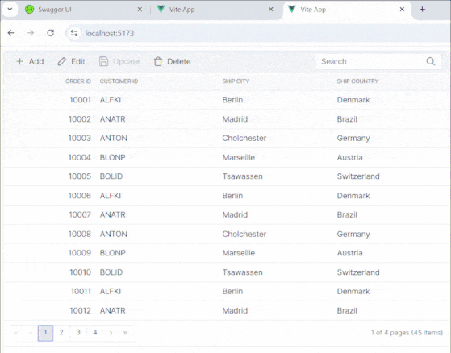

# Local data in Vue Grid component

The Syncfusion<sup style="font-size:70%">&reg;</sup> Grid offers a straightforward way to bind local data, such as arrays or JSON objects, to the grid component. This feature allows you to display and manipulate data within the grid without the need for external server calls, making it particularly useful for scenarios where you're working with static or locally stored data.

To achieve this, you can assign a JavaScript object array to the [dataSource](https://ej2.syncfusion.com/vue/documentation/api/grid/#datasource) property. Additionally, you have an option to provide the local data source using an instance of the **DataManager**.

The following example demonstrates how to utilize the local data binding feature in the Vue Grid component:









        


## Data binding with SignalR 

The syncfusion<sup style="font-size:70%">&reg;</sup> Grid provides support for real-time data binding using SignalR, allowing you to update the grid automatically as data changes on the server-side. This feature is particularly useful for applications requiring live updates and synchronization across multiple clients.

To achieve real-time data binding with SignalR in your Syncfusion<sup style="font-size:70%">&reg;</sup> Vue Grid, follow the steps below:

**Step 1:** Open Visual Studio and create an Vue and ASP.NET Core project named signalR. To create an Vue and ASP.NET Core application, follow the documentation [link](https://learn.microsoft.com/en-us/visualstudio/javascript/tutorial-asp-net-core-with-vue?view=vs-2022) for detailed steps.

**Step 2 :** Create a simple Vue Grid by following the [Getting Started](https://ej2.syncfusion.com/vue/documentation/grid/getting-started) documentation link.

**Step 3:** Install the necessary SignalR package for your client application using npm:

```ts

 npm install @microsoft/signalr — save

```

**Step 3:** Create a SignalR hub on the server-side to manage communication between clients and the server. You can create a **ChatHub.cs** file under the **Hubs** folder. Add the following code to define methods for sending data updates to clients:





using Microsoft.AspNetCore.SignalR;

namespace SignalRChat.Hubs
{
    public class ChatHub : Hub 
    {
        public async Task SendMessage(string message)
        {
            await Clients.All.SendAsync("ReceiveMessage", message);
        }
    }
}





**Step 4:** Configure the SignalR server to route requests to the SignalR hub. In the **Program.cs** file, add the following code:





using SignalR.Server.Hubs;

var builder = WebApplication.CreateBuilder(args);

// Add services to the container.
builder.Services.AddSignalR();
builder.Services.AddControllers();
// Learn more about configuring Swagger/OpenAPI at https://aka.ms/aspnetcore/swashbuckle
builder.Services.AddEndpointsApiExplorer();
builder.Services.AddSwaggerGen();

builder.Services.AddCors(options =>
{
    options.AddPolicy("CORSPolicy",
        builder => builder
        .AllowAnyMethod()
        .AllowAnyHeader()
        .AllowCredentials()
        .SetIsOriginAllowed((hosts) =>
        true));
});
var app = builder.Build();
app.UseCors("CORSPolicy");

app.UseDefaultFiles();
app.UseStaticFiles();

// Configure the HTTP request pipeline.
if (app.Environment.IsDevelopment())
{
    app.UseSwagger();
    app.UseSwaggerUI();
}

app.UseHttpsRedirection();

app.UseAuthorization();

app.MapControllers();
app.MapHub<ChatHub>("/chatHub");
app.MapFallbackToFile("/index.html");

app.Run();





**Step 6:** In your client-side code, establish a connection to the SignalR hub and configure grid data binding in the **App.vue** file.





<template>
    <div id="app">
        <ejs-grid ref="grid" :dataSource='data' :toolbar="toolbar" :editSettings="editSettings" allowSorting="true" allowPaging="true" :created="created" :actionComplete="actionComplete">
            <e-columns>
                <e-column field='OrderID' headerText='Order ID' width='120' textAlign='Right' isPrimaryKey="true"></e-column>
                <e-column field='CustomerID' headerText='Customer ID' width='160'></e-column>
                <e-column field='ShipCity' headerText='Ship City' width='150'></e-column>
                <e-column field='ShipCountry' headerText='Ship Country' width='150'></e-column>
            </e-columns>
        </ejs-grid>
    </div>
</template>
<script>
import { provide } from "vue";
import { GridComponent, ColumnDirective , ColumnsDirective, Page, Edit, Sort, Toolbar } from "@syncfusion/ej2-vue-grids";
import { DataManager, UrlAdaptor } from "@syncfusion/ej2-data";
import * as signalR from '@microsoft/signalr';
export default {
    name: "App",
    components: {
       "ejs-grid": GridComponent,
       "e-columns": ColumnsDirective,
       "e-column": ColumnDirective,
    },
    data() {
      return {
        data: new DataManager({
              url: 'https://localhost:****/api/Home',
              insertUrl: 'https://localhost:****/api/Home/Insert',
              updateUrl: 'https://localhost:****/api/Home/Update',
              removeUrl: 'https://localhost:****/api/Home/Remove',
              adaptor: new UrlAdaptor(),
        }),//Use remote server host number instead ****
      editSettings: { allowEditing: true, allowAdding: true, allowDeleting: true, mode: 'Normal' },
      toolbar: ['Add', 'Edit', 'Delete', 'Update', 'Cancel'],
      connection: new signalR.HubConnectionBuilder().withUrl("https://localhost:****/ChatHub").build() //Use remote server host number instead ****

      };
    },
    methods: {
       created: function (e) {
           this.connection.on("ReceiveMessage", (message) => {
                if (this.$refs.grid) {
                   this.$refs.grid.ej2Instances.refresh();
                }

           });
           this.connection.start()
                .then(() => {
                        console.log("SignalR connection established successfully");
                        this.connection.invoke('SendMessage', "refreshPages")
                            .catch((err) => {
                                console.error("Error sending data:", err.toString());
                            });
                    })
                    .catch((err) => {
                        console.error("Error establishing SignalR connection:", err.toString());
                    });

       },
       actionComplete: function (args) {
                if (args.requestType === "save" || args.requestType === "delete") {
                    this.connection.invoke('SendMessage', "refreshPages")
                        .catch((err) => {
                            console.error(err.toString());
                        });
                }
         }
    },
    provide: {
        grid: [Sort, Edit, Page, Toolbar]
    },
};
</script>
<style>
    @import "../node_modules/@syncfusion/ej2-base/styles/material3.css";
    @import "../node_modules/@syncfusion/ej2-buttons/styles/material3.css";
    @import "../node_modules/@syncfusion/ej2-calendars/styles/material3.css";
    @import "../node_modules/@syncfusion/ej2-dropdowns/styles/material3.css";
    @import "../node_modules/@syncfusion/ej2-inputs/styles/material3.css";
    @import "../node_modules/@syncfusion/ej2-navigations/styles/material3.css";
    @import "../node_modules/@syncfusion/ej2-popups/styles/material3.css";
    @import "../node_modules/@syncfusion/ej2-splitbuttons/styles/material3.css";
    @import "../node_modules/@syncfusion/ej2-vue-grids/styles/material3.css";
</style>




<template>
    <div id="app">
        <ejs-grid ref="grid" :dataSource='data' :toolbar="toolbar" :editSettings="editSettings" allowSorting="true" allowPaging="true" :created="created" :actionComplete="actionComplete">
            <e-columns>
                <e-column field='OrderID' headerText='Order ID' width='120' textAlign='Right' isPrimaryKey="true"></e-column>
                <e-column field='CustomerID' headerText='Customer ID' width='160'></e-column>
                <e-column field='Freight' headerText='Freight' format="C" width='150'></e-column>
                <e-column field='ShipCity' headerText='Ship City' width='150'></e-column>
                <e-column field='ShipCountry' headerText='Ship Country' width='150'></e-column>
            </e-columns>
        </ejs-grid>
    </div>
</template>
<script setup>
    import { provide, ref } from "vue";
    import { GridComponent as EjsGrid, ColumnDirective as EColumn, ColumnsDirective as EColumns, Page, Edit, Sort, Filter, Toolbar } from "@syncfusion/ej2-vue-grids";
    import { DataManager, UrlAdaptor } from "@syncfusion/ej2-data";
    import * as signalR from '@microsoft/signalr';
    const grid = ref(null);

    const data = new DataManager({
        url: 'https://localhost:****/api/Home',
        insertUrl: 'https://localhost:****/api/Home/Insert',
        updateUrl: 'https://localhost:****/api/Home/Update',
        removeUrl: 'https://localhost:****/api/Home/Remove',
        adaptor: new UrlAdaptor(),
    });//Use remote server host number instead ****

    let connection = new signalR.HubConnectionBuilder().withUrl("https://localhost:****/ChatHub").build();//Use remote server host number instead ****
    const editSettings = { allowEditing: true, allowAdding: true, allowDeleting: true };
    const toolbar = ['Add', 'Edit', 'Update', 'Delete', 'Search'];
    const created = function () {
        connection.on("ReceiveMessage", (message) => {
            if (grid.value) {
                grid.value.ej2Instances.refresh();
            }

        });

        connection.start()
            .then(() => {
                console.log("SignalR connection established successfully");
                connection.invoke('SendMessage', "refreshPages")
                    .catch((err) => {
                        console.error("Error sending data:", err.toString());
                    });
            })
            .catch((err) => {
                console.error("Error establishing SignalR connection:", err.toString());
            });
    };
    const actionComplete = function (args) {
        if (args.requestType === "save" || args.requestType === "delete") {
            connection.invoke('SendMessage', "refreshPages")
                .catch((err) => {
                    console.error(err.toString());
                });
        }
    }
    provide('grid', [Sort, Edit, Filter, Page, Toolbar]);

</script>
<style>
    @import "../node_modules/@syncfusion/ej2-base/styles/material3.css";
    @import "../node_modules/@syncfusion/ej2-buttons/styles/material3.css";
    @import "../node_modules/@syncfusion/ej2-calendars/styles/material3.css";
    @import "../node_modules/@syncfusion/ej2-dropdowns/styles/material3.css";
    @import "../node_modules/@syncfusion/ej2-inputs/styles/material3.css";
    @import "../node_modules/@syncfusion/ej2-navigations/styles/material3.css";
    @import "../node_modules/@syncfusion/ej2-popups/styles/material3.css";
    @import "../node_modules/@syncfusion/ej2-splitbuttons/styles/material3.css";
    @import "../node_modules/@syncfusion/ej2-vue-grids/styles/material3.css";
</style>






**Step 6** : Create a controller on the server-side to manage data operations such as fetching, updating, inserting, and deleting records. You can create a **HomeController.cs** file under the **Controllers** folder. Add the following code to define methods for sending data updates to clients.






using Microsoft.AspNetCore.Mvc;
using SignalR.Server.Models;
using Microsoft.AspNetCore.Http;
using Syncfusion.EJ2.Base;

namespace SignalR.Server.Controllers
{
    
    [ApiController]
    public class HomeController : Controller
    {
        [HttpPost]
        [Route("api/[controller]")]
        public object Post([FromBody] DataManagerRequest DataManagerRequest)
        {
            // Retrieve data from the data source (e.g., database)
            IQueryable<OrdersDetails> DataSource = GetOrderData().AsQueryable();

            QueryableOperation queryableOperation = new QueryableOperation(); // Initialize DataOperations instance

            // Handling searching operation
            if (DataManagerRequest.Search != null && DataManagerRequest.Search.Count > 0)
            {
                DataSource = queryableOperation.PerformSearching(DataSource, DataManagerRequest.Search);
            }

            // Handling filtering operation
            if (DataManagerRequest.Where != null && DataManagerRequest.Where.Count > 0)
            {
                foreach (var condition in DataManagerRequest.Where)
                {
                    foreach (var predicate in condition.predicates)
                    {
                        DataSource = queryableOperation.PerformFiltering(DataSource, DataManagerRequest.Where, predicate.Operator);
                    }
                }
            }

            // Handling sorting operation
            if (DataManagerRequest.Sorted != null && DataManagerRequest.Sorted.Count > 0)
            {
                DataSource = queryableOperation.PerformSorting(DataSource, DataManagerRequest.Sorted);
            }

            // Get the total count of records
            int totalRecordsCount = DataSource.Count();

            // Handling paging operation.
            if (DataManagerRequest.Skip != 0)
            {
                DataSource = queryableOperation.PerformSkip(DataSource, DataManagerRequest.Skip);
            }
            if (DataManagerRequest.Take != 0)
            {
                DataSource = queryableOperation.PerformTake(DataSource, DataManagerRequest.Take);
            }

            // Return data based on the request
            return new { result = DataSource, count = totalRecordsCount };
        }

        [HttpGet]
        [Route("api/[controller]")]
        public List<OrdersDetails> GetOrderData()
        {
            var data = OrdersDetails.GetAllRecords().ToList();
            return data;
        }

        /// <summary>
        /// Inserts a new data item into the data collection.
        /// </summary>
        /// <param name="newRecord">It contains the new record detail which is need to be inserted.</param>
        /// <returns>Returns void</returns>
        [HttpPost]
        [Route("api/Home/Insert")]
        public void Insert([FromBody] CRUDModel<OrdersDetails> newRecord)
        {
            if (newRecord.value != null)
            {
                OrdersDetails.GetAllRecords().Insert(0, newRecord.value);
            }
        }

        /// <summary>
        /// Update a existing data item from the data collection.
        /// </summary>
        /// <param name="Order">It contains the updated record detail which is need to be updated.</param>
        /// <returns>Returns void</returns>
        [HttpPost]
        [Route("api/Home/Update")]
        public void Update([FromBody] CRUDModel<OrdersDetails> Order)
        {
            var updatedOrder = Order.value;
            if (updatedOrder != null)
            {
                var data = OrdersDetails.GetAllRecords().FirstOrDefault(or => or.OrderID == updatedOrder.OrderID);
                if (data != null)
                {
                    // Update the existing record
                    data.OrderID = updatedOrder.OrderID;
                    data.CustomerID = updatedOrder.CustomerID;
                    data.ShipCity = updatedOrder.ShipCity;
                    data.ShipCountry = updatedOrder.ShipCountry;
                }
            }

        }
        /// <summary>
        /// Remove a specific data item from the data collection.
        /// </summary>
        /// <param name="value">It contains the specific record detail which is need to be removed.</param>
        /// <return>Returns void</return>
        [HttpPost]
        [Route("api/Home/Remove")]
        public void Remove([FromBody] CRUDModel<OrdersDetails> value)
        {
            int orderId = int.Parse((value.key).ToString());
            var data = OrdersDetails.GetAllRecords().FirstOrDefault(orderData => orderData.OrderID == orderId);
            if (data != null)
            {
                // Remove the record from the data collection
                OrdersDetails.GetAllRecords().Remove(data);
            }
        }

        public class CRUDModel<T> where T : class
        {

            public string? action { get; set; }

            public string? keyColumn { get; set; }

            public object? key { get; set; }

            public T? value { get; set; }

            public List<T>? added { get; set; }

            public List<T>? changed { get; set; }

            public List<T>? deleted { get; set; }

            public IDictionary<string, object>? @params { get; set; }
        }
    }
}






**Step 6 :** Define a model class to represent the data structure. You can create an **OrdersDetails.cs** file under the **Models** folder. Add the following code.





namespace SignalR.Server.Models
{
    public class OrdersDetails
    {
        public static List<OrdersDetails> order = new List<OrdersDetails>();
        public OrdersDetails()
        {

        }
        public OrdersDetails(
        int OrderID, string CustomerId, int EmployeeId, double Freight, bool Verified,
        DateTime OrderDate, string ShipCity, string ShipName, string ShipCountry,
        DateTime ShippedDate, string ShipAddress)
        {
            this.OrderID = OrderID;
            this.CustomerID = CustomerId;
            this.EmployeeID = EmployeeId;
            this.Freight = Freight;
            this.ShipCity = ShipCity;
            this.Verified = Verified;
            this.OrderDate = OrderDate;
            this.ShipName = ShipName;
            this.ShipCountry = ShipCountry;
            this.ShippedDate = ShippedDate;
            this.ShipAddress = ShipAddress;
        }

        public static List<OrdersDetails> GetAllRecords()
        {
            if (order.Count() == 0)
            {
                int code = 10000;
                for (int i = 1; i < 10; i++)
                {
                    order.Add(new OrdersDetails(code + 1, "ALFKI", i + 0, 2.3 * i, false, new DateTime(1991, 05, 15), "Berlin", "Simons bistro", "Denmark", new DateTime(1996, 7, 16), "Kirchgasse 6"));
                    order.Add(new OrdersDetails(code + 2, "ANATR", i + 2, 3.3 * i, true, new DateTime(1990, 04, 04), "Madrid", "Queen Cozinha", "Brazil", new DateTime(1996, 9, 11), "Avda. Azteca 123"));
                    order.Add(new OrdersDetails(code + 3, "ANTON", i + 1, 4.3 * i, true, new DateTime(1957, 11, 30), "Cholchester", "Frankenversand", "Germany", new DateTime(1996, 10, 7), "Carrera 52 con Ave. Bolívar #65-98 Llano Largo"));
                    order.Add(new OrdersDetails(code + 4, "BLONP", i + 3, 5.3 * i, false, new DateTime(1930, 10, 22), "Marseille", "Ernst Handel", "Austria", new DateTime(1996, 12, 30), "Magazinweg 7"));
                    order.Add(new OrdersDetails(code + 5, "BOLID", i + 4, 6.3 * i, true, new DateTime(1953, 02, 18), "Tsawassen", "Hanari Carnes", "Switzerland", new DateTime(1997, 12, 3), "1029 - 12th Ave. S."));
                    code += 5;
                }
            }
            return order;
        }

        public int? OrderID { get; set; }
        public string? CustomerID { get; set; }
        public int? EmployeeID { get; set; }
        public double? Freight { get; set; }
        public string? ShipCity { get; set; }
        public bool? Verified { get; set; }
        public DateTime OrderDate { get; set; }
        public string? ShipName { get; set; }
        public string? ShipCountry { get; set; }
        public DateTime ShippedDate { get; set; }
        public string? ShipAddress { get; set; }
    }
}






The following screenshot represents the addition, editing, and deletion operations performed, reflecting changes across all client sides.



> You can find a complete sample for signalR on [GitHub](https://github.com/SyncfusionExamples/Binding-data-with-SignalR-in-ej2-vue-grid).

## Binding data from excel file

The Syncfusion<sup style="font-size:70%">&reg;</sup> Grid component allows you to import data from Excel files into your web application for display and manipulation within the grid. This feature streamlines the process of transferring Excel data to a web-based environment. This can be achieved by using [Uploader](https://ej2.syncfusion.com/vue/documentation/uploader/getting-started) component [change](https://ej2.syncfusion.com/vue/documentation/api/uploader#change) event.

To import excel data in to grid, you can follow these steps:

1. Import excel file using Uploader component. 
2. Parse the excel file data using **XLSX** library.
3. Bind the JSON to the grid component. 

The following example demonstrates how to import Excel data into the grid by utilizing the [Uploader](https://ej2.syncfusion.com/vue/documentation/uploader/getting-started) component's `change` event along with the **XLSX** library:









        


## Binding data and performing CRUD actions via Fetch request

The Syncfusion<sup style="font-size:70%">&reg;</sup> Grid provides a seamless way to bind data from external sources using Fetch requests, facilitating CRUD (Create, Read, Update, Delete) operations with data retrieved from a server. This feature is particularly valuable for sending data to a server for database updates and asynchronously retrieving data without refreshing the entire web page.

To achieve data binding and perform CRUD actions using Ajax requests in the Syncfusion<sup style="font-size:70%">&reg;</sup> Grid, follow these steps:

**Step 1:** Open Visual Studio and create an Vue and ASP.NET Core project named FetchProject. To create an Vue and ASP.NET Core application, follow the documentation [link](https://learn.microsoft.com/en-us/visualstudio/javascript/tutorial-asp-net-core-with-vue?view=vs-2022) for detailed steps.

**Step 2:** Include the Syncfusion<sup style="font-size:70%">&reg;</sup> Grid in your HTML with necessary configurations:

```html

        <ejs-button cssClass='e-success' @click="click">Bind data via Fetch</ejs-button>
        <div style="padding: 20px 17px 0 0">
            <ejs-grid ref="grid" :dataSource='data' :editSettings='editSettings' :toolbar='toolbar' allowPaging="true" height="320" :actionBegin="actionBegin" :actionComplete="actionComplete">
                <e-columns>
                    <e-column field='OrderID' headerText='Order ID' isPrimaryKey=true width='150'></e-column>
                    <e-column field='CustomerID' headerText='Customer Name' width='150'></e-column>
                    <e-column field='Freight' headerText='Freight' format="C" width='150'></e-column>
                    <e-column field='ShipCity' headerText='ShipCity' width='150' textAlign='Right'></e-column>
                </e-columns>
            </ejs-grid>
        </div>
```

**Step 3:** To bind data from an external Fetch request, utilize the [dataSource](https://ej2.syncfusion.com/vue/documentation/api/grid/#datasource) property of the Grid. Fetch data from the server and provide it to the `dataSource` property using the `onSuccess` event of the Fetch request.

```ts

    click: function () {
        const fetchRequest = new fetch("https://localhost:****/Home/Getdata", 'POST');//Use remote server host number instead ****
        fetchRequest.send();
        fetchRequest.onSuccess = (data) => {
            this.$refs.grid.ej2Instances.dataSource = data;
        };
    }

```

On the server side, there is a method named **GetData** within the HomeController that contains the grid's data source. When the button is clicked, an Fetch request is sent to fetch the data from the server and bind it to the Grid component.

```cs

public class HomeController : Controller
    {        
    public ActionResult Getdata()
        {
            IEnumerable DataSource = OrdersDetails.GetAllRecords();
            return Json(DataSource);
        } 
    }

```

 Create a model class named **OrdersDetails.cs** in the server-side Models folder to represent the order data.   

```cs 

    public class OrdersDetails
       {
        public OrdersDetails()
           {

           }
        public OrdersDetails(int OrderID, string CustomerId, int EmployeeId, double Freight, bool Verified, DateTime OrderDate, string ShipCity, string ShipName, string ShipCountry, DateTime ShippedDate, string ShipAddress)
        {
            this.OrderID = OrderID;
            this.CustomerID = CustomerId;
            this.EmployeeID = EmployeeId;
            this.Freight = Freight;
            this.ShipCity = ShipCity;
            this.Verified = Verified;
            this.OrderDate = OrderDate;
            this.ShipName = ShipName;
            this.ShipCountry = ShipCountry;
            this.ShippedDate = ShippedDate;
            this.ShipAddress = ShipAddress;
        }
        //Render data in this method
        public static List<OrdersDetails> GetAllRecords()
        {
            List<OrdersDetails> order = new List<OrdersDetails>();
            int code = 10000;
            for (int i = 1; i < 10; i++)
            {
                order.Add(new OrdersDetails(code + 1, "ALFKI", i + 0, 2.3 * i, false, new DateTime(1991, 05, 15), "Berlin", "Simons bistro", "Denmark", new DateTime(1996, 7, 16), "Kirchgasse 6"));
                order.Add(new OrdersDetails(code + 2, "ANATR", i + 2, 3.3 * i, true, new DateTime(1990, 04, 04), "Madrid", "Queen Cozinha", "Brazil", new DateTime(1996, 9, 11), "Avda. Azteca 123"));
                order.Add(new OrdersDetails(code + 3, "ANTON", i + 1, 4.3 * i, true, new DateTime(1957, 11, 30), "Cholchester", "Frankenversand", "Germany", new DateTime(1996, 10, 7), "Carrera 52 con Ave. Bolívar #65-98 Llano Largo"));
                order.Add(new OrdersDetails(code + 4, "BLONP", i + 3, 5.3 * i, false, new DateTime(1930, 10, 22), "Marseille", "Ernst Handel", "Austria", new DateTime(1996, 12, 30), "Magazinweg 7"));
                order.Add(new OrdersDetails(code + 5, "BOLID", i + 4, 6.3 * i, true, new DateTime(1953, 02, 18), "Tsawassen", "Hanari Carnes", "Switzerland", new DateTime(1997, 12, 3), "1029 - 12th Ave. S."));
                code += 5;
            }
            return order;
        }

        public int? OrderID { get; set; }
        public string CustomerID { get; set; }
        public int? EmployeeID { get; set; }
        public double? Freight { get; set; }
        public string ShipCity { get; set; }
        public bool Verified { get; set; }
        public DateTime OrderDate { get; set; }
        public string ShipName { get; set; }
        public string ShipCountry { get; set; }
        public DateTime ShippedDate { get; set; }
        public string ShipAddress { get; set; }
    }    


```

**Step 4:** To perform CRUD actions, leverage the [actionBegin](https://ej2.syncfusion.com/vue/documentation/api/grid/#actionbegin) event. You can cancel the default CRUD operations by utilizing the **cancel** argument provided by this event. This allows you to dynamically call your server-side method using Fetch, along with the relevant data received from the `actionBegin` event, to update your server data accordingly.

A. To add and save a new record using Fetch requests, follow these steps:

```ts
       public flag = false;

        actionBegin: function (e) {
            // Initially this.flag needs to be false in order to enter this condition
            if (!this.flag) {
                 // Add and edit operations
                if (e.requestType == 'save' && (e.action == 'add')) {
                    var editedData = e.data;
                     // The default edit operation is cancelled
                    e.cancel = true;
                    // Here you can send the updated data to your server using fetch call
                    var fetchRequest= new Fetch({
                        url: 'https://localhost:****/Home/Insert',  //Use remote server host number instead ****
                        type: 'POST',
                        contentType: 'application/json; charset=utf-8',
                        data: JSON.stringify({ value: editedData })
                    });
                    fetchRequest.onSuccess = () => {
                    // this.flag is enabled to skip this execution when grid ends add/edit
                        this.flag = true;
                        //The added/edited data will be saved in the Grid
                        this.$refs.grid.ej2Instances.endEdit();
                    };
                    fetchRequest.onFailure = () => {
                        // Add/edit failed
                        // The this.flag is disabled if operation is failed so that it can enter the condition on next execution
                    this.flag = false;
                    };
                    fetchRequest.send();
                }
            }
        }
```

```ts
//insert the record in server side
    public ActionResult Insert(OrdersDetails value)
        {
            OrdersDetails.GetAllRecords().Insert(0, value);
            return Json(value);
        }

```

B. To edit and save a record using an Fetch request, follow these steps:

```ts

        public flag = false;

        actionBegin: function (e) {
            // Initially this.flag needs to be false in order to enter this condition
            if (!this.flag) {
                if (e.requestType == 'save' && (e.action == "edit")) {
                    var editedData = e.data;
                    // The default edit operation is cancelled
                    e.cancel = true;
                    // Here you can send the updated data to your server using fetch call
                    var fetchRequest = new Fetch({
                        url: 'https://localhost:****/Home/Update', //Use remote server host number instead ****
                        type: 'POST',
                        contentType: 'application/json; charset=utf-8',
                        data: JSON.stringify({ value: editedData })
                    });
                    fetchRequest.onSuccess = () => {
                        // this.flag is enabled to skip this execution when grid ends add/edit
                            this.flag = true;
                        // The added/edited data will be saved in the Grid
                            this.$refs.grid.ej2Instances.endEdit();
                    };
                    fetchRequest.onFailure = () => {
                        // Add/edit failed
                        // The this.flag is disabled if operation is failed so that it can enter the condition on next executio
                        this.flag = false;
                    };
                    fetchRequest.send();
                }
            }   
        }

```

```cs
//update the record in server side
public ActionResult Update(OrdersDetails value)
        {
            var ord = value;
            OrdersDetails val = OrdersDetails.GetAllRecords().Where(or => or.OrderID == ord.OrderID).FirstOrDefault();
            val.OrderID = ord.OrderID;
            val.EmployeeID = ord.EmployeeID;
            val.CustomerID = ord.CustomerID;
            return Json(value);
        }

```

C. To delete a record using an Fetch request, follow these steps:

```ts
        public flag = false;

        actionBegin: function (e) {
            // Initially this.flag needs to be false in order to enter this condition
            if (!this.flag) {
                if (e.requestType == 'delete') {
                    var editedData = e.data;
                    // The default delete operation is cancelled
                   e.cancel = true;
                    // Here you can send the deleted data to your server using fetch call
                   var fetchRequest = new Fetch({
                        url: 'https://localhost:****/Home/Delete', //Use remote server host number instead ****
                        type: 'POST',
                        contentType: 'application/json; charset=utf-8',
                        data: JSON.stringify({ key: editedData[0][this.$refs.grid.ej2Instances.getPrimaryKeyFieldNames()[0]] })
                   });
                   fetchRequest.onSuccess = () => {
                    // this.flag is enabled to skip this execution when grid deletes record
                       this.flag = true;
                    // The deleted data will be removed in the Grid
                       this.$refs.grid.ej2Instances.deleteRecord();
                    };
                    fetchRequest.onFailure = () => {
                        // Delete failed
                        // The this.flag is disabled if operation is failed so that it can enter the condition on next execution
                        this.flag = false;
                    };
                  fetchRequest.send();
               }  
            }
       }

```

```cs
//Delete the record in server side
  public ActionResult Delete(int key)
        {
            OrdersDetails.GetAllRecords().Remove(OrdersDetails.GetAllRecords().Where(or => or.OrderID == key).FirstOrDefault());
            var data = OrdersDetails.GetAllRecords();
            return Json(data);
        }

```

**Step 5:**  In the Fetch success event, you have the flexibility to utilize the Grid's [endEdit](https://ej2.syncfusion.com/vue/documentation/api/grid/#endedit) and [deleteRecord](https://ej2.syncfusion.com/vue/documentation/api/grid/#deleterecord) methods to handle the addition, editing, and deletion of corresponding data in the Grid. However, invoking these methods triggers the `actionBegin` event once again to save the changes in the Grid. To prevent this behavior and maintain control over the execution flow, you can employ a flag variable and manage it within the `actionComplete` and Fetch failure events: The following code snippet demonstrates this approach:

```ts
        actionComplete: function (e){
            if (e.requestType === 'save' || e.requestType === 'delete') {
                // The this.flag is disabled after operation is successfully performed so that it can enter the condition on next execution
                this.flag = false;
            }
        }

```

The following example demonstrates client-side and server-side code on how to bind data and perform CRUD actions via Fetch:




<template>
    <div id="app">
        <ejs-button cssClass='e-success' @click="click">Bind data via fetch</ejs-button>
        <div style="padding: 20px 17px 0 0">
            <ejs-grid ref="grid" :editSettings='editSettings' :toolbar='toolbar' allowPaging="true" height="320" :actionBegin="actionBegin" :actionComplete="actionComplete">
                <e-columns>
                    <e-column field='OrderID' headerText='Order ID' isPrimaryKey=true width='150'></e-column>
                    <e-column field='CustomerID' headerText='Customer Name' width='150'></e-column>
                    <e-column field='Freight' headerText='Freight' format="C" width='150'></e-column>
                    <e-column field='ShipCity' headerText='ShipCity' width='150' textAlign='Right'></e-column>
                </e-columns>
            </ejs-grid>
        </div>
    </div>
</template>

<script setup>
    import { provide, ref } from "vue";
    import { GridComponent as EjsGrid, ColumnDirective as EColumn, ColumnsDirective as EColumns, Page, Edit, Toolbar } from "@syncfusion/ej2-vue-grids";
    import { ButtonComponent as EjsButton } from "@syncfusion/ej2-vue-buttons";
    import { Fetch } from '@syncfusion/ej2-base';

    const grid = ref(null);
    let flag = false;
    const editSettings = { allowEditing: true, allowAdding: true, allowDeleting: true, mode: 'Normal' };
    const toolbar = ['Add', 'Edit', 'Delete', 'Update', 'Cancel'];
    const click = function () {
        const fetchRequest = new Fetch("https://localhost:****/Home/Getdata", 'POST'); // Use remote server host number instead ****
        fetchRequest.send();
        fetchRequest.onSuccess = (data) => {
            grid.value.ej2Instances.dataSource = data;
        };
    };

    const actionBegin = function (e) {
        // Initially this.flag needs to be false in order to enter this condition
        if (!flag) {
            // Add and edit operations
            if (e.requestType === 'save' && (e.action === 'add')) {
                var editedData = e.data;
                // The default edit operation is cancelled
                e.cancel = true;
                // Here you can send the updated data to your server using fetch call
                const fetchRequest = new Fetch({
                    url: 'https://localhost:****/Home/Insert',//Use remote server host number instead ****
                    type: 'POST',
                    contentType: 'application/json; charset=utf-8',
                    data: JSON.stringify({ value: editedData })
                }); // Use remote server host number instead ****
                fetchRequest.onSuccess = () => {
                    // this.flag is enabled to skip this execution when grid ends add/edit
                    flag = true;
                    // The added/edited data will be saved in the Grid
                    grid.value.ej2Instances.endEdit();
                };
                fetchRequest.onFailure = () => {
                    // Add/edit failed
                    // The this.flag is disabled if operation is failed so that it can enter the condition on next execution
                    flag = false;
                };
                fetch.send();
            }
            if (e.requestType === 'save' && (e.action === "edit")) {
                var editedData = e.data;
                // The default edit operation is cancelled
                e.cancel = true;
                // Here you can send the updated data to your server using fetch call
                const fetchRequest = new Fetch({
                    url: 'https://localhost:****/Home/Update',//Use remote server host number instead ****
                    type: 'POST',
                    contentType: 'application/json; charset=utf-8',
                    data: JSON.stringify({ value: editedData })
                }); // Use remote server host number instead ****
                fetchRequest.onSuccess = () => {
                    // this.flag is enabled to skip this execution when grid ends add/edit
                    flag = true;
                    // The added/edited data will be saved in the Grid
                    grid.value.ej2Instances.endEdit();
                };
                fetchRequest.onFailure = () => {
                    // Add/edit failed
                    // The this.flag is disabled if operation is failed so that it can enter the condition on next execution
                    flag = false;
                };
                fetchRequest.send();
            }

            if (e.requestType === 'delete') {
                var editedData = e.data;
                // The default delete operation is cancelled
                e.cancel = true;
                // Here you can send the deleted data to your server using fetch call
                const fetchRequest = new Fetch({
                    url: 'https://localhost:****/Home/Delete', //Use remote server host number instead ****
                    type: 'POST',
                    contentType: 'application/json; charset=utf-8',
                    data: JSON.stringify({ key: editedData[0][grid.value.ej2Instances.getPrimaryKeyFieldNames()[0]] })
                }); // Use remote server host number instead ****
                fetchRequest.onSuccess = () => {
                    // this.flag is enabled to skip this execution when grid deletes record
                    flag = true;
                    // The deleted data will be removed in the Grid
                    grid.value.ej2Instances.deleteRecord();
                };
                fetchRequest.onFailure = () => {
                    // Delete failed
                    // The this.flag is disabled if operation is failed so that it can enter the condition on next execution
                    flag = false;
                };
                fetchRequest.send();
            }
        }
    };

    const actionComplete = function (e) {
        if (e.requestType === 'save' || e.requestType === 'delete') {
            // The this.flag is disabled after operation is successfully performed so that it can enter the condition on next execution
            flag = false;
        }
    };

    provide('grid', [Page, Edit, Toolbar]);
</script>

<style>
    @import "../node_modules/@syncfusion/ej2-base/styles/material3.css";
    @import "../node_modules/@syncfusion/ej2-buttons/styles/material3.css";
    @import "../node_modules/@syncfusion/ej2-calendars/styles/material3.css";
    @import "../node_modules/@syncfusion/ej2-dropdowns/styles/material3.css";
    @import "../node_modules/@syncfusion/ej2-inputs/styles/material3.css";
    @import "../node_modules/@syncfusion/ej2-navigations/styles/material3.css";
    @import "../node_modules/@syncfusion/ej2-popups/styles/material3.css";
    @import "../node_modules/@syncfusion/ej2-splitbuttons/styles/material3.css";
    @import "../node_modules/@syncfusion/ej2-vue-grids/styles/material3.css";
    @import "../node_modules/@syncfusion/ej2-vue-grids/styles/material.css";
</style>




<template>
    <div id="app">
        <ejs-button cssClass='e-success' @click="click">Bind data via fetch</ejs-button>
        <div style="padding: 20px 17px 0 0">
            <ejs-grid ref="grid" :editSettings='editSettings' :toolbar='toolbar' allowPaging="true" height="320" :actionBegin="actionBegin" :actionComplete="actionComplete">
                <e-columns>
                    <e-column field='OrderID' headerText='Order ID' isPrimaryKey=true width='150'></e-column>
                    <e-column field='CustomerID' headerText='Customer Name' width='150'></e-column>
                    <e-column field='Freight' headerText='Freight' format="C" width='150'></e-column>
                    <e-column field='ShipCity' headerText='ShipCity' width='150' textAlign='Right'></e-column>
                </e-columns>
            </ejs-grid>
        </div>
    </div>
</template>

<script>
    import { GridComponent, ColumnsDirective, ColumnDirective, Page, Edit, Toolbar } from "@syncfusion/ej2-vue-grids";
    import { ButtonComponent } from "@syncfusion/ej2-vue-buttons";
    import { Fetch } from '@syncfusion/ej2-base';

    export default {
        name: "App",
        components: {
            "ejs-grid": GridComponent,
            "e-columns": ColumnsDirective,
            "e-column": ColumnDirective,
            "ejs-button": ButtonComponent
        },
        data() {
            return {
                flag: false,
                editSettings: { allowEditing: true, allowAdding: true, allowDeleting: true, mode: 'Normal' },
                toolbar: ['Add', 'Edit', 'Delete', 'Update', 'Cancel']
            };
        },
        methods: {
            click: function () {
                const fetchRequest = new Fetch("https://localhost:****/Home/Getdata", 'POST'); //Use remote server host number instead ****
                fetchRequest.send();
                fetchRequest.onSuccess = (data) => {
                    this.$refs.grid.ej2Instances.dataSource = data;
                };
            },
            actionBegin: function (e) {
                if (!this.flag) {
                    if (e.requestType == 'save' && (e.action == 'add')) {
                        var editedData = e.data;
                        e.cancel = true;
                        var fetchRequest = new Fetch({
                            url: 'https://localhost:****/Home/Insert',
                            type: 'POST',
                            contentType: 'application/json; charset=utf-8',
                            data: JSON.stringify({ value: editedData })
                        });
                        fetchRequest.onSuccess = () => {
                            this.flag = true;
                            this.$refs.grid.ej2Instances.endEdit();
                        };
                        fetchRequest.onFailure = () => {
                            this.flag = false;
                        };
                        fetchRequest.send();
                    }
                    if (e.requestType == 'save' && (e.action == "edit")) {
                        var editedData = e.data;
                        e.cancel = true;
                        var fetchRequest = new Fetch({
                            url: 'https://localhost:****/Home/Update',
                            type: 'POST',
                            contentType: 'application/json; charset=utf-8',
                            data: JSON.stringify({ value: editedData })
                        });
                        fetchRequest.onSuccess = () => {
                            this.flag = true;
                            this.$refs.grid.ej2Instances.endEdit();
                        };
                        fetchRequest.onFailure = () => {
                            this.flag = false;
                        };
                        fetchRequest.send();
                    }
                    if (e.requestType == 'delete') {
                        var editedData = e.data;
                        e.cancel = true;
                        var fetchRequest = new Fetch({
                            url: 'https://localhost:****/Home/Delete',
                            type: 'POST',
                            contentType: 'application/json; charset=utf-8',
                            data: JSON.stringify({ key: editedData[0][this.$refs.grid.ej2Instances.getPrimaryKeyFieldNames()[0]] })
                        });
                        fetchRequest.onSuccess = () => {
                            this.flag = true;
                            this.$refs.grid.ej2Instances.deleteRecord();
                        };
                        fetchRequest.onFailure = () => {
                            this.flag = false;
                        };
                        fetchRequest.send();
                    }
                }
            },
            actionComplete: function (e) {
                if (e.requestType === 'save' || e.requestType === 'delete') {
                    this.flag = false;
                }
            }
        },
        provide: {
            grid: [Page, Edit, Toolbar]
        },
    };
</script>

<style>
    @import "../node_modules/@syncfusion/ej2-base/styles/material3.css";
    @import "../node_modules/@syncfusion/ej2-buttons/styles/material3.css";
    @import "../node_modules/@syncfusion/ej2-calendars/styles/material3.css";
    @import "../node_modules/@syncfusion/ej2-dropdowns/styles/material3.css";
    @import "../node_modules/@syncfusion/ej2-inputs/styles/material3.css";
    @import "../node_modules/@syncfusion/ej2-navigations/styles/material3.css";
    @import "../node_modules/@syncfusion/ej2-popups/styles/material3.css";
    @import "../node_modules/@syncfusion/ej2-splitbuttons/styles/material3.css";
    @import "../node_modules/@syncfusion/ej2-vue-grids/styles/material3.css";
</style>






using FetchProject.Server.Models;
using Microsoft.AspNetCore.Mvc;

namespace FetchProject.Server.Controllers
{
    public class HomeController : Controller
    {
        public ActionResult Getdata()
        {
            var DataSource = OrdersDetails.GetAllRecords();
            return Json(DataSource);
        }

        public ActionResult Update([FromBody] CRUDModel<OrdersDetails> value)
        {
            var ord = value.value;
            OrdersDetails val = OrdersDetails.GetAllRecords().Where(or => or.OrderID == ord.OrderID).FirstOrDefault();
            val.OrderID = ord.OrderID;
            val.EmployeeID = ord.EmployeeID;
            val.CustomerID = ord.CustomerID;
            val.Freight = ord.Freight;
            val.OrderDate = ord.OrderDate;
            val.ShipCity = ord.ShipCity;
            val.ShipCountry = ord.ShipCountry;

            return Json(value.value);
        }


        //insert the record
        public ActionResult Insert([FromBody] CRUDModel<OrdersDetails> value)
        {

            OrdersDetails.GetAllRecords().Insert(0, value.value);
            return Json(value.value);
        }

        //Delete the record
        public ActionResult Delete(int key)
        {
            OrdersDetails.GetAllRecords().Remove(OrdersDetails.GetAllRecords().Where(or => or.OrderID == key).FirstOrDefault());
            var data = OrdersDetails.GetAllRecords();
            return Json(data);
        }
    }
}
public class CRUDModel<T> where T : class
{
    public string action { get; set; }
    public string table { get; set; }
    public string keyColumn { get; set; }
    public object key { get; set; }
    public T value { get; set; }
    public List<T> added { get; set; }
    public List<T> changed { get; set; }
    public List<T> deleted { get; set; }
    public IDictionary<string, object> @params { get; set; }
}






namespace FetchProject.Server.Models
{
    public class OrdersDetails
    {
        public static List<OrdersDetails> order = new List<OrdersDetails>();
        public OrdersDetails()
        {

        }
        public OrdersDetails(
        int OrderID, string CustomerId, int EmployeeId, double Freight, bool Verified,
        DateTime OrderDate, string ShipCity, string ShipName, string ShipCountry,
        DateTime ShippedDate, string ShipAddress)
        {
            this.OrderID = OrderID;
            this.CustomerID = CustomerId;
            this.EmployeeID = EmployeeId;
            this.Freight = Freight;
            this.ShipCity = ShipCity;
            this.Verified = Verified;
            this.OrderDate = OrderDate;
            this.ShipName = ShipName;
            this.ShipCountry = ShipCountry;
            this.ShippedDate = ShippedDate;
            this.ShipAddress = ShipAddress;
        }

        public static List<OrdersDetails> GetAllRecords()
        {
            List<OrdersDetails> order = new List<OrdersDetails>();
            int code = 10000;
            for (int i = 1; i < 10; i++)
            {
                order.Add(new OrdersDetails(code + 1, "ALFKI", i + 0, 2.3 * i, false, new DateTime(1991, 05, 15), "Berlin", "Simons bistro", "Denmark", new DateTime(1996, 7, 16), "Kirchgasse 6"));
                order.Add(new OrdersDetails(code + 2, "ANATR", i + 2, 3.3 * i, true, new DateTime(1990, 04, 04), "Madrid", "Queen Cozinha", "Brazil", new DateTime(1996, 9, 11), "Avda. Azteca 123"));
                order.Add(new OrdersDetails(code + 3, "ANTON", i + 1, 4.3 * i, true, new DateTime(1957, 11, 30), "Cholchester", "Frankenversand", "Germany", new DateTime(1996, 10, 7), "Carrera 52 con Ave. Bolívar #65-98 Llano Largo"));
                order.Add(new OrdersDetails(code + 4, "BLONP", i + 3, 5.3 * i, false, new DateTime(1930, 10, 22), "Marseille", "Ernst Handel", "Austria", new DateTime(1996, 12, 30), "Magazinweg 7"));
                order.Add(new OrdersDetails(code + 5, "BOLID", i + 4, 6.3 * i, true, new DateTime(1953, 02, 18), "Tsawassen", "Hanari Carnes", "Switzerland", new DateTime(1997, 12, 3), "1029 - 12th Ave. S."));
                code += 5;
            }
            return order;
        }

        public int? OrderID { get; set; }
        public string CustomerID { get; set; }
        public int? EmployeeID { get; set; }
        public double? Freight { get; set; }
        public string ShipCity { get; set; }
        public bool Verified { get; set; }
        public DateTime OrderDate { get; set; }
        public string ShipName { get; set; }
        public string ShipCountry { get; set; }
        public DateTime ShippedDate { get; set; }
        public string ShipAddress { get; set; }
    }
}






    var builder = WebApplication.CreateBuilder(args);

    // Add services to the container.
    builder.Services.AddControllers();
    builder.Services.AddEndpointsApiExplorer();
    builder.Services.AddSwaggerGen();

    builder.Services.AddCors(options =>
    {
        options.AddDefaultPolicy(builder =>
        {
            builder.AllowAnyOrigin().AllowAnyMethod().AllowAnyHeader();
        });
    });

    var app = builder.Build();

    // Configure HTTPS redirection
    app.UseHttpsRedirection();

    // Configure CORS
    app.UseCors();

    app.UseDefaultFiles();
    app.UseStaticFiles();

    // Configure Swagger
    if (app.Environment.IsDevelopment())
    {
        app.UseSwagger();
        app.UseSwaggerUI();
    }

    app.UseAuthorization();

    app.MapControllerRoute(
        name: "default",
        pattern: "{controller=Home}/{action=Index}");

    app.MapFallbackToFile("/index.html");

    app.Run();




        
The following screenshot represents loading data when the button is clicked and CRUD operations are performed:


> You can find a complete sample for binding data and performing CRUD actions via Fetch requests on [GitHub](https://github.com/SyncfusionExamples/Binding-data-and-perform-action-in-ej2-vue-grid-using-Fetch-request).

### Display the loading indicator with local data. 

The Syncfusion<sup style="font-size:70%">&reg;</sup> Grid allows you to display a loading indicator while loading local data. This feature is useful when there is a delay in loading data from a local source, and you want to inform the you that the data is being fetched.

To display the loading indicator with local data, you need to set the [showSpinner](https://ej2.syncfusion.com/vue/documentation/api/grid#showspinner) property to **true**. This property controls the visibility of the loading indicator.

The following example demonstrates how to display the loading indicator in the Syncfusion<sup style="font-size:70%">&reg;</sup> Grid using the [load](https://ej2.syncfusion.com/vue/documentation/api/grid#load) and [created](https://ej2.syncfusion.com/vue/documentation/api/grid/#created) events:

```typescript

<template>
  <div id="app">
    <ejs-grid ref="grid" :load='load' :created='created' >
      <e-columns>
        <e-column field='OrderID' headerText='Order ID' textAlign='Right' width=120></e-column>
        <e-column field='CustomerID' headerText='Customer ID' textAlign='Right' width=120></e-column>
        <e-column field='Quantity' headerText='Quantity' textAlign='Right' width=120></e-column>
        <e-column field='CustomerAddress' headerText='Ship Address' textAlign='Right' width=120></e-column>
      </e-columns>
    </ejs-grid>
  </div>
</template>
<script>
import { GridComponent, ColumnsDirective, ColumnDirective,Page} from "@syncfusion/ej2-vue-grids";
import { data } from './datasource.js';

export default {
name: "App",
components: {
"ejs-grid":GridComponent,
"e-columns":ColumnsDirective,
"e-column":ColumnDirective,

},

data() {
  return {
    isDataLoading :true
  };
},
methods: {
  load() {
    if (this.isDataLoading) { 
      this.$refs.grid.ej2Instances.showSpinner();
    }
  },

  created(){
    this.isDataLoading = true;
    this.$refs.grid.ej2Instances.dataSource = data ;
  }
},
provide: {
  grid: [Page]
}
}
</script>
<style>
@import "../node_modules/@syncfusion/ej2-base/styles/material3.css";
@import "../node_modules/@syncfusion/ej2-buttons/styles/material3.css";
@import "../node_modules/@syncfusion/ej2-calendars/styles/material3.css";
@import "../node_modules/@syncfusion/ej2-dropdowns/styles/material3.css";
@import "../node_modules/@syncfusion/ej2-inputs/styles/material3.css";
@import "../node_modules/@syncfusion/ej2-navigations/styles/material3.css";
@import "../node_modules/@syncfusion/ej2-popups/styles/material3.css";
@import "../node_modules/@syncfusion/ej2-splitbuttons/styles/material3.css";
@import "../node_modules/@syncfusion/ej2-vue-grids/styles/material3.css";
@import "../node_modules/@syncfusion/ej2-vue-grids/styles/material3.css";
</style>

```
## Binding data and performing CRUD actions via AJAX request

The Syncfusion<sup style="font-size:70%">&reg;</sup> Grid provides a seamless way to bind data from external sources using AJAX requests, facilitating CRUD (Create, Read, Update, Delete) operations with data retrieved from a server. This feature is particularly valuable for sending data to a server for database updates and asynchronously retrieving data without refreshing the entire web page

To achieve data binding and perform CRUD actions using Ajax requests in the Syncfusion<sup style="font-size:70%">&reg;</sup> Grid, follow these steps:

**Step 1:** Open Visual Studio and create an Vue and ASP.NET Core project named AjaxProject. To create an Vue and ASP.NET Core application, follow the documentation [link](https://learn.microsoft.com/en-us/visualstudio/javascript/tutorial-asp-net-core-with-vue?view=vs-2022) for detailed steps.

**Step 2:** Include the Syncfusion<sup style="font-size:70%">&reg;</sup> Grid in your HTML with necessary configurations:

```html
        <ejs-button cssClass='e-success' @click="click">Bind data via ajax</ejs-button>
        <div style="padding: 20px 17px 0 0">
            <ejs-grid ref="grid" :dataSource='data' :editSettings='editSettings' :toolbar='toolbar' allowPaging="true" height="320" :actionBegin="actionBegin" :actionComplete="actionComplete">
                <e-columns>
                    <e-column field='OrderID' headerText='Order ID' isPrimaryKey=true width='150'></e-column>
                    <e-column field='CustomerID' headerText='Customer Name' width='150'></e-column>
                    <e-column field='ShipCity' headerText='ShipCity' width='150' textAlign='Right'></e-column>
                </e-columns>
            </ejs-grid>
        </div>
    </div>
```

**Step 3:** To bind data from an external AJAX request, utilize the [dataSource](https://ej2.syncfusion.com/vue/documentation/api/grid/#datasource) property of the Grid. Fetch data from the server and provide it to the `dataSource` property using the `onSuccess` event of the AJAX request.

```ts
    click: function () {
        const ajax = new Ajax("https://localhost:****/Home/Getdata", 'POST');//Use remote server host number instead ****
         ajax.send();
         ajax.onSuccess = (data) => {
            this.$refs.grid.ej2Instances.dataSource = JSON.parse(data);
        };
    } 

```
On the server side, there is a method named **GetData** within the HomeController that contains the grid's data source. When the button is clicked, an AJAX request is sent to fetch the data from the server and bind it to the Grid component.

```cs

public class HomeController : Controller
    {        
        public ActionResult Getdata()
        {
            var DataSource = OrdersDetails.GetAllRecords();
            return Json(DataSource);
        } 

    }

```

Create a model class named **OrdersDetails.cs** in the server-side Models folder to represent the order data.   

```cs

        public class OrdersDetails
           {
             public OrdersDetails()
             {

             }
        public OrdersDetails(int OrderID, string CustomerId, int EmployeeId, double Freight, bool Verified, DateTime OrderDate, string ShipCity, string ShipName, string ShipCountry, DateTime ShippedDate, string ShipAddress)
        {
            this.OrderID = OrderID;
            this.CustomerID = CustomerId;
            this.EmployeeID = EmployeeId;
            this.Freight = Freight;
            this.ShipCity = ShipCity;
            this.Verified = Verified;
            this.OrderDate = OrderDate;
            this.ShipName = ShipName;
            this.ShipCountry = ShipCountry;
            this.ShippedDate = ShippedDate;
            this.ShipAddress = ShipAddress;
        }
        //Render data in this method
        public static List<OrdersDetails> GetAllRecords()
        {
            List<OrdersDetails> order = new List<OrdersDetails>();
            int code = 10000;
            for (int i = 1; i < 10; i++)
            {
                order.Add(new OrdersDetails(code + 1, "ALFKI", i + 0, 2.3 * i, false, new DateTime(1991, 05, 15), "Berlin", "Simons bistro", "Denmark", new DateTime(1996, 7, 16), "Kirchgasse 6"));
                order.Add(new OrdersDetails(code + 2, "ANATR", i + 2, 3.3 * i, true, new DateTime(1990, 04, 04), "Madrid", "Queen Cozinha", "Brazil", new DateTime(1996, 9, 11), "Avda. Azteca 123"));
                order.Add(new OrdersDetails(code + 3, "ANTON", i + 1, 4.3 * i, true, new DateTime(1957, 11, 30), "Cholchester", "Frankenversand", "Germany", new DateTime(1996, 10, 7), "Carrera 52 con Ave. Bolívar #65-98 Llano Largo"));
                order.Add(new OrdersDetails(code + 4, "BLONP", i + 3, 5.3 * i, false, new DateTime(1930, 10, 22), "Marseille", "Ernst Handel", "Austria", new DateTime(1996, 12, 30), "Magazinweg 7"));
                order.Add(new OrdersDetails(code + 5, "BOLID", i + 4, 6.3 * i, true, new DateTime(1953, 02, 18), "Tsawassen", "Hanari Carnes", "Switzerland", new DateTime(1997, 12, 3), "1029 - 12th Ave. S."));
                code += 5;
            }
            return order;
        }

        public int? OrderID { get; set; }
        public string CustomerID { get; set; }
        public int? EmployeeID { get; set; }
        public double? Freight { get; set; }
        public string ShipCity { get; set; }
        public bool Verified { get; set; }
        public DateTime OrderDate { get; set; }
        public string ShipName { get; set; }
        public string ShipCountry { get; set; }
        public DateTime ShippedDate { get; set; }
        public string ShipAddress { get; set; }
    }    
}

```

**Step 4:** To perform CRUD actions, leverage the [actionBegin](https://ej2.syncfusion.com/vue/documentation/api/grid/#actionbegin) event. You can cancel the default CRUD operations by utilizing the **cancel** argument provided by this event. This allows you to dynamically call your server-side method using AJAX, along with the relevant data received from the `actionBegin` event, to update your server data accordingly.

A. To add and save a new record using AJAX requests, follow these steps:


```typescript
       public flag = false;

        actionBegin: function (e) {
            // Initially this.flag needs to be false in order to enter this condition
            if (!this.flag) {
                 // Add and edit operations
                if (e.requestType == 'save' && (e.action == 'add')) {
                    var editedData = e.data;
                     // The default edit operation is cancelled
                    e.cancel = true;
                    // Here you can send the updated data to your server using ajax call
                    var ajax = new Ajax({
                        url: 'https://localhost:****/Home/Insert',  //Use remote server host number instead ****
                        type: 'POST',
                        contentType: 'application/json; charset=utf-8',
                        data: JSON.stringify({ value: editedData })
                    });
                    ajax.onSuccess = () => {
                    // this.flag is enabled to skip this execution when grid ends add/edit
                        this.flag = true;
                        //The added/edited data will be saved in the Grid
                        this.$refs.grid.ej2Instances.endEdit();
                    };
                    ajax.onFailure = () => {
                        // Add/edit failed
                        // The this.flag is disabled if operation is failed so that it can enter the condition on next execution
                    this.flag = false;
                    };
                    ajax.send();
                }
            }
        }

```

```cs
//insert the record
       public ActionResult Insert([FromBody] CRUDModel<OrdersDetails> value)
       {

           OrdersDetails.GetAllRecords().Insert(0, value.value);
           return Json(value.value);
       }

```

B. To edit and save a record using an AJAX request, follow these steps:

```cs

        public flag = false;

        actionBegin: function (e) {
            // Initially this.flag needs to be false in order to enter this condition
            if (!this.flag) {
                if (e.requestType == 'save' && (e.action == "edit")) {
                    var editedData = e.data;
                    // The default edit operation is cancelled
                    e.cancel = true;
                    // Here you can send the updated data to your server using ajax call
                    var ajax = new Ajax({
                        url: 'https://localhost:****/Home/Update', //Use remote server host number instead ****
                        type: 'POST',
                        contentType: 'application/json; charset=utf-8',
                        data: JSON.stringify({ value: editedData })
                    });
                    ajax.onSuccess = () => {
                        // this.flag is enabled to skip this execution when grid ends add/edit
                            this.flag = true;
                        // The added/edited data will be saved in the Grid
                            this.$refs.grid.ej2Instances.endEdit();
                    };
                    ajax.onFailure = () => {
                        // Add/edit failed
                        // The this.flag is disabled if operation is failed so that it can enter the condition on next executio
                        this.flag = false;
                    };
                        ajax.send();
                }
            }   
        }

```

```cs
//update the record
   public ActionResult Update([FromBody] CRUDModel<OrdersDetails> value)
    {
        var ord = value.value;
        OrdersDetails val = OrdersDetails.GetAllRecords().Where(or => or.OrderID == ord.OrderID).FirstOrDefault();
        val.OrderID = ord.OrderID;
        val.EmployeeID = ord.EmployeeID;
        val.CustomerID = ord.CustomerID;
        val.Freight = ord.Freight;
        val.OrderDate = ord.OrderDate;
        val.ShipCity = ord.ShipCity;
        val.ShipCountry = ord.ShipCountry;
        return Json(value.value);
    }
 
```

C. To delete a record using an AJAX request, follow these steps:

```typescript
        public flag = false;

        actionBegin: function (e) {
            // Initially this.flag needs to be false in order to enter this condition
            if (!this.flag) {
                if (e.requestType == 'delete') {
                    var editedData = e.data;
                    // The default delete operation is cancelled
                   e.cancel = true;
                    // Here you can send the deleted data to your server using Ajax call
                   var ajax = new Ajax({
                        url: 'https://localhost:****/Home/Delete', //Use remote server host number instead ****
                        type: 'POST',
                        contentType: 'application/json; charset=utf-8',
                        data: JSON.stringify({ key: editedData[0][this.$refs.grid.ej2Instances.getPrimaryKeyFieldNames()[0]] })
                   });
                    ajax.onSuccess = () => {
                    // this.flag is enabled to skip this execution when grid deletes record
                       this.flag = true;
                    // The deleted data will be removed in the Grid
                       this.$refs.grid.ej2Instances.deleteRecord();
                    };
                    ajax.onFailure = () => {
                        // Delete failed
                        // The this.flag is disabled if operation is failed so that it can enter the condition on next execution
                        this.flag = false;
                    };
                  ajax.send();
               }  
            }
       }

```

```cs
//Delete the record
  public ActionResult Delete(int key)
        {
            OrdersDetails.GetAllRecords().Remove(OrdersDetails.GetAllRecords().Where(or => or.OrderID == key).FirstOrDefault());
            var data = OrdersDetails.GetAllRecords();
            return Json(data);
        }

```

**Step 5:**  In the AJAX success event, you have the flexibility to utilize the Grid's [endEdit](https://ej2.syncfusion.com/vue/documentation/api/grid/#endedit) and [deleteRecord](https://ej2.syncfusion.com/vue/documentation/api/grid/#deleterecord) methods to handle the addition, editing, and deletion of corresponding data in the Grid. However, invoking these methods triggers the `actionBegin` event once again to save the changes in the Grid. To prevent this behavior and maintain control over the execution flow, you can employ a flag variable and manage it within the actionComplete and AJAX failure events: The following code snippet demonstrates this approach:

```typescript
        actionComplete(e) {
            if (e.requestType === 'save' || e.requestType === 'delete') {
                // The this.flag is disabled after operation is successfully performed so that it can enter the condition on next execution
                this.flag = false;
            }
        }

```

The following example demonstrates how to Binding data and performing CRUD actions via Ajax request both client side and server side.




<template>
    <div id="app">
        <ejs-button cssClass='e-success' @click="click">Bind data via ajax</ejs-button>
        <div style="padding: 20px 17px 0 0">
            <ejs-grid ref="grid" :dataSource='data' :editSettings='editSettings' :toolbar='toolbar' allowPaging="true" height="320" :actionBegin="actionBegin" :actionComplete="actionComplete">
                <e-columns>
                    <e-column field='OrderID' headerText='Order ID' isPrimaryKey=true width='150'></e-column>
                    <e-column field='CustomerID' headerText='Customer Name' width='150'></e-column>
                    <e-column field='ShipCity' headerText='ShipCity' width='150' textAlign='Right'></e-column>
                </e-columns>
            </ejs-grid>
        </div>
    </div>
</template>

<script setup>
    import { provide, ref } from "vue";
    import { GridComponent as EjsGrid, ColumnDirective as EColumn, ColumnsDirective as EColumns, Page,Edit,Toolbar } from "@syncfusion/ej2-vue-grids";
    import { ButtonComponent as EjsButton } from "@syncfusion/ej2-vue-buttons";
    import { Ajax } from '@syncfusion/ej2-base';

    const grid = ref(null);
    let flag = false;
    const editSettings = { allowEditing: true, allowAdding: true, allowDeleting: true, mode: 'Normal' };
    const toolbar = ['Add', 'Edit', 'Delete', 'Update', 'Cancel'];
    const click = function () {
        const ajax = new Ajax("https://localhost:****/Home/Getdata", 'POST'); // Use remote server host number instead ****
        ajax.send();
        ajax.onSuccess = (data) => {
            grid.value.ej2Instances.dataSource = data;
        };
    };

    const actionBegin = function (e) {
        // Initially this.flag needs to be false in order to enter this condition
        if (!flag) {
            // Add and edit operations
            if (e.requestType === 'save' && (e.action === 'add')) {
                var editedData = e.data;
                // The default edit operation is cancelled
                e.cancel = true;
                // Here you can send the updated data to your server using Ajax call
                const a = new Ajax({
                    url: 'https://localhost:****/Home/Insert',//Use remote server host number instead ****
                    type: 'POST',
                    contentType: 'application/json; charset=utf-8',
                    data: JSON.stringify({ value: editedData })
                }); // Use remote server host number instead ****
                ajax.onSuccess = () => {
                    // this.flag is enabled to skip this execution when grid ends add/edit
                    flag = true;
                    // The added/edited data will be saved in the Grid
                    grid.value.ej2Instances.endEdit();
                };
                ajax.onFailure = () => {
                    // Add/edit failed
                    // The this.flag is disabled if operation is failed so that it can enter the condition on next execution
                    flag = false;
                };
               ajax.send();
            }
            if (e.requestType === 'save' && (e.action === "edit")) {
                var editedData = e.data;
                // The default edit operation is cancelled
                e.cancel = true;
                // Here you can send the updated data to your server using Ajax call
                const Ajax = new Ajax({
                    url: 'https://localhost:****/Home/Update',//Use remote server host number instead ****
                    type: 'POST',
                    contentType: 'application/json; charset=utf-8',
                    data: JSON.stringify({ value: editedData })
                }); // Use remote server host number instead ****
                ajax.onSuccess = () => {
                    // this.flag is enabled to skip this execution when grid ends add/edit
                    flag = true;
                    // The added/edited data will be saved in the Grid
                    grid.value.ej2Instances.endEdit();
                };
                ajax.onFailure = () => {
                    // Add/edit failed
                    // The this.flag is disabled if operation is failed so that it can enter the condition on next execution
                    flag = false;
                };
                ajax.send();
            }

            if (e.requestType === 'delete') {
                var editedData = e.data;
                // The default delete operation is cancelled
                e.cancel = true;
                // Here you can send the deleted data to your server using ajax call
                const ajax = new Ajax({
                    url: 'https://localhost:****/Home/Delete',//Use remote server host number instead ****
                    type: 'POST',
                    contentType: 'application/json; charset=utf-8',
                    data: JSON.stringify({ key: editedData[0][grid.value.ej2Instances.getPrimaryKeyFieldNames()[0]] })
                }); // Use remote server host number instead ****
                ajax.onSuccess = () => {
                    // this.flag is enabled to skip this execution when grid deletes record
                    flag = true;
                    // The deleted data will be removed in the Grid
                    grid.value.ej2Instances.deleteRecord();
                };
                ajax.onFailure = () => {
                    // Delete failed
                    // The this.flag is disabled if operation is failed so that it can enter the condition on next execution
                    flag = false;
                };
               ajax.send();
            }
        }
    };

    const actionComplete = function (e) {
        if (e.requestType === 'save' || e.requestType === 'delete') {
            // The this.flag is disabled after operation is successfully performed so that it can enter the condition on next execution
            flag = false;
        }
    };

    provide('grid', [Page, Edit, Toolbar]);
</script>

<style>
    @import "../node_modules/@syncfusion/ej2-base/styles/material3.css";
    @import "../node_modules/@syncfusion/ej2-buttons/styles/material3.css";
    @import "../node_modules/@syncfusion/ej2-calendars/styles/material3.css";
    @import "../node_modules/@syncfusion/ej2-dropdowns/styles/material3.css";
    @import "../node_modules/@syncfusion/ej2-inputs/styles/material3.css";
    @import "../node_modules/@syncfusion/ej2-navigations/styles/material3.css";
    @import "../node_modules/@syncfusion/ej2-popups/styles/material3.css";
    @import "../node_modules/@syncfusion/ej2-splitbuttons/styles/material3.css";
    @import "../node_modules/@syncfusion/ej2-vue-grids/styles/material3.css";
    @import "../node_modules/@syncfusion/ej2-vue-grids/styles/material.css";
</style>




<template>
    <div id="app">
        <ejs-button cssClass='e-success' @click="click">Bind data via Ajax</ejs-button>
        <div style="padding: 20px 17px 0 0">
            <ejs-grid ref="grid" :dataSource='data' :editSettings='editSettings' :toolbar='toolbar' allowPaging="true" height="320" :actionBegin="actionBegin" :actionComplete="actionComplete">
                <e-columns>
                    <e-column field='OrderID' headerText='Order ID' isPrimaryKey=true width='150'></e-column>
                    <e-column field='CustomerID' headerText='Customer Name' width='150'></e-column>
                    <e-column field='ShipCity' headerText='ShipCity' width='150' textAlign='Right'></e-column>
                </e-columns>
            </ejs-grid>
        </div>
    </div>
</template>

<script>
    import { GridComponent, ColumnsDirective, ColumnDirective, Page, Edit, Toolbar } from "@syncfusion/ej2-vue-grids";
    import { ButtonComponent } from "@syncfusion/ej2-vue-buttons";
    import {Ajax } from '@syncfusion/ej2-base';

    export default {
        name: "App",
        components: {
            "ejs-grid": GridComponent,
            "e-columns": ColumnsDirective,
            "e-column": ColumnDirective,
            "ejs-button": ButtonComponent
        },
        data() {
            return {
                flag: false,
                editSettings: { allowEditing: true, allowAdding: true, allowDeleting: true, mode: 'Normal' },
                toolbar: ['Add', 'Edit', 'Delete', 'Update', 'Cancel']
            };
        },
        methods: {
            click: function () {
                const ajax = new Ajax("https://localhost:****/Home/Getdata", 'POST');//Use remote server host number instead ****
                ajax.send();
               ajax.onSuccess = (data) => {
                    this.$refs.grid.ej2Instances.dataSource = JSON.parse(data);
                };
            },
            actionBegin: function (e) {
                if (!this.flag) {
                    if (e.requestType == 'save' && (e.action == 'add')) {
                        var editedData = e.data;
                        e.cancel = true;
                        var ajax = new Ajax({
                            url: 'https://localhost:****/Home/Insert',//Use remote server host number instead ****
                            type: 'POST',
                            contentType: 'application/json; charset=utf-8',
                            data: JSON.stringify({ value: editedData })
                        });
                        ajax.onSuccess = () => {
                            this.flag = true;
                            this.$refs.grid.ej2Instances.endEdit();
                        };
                       ajax.onFailure = () => {
                            this.flag = false;
                        };
                        ajax.send();
                    }
                    if (e.requestType == 'save' && (e.action == "edit")) {
                        var editedData = e.data;
                        e.cancel = true;
                        var Ajax = new Ajax({
                            url: 'https://localhost:****/Home/Update',//Use remote server host number instead ****
                            type: 'POST',
                            contentType: 'application/json; charset=utf-8',
                            data: JSON.stringify({ value: editedData })
                        });
                        ajax.onSuccess = () => {
                            this.flag = true;
                            this.$refs.grid.ej2Instances.endEdit();
                        };
                       ajax.onFailure = () => {
                            this.flag = false;
                        };
                        ajax.send();
                    }
                    if (e.requestType == 'delete') {
                        var editedData = e.data;
                        e.cancel = true;
                        var ajax = new Ajax({
                            url: 'https://localhost:****/Home/Delete',//Use remote server host number instead ****
                            type: 'POST',
                            contentType: 'application/json; charset=utf-8',
                            data: JSON.stringify({ key: editedData[0][this.$refs.grid.ej2Instances.getPrimaryKeyFieldNames()[0]] })
                        });
                        ajax.onSuccess = () => {
                            this.flag = true;
                            this.$refs.grid.ej2Instances.deleteRecord();
                        };
                        ajax.onFailure = () => {
                            this.flag = false;
                        };
                        a.send();
                    }
                }
            },
            actionComplete: function (e) {
                if (e.requestType === 'save' || e.requestType === 'delete') {
                    this.flag = false;
                }
            }
        },
        provide: {
            grid: [Page, Edit, Toolbar]
        },
    };
</script>

<style>
    @import "../node_modules/@syncfusion/ej2-base/styles/material3.css";
    @import "../node_modules/@syncfusion/ej2-buttons/styles/material3.css";
    @import "../node_modules/@syncfusion/ej2-calendars/styles/material3.css";
    @import "../node_modules/@syncfusion/ej2-dropdowns/styles/material3.css";
    @import "../node_modules/@syncfusion/ej2-inputs/styles/material3.css";
    @import "../node_modules/@syncfusion/ej2-navigations/styles/material3.css";
    @import "../node_modules/@syncfusion/ej2-popups/styles/material3.css";
    @import "../node_modules/@syncfusion/ej2-splitbuttons/styles/material3.css";
    @import "../node_modules/@syncfusion/ej2-vue-grids/styles/material3.css";
</style>






using FetchProject.Server.Models;
using Microsoft.AspNetCore.Mvc;

namespace FetchProject.Server.Controllers
{
    public class HomeController : Controller
    {
        public ActionResult Getdata()
        {
            var DataSource = OrdersDetails.GetAllRecords();
            return Json(DataSource);
        }

        public ActionResult Update([FromBody] CRUDModel<OrdersDetails> value)
        {
            var ord = value.value;
            OrdersDetails val = OrdersDetails.GetAllRecords().Where(or => or.OrderID == ord.OrderID).FirstOrDefault();
            val.OrderID = ord.OrderID;
            val.EmployeeID = ord.EmployeeID;
            val.CustomerID = ord.CustomerID;
            val.Freight = ord.Freight;
            val.OrderDate = ord.OrderDate;
            val.ShipCity = ord.ShipCity;
            val.ShipCountry = ord.ShipCountry;

            return Json(value.value);
        }


        //insert the record
        public ActionResult Insert([FromBody] CRUDModel<OrdersDetails> value)
        {

            OrdersDetails.GetAllRecords().Insert(0, value.value);
            return Json(value.value);
        }

        //Delete the record
        public ActionResult Delete(int key)
        {
            OrdersDetails.GetAllRecords().Remove(OrdersDetails.GetAllRecords().Where(or => or.OrderID == key).FirstOrDefault());
            var data = OrdersDetails.GetAllRecords();
            return Json(data);
        }
    }
}
public class CRUDModel<T> where T : class
{
    public string action { get; set; }
    public string table { get; set; }
    public string keyColumn { get; set; }
    public object key { get; set; }
    public T value { get; set; }
    public List<T> added { get; set; }
    public List<T> changed { get; set; }
    public List<T> deleted { get; set; }
    public IDictionary<string, object> @params { get; set; }
}






namespace FetchProject.Server.Models
{
    public class OrdersDetails
    {
        public static List<OrdersDetails> order = new List<OrdersDetails>();
        public OrdersDetails()
        {

        }
        public OrdersDetails(
        int OrderID, string CustomerId, int EmployeeId, double Freight, bool Verified,
        DateTime OrderDate, string ShipCity, string ShipName, string ShipCountry,
        DateTime ShippedDate, string ShipAddress)
        {
            this.OrderID = OrderID;
            this.CustomerID = CustomerId;
            this.EmployeeID = EmployeeId;
            this.Freight = Freight;
            this.ShipCity = ShipCity;
            this.Verified = Verified;
            this.OrderDate = OrderDate;
            this.ShipName = ShipName;
            this.ShipCountry = ShipCountry;
            this.ShippedDate = ShippedDate;
            this.ShipAddress = ShipAddress;
        }

        public static List<OrdersDetails> GetAllRecords()
        {
            List<OrdersDetails> order = new List<OrdersDetails>();
            int code = 10000;
            for (int i = 1; i < 10; i++)
            {
                order.Add(new OrdersDetails(code + 1, "ALFKI", i + 0, 2.3 * i, false, new DateTime(1991, 05, 15), "Berlin", "Simons bistro", "Denmark", new DateTime(1996, 7, 16), "Kirchgasse 6"));
                order.Add(new OrdersDetails(code + 2, "ANATR", i + 2, 3.3 * i, true, new DateTime(1990, 04, 04), "Madrid", "Queen Cozinha", "Brazil", new DateTime(1996, 9, 11), "Avda. Azteca 123"));
                order.Add(new OrdersDetails(code + 3, "ANTON", i + 1, 4.3 * i, true, new DateTime(1957, 11, 30), "Cholchester", "Frankenversand", "Germany", new DateTime(1996, 10, 7), "Carrera 52 con Ave. Bolívar #65-98 Llano Largo"));
                order.Add(new OrdersDetails(code + 4, "BLONP", i + 3, 5.3 * i, false, new DateTime(1930, 10, 22), "Marseille", "Ernst Handel", "Austria", new DateTime(1996, 12, 30), "Magazinweg 7"));
                order.Add(new OrdersDetails(code + 5, "BOLID", i + 4, 6.3 * i, true, new DateTime(1953, 02, 18), "Tsawassen", "Hanari Carnes", "Switzerland", new DateTime(1997, 12, 3), "1029 - 12th Ave. S."));
                code += 5;
            }
            return order;
        }

        public int? OrderID { get; set; }
        public string CustomerID { get; set; }
        public int? EmployeeID { get; set; }
        public double? Freight { get; set; }
        public string ShipCity { get; set; }
        public bool Verified { get; set; }
        public DateTime OrderDate { get; set; }
        public string ShipName { get; set; }
        public string ShipCountry { get; set; }
        public DateTime ShippedDate { get; set; }
        public string ShipAddress { get; set; }
    }
}






var builder = WebApplication.CreateBuilder(args);

// Add services to the container.
builder.Services.AddControllers();
builder.Services.AddEndpointsApiExplorer();
builder.Services.AddSwaggerGen();

builder.Services.AddCors(options =>
{
    options.AddDefaultPolicy(builder =>
    {
        builder.AllowAnyOrigin().AllowAnyMethod().AllowAnyHeader();
    });
});

var app = builder.Build();

// Configure HTTPS redirection
app.UseHttpsRedirection();

// Configure CORS
app.UseCors();

app.UseDefaultFiles();
app.UseStaticFiles();

// Configure Swagger
if (app.Environment.IsDevelopment())
{
    app.UseSwagger();
    app.UseSwaggerUI();
}

app.UseAuthorization();

app.MapControllerRoute(
    name: "default",
    pattern: "{controller=Home}/{action=Index}");

app.MapFallbackToFile("/index.html");

app.Run();




The following screenshot represents loading data when the button is clicked and CRUD operations are performed:


You can find a complete sample for binding data and performing CRUD actions via AJAX requests on [GitHub](https://github.com/SyncfusionExamples/Binding-data-and-perform-action-in-ej2-vue-grid-using-Ajax-request).

### Display the loading indicator using AJAX. 

The Syncfusion<sup style="font-size:70%">&reg;</sup> Grid allows you to display a loading indicator while loading data using AJAX. This feature is useful when there is a delay in loading data from data , and you want to inform the you that the data is being fetched. This is particularly beneficial when working with large datasets or under conditions of slower internet connections.

To display the loading indicator with local data, you need to set the [showSpinner](https://ej2.syncfusion.com/vue/documentation/api/grid#showspinner) property to **true**. This property controls the visibility of the loading indicator.

The following example demonstrates how to display the loading indicator in the Syncfusion<sup style="font-size:70%">&reg;</sup> Grid using the [load](https://ej2.syncfusion.com/vue/documentation/api/grid#load) and [created](https://ej2.syncfusion.com/vue/documentation/api/grid/#created) events:

```typescript

<template>
  <div id="app">
    <ejs-grid ref="grid" :load='load' :created='created' >
      <e-columns>
        <e-column field='OrderID' headerText='Order ID' textAlign='Right' width=120></e-column>
        <e-column field='CustomerID' headerText='Customer ID' textAlign='Right' width=120></e-column>
        <e-column field='Quantity' headerText='Quantity' textAlign='Right' width=120></e-column>
        <e-column field='CustomerAddress' headerText='Ship Address' textAlign='Right' width=120></e-column>
      </e-columns>
    </ejs-grid>
  </div>
</template>
<script>
import { GridComponent, ColumnsDirective, ColumnDirective,Page} from "@syncfusion/ej2-vue-grids";
import { Ajax } from "@syncfusion/ej2-base";

export default {
name: "App",
components: {
"ejs-grid":GridComponent,
"e-columns":ColumnsDirective,
"e-column":ColumnDirective,

},

data() {
  return {
    isDataLoading :true
  };
},
methods: {
  load() {
        if (this.isDataLoading) {
            this.$refs.grid.ej2Instances.showSpinner();
            this.isDataLoading = false;
        }
    },
    created() {
        this.isDataLoading = true;
        const grid = this.$refs.grid.ej2Instances;  // Grid instance
        const ajax = new Ajax(
                'https://services.syncfusion.com/vue/production/api/orders',
                'GET'
              );
        ajax.send();
        ajax.onSuccess = (data) => {
            grid.dataSource = JSON.parse(data);
        };
    }
},
provide: {
  grid: [Page]
}
}
</script>
<style>
@import "../node_modules/@syncfusion/ej2-base/styles/material3.css";
@import "../node_modules/@syncfusion/ej2-buttons/styles/material3.css";
@import "../node_modules/@syncfusion/ej2-calendars/styles/material3.css";
@import "../node_modules/@syncfusion/ej2-dropdowns/styles/material3.css";
@import "../node_modules/@syncfusion/ej2-inputs/styles/material3.css";
@import "../node_modules/@syncfusion/ej2-navigations/styles/material3.css";
@import "../node_modules/@syncfusion/ej2-popups/styles/material3.css";
@import "../node_modules/@syncfusion/ej2-splitbuttons/styles/material3.css";
@import "../node_modules/@syncfusion/ej2-vue-grids/styles/material3.css";
@import "../node_modules/@syncfusion/ej2-vue-grids/styles/material3.css";
</style>

```

## Managing spinner visibility during data loading

Showing a spinner during data loading in the Syncfusion<sup style="font-size:70%">&reg;</sup> vue Grid enhances the experience by providing a visual indication of the loading progress. This feature helps to understand that data is being fetched or processed.

To show or hide a spinner during data loading in the grid, you can utilize the [showSpinner](https://ej2.syncfusion.com/vue/documentation/api/grid/#showspinner) and [hideSpinner](https://ej2.syncfusion.com/vue/documentation/api/grid/#hidespinner) methods provided by the Grid component

The following example demonstrates how to show and hide the spinner during data loading using external buttons in a grid:









        


## Immutable mode  

Immutable mode in the Syncfusion<sup style="font-size:70%">&reg;</sup> Grid is designed to optimize re-rendering performance by utilizing the object reference and [deep compare](https://dmitripavlutin.com/how-to-compare-objects-in-javascript/#4-deep-equality) concept. This mode ensures that when performing Grid actions, only the modified or newly added rows are re-rendered, preventing unnecessary re-rendering of unchanged rows. 

To enable this feature, you need to set the [enableImmutableMode](https://ej2.syncfusion.com/vue/documentation/api/grid/#enableImmutableMode) property as **true**.

If immutable mode is enabled, when the datasource changes, only newly added rows are regenerated or reused. Consequently, the grid's [queryCellInfo](https://ej2.syncfusion.com/vue/documentation/api/grid/#querycellinfo) and [rowDataBound](https://ej2.syncfusion.com/vue/documentation/api/grid/#rowdatabound) events trigger only for newly generated rows, not for existing rows. 

If immutable mode is not enabled, both newly added rows and existing rows are regenerated or reused when the datasource changes. As a result, the `rowDataBound` and `queryCellInfo` events trigger for both newly added and existing rows. 

> This feature uses the primary key value for data comparison. So, you need to provide the [isPrimaryKey](https://ej2.syncfusion.com/vue/documentation/api/grid/column/#isprimarykey) column.

The following example demonstrates how to enable immutable mode in an vue component. When add, delete, or update actions are performed, existing rows are not regenerated or reused, ensuring efficient rendering of only the modified or newly added rows:




<template>
  <div id="app">
    <ejs-button class="e-control e-btn e-lib e-info" @click="addTopEvent">Add rows Data</ejs-button>
    <ejs-button style="margin-left: 20px" class="e-control e-btn e-lib e-info" @click="deleteEvent">Delete rows</ejs-button>
    <ejs-button style="margin-left: 20px" class="e-control e-btn e-lib e-info" @click="updateEvent">Update Freight Data</ejs-button>
    <div id="message">{{ message }}</div>
    <div style="padding-top: 20px">
      <ejs-grid ref="immutablegrid" :dataSource="rowData" :enableHover="false" height="350" :enableImmutableMode="true" allowPaging="true" :selectionSettings="selectionOptions"  :rowDataBound="rowDataBound" :queryCellInfo="queryCellInfo">
        <e-columns>
          <e-column field="OrderID" headerText="Order ID" isPrimaryKey="true" width="120" textAlign="Right"></e-column>
          <e-column field="CustomerID" headerText="Customer ID" width="120"></e-column>
          <e-column field="Freight" headerText="Freight" width="120"></e-column>
          <e-column field="ShipName" headerText="Ship Name" width="120"></e-column>
        </e-columns>
      </ejs-grid>
    </div>
  </div>
</template>
<script setup>
import { provide, ref } from "vue";
import { GridComponent as EjsGrid, ColumnDirective as EColumn, ColumnsDirective as EColumns, Page } from "@syncfusion/ej2-vue-grids";
import { ButtonComponent as EjsButton } from "@syncfusion/ej2-vue-buttons";
import { data } from './datasource.js';

const immutablegrid = ref(null);
const rowData = ref(data);
const selectionOptions = { type: 'Multiple' };
const message = ref(`Initial rows rendered: ${data.length}`);

const queryCellInfo = (args) => {
  if (args.column.field === 'ShipName' && args.data.ShipName === "Gems Chevalier") {
    args.cell.style.backgroundColor = 'rgb(210, 226, 129)';
  }
};

const rowDataBound = (args) => {
  args.row.style.backgroundColor = args.data.isNewlyAdded ? '' : 'rgb(208, 255, 255)';
};

const addTopEvent = () => {
  immutablegrid.value.ej2Instances.getAllDataRows().forEach(row => {
    row.style.backgroundColor = "rgb(208, 255, 255)";
  });
  let newRowData = [];
  let addedRecords = {
    'OrderID': generateOrderId(),
    'CustomerID': generateCustomerId(),
    'ShipCity': generateShipCity(),
    'Freight': generateFreight(),
    'ShipName': generateShipName(),
    'isNewlyAdded': true
  };
  newRowData.push(addedRecords);
  rowData.value = [...newRowData, ...rowData.value];
  message.value = `${newRowData.length} rows rendered after performing the add action`;
};

const deleteEvent = () => {
  if (rowData.value.length > 0) {
    rowData.value = rowData.value.slice(1);
    message.value = `1 row deleted after performing delete action`;
  } else {
    message.value = `No rows to delete`;
  }
};

const updateEvent = () => {
  let count = 0;
  let newRowData = rowData.value.map((row) => {
    if (row.ShipName === 'Bueno Foods') {
      count++;
      return { ...row, 'ShipName': "Gems Chevalier" };
    } else {
      return row;
    }
  });
  rowData.value = newRowData;
  message.value = `${count} rows updated after performing update action`;
};

const generateOrderId = () => {
  return Math.floor(10000 + Math.random() * 90000);
};

const generateCustomerId = () => {
  const characters = 'ABCDEFGHIJKLMNOPQRSTUVWXYZ';
  let result = '';
  for (let i = 0; i < 5; i++) {
    result += characters.charAt(Math.floor(Math.random() * characters.length));
  }
  return result;
};

const generateShipCity = () => {
  const cities = ['London', 'Paris', 'New York', 'Tokyo', 'Berlin'];
  return cities[Math.floor(Math.random() * cities.length)];
};

const generateFreight = () => {
  const randomValue = Math.random() * 100;
  return parseFloat(randomValue.toFixed(2));
};

const generateShipName = () => {
  const names = ['Que Delícia', 'Bueno Foods', 'Island Trading', 'Laughing Bacchus Winecellars'];
  return names[Math.floor(Math.random() * names.length)];
};

provide('grid', [Page]);
</script>

<style>
@import "../node_modules/@syncfusion/ej2-base/styles/material3.css";
@import "../node_modules/@syncfusion/ej2-buttons/styles/material3.css";
@import "../node_modules/@syncfusion/ej2-calendars/styles/material3.css";
@import "../node_modules/@syncfusion/ej2-dropdowns/styles/material3.css";
@import "../node_modules/@syncfusion/ej2-inputs/styles/material3.css";
@import "../node_modules/@syncfusion/ej2-navigations/styles/material3.css";
@import "../node_modules/@syncfusion/ej2-popups/styles/material3.css";
@import "../node_modules/@syncfusion/ej2-splitbuttons/styles/material3.css";
@import "../node_modules/@syncfusion/ej2-vue-grids/styles/material3.css";
@import "../node_modules/@syncfusion/ej2-vue-grids/styles/material.css";
#message{
        color:red;
        text-align: center;
        padding-top: 20px;
}
</style>




<template>
  <div id="app">
    <ejs-button class="e-control e-btn e-lib e-info"  @click="addTopEvent">Add rows Data</ejs-button>
    <ejs-button style="margin-left: 20px" class="e-control e-btn e-lib e-info"  @click="deleteEvent">Delete rows</ejs-button>
    <ejs-button style="margin-left: 20px" class="e-control e-btn e-lib e-info"  @click="updateEvent">Update Freight Data</ejs-button>
      <div id="message">{{ message }} </div>
      <div  style="padding-top: 20px">
        <ejs-grid ref="immutable" :dataSource='rowData' :enableHover="false" height='350' :enableImmutableMode="true" allowPaging="true" :selectionSettings="selectionOptions"
           :rowDataBound="rowDataBound" :queryCellInfo="queryCellInfo">
          <e-columns>
            <e-column field='OrderID' headerText='Order ID' isPrimaryKey="true" width='120'
            textAlign='Right'></e-column>
            <e-column field='CustomerID' headerText='Customer ID' width='120'></e-column>
            <e-column field='Freight' headerText='Freight' width='120'></e-column>
            <e-column field='ShipName' headerText='Ship Name' width='120'></e-column>
          </e-columns>
        </ejs-grid>
      </div>
  </div>
</template>
<script>
import { GridComponent, ColumnsDirective, ColumnDirective,Page} from "@syncfusion/ej2-vue-grids";
import { ButtonComponent } from "@syncfusion/ej2-vue-buttons";
import { data } from './datasource.js';

export default {
name: "App",
components: {
"ejs-grid":GridComponent,
"e-columns":ColumnsDirective,
"e-column":ColumnDirective,
"ejs-button": ButtonComponent

},

data() {
  return {
    rowData : data,
    selectionOptions : { type: 'Multiple' },
    message : `Initial rows rendered: ${data.length}`
  };
},
methods: {
  queryCellInfo(args){
    if (args.column.field === 'ShipName' && args.data.ShipName === "Gems Chevalier") {
      args.cell.style.backgroundColor = 'rgb(210, 226, 129)';
    }
  },
  rowDataBound(args){
    args.row.style.backgroundColor = args.data.isNewlyAdded ? '' : ' rgb(208, 255, 255)';
  },
  addTopEvent(){
    this.$refs.immutable.ej2Instances.getAllDataRows().forEach(row => {
      row.style.backgroundColor = "rgb(208, 255, 255)";
    });
    let count = 0;
    if (count < 1) {
      let newRowData = [];
      let addedRecords = {
        'OrderID': this.generateOrderId(),
        'CustomerID': this.generateCustomerId(),
        'ShipCity': this.generateShipCity(),
        'Freight': this.generateFreight(),
        'ShipName': this.generateShipName(),
        'isNewlyAdded': true
      };
      newRowData.push(addedRecords);
      this.rowData = ([...newRowData, ...this.rowData]);
      count++;
      this.message = `${count} rows rendered after performing the add action`;
    }
  },
  deleteEvent() {
    let count = 0;
    if (count < 1 && (this.rowData).length > 0) {
      this.rowData = (this.rowData).slice(1);
      count++;
      this.message = `${count} rows deleted after performing delete action`;
    }
  },
  updateEvent(){
    let count = 0;
    let newRowData = (this.rowData).map((row) => {
      if (row.ShipName === 'Bueno Foods') {
        count++;
        return { ...row, 'ShipName': "Gems Chevalier" };
      } else {
        return row;
      }
    });
    this.rowData = newRowData;
    this.message = ` ${count} rows updated after performing update action`;
  },
  generateOrderId(){
    return Math.floor(10000 + Math.random() * 90000);
  },
  generateCustomerId(){
    const characters = 'ABCDEFGHIJKLMNOPQRSTUVWXYZ';
    let result = '';
    for (let i = 0; i < 5; i++) {
      result += characters.charAt(Math.floor(Math.random() * characters.length));
    }
    return result;
  },
  generateShipCity() {
    const cities = ['London', 'Paris', 'New York', 'Tokyo', 'Berlin'];
    return cities[Math.floor(Math.random() * cities.length)];
  },
  generateFreight(){
    const randomValue = Math.random() * 100;
    return parseFloat(randomValue.toFixed(2));
  },
  generateShipName(){
    const names = ['Que Delícia', 'Bueno Foods', 'Island Trading', 'Laughing Bacchus Winecellars'];
    return names[Math.floor(Math.random() * names.length)];
  }
},
provide: {
  grid: [Page]
}
}
</script>
<style>
@import "../node_modules/@syncfusion/ej2-base/styles/material3.css";
@import "../node_modules/@syncfusion/ej2-buttons/styles/material3.css";
@import "../node_modules/@syncfusion/ej2-calendars/styles/material3.css";
@import "../node_modules/@syncfusion/ej2-dropdowns/styles/material3.css";
@import "../node_modules/@syncfusion/ej2-inputs/styles/material3.css";
@import "../node_modules/@syncfusion/ej2-navigations/styles/material3.css";
@import "../node_modules/@syncfusion/ej2-popups/styles/material3.css";
@import "../node_modules/@syncfusion/ej2-splitbuttons/styles/material3.css";
@import "../node_modules/@syncfusion/ej2-vue-grids/styles/material3.css";
@import "../node_modules/@syncfusion/ej2-vue-grids/styles/material.css";
#message{
        color:red;
        text-align: center;
        padding-top: 20px;
}
</style>



        


### Limitations

The following features are not supported in the immutable mode:

* Frozen rows and columns
* Grouping
* Row Template 
* Detail Template
* Hierarchy Grid
* Scrolling 
* Virtual scroll
* Infinite scroll
* Column reorder
* Rows,column spanning
* PDF export ,Excel export,Print
* Column Resize
* Drag and drop
* Column template
* Column chooser
* Clipboard
* AutoFit
* Filtering