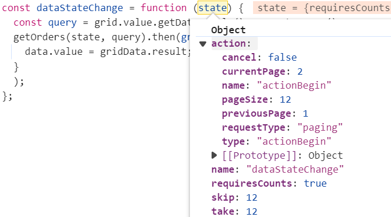
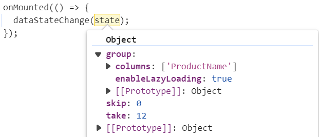

# Remote data in Vue Grid component

In Vue Grid component, binding remote data is a fundamental aspect that enhances the efficiency of data interaction. This process involves assigning the service data, represented as an instance of `DataManager`, to the `dataSource` property of the Vue Grid component. By doing so, you enable seamless interaction with a remote data source, and this is achieved by specifying the endpoint URL where the data is hosted.

Additionally, leverage the power for data retrieval and operations, enhancing event handling, asynchronous programming, and concurrent value management in Vue applications.

## Custom binding

The custom binding feature in the Vue Grid enables you to manage your own custom API for handling data processing externally and then binding the resulting data to the Grid. This allows you to implement your own custom data logic to your application's requirements. When using custom binding, the Grid expects the result of the custom logic to be an object with properties `result` and `count`. The `result` property should contain the data to be displayed in the Grid, while the `count` property indicates the total number of records in the dataset for your application. To utilize custom binding, you can handle the [DataManager](https://ej2.syncfusion.com/vue/documentation/data/vue-3-getting-started). The DataManager integrates seamlessly with the vue Grid to manage custom data processing and binding. 

The Syncfusion<sup style="font-size:70%">&reg;</sup> Grid component offers a range of powerful features for handling grid actions such as **paging**, **grouping**, **sorting** and **filtering**. These actions trigger the [dataStateChange](https://ej2.syncfusion.com/vue/documentation/api/grid/#datastatechange) event. The feature for CRUD action such as **Create**, **Read**, **Update**, **Delete** operations. This action trigger the [dataSourceChanged](https://ej2.syncfusion.com/vue/documentation/api/grid/#datasourcechanged) event. This event provides you with the opportunity to manage and manipulate data according to the individual's interactions. 

**Using the dataStateChange event**

The `dataStateChange` event is triggered whenever you perform actions that modify the state of the grid's data, such as changing pages, applying sorting, or grouping. This event provides detailed information about the action performed and the current state of the grid, including parameters like page number, sorting details, and filtering criteria.

To implement the `dataStateChange` event, follow these steps:

1. **Subscribe to the event:** In your component code, subscribe to the `dataStateChange` event using the appropriate event handler function. This function will be executed whenever you interact with the grid.

2. **Handle data state:** Inside the event handler function, you can access the event arguments to determine the individual actions and intentions. The action property of the event arguments indicates the type of action performed (e.g., paging, sorting, grouping).

> The `dataStateChange` event will not be triggered during the initial rendering.

## Creating an API service

To configure a server with Syncfusion<sup style="font-size:70%">&reg;</sup> Vue Grid, you need to follow the below steps:

**Step 1:** Open your terminal and create a new Vite project using the following command:

```bash
npm create vite@latest
```

**Step 2:** Navigate to your project directory and install the required Syncfusion<sup style="font-size:70%">&reg;</sup> packages using npm:

```bash
cd my-project
npm install @syncfusion/ej2-vue-grids --save
npm install @syncfusion/ej2-data --save
```

**Step 3:** Install the necessary packages for setting up an Express server:

```bash
npm install express body-parser cors
```

**Step 4:** Install axios for making HTTP requests in your Vue.js project:

```bash
npm install axios
```

**Step 5:** Install Concurrently to run both the server and client simultaneously:

```bash
npm install concurrently --save-dev
```

**Step 6:** Update the scripts section in your package.json to include commands for starting the server and client concurrently:

```bash
"scripts": 
{
  "start-server": "node server.js",
  "start-client": "vite",
  "start": "concurrently \"npm run start-server\" \"npm run start-client\""
}
```

**Step 7:**  Create a **data-source.js** file to represent the data in the **src** folder, like `src/data-source.js`.

```js
const data = createLazyLoadData();

function createLazyLoadData() {
    let lazyLoadData = [];
    let customerid = ['VINET', 'TOMSP', 'HANAR', 'VICTE', 'SUPRD', 'HANAR', 'CHOPS', 'RICSU', 'WELLI', 'HILAA', 'ERNSH', 'CENTC',
    'OTTIK', 'QUEDE', 'RATTC', 'ERNSH', 'FOLKO', 'BLONP', 'WARTH', 'FRANK', 'GROSR', 'WHITC', 'WARTH', 'SPLIR', 'RATTC', 'QUICK', 'VINET',
    'MAGAA', 'TORTU', 'MORGK', 'BERGS', 'LEHMS', 'BERGS', 'ROMEY', 'ROMEY', 'LILAS', 'LEHMS', 'QUICK', 'QUICK', 'RICAR', 'REGGC', 'BSBEV',
    'COMMI', 'QUEDE', 'TRADH', 'TORTU', 'RATTC', 'VINET', 'LILAS', 'BLONP', 'HUNGO', 'RICAR', 'MAGAA', 'WANDK', 'SUPRD', 'GODOS', 'TORTU',
    'OLDWO', 'ROMEY', 'LONEP', 'ANATR', 'HUNGO', 'THEBI', 'DUMON', 'WANDK', 'QUICK', 'RATTC', 'ISLAT', 'RATTC', 'LONEP', 'ISLAT', 'TORTU',
    'WARTH', 'ISLAT', 'PERIC', 'KOENE', 'SAVEA', 'KOENE', 'BOLID', 'FOLKO', 'FURIB', 'SPLIR', 'LILAS', 'BONAP', 'MEREP', 'WARTH', 'VICTE',
    'HUNGO', 'PRINI', 'FRANK', 'OLDWO', 'MEREP', 'BONAP', 'SIMOB', 'FRANK', 'LEHMS', 'WHITC', 'QUICK', 'RATTC', 'FAMIA'];

    let product = ['Chai', 'Chang', 'Aniseed Syrup', 'Chef Anton\'s Cajun Seasoning', 'Chef Anton\'s Gumbo Mix', 'Grandma\'s Boysenberry Spread',
    'Uncle Bob\'s Organic Dried Pears', 'Northwoods Cranberry Sauce', 'Mishi Kobe Niku', 'Ikura', 'Queso Cabrales', 'Queso Manchego La Pastora', 'Konbu',
    'Tofu', 'Genen Shouyu', 'Pavlova', 'Alice Mutton', 'Carnarvon Tigers', 'Teatime Chocolate Biscuits', 'Sir Rodney\'s Marmalade', 'Sir Rodney\'s Scones',
    'Gustaf\'s Knäckebröd', 'Tunnbröd', 'Guaraná Fantástica', 'NuNuCa Nuß-Nougat-Creme', 'Gumbär Gummibärchen', 'Schoggi Schokolade', 'Rössle Sauerkraut',
    'Thüringer Rostbratwurst', 'Nord-Ost Matjeshering', 'Gorgonzola Telino', 'Mascarpone Fabioli', 'Geitost', 'Sasquatch Ale', 'Steeleye Stout', 'Inlagd Sill',
    'Gravad lax', 'Côte de Blaye', 'Chartreuse verte', 'Boston Crab Meat', 'Jack\'s New England Clam Chowder', 'Singaporean Hokkien Fried Mee', 'Ipoh Coffee',
    'Gula Malacca', 'Rogede sild', 'Spegesild', 'Zaanse koeken', 'Chocolade', 'Maxilaku', 'Valkoinen suklaa', 'Manjimup Dried Apples', 'Filo Mix', 'Perth Pasties',
    'Tourtière', 'Pâté chinois', 'Gnocchi di nonna Alice', 'Ravioli Angelo', 'Escargots de Bourgogne', 'Raclette Courdavault', 'Camembert Pierrot', 'Sirop d\'érable',
    'Tarte au sucre', 'Vegie-spread', 'Wimmers gute Semmelknödel', 'Louisiana Fiery Hot Pepper Sauce', 'Louisiana Hot Spiced Okra', 'Laughing Lumberjack Lager', 'Scottish Longbreads',
    'Gudbrandsdalsost', 'Outback Lager', 'Flotemysost', 'Mozzarella di Giovanni', 'Röd Kaviar', 'Longlife Tofu', 'Rhönbräu Klosterbier', 'Lakkalikööri', 'Original Frankfurter grüne Soße'];

    let customername = ['Maria', 'Ana Trujillo', 'Antonio Moreno', 'Thomas Hardy', 'Christina Berglund', 'Hanna Moos', 'Frédérique Citeaux', 'Martín Sommer', 'Laurence Lebihan', 'Elizabeth Lincoln',
    'Victoria Ashworth', 'Patricio Simpson', 'Francisco Chang', 'Yang Wang', 'Pedro Afonso', 'Elizabeth Brown', 'Sven Ottlieb', 'Janine Labrune', 'Ann Devon', 'Roland Mendel', 'Aria Cruz', 'Diego Roel',
    'Martine Rancé', 'Maria Larsson', 'Peter Franken', 'Carine Schmitt', 'Paolo Accorti', 'Lino Rodriguez', 'Eduardo Saavedra', 'José Pedro Freyre', 'André Fonseca', 'Howard Snyder', 'Manuel Pereira',
    'Mario Pontes', 'Carlos Hernández', 'Yoshi Latimer', 'Patricia McKenna', 'Helen Bennett', 'Philip Cramer', 'Daniel Tonini', 'Annette Roulet', 'Yoshi Tannamuri', 'John Steel', 'Renate Messner', 'Jaime Yorres',
    'Carlos González', 'Felipe Izquierdo', 'Fran Wilson', 'Giovanni Rovelli', 'Catherine Dewey', 'Jean Fresnière', 'Alexander Feuer', 'Simon Crowther', 'Yvonne Moncada', 'Rene Phillips', 'Henriette Pfalzheim',
    'Marie Bertrand', 'Guillermo Fernández', 'Georg Pipps', 'Isabel de Castro', 'Bernardo Batista', 'Lúcia Carvalho', 'Horst Kloss', 'Sergio Gutiérrez', 'Paula Wilson', 'Maurizio Moroni', 'Janete Limeira', 'Michael Holz',
    'Alejandra Camino', 'Jonas Bergulfsen', 'Jose Pavarotti', 'Hari Kumar', 'Jytte Petersen', 'Dominique Perrier', 'Art Braunschweiger', 'Pascale Cartrain', 'Liz Nixon', 'Liu Wong', 'Karin Josephs', 'Miguel Angel Paolino',
    'Anabela Domingues', 'Helvetius Nagy', 'Palle Ibsen', 'Mary Saveley', 'Paul Henriot', 'Rita Müller', 'Pirkko Koskitalo', 'Paula Parente', 'Karl Jablonski', 'Matti Karttunen', 'Zbyszek Piestrzeniewicz'];

    let customeraddress = ['507 - 20th Ave. E.\r\nApt. 2A', '908 W. Capital Way', '722 Moss Bay Blvd.', '4110 Old Redmond Rd.', '14 Garrett Hill', 'Coventry House\r\nMiner Rd.', 'Edgeham Hollow\r\nWinchester Way',
    '4726 - 11th Ave. N.E.', '7 Houndstooth Rd.', '59 rue de l\'Abbaye', 'Luisenstr. 48', '908 W. Capital Way', '722 Moss Bay Blvd.', '4110 Old Redmond Rd.', '14 Garrett Hill', 'Coventry House\r\nMiner Rd.', 'Edgeham Hollow\r\nWinchester Way',
    '7 Houndstooth Rd.', '2817 Milton Dr.', 'Kirchgasse 6', 'Sierras de Granada 9993', 'Mehrheimerstr. 369', 'Rua da Panificadora, 12', '2817 Milton Dr.', 'Mehrheimerstr. 369'];

    let quantityperunit= ['10 boxes x 20 bags', '24 - 12 oz bottles', '12 - 550 ml bottles', '48 - 6 oz jars', '36 boxes', '12 - 8 oz jars', '12 - 1 lb pkgs.', '12 - 12 oz jars', '18 - 500 g pkgs.', '12 - 200 ml jars',
    '1 kg pkg.', '10 - 500 g pkgs.', '2 kg box', '40 - 100 g pkgs.', '24 - 250 ml bottles', '32 - 500 g boxes', '20 - 1 kg tins', '16 kg pkg.', '10 boxes x 12 pieces', '30 gift boxes', '24 pkgs. x 4 pieces', '24 - 500 g pkgs.', '12 - 250 g pkgs.',
    '12 - 355 ml cans', '20 - 450 g glasses', '100 - 250 g bags'];

    let OrderID = 10248;
    for (let i = 0; i < 20000; i++) {
        lazyLoadData.push({
            'OrderID': OrderID + i,
            'CustomerID': customerid[Math.floor(Math.random() * customerid.length)],
            'CustomerName': customername[Math.floor(Math.random() * customername.length)],
            'CustomerAddress': customeraddress[Math.floor(Math.random() * customeraddress.length)],
            'ProductName': product[Math.floor(Math.random() * product.length)],
            'ProductID': i,
            'Quantity': quantityperunit[Math.floor(Math.random() * quantityperunit.length)]
        })
    }
    return lazyLoadData;
}

export default data;
```

**Step 8:** Create **server.js** file to set up a basic Express server:

```js
import express from 'express';
import data from './src/data-source.js';
import bodyParser from 'body-parser';
import cors from 'cors';

const app = express();

app.use(cors({
    origin: '*', // Update to the correct frontend origin
    credentials: true
}));

app.use(bodyParser.json());

// Root route
app.get('/', (req, res) => {
    res.send('Server is running');
});

// all records
app.get('/orders', function (req, res) {
    res.json({ result: data, count:data.length });
});

const port = xxxx; // Here xxxx denotes the port number.
app.listen(port, () => {
    console.log(`Server running on http://localhost:${port}`);
});
```

**Step 9:** Create an **orderService.ts** file inside the **src** folder (e.g., `src/orderService.ts`) to handle CRUD operations and grid actions using Syncfusion's DataManager:

```ts
import { DataManager, Query } from "@syncfusion/ej2-data";

export class OrderService {
}
export {};
const baseUrl = "http://localhost:xxxx/orders"; // Here xxxx denotes the port number.
let gridData:DataManager; 
// Apply paging
const applyPaging = (query, state)=> {
  // Check if both 'take' and 'skip' values are available
  if (state.take && state.skip) {
    // Calculate pageSkip and pageTake values to get pageIndex and pageSize
    const pageSkip = state.skip / state.take + 1;
    const pageTake = state.take;
    query.page(pageSkip, pageTake);
  }
  // If if only 'take' is available and 'skip' is 0, apply paging for the first page.
  else if (state.skip === 0 && state.take) {
    query.page(1, state.take);
  }
}
export function getOrders(state) {
  const query = new Query();
  // page
  applyPaging(query, state)
  query.isCountRequired = true

  // Request the data from server using fetch
  return fetch(baseUrl)
    .then(res => res.json())
    .then(data => {      
      // Create a DataManager instance with your fetched data
      gridData = new DataManager(data.result);

      // Execute local data operations using the provided query
      const result = gridData.executeLocal(query);

      // Return the result along with the count of total records
      return {
        result: result, // Result of the data
        count: (result as any).count // Total record count based on fetched data length
      };
    });
}
```

**Step 10:** In your Vue component (e.g., `App.vue`), import and use the Syncfusion<sup style="font-size:70%">&reg;</sup> Grid component. Use the **orderService** to fetch and manipulate data.

```ts
<script setup>
import { ref, onMounted, provide } from "vue";
import { GridComponent as EjsGrid, ColumnsDirective as EColumns, ColumnDirective as EColumn, Page } from '@syncfusion/ej2-vue-grids';
import { getOrders } from './orderService';

const data = ref([]);
const grid = ref([]);
const state = { skip: 0, take: 12 };

const dataStateChange = function (state) {
  const query = grid.value.getDataModule().generateQuery();
  getOrders(state, query).then(gridData => {
    data.value = gridData.result; // Assign the result to the data property
  });
}

onMounted(() => {
  dataStateChange(state);
});

provide('grid', [Page]);
</script>

<template>
  <ejs-grid ref="grid" :dataSource='data' :allowPaging='true' :dataStateChange="dataStateChange">
    <e-columns>
      <e-column field='OrderID' headerText='Order ID' width='90' textAlign='Right'></e-column>
      <e-column field="CustomerName" headerText="Customer Name" width="100"></e-column>
      <e-column field='ProductID' headerText='Product ID' width=100></e-column>
      <e-column field='ProductName' headerText='Product Name' format='C2' width=100></e-column>
    </e-columns>
  </ejs-grid>
</template>

<style>
@import "../node_modules/@syncfusion/ej2-base/styles/material3.css";
@import "../node_modules/@syncfusion/ej2-buttons/styles/material3.css";
@import "../node_modules/@syncfusion/ej2-calendars/styles/material3.css";
@import "../node_modules/@syncfusion/ej2-dropdowns/styles/material3.css";
@import "../node_modules/@syncfusion/ej2-inputs/styles/material3.css";
@import "../node_modules/@syncfusion/ej2-navigations/styles/material3.css";
@import "../node_modules/@syncfusion/ej2-popups/styles/material3.css";
@import "../node_modules/@syncfusion/ej2-splitbuttons/styles/material3.css";
@import "../node_modules/@syncfusion/ej2-vue-grids/styles/material3.css";
</style>
```

**Step 11:** Finally, you can start both the server and client concurrently using the start script.

```bash
npm start
```

> Replace https://localhost:xxxx/orders with the actual URL of your API endpoint that provides the data in a consumable format (e.g., JSON).

## Handling filtering operation

When filtering operation is performed in the grid, the `dataStateChange` event is triggered, providing access to the following referenced arguments within the event.


You can change the new grid data state of filter action as follows:

```typescript
// Apply filtering
const applyFiltering = (query, filter)=> {
// Check if filter columns are specified
  if (filter.columns && filter.columns.length) {
    // Apply filtering for each specified column
    for (let i = 0; i < filter.columns.length; i++) {
      const field = filter.columns[i].field;
      const operator = filter.columns[i].operator;
      const value = filter.columns[i].value;
      query.where(field, operator, value);
    }
  }
  else {
    // Apply filtering based on direct filter conditions
    for (let i = 0; i < filter.length; i++) {
      const { fn, e } = filter[i];
      if (fn === 'onWhere') {
        query.where(e as string);
      }
    }
  }
}
/** GET all data from the server */
export function getOrders(state, action) {
  const query = new Query();
  // filter
  if (state.where) {
    applyFiltering(query, action.queries);
  }
  query.isCountRequired = true

  // Request the data from server using fetch
  return fetch(baseUrl)
    .then(res => res.json())
    .then(data => {
      // Create a DataManager instance with your fetched data
      const dataManager = new DataManager(data.result);
      // Execute local data operations using the provided query
      const result = dataManager.executeLocal(query);
      // Return the result along with the count of total records
      return {
        result: result, // Result of the data
        count: result.count // Total record count based on fetched data length
      };
    });
}
```


When filtering multiple values, you can get the predicates as arguments in the `dataStateChange` event. You can create your predicate execution based on the predicates values.

## Handling searching operation

When performing a search operation in the grid, the `dataStateChange` event is triggered, allowing access to the following referenced arguments within the event


You can change the new grid data state of search action as follows:

```typescript
// Apply searching 
const applySearching = (query, search)=> {
  // Check if a search operation is requested
  if (search && search.length > 0) {
    // Extract the search key and fields from the search array
    const { fields, key } = search[0];
    // perform search operation using the field and key on the query
    query.search(key, fields);
  }
}
/** GET all data from the server */
export function getOrders(state, action) {
  const query = new Query();
  // search
  if (state.search) {
    applySearching(query, state.search);
  };
  query.isCountRequired = true
  // Request the data from server using fetch
  return fetch(baseUrl)
    .then(res => res.json())
    .then(data => {
      // Create a DataManager instance with your fetched data
      const dataManager = new DataManager(data.result);
      // Execute local data operations using the provided query
      const result = dataManager.executeLocal(query);
      // Return the result along with the count of total records
      return {
        result: result, // Result of the data
        count: result.count // Total record count based on fetched data length
      };
    });
  }
```

## Handling sorting operation

When sorting operation is performed in the grid, the dataStateChange event is triggered, and within this event, you can access the following referenced arguments.


When performing multi-column sorting, you can get the below referred arguments in the `dataStateChange` event.


You can change the new grid data state of sort action as follows:

```typescript
// Apply sorting
const applySorting = (query, sorted) =>{
  // Check if sorting data is available
  if (sorted && sorted.length > 0) {
    // Iterate through each sorting info
    sorted.forEach(sort => {
      // Get the sort field name either by name or field
      const sortField = sort.name || sort.field;
      // Perform sort operation using the query based on the field name and direction
      query.sortBy(sortField, sort.direction);
    });
  }
}
/** GET all data from the server */
export function getOrders(state, action) {
  const query = new Query();
  // sort
  if (state.sorted) {
    state.sorted.length ? applySorting(query, state.sorted) :
      // initial sorting
      state.sorted.columns.length ? applySorting(query, state.sorted.columns) : null
  }
  query.isCountRequired = true
  // Request the data from server using fetch
  return fetch(baseUrl)
    .then(res => res.json())
    .then(data => {
      // Create a DataManager instance with your fetched data
      const dataManager = new DataManager(data.result);
      // Execute local data operations using the provided query
      const result = dataManager.executeLocal(query);
      // Return the result along with the count of total records
      return {
        result: result, // Result of the data
        count: result.count // Total record count based on fetched data length
      };
    });
}
```

## Handling paging operation

When paging operation is performed in the grid, the `dataStateChange` event is triggered, and within this event, you can access the following referenced arguments.



You can change the new grid data state of page action as follows:

```typescript
// Apply paging
const applyPaging = (query, state)=> {
  // Check if both 'take' and 'skip' values are available
  if (state.take && state.skip) {
    // Calculate pageSkip and pageTake values to get pageIndex and pageSize
    const pageSkip = state.skip / state.take + 1;
    const pageTake = state.take;
    query.page(pageSkip, pageTake);
  }
  // If if only 'take' is available and 'skip' is 0, apply paging for the first page.
  else if (state.skip === 0 && state.take) {
    query.page(1, state.take);
  }
}
/** GET all data from the server */
export function getOrders(state, action) {
  const query = new Query();
  // page
  applyPaging(query, state)
  query.isCountRequired = true
  // Request the data from server using fetch
  return fetch(baseUrl)
    .then(res => res.json())
    .then(data => {
      // Create a DataManager instance with your fetched data
      const dataManager = new DataManager(data.result);
      // Execute local data operations using the provided query
      const result = dataManager.executeLocal(query);
      // Return the result along with the count of total records
      return {
        result: result, // Result of the data
        count: result.count // Total record count based on fetched data length
      };
    });
}
```

## Handling grouping operation

When grouping operation is performed in the grid, the `dataStateChange` event is triggered, providing access to the following referenced arguments within the event.


You can change the new grid data state of group action as follows:

```typescript
// Apply grouping
const applyGrouping = (query, group) =>{
  // Check if sorting data is available
  if (group.length > 0) {
    // Iterate through each group info
    group.forEach((column: string) => {
      // perform group operation using the column on the query
      query.group(column);
    });
  }
}
/** GET all data from the server */
export function getOrders(state, action) {
  const query = new Query();
  // grouping
  if (state.group) {
    state.group.length ? applyGrouping(query, state.group) :
      // initial grouping
      state.group.columns.length ? applyGrouping(query, state.group.columns) : null
  }
  query.isCountRequired = true

  // Request the data from server using fetch
  return fetch(baseUrl)
    .then(res => res.json())
    .then(data => {
      // Create a DataManager instance with your fetched data
      const dataManager = new DataManager(data.result);

      // Execute local data operations using the provided query
      const result = dataManager.executeLocal(query);

      // Return the result along with the count of total records
      return {
        result: result, // Result of the data
        count: result.count // Total record count based on fetched data length
      };
    });
}
```

> * In order to utilize group actions, it is necessary to manage the sorting query within your service.

**Lazy load grouping**

In Vue, lazy loading refers to the technique of loading data dynamically when they are needed, instead of loading everything upfront. Lazy load grouping allows you to load and display grouped data efficiently by fetching only the required data on demand. 

To enable this feature, you need to set the [groupSettings.enableLazyLoading](https://ej2.syncfusion.com/vue/documentation/api/grid/groupSettings/#enableLazyLoading) property to **true**. Also, you need to manage the state based on the initial grid action as follows.

```typescript
const groupSettings = { enableLazyLoading: true, columns: ['ProductName'], showGroupedColumn: true, };
const state = { skip:0, take: 12, group: groupSettings};
```

Based on the initial state, you can get the arguments as shown below



You can change the grid state as follows:

```typescript
// Apply grouping
const applyGrouping = (query, group) =>{
  // Check if sorting data is available
  if (group.length > 0) {
    // Iterate through each group info
    group.forEach((column: string) => {
      // perform group operation using the column on the query
      query.group(column);
    });
  }
}
// Apply lazy load grouping
const applyLazyLoad = (query, payload) => {
  // Configure lazy loading for the main data
  if (payload.isLazyLoad) {
    query.lazyLoad.push({ key: 'isLazyLoad', value: true });
    // If on-demand group loading is enabled, configure lazy loading for grouped data
    if (payload.onDemandGroupInfo) {
      query.lazyLoad.push({
          key: 'onDemandGroupInfo',
          value: payload.action.lazyLoadQuery,
      });
    }
  }
}
/** GET all data from the server */
export function getOrders(state, action) {
  const query = new Query();
  // grouping
  if (state.group) {
    state.group.length ? applyGrouping(query, state.group) :
      // initial grouping
      state.group.columns.length ? applyGrouping(query, state.group.columns) : null
  }
  // lazy load grouping
  if (state.group) {
    if (state.isLazyLoad) {
      applyLazyLoad(query, state)
    }
    if (state.group.enableLazyLoading) {
      query.lazyLoad.push({ key: 'isLazyLoad', value: true })
    }
  }
  query.isCountRequired = true
  // Request the data from server using fetch
  return fetch(baseUrl)
    .then(res => res.json())
    .then(data => {
      // Create a DataManager instance with your fetched data
      const dataManager = new DataManager(data.result);
      // Execute local data operations using the provided query
      const result = dataManager.executeLocal(query);
      // Return the result along with the count of total records
      return {
        result: result, // Result of the data
        count: result.count // Total record count based on fetched data length
      };
    });
}
```

> Further information can be accessed in the respective documentation for [lazy load grouping](https://ej2.syncfusion.com/vue/documentation/grid/grouping/lazy-load-grouping).

## Handling CRUD operations

The Grid component provides powerful options for dynamically inserting, deleting, and updating records, enabling you to modify data directly within the grid. This feature is useful when you want to perform CRUD (Create, Read, Update, Delete) operations seamlessly.

Integrating CRUD Operations

To implement CRUD operations using Syncfusion<sup style="font-size:70%">&reg;</sup> Grid, follow these steps:

1. **Configure grid settings:** Set up the necessary grid settings, such as editing, adding, and deleting records. Define the toolbar options to facilitate your interactions.

2. **Handle data state changes:** Utilize the [dataStateChange](https://ej2.syncfusion.com/vue/documentation/api/grid/#datastatechange) event to respond to changes in the grid’s data state. This event is triggered whenever you interact with the grid, such as paging or sorting.

3. **Execute CRUD operations:** Within the event handler for [dataSourceChanged](https://ej2.syncfusion.com/vue/documentation/api/grid/#datasourcechanged), implement logic to handle various CRUD actions based on the action or requestType property of the event arguments.

4. **Call endEdit method:** After performing CRUD operations (adding, editing, or deleting), call the endEdit method to signal the completion of the operation and update the grid accordingly.

**Insert operation**

When an insert operation is performed in the grid, the `dataSourceChanged` event will be triggered, allowing access to the following referenced arguments within the event.


```ts
// add
export function addRecord(order) {
  return fetch(baseUrl , {
    method: "post",
    headers: { "Content-Type": "application/json" },
    body: JSON.stringify({
      value: order
    })
  })
    .then((data) => {
      return data;
    });
}
```

**Edit operation**

When an edit operation is performed in the grid, the `dataSourceChanged` event will be triggered, providing access to the following referenced arguments within the event.


```ts
// update
export function updateRecord(order) {
  return fetch(`${baseUrl}/${order.OrderID}`, {
    method: "put",
    headers: { "Content-Type": "application/json" },
    body: JSON.stringify({
      value: order
    })
  })
    .then(data => {
      return data;
    });
}
```

**Delete operation**

When a delete operation is performed in the grid, the `dataSourceChanged` event will be triggered, allowing access to the following referenced arguments within the event.


```ts
// delete
export function deleteRecord(primaryKey) {
  return fetch(`${baseUrl}/${primaryKey}`, {
    method: "delete",
    body: JSON.stringify({
      value: primaryKey
    })
  })
  .then(data => {
    return data;
  });
}
```

The following example demonstrates how to bind custom data to handle grid actions and CRUD operation.




<script setup>
import { ref, onMounted, provide } from "vue";
import { GridComponent as EjsGrid, ColumnsDirective as EColumns, ColumnDirective as EColumn, Page, Sort, Filter, Group, LazyLoadGroup, Toolbar, Edit, Search, } from '@syncfusion/ej2-vue-grids';
import { getOrders, addRecord, updateRecord, deleteRecord } from './orderService';

const data = ref([]);
const grid = ref([]);
const groupSettings = { enableLazyLoading: true, columns: ['ProductName'], showGroupedColumn: true, };
const filterSettings = { columns: [{ field: 'CustomerName', matchCase: false, operator: 'startswith', predicate: 'and', value: 'Maria' }] };
const sortSettings = { columns: [{ field: 'ProductID', direction: 'Descending' }] }
const state = { skip: 0, take: 12, group: groupSettings, sort: sortSettings, filter: filterSettings };
const editSettings = { allowEditing: true, allowAdding: true, allowDeleting: true, newRowPosition: 'Top', };
const toolbar = ['Add', 'Edit', 'Delete', 'Update', 'Cancel', 'Search'];
const OrderIDRules = { required: true };

const dataStateChange = function (state) {
    const query = grid.value.getDataModule().generateQuery();
    getOrders(state, query).then(gridData => {
      data.value = gridData.result; // Assign the result to the data property
    });
  }

const dataSourceChanged = function (state) {
  if (state.action === 'add') {
    addRecord(state.data, state); state.endEdit();
  } else if (state.action === 'edit') {
    updateRecord(state.data, state); state.endEdit();
  } else if (state.requestType === 'delete') {
    deleteRecord(state.data[0].OrderID, state); state.endEdit();
  }
}

onMounted(() => {
  dataStateChange(state);
});

provide('grid', [Page, Filter, Sort, Group, LazyLoadGroup, Toolbar, Edit, Search]);
</script>

<template>
  <ejs-grid ref="grid" :dataSource='data' :allowPaging='true' :allowFiltering='true' :filterSettings='filterSettings'
    :allowSorting='true' :sortSettings='sortSettings' :allowGrouping='true' :groupSettings='groupSettings'
    :toolbar='toolbar' :editSettings='editSettings' :dataStateChange="dataStateChange"
    :dataSourceChanged="dataSourceChanged">
    <e-columns>
      <e-column field='OrderID' headerText='Order ID' width='90' textAlign='Right' isPrimaryKey='true'
        :validationRules="OrderIDRules"></e-column>
      <e-column field="CustomerName" headerText="Customer Name" width="100"></e-column>
      <e-column field='ProductID' headerText='Product ID' width=100></e-column>
      <e-column field='ProductName' headerText='Product Name' format='C2' width=100></e-column>
    </e-columns>
  </ejs-grid>
</template>

<style>
  @import "../node_modules/@syncfusion/ej2-base/styles/material3.css";
  @import "../node_modules/@syncfusion/ej2-buttons/styles/material3.css";
  @import "../node_modules/@syncfusion/ej2-calendars/styles/material3.css";
  @import "../node_modules/@syncfusion/ej2-dropdowns/styles/material3.css";
  @import "../node_modules/@syncfusion/ej2-inputs/styles/material3.css";
  @import "../node_modules/@syncfusion/ej2-navigations/styles/material3.css";
  @import "../node_modules/@syncfusion/ej2-popups/styles/material3.css";
  @import "../node_modules/@syncfusion/ej2-splitbuttons/styles/material3.css";
  @import "../node_modules/@syncfusion/ej2-vue-grids/styles/material3.css";
</style>




<script>
import { GridComponent, ColumnDirective, ColumnsDirective, Page, Sort, Filter, Group, LazyLoadGroup, Toolbar, Edit, Search, } from '@syncfusion/ej2-vue-grids';
import { getOrders, addRecord, updateRecord, deleteRecord } from './orderService';

export default {
  components: {
    'ejs-grid': GridComponent,
    'e-column': ColumnDirective,
    'e-columns': ColumnsDirective
  },
  name: 'App',
  data() {
    return {
      data: [],
      groupSettings: { enableLazyLoading: true, columns: ['ProductName'], showGroupedColumn: true },
      filterSettings: { columns: [{ field: 'CustomerName', matchCase: false, operator: 'startswith', predicate: 'and', value: 'Maria' }] },
      sortSettings: { columns: [{ field: 'ProductID', direction: 'Descending' }] },
      editSettings: { allowEditing: true, allowAdding: true, allowDeleting: true, newRowPosition: 'Top' },
      toolbar: ['Add', 'Edit', 'Delete', 'Update', 'Cancel', 'Search'],
      OrderIDRules: { required: true }
    };
  },
  mounted() {
    let state= { skip: 0, take: 12, group: this.groupSettings, sort: this.sortSettings, filter: this.filterSettings };
    this.dataStateChange(state);
  },
  methods: {
    dataStateChange(state) {
      const query = this.$refs.grid.getDataModule().generateQuery();
      getOrders(state, query).then(gridData => {
        this.data = gridData.result;
      });
    },
    dataSourceChanged(state) {
      if (state.action === 'add') {
        addRecord(state.data, state);
        state.endEdit();
      } else if (state.action === 'edit') {
        updateRecord(state.data, state);
        state.endEdit();
      } else if (state.requestType === 'delete') {
        deleteRecord(state.data[0].OrderID, state);
        state.endEdit();
      }
    }
  },
  provide() {
    return {
      grid: [Page, Filter, Sort, Group, LazyLoadGroup, Toolbar, Edit, Search]
    };
  }
};
</script>

<template>
  <ejs-grid ref="grid" :dataSource='data' :allowPaging='true' :allowFiltering='true' :filterSettings='filterSettings'
    :allowSorting='true' :sortSettings='sortSettings' :allowGrouping='true' :groupSettings='groupSettings'
    :toolbar='toolbar' :editSettings='editSettings' :dataStateChange="dataStateChange"
    :dataSourceChanged="dataSourceChanged">
    <e-columns>
      <e-column field='OrderID' headerText='Order ID' width='90' textAlign='Right' isPrimaryKey='true'
        :validationRules="OrderIDRules"></e-column>
      <e-column field="CustomerName" headerText="Customer Name" width="100"></e-column>
      <e-column field='ProductID' headerText='Product ID' width=100></e-column>
      <e-column field='ProductName' headerText='Product Name' format='C2' width=100></e-column>
    </e-columns>
  </ejs-grid>
</template>

<style>
  @import "../node_modules/@syncfusion/ej2-base/styles/material3.css";
  @import "../node_modules/@syncfusion/ej2-buttons/styles/material3.css";
  @import "../node_modules/@syncfusion/ej2-calendars/styles/material3.css";
  @import "../node_modules/@syncfusion/ej2-dropdowns/styles/material3.css";
  @import "../node_modules/@syncfusion/ej2-inputs/styles/material3.css";
  @import "../node_modules/@syncfusion/ej2-navigations/styles/material3.css";
  @import "../node_modules/@syncfusion/ej2-popups/styles/material3.css";
  @import "../node_modules/@syncfusion/ej2-splitbuttons/styles/material3.css";
  @import "../node_modules/@syncfusion/ej2-vue-grids/styles/material3.css";
</style>




import express from 'express';
import data from './src/data-source.js';
import bodyParser from 'body-parser';
import cors from 'cors';

const app = express();

app.use(cors({
    origin: '*', // Update to the correct frontend origin
    credentials: true
}));

app.use(bodyParser.json());

// Root route
app.get('/', (req, res) => {
    res.send('Server is running');
});

// all records
app.get('/orders', function (req, res) {
    res.json({ result: data, count:data.length });
});

// insert
app.post('/orders', function (req, res){
    data.splice(0, 0, req.body.value);
    res.status(200).send('Row Inserted');
});

// get specific records
app.get('/orders/:OrderID', (req, res) => {
  const orderID = parseInt(req.params.OrderID, 10);
  const order = data.find(d => d.OrderID === orderID);
  
  if (order) {
      res.json(order);
  } else {
      res.status(404).send('Order not found');
  }
});
// Remove
app.delete('/orders/:OrderID', function (req, res) {
    const orderID = parseInt(req.params.OrderID, 10);
    const index = data.findIndex(x => x.OrderID === orderID);
    if (index !== -1) {
        data.splice(index, 1);
        res.status(200).send('Row Deleted');
    } else {
        res.status(404).send('Order not found');
    }
});

// Update
app.put('/orders/:OrderID', function (req, res) {
    const orderID = parseInt(req.params.OrderID, 10);
    const index = data.findIndex(x => x.OrderID === orderID);
    if (index !== -1) {
        // Assuming req.body.value contains the updated record with the same OrderID
        data[index] = req.body.value;
        res.status(200).send('Row Updated');
    } else {
        res.status(404).send('Order not found');
    }
});

const port = xxxx; // Here xxxx denotes the port number.
app.listen(port, () => {
    console.log(`Server running on http://localhost:${port}`);
});




import { DataManager, Query } from "@syncfusion/ej2-data";

export class OrderService {
}
export {};
const baseUrl = "http://localhost:xxxx/orders"; // Here xxxx denotes the port number.
let gridData:DataManager; 
// Apply filtering
const applyFiltering = (query, filter)=> {
  // Check if filter columns are specified
    if (filter.columns && filter.columns.length) {
      // Apply filtering for each specified column
      for (let i = 0; i < filter.columns.length; i++) {
        const field = filter.columns[i].field;
        const operator = filter.columns[i].operator;
        const value = filter.columns[i].value;
        query.where(field, operator, value);
      }
    }
    else {
      // Apply filtering based on direct filter conditions
      for (let i = 0; i < filter.length; i++) {
        const { fn, e } = filter[i];
        if (fn === 'onWhere') {
          query.where(e as string);
        }
      }
    }
  }
// Apply searching 
const applySearching = (query, search)=> {
  // Check if a search operation is requested
  if (search && search.length > 0) {
    // Extract the search key and fields from the search array
    const { fields, key } = search[0];
    // perform search operation using the field and key on the query
    query.search(key, fields);
  }
}
// Apply sorting
const applySorting = (query, sorted) =>{
  // Check if sorting data is available
  if (sorted && sorted.length > 0) {
    // Iterate through each sorting info
    sorted.forEach(sort => {
      // Get the sort field name either by name or field
      const sortField = sort.name || sort.field;
      // Perform sort operation using the query based on the field name and direction
      query.sortBy(sortField, sort.direction);
    });
  }
}
// Apply grouping
const applyGrouping = (query, group) =>{
  // Check if sorting data is available
  if (group.length > 0) {
    // Iterate through each group info
    group.forEach((column: string) => {
      // perform group operation using the column on the query
      query.group(column);
    });
  }
}
// Apply lazy load grouping
const applyLazyLoad = (query, payload) => {
  // Configure lazy loading for the main data
  if (payload.isLazyLoad) {
    query.lazyLoad.push({ key: 'isLazyLoad', value: true });
    // If on-demand group loading is enabled, configure lazy loading for grouped data
    if (payload.onDemandGroupInfo) {
      query.lazyLoad.push({
          key: 'onDemandGroupInfo',
          value: payload.action.lazyLoadQuery,
      });
    }
  }
}
// Apply paging
const applyPaging = (query, state)=> {
  // Check if both 'take' and 'skip' values are available
  if (state.take && state.skip) {
    // Calculate pageSkip and pageTake values to get pageIndex and pageSize
    const pageSkip = state.skip / state.take + 1;
    const pageTake = state.take;
    query.page(pageSkip, pageTake);
  }
  // If if only 'take' is available and 'skip' is 0, apply paging for the first page.
  else if (state.skip === 0 && state.take) {
    query.page(1, state.take);
  }
}
export function getOrders(state, action) {
  const query = new Query();
  // filter
  if (state.where) {
    applyFiltering(query, action.queries);
  }
  // search
  if (state.search) {
    applySearching(query, state.search);
  };
  // sort
  if (state.sorted) {
    state.sorted.length ? applySorting(query, state.sorted) :
      // initial sorting
      state.sorted.columns.length ? applySorting(query, state.sorted.columns) : null
  }
  // grouping
  if (state.group) {
    state.group.length ? applyGrouping(query, state.group) :
      // initial grouping
      state.group.columns.length ? applyGrouping(query, state.group.columns) : null
  }
  // lazy load grouping
  if (state.group) {
    if (state.isLazyLoad) {
      applyLazyLoad(query, state)
    }
    if (state.group.enableLazyLoading) {
      query.lazyLoad.push({ key: 'isLazyLoad', value: true })
    }
  }
  // page
  applyPaging(query, state)
  query.isCountRequired = true

  // Request the data from server using fetch
  return fetch(baseUrl)
    .then(res => res.json())
    .then(data => {      
      // Create a DataManager instance with your fetched data
      gridData = new DataManager(data.result);

      // Execute local data operations using the provided query
      const result = gridData.executeLocal(query);

      // Return the result along with the count of total records
      return {
        result: result, // Result of the data
        count: (result as any).count // Total record count based on fetched data length
      };
    });
}

// add
export function addRecord(order) {
  return fetch(baseUrl , {
    method: "post",
    headers: { "Content-Type": "application/json" },
    body: JSON.stringify({
      value: order
    })
  })
    .then((data) => {
      return data;
    });
}

// update
export function updateRecord(order) {
  return fetch(`${baseUrl}/${order.OrderID}`, {
    method: "put",
    headers: { "Content-Type": "application/json" },
    body: JSON.stringify({
      value: order
    })
  })
    .then(data => {
      return data;
    });
}

// delete
export function deleteRecord(primaryKey) {
  return fetch(`${baseUrl}/${primaryKey}`, {
    method: "delete",
    body: JSON.stringify({
      value: primaryKey
    })
  })
  .then(data => {
    return data;
  });
}




const data = createLazyLoadData();

function createLazyLoadData() {
    let lazyLoadData = [];
    let customerid = ['VINET', 'TOMSP', 'HANAR', 'VICTE', 'SUPRD', 'HANAR', 'CHOPS', 'RICSU', 'WELLI', 'HILAA', 'ERNSH', 'CENTC',
    'OTTIK', 'QUEDE', 'RATTC', 'ERNSH', 'FOLKO', 'BLONP', 'WARTH', 'FRANK', 'GROSR', 'WHITC', 'WARTH', 'SPLIR', 'RATTC', 'QUICK', 'VINET',
    'MAGAA', 'TORTU', 'MORGK', 'BERGS', 'LEHMS', 'BERGS', 'ROMEY', 'ROMEY', 'LILAS', 'LEHMS', 'QUICK', 'QUICK', 'RICAR', 'REGGC', 'BSBEV',
    'COMMI', 'QUEDE', 'TRADH', 'TORTU', 'RATTC', 'VINET', 'LILAS', 'BLONP', 'HUNGO', 'RICAR', 'MAGAA', 'WANDK', 'SUPRD', 'GODOS', 'TORTU',
    'OLDWO', 'ROMEY', 'LONEP', 'ANATR', 'HUNGO', 'THEBI', 'DUMON', 'WANDK', 'QUICK', 'RATTC', 'ISLAT', 'RATTC', 'LONEP', 'ISLAT', 'TORTU',
    'WARTH', 'ISLAT', 'PERIC', 'KOENE', 'SAVEA', 'KOENE', 'BOLID', 'FOLKO', 'FURIB', 'SPLIR', 'LILAS', 'BONAP', 'MEREP', 'WARTH', 'VICTE',
    'HUNGO', 'PRINI', 'FRANK', 'OLDWO', 'MEREP', 'BONAP', 'SIMOB', 'FRANK', 'LEHMS', 'WHITC', 'QUICK', 'RATTC', 'FAMIA'];

    let product = ['Chai', 'Chang', 'Aniseed Syrup', 'Chef Anton\'s Cajun Seasoning', 'Chef Anton\'s Gumbo Mix', 'Grandma\'s Boysenberry Spread',
    'Uncle Bob\'s Organic Dried Pears', 'Northwoods Cranberry Sauce', 'Mishi Kobe Niku', 'Ikura', 'Queso Cabrales', 'Queso Manchego La Pastora', 'Konbu',
    'Tofu', 'Genen Shouyu', 'Pavlova', 'Alice Mutton', 'Carnarvon Tigers', 'Teatime Chocolate Biscuits', 'Sir Rodney\'s Marmalade', 'Sir Rodney\'s Scones',
    'Gustaf\'s Knäckebröd', 'Tunnbröd', 'Guaraná Fantástica', 'NuNuCa Nuß-Nougat-Creme', 'Gumbär Gummibärchen', 'Schoggi Schokolade', 'Rössle Sauerkraut',
    'Thüringer Rostbratwurst', 'Nord-Ost Matjeshering', 'Gorgonzola Telino', 'Mascarpone Fabioli', 'Geitost', 'Sasquatch Ale', 'Steeleye Stout', 'Inlagd Sill',
    'Gravad lax', 'Côte de Blaye', 'Chartreuse verte', 'Boston Crab Meat', 'Jack\'s New England Clam Chowder', 'Singaporean Hokkien Fried Mee', 'Ipoh Coffee',
    'Gula Malacca', 'Rogede sild', 'Spegesild', 'Zaanse koeken', 'Chocolade', 'Maxilaku', 'Valkoinen suklaa', 'Manjimup Dried Apples', 'Filo Mix', 'Perth Pasties',
    'Tourtière', 'Pâté chinois', 'Gnocchi di nonna Alice', 'Ravioli Angelo', 'Escargots de Bourgogne', 'Raclette Courdavault', 'Camembert Pierrot', 'Sirop d\'érable',
    'Tarte au sucre', 'Vegie-spread', 'Wimmers gute Semmelknödel', 'Louisiana Fiery Hot Pepper Sauce', 'Louisiana Hot Spiced Okra', 'Laughing Lumberjack Lager', 'Scottish Longbreads',
    'Gudbrandsdalsost', 'Outback Lager', 'Flotemysost', 'Mozzarella di Giovanni', 'Röd Kaviar', 'Longlife Tofu', 'Rhönbräu Klosterbier', 'Lakkalikööri', 'Original Frankfurter grüne Soße'];

    let customername = ['Maria', 'Ana Trujillo', 'Antonio Moreno', 'Thomas Hardy', 'Christina Berglund', 'Hanna Moos', 'Frédérique Citeaux', 'Martín Sommer', 'Laurence Lebihan', 'Elizabeth Lincoln',
    'Victoria Ashworth', 'Patricio Simpson', 'Francisco Chang', 'Yang Wang', 'Pedro Afonso', 'Elizabeth Brown', 'Sven Ottlieb', 'Janine Labrune', 'Ann Devon', 'Roland Mendel', 'Aria Cruz', 'Diego Roel',
    'Martine Rancé', 'Maria Larsson', 'Peter Franken', 'Carine Schmitt', 'Paolo Accorti', 'Lino Rodriguez', 'Eduardo Saavedra', 'José Pedro Freyre', 'André Fonseca', 'Howard Snyder', 'Manuel Pereira',
    'Mario Pontes', 'Carlos Hernández', 'Yoshi Latimer', 'Patricia McKenna', 'Helen Bennett', 'Philip Cramer', 'Daniel Tonini', 'Annette Roulet', 'Yoshi Tannamuri', 'John Steel', 'Renate Messner', 'Jaime Yorres',
    'Carlos González', 'Felipe Izquierdo', 'Fran Wilson', 'Giovanni Rovelli', 'Catherine Dewey', 'Jean Fresnière', 'Alexander Feuer', 'Simon Crowther', 'Yvonne Moncada', 'Rene Phillips', 'Henriette Pfalzheim',
    'Marie Bertrand', 'Guillermo Fernández', 'Georg Pipps', 'Isabel de Castro', 'Bernardo Batista', 'Lúcia Carvalho', 'Horst Kloss', 'Sergio Gutiérrez', 'Paula Wilson', 'Maurizio Moroni', 'Janete Limeira', 'Michael Holz',
    'Alejandra Camino', 'Jonas Bergulfsen', 'Jose Pavarotti', 'Hari Kumar', 'Jytte Petersen', 'Dominique Perrier', 'Art Braunschweiger', 'Pascale Cartrain', 'Liz Nixon', 'Liu Wong', 'Karin Josephs', 'Miguel Angel Paolino',
    'Anabela Domingues', 'Helvetius Nagy', 'Palle Ibsen', 'Mary Saveley', 'Paul Henriot', 'Rita Müller', 'Pirkko Koskitalo', 'Paula Parente', 'Karl Jablonski', 'Matti Karttunen', 'Zbyszek Piestrzeniewicz'];

    let customeraddress = ['507 - 20th Ave. E.\r\nApt. 2A', '908 W. Capital Way', '722 Moss Bay Blvd.', '4110 Old Redmond Rd.', '14 Garrett Hill', 'Coventry House\r\nMiner Rd.', 'Edgeham Hollow\r\nWinchester Way',
    '4726 - 11th Ave. N.E.', '7 Houndstooth Rd.', '59 rue de l\'Abbaye', 'Luisenstr. 48', '908 W. Capital Way', '722 Moss Bay Blvd.', '4110 Old Redmond Rd.', '14 Garrett Hill', 'Coventry House\r\nMiner Rd.', 'Edgeham Hollow\r\nWinchester Way',
    '7 Houndstooth Rd.', '2817 Milton Dr.', 'Kirchgasse 6', 'Sierras de Granada 9993', 'Mehrheimerstr. 369', 'Rua da Panificadora, 12', '2817 Milton Dr.', 'Mehrheimerstr. 369'];

    let quantityperunit= ['10 boxes x 20 bags', '24 - 12 oz bottles', '12 - 550 ml bottles', '48 - 6 oz jars', '36 boxes', '12 - 8 oz jars', '12 - 1 lb pkgs.', '12 - 12 oz jars', '18 - 500 g pkgs.', '12 - 200 ml jars',
    '1 kg pkg.', '10 - 500 g pkgs.', '2 kg box', '40 - 100 g pkgs.', '24 - 250 ml bottles', '32 - 500 g boxes', '20 - 1 kg tins', '16 kg pkg.', '10 boxes x 12 pieces', '30 gift boxes', '24 pkgs. x 4 pieces', '24 - 500 g pkgs.', '12 - 250 g pkgs.',
    '12 - 355 ml cans', '20 - 450 g glasses', '100 - 250 g bags'];

    let OrderID = 10248;
    for (let i = 0; i < 20000; i++) {
        lazyLoadData.push({
            'OrderID': OrderID + i,
            'CustomerID': customerid[Math.floor(Math.random() * customerid.length)],
            'CustomerName': customername[Math.floor(Math.random() * customername.length)],
            'CustomerAddress': customeraddress[Math.floor(Math.random() * customeraddress.length)],
            'ProductName': product[Math.floor(Math.random() * product.length)],
            'ProductID': i,
            'Quantity': quantityperunit[Math.floor(Math.random() * quantityperunit.length)]
        })
    }
    return lazyLoadData;
}

export default data;




The following screenshot represents the grid action with custom binding


You can find the complete sample for the custom binding in [GitHub](https://github.com/SyncfusionExamples/vue-data-grid-integration-with-custom-binding) link. 

> * While working with grid edit operation, defining the [isPrimaryKey](https://ej2.syncfusion.com/vue/documentation/api/grid/column/#isprimarykey) property of column is a mandatory step. In case the primary key column is not defined, the edit or delete action will take place on the first row of the grid.
> * Need to maintain the same instance for all grid actions.

## Sending additional parameters to the server

The Syncfusion<sup style="font-size:70%">&reg;</sup> Grid component allows you to include custom parameters in data requests. This feature is particularly useful when you need to provide additional information to the server enhanced processing.

By utilizing the [query](https://ej2.syncfusion.com/vue/documentation/api/grid/#query) property of the grid along with the `addParams` method of the Query class, you can easily incorporate custom parameters into data requests for every grid action.

To enable custom parameters in data requests for the grid component, follow these steps:

**1. Bind the Query Object to the Grid**: Assign the initialized query object to the query property of the Syncfusion<sup style="font-size:70%">&reg;</sup> Grid component.

**2. Initialize the Query Object:** Create a new instance of the Query class and use the addParams method to add the custom parameters.

**3. Handle Data State Changes:** If you need to dynamically update the data based on interactions, implement the dataStateChange event handler to execute the query with the updated state.

**4. Execute Data Request:** In the service, execute the data request by combining the custom parameters with other query parameters such as paging and sorting.

The following example demonstrates how to send additional parameters to the server.



<script setup>
import { ref, onMounted, provide } from "vue";
import { GridComponent as EjsGrid, ColumnsDirective as EColumns, ColumnDirective as EColumn, Page } from '@syncfusion/ej2-vue-grids';
import { getOrders } from './orderService';
import { Query } from '@syncfusion/ej2-data';

const data = ref([]);
const grid = ref([]);
const query= new Query().addParams('Syncfusion_Vue_Grid', 'true')

const state = { skip: 0, take: 12,  query:query };

const dataStateChange = function (state) {
  const query = grid.value.getDataModule().generateQuery();
  getOrders(state, query).then(gridData => {
    data.value = gridData.result; // Assign the result to the data property
  });
}
onMounted(() => {
  dataStateChange(state);
});

provide('grid', [Page]);
</script>

<template>
  <ejs-grid ref="grid" :dataSource='data' :allowPaging='true' :query='query' :dataStateChange="dataStateChange">
    <e-columns>
      <e-column field='OrderID' headerText='Order ID' width='90' textAlign='Right'></e-column>
      <e-column field="CustomerName" headerText="Customer Name" width="100"></e-column>
      <e-column field='ProductID' headerText='Product ID' width=100></e-column>
      <e-column field='ProductName' headerText='Product Name' format='C2' width=100></e-column>
    </e-columns>
  </ejs-grid>
</template>

<style>
  @import "../node_modules/@syncfusion/ej2-base/styles/material3.css";
  @import "../node_modules/@syncfusion/ej2-buttons/styles/material3.css";
  @import "../node_modules/@syncfusion/ej2-calendars/styles/material3.css";
  @import "../node_modules/@syncfusion/ej2-dropdowns/styles/material3.css";
  @import "../node_modules/@syncfusion/ej2-inputs/styles/material3.css";
  @import "../node_modules/@syncfusion/ej2-navigations/styles/material3.css";
  @import "../node_modules/@syncfusion/ej2-popups/styles/material3.css";
  @import "../node_modules/@syncfusion/ej2-splitbuttons/styles/material3.css";
  @import "../node_modules/@syncfusion/ej2-vue-grids/styles/material3.css";
</style>


<script>
import { GridComponent, ColumnDirective, ColumnsDirective, Page } from '@syncfusion/ej2-vue-grids';
import { getOrders } from './orderService';
import { Query } from '@syncfusion/ej2-data';

export default {
  components: {
    'ejs-grid': GridComponent,
    'e-column': ColumnDirective,
    'e-columns': ColumnsDirective
  },
  name: 'App',
  data() {
    return {
      data: [],      
      query : new Query().addParams('Syncfusion_Vue_Grid', 'true')
    };
  },
  mounted() {
    let state= { skip: 0, take: 12,  query:this.query };
    this.dataStateChange(state);
  },
  methods: {
    dataStateChange(state) {
      const query = this.$refs.grid.getDataModule().generateQuery();
      getOrders(state, query).then(gridData => {
        this.data = gridData.result;
      });
    },
  },
  provide() {
    return {
      grid: [Page]
    };
  }
};
</script>

<template>
  <ejs-grid ref="grid" :dataSource='data' :allowPaging='true' :query='query' :dataStateChange="dataStateChange">
    <e-columns>
      <e-column field='OrderID' headerText='Order ID' width='90' textAlign='Right'></e-column>
      <e-column field="CustomerName" headerText="Customer Name" width="100"></e-column>
      <e-column field='ProductID' headerText='Product ID' width=100></e-column>
      <e-column field='ProductName' headerText='Product Name' format='C2' width=100></e-column>
    </e-columns>
  </ejs-grid>
</template>

<style>
  @import "../node_modules/@syncfusion/ej2-base/styles/material3.css";
  @import "../node_modules/@syncfusion/ej2-buttons/styles/material3.css";
  @import "../node_modules/@syncfusion/ej2-calendars/styles/material3.css";
  @import "../node_modules/@syncfusion/ej2-dropdowns/styles/material3.css";
  @import "../node_modules/@syncfusion/ej2-inputs/styles/material3.css";
  @import "../node_modules/@syncfusion/ej2-navigations/styles/material3.css";
  @import "../node_modules/@syncfusion/ej2-popups/styles/material3.css";
  @import "../node_modules/@syncfusion/ej2-splitbuttons/styles/material3.css";
  @import "../node_modules/@syncfusion/ej2-vue-grids/styles/material3.css";
</style>



import express from 'express';
import data from './src/data-source.js';
import bodyParser from 'body-parser';
import cors from 'cors';

const app = express();

app.use(cors({
    origin: '*', // Update to the correct frontend origin
    credentials: true
}));

app.use(bodyParser.json());

// Root route
app.get('/', (req, res) => {
    res.send('Server is running');
});

// all records
app.get('/orders', function (req, res) {
    res.json({ result: data, count:data.length });
});

const port = xxxx; // Here xxxx denotes the port number.
app.listen(port, () => {
    console.log(`Server running on http://localhost:${port}`);
});




import { DataManager, Query } from "@syncfusion/ej2-data";

export class OrderService {
}
export {};
const baseUrl = "http://localhost:xxxx/orders"; // Here xxxx denotes the port number.
let gridData:DataManager; 
// Apply paging
const applyPaging = (query, state)=> {
  // Check if both 'take' and 'skip' values are available
  if (state.take && state.skip) {
    // Calculate pageSkip and pageTake values to get pageIndex and pageSize
    const pageSkip = state.skip / state.take + 1;
    const pageTake = state.take;
    query.page(pageSkip, pageTake);
  }
  // If if only 'take' is available and 'skip' is 0, apply paging for the first page.
  else if (state.skip === 0 && state.take) {
    query.page(1, state.take);
  }
}
export function getOrders(state, action) {
  const query = new Query();
  // page
  applyPaging(query, state)
  //addParams
  query.addParams('Syncfusion_Vue_Grid', 'true');
  query.isCountRequired = true

  // Request the data from server using fetch
  return fetch(baseUrl)
    .then(res => res.json())
    .then(data => {      
      // Create a DataManager instance with your fetched data
      gridData = new DataManager(data.result);
      // Execute local data operations using the provided query
      const result = gridData.executeLocal(query);
      // Return the result along with the count of total records
      return {
        result: result, // Result of the data
        count: (result as any).count // Total record count based on fetched data length
      };
    });
}




const data = createLazyLoadData();

function createLazyLoadData() {
    let lazyLoadData = [];
    let customerid = ['VINET', 'TOMSP', 'HANAR', 'VICTE', 'SUPRD', 'HANAR', 'CHOPS', 'RICSU', 'WELLI', 'HILAA', 'ERNSH', 'CENTC',
    'OTTIK', 'QUEDE', 'RATTC', 'ERNSH', 'FOLKO', 'BLONP', 'WARTH', 'FRANK', 'GROSR', 'WHITC', 'WARTH', 'SPLIR', 'RATTC', 'QUICK', 'VINET',
    'MAGAA', 'TORTU', 'MORGK', 'BERGS', 'LEHMS', 'BERGS', 'ROMEY', 'ROMEY', 'LILAS', 'LEHMS', 'QUICK', 'QUICK', 'RICAR', 'REGGC', 'BSBEV',
    'COMMI', 'QUEDE', 'TRADH', 'TORTU', 'RATTC', 'VINET', 'LILAS', 'BLONP', 'HUNGO', 'RICAR', 'MAGAA', 'WANDK', 'SUPRD', 'GODOS', 'TORTU',
    'OLDWO', 'ROMEY', 'LONEP', 'ANATR', 'HUNGO', 'THEBI', 'DUMON', 'WANDK', 'QUICK', 'RATTC', 'ISLAT', 'RATTC', 'LONEP', 'ISLAT', 'TORTU',
    'WARTH', 'ISLAT', 'PERIC', 'KOENE', 'SAVEA', 'KOENE', 'BOLID', 'FOLKO', 'FURIB', 'SPLIR', 'LILAS', 'BONAP', 'MEREP', 'WARTH', 'VICTE',
    'HUNGO', 'PRINI', 'FRANK', 'OLDWO', 'MEREP', 'BONAP', 'SIMOB', 'FRANK', 'LEHMS', 'WHITC', 'QUICK', 'RATTC', 'FAMIA'];

    let product = ['Chai', 'Chang', 'Aniseed Syrup', 'Chef Anton\'s Cajun Seasoning', 'Chef Anton\'s Gumbo Mix', 'Grandma\'s Boysenberry Spread',
    'Uncle Bob\'s Organic Dried Pears', 'Northwoods Cranberry Sauce', 'Mishi Kobe Niku', 'Ikura', 'Queso Cabrales', 'Queso Manchego La Pastora', 'Konbu',
    'Tofu', 'Genen Shouyu', 'Pavlova', 'Alice Mutton', 'Carnarvon Tigers', 'Teatime Chocolate Biscuits', 'Sir Rodney\'s Marmalade', 'Sir Rodney\'s Scones',
    'Gustaf\'s Knäckebröd', 'Tunnbröd', 'Guaraná Fantástica', 'NuNuCa Nuß-Nougat-Creme', 'Gumbär Gummibärchen', 'Schoggi Schokolade', 'Rössle Sauerkraut',
    'Thüringer Rostbratwurst', 'Nord-Ost Matjeshering', 'Gorgonzola Telino', 'Mascarpone Fabioli', 'Geitost', 'Sasquatch Ale', 'Steeleye Stout', 'Inlagd Sill',
    'Gravad lax', 'Côte de Blaye', 'Chartreuse verte', 'Boston Crab Meat', 'Jack\'s New England Clam Chowder', 'Singaporean Hokkien Fried Mee', 'Ipoh Coffee',
    'Gula Malacca', 'Rogede sild', 'Spegesild', 'Zaanse koeken', 'Chocolade', 'Maxilaku', 'Valkoinen suklaa', 'Manjimup Dried Apples', 'Filo Mix', 'Perth Pasties',
    'Tourtière', 'Pâté chinois', 'Gnocchi di nonna Alice', 'Ravioli Angelo', 'Escargots de Bourgogne', 'Raclette Courdavault', 'Camembert Pierrot', 'Sirop d\'érable',
    'Tarte au sucre', 'Vegie-spread', 'Wimmers gute Semmelknödel', 'Louisiana Fiery Hot Pepper Sauce', 'Louisiana Hot Spiced Okra', 'Laughing Lumberjack Lager', 'Scottish Longbreads',
    'Gudbrandsdalsost', 'Outback Lager', 'Flotemysost', 'Mozzarella di Giovanni', 'Röd Kaviar', 'Longlife Tofu', 'Rhönbräu Klosterbier', 'Lakkalikööri', 'Original Frankfurter grüne Soße'];

    let customername = ['Maria', 'Ana Trujillo', 'Antonio Moreno', 'Thomas Hardy', 'Christina Berglund', 'Hanna Moos', 'Frédérique Citeaux', 'Martín Sommer', 'Laurence Lebihan', 'Elizabeth Lincoln',
    'Victoria Ashworth', 'Patricio Simpson', 'Francisco Chang', 'Yang Wang', 'Pedro Afonso', 'Elizabeth Brown', 'Sven Ottlieb', 'Janine Labrune', 'Ann Devon', 'Roland Mendel', 'Aria Cruz', 'Diego Roel',
    'Martine Rancé', 'Maria Larsson', 'Peter Franken', 'Carine Schmitt', 'Paolo Accorti', 'Lino Rodriguez', 'Eduardo Saavedra', 'José Pedro Freyre', 'André Fonseca', 'Howard Snyder', 'Manuel Pereira',
    'Mario Pontes', 'Carlos Hernández', 'Yoshi Latimer', 'Patricia McKenna', 'Helen Bennett', 'Philip Cramer', 'Daniel Tonini', 'Annette Roulet', 'Yoshi Tannamuri', 'John Steel', 'Renate Messner', 'Jaime Yorres',
    'Carlos González', 'Felipe Izquierdo', 'Fran Wilson', 'Giovanni Rovelli', 'Catherine Dewey', 'Jean Fresnière', 'Alexander Feuer', 'Simon Crowther', 'Yvonne Moncada', 'Rene Phillips', 'Henriette Pfalzheim',
    'Marie Bertrand', 'Guillermo Fernández', 'Georg Pipps', 'Isabel de Castro', 'Bernardo Batista', 'Lúcia Carvalho', 'Horst Kloss', 'Sergio Gutiérrez', 'Paula Wilson', 'Maurizio Moroni', 'Janete Limeira', 'Michael Holz',
    'Alejandra Camino', 'Jonas Bergulfsen', 'Jose Pavarotti', 'Hari Kumar', 'Jytte Petersen', 'Dominique Perrier', 'Art Braunschweiger', 'Pascale Cartrain', 'Liz Nixon', 'Liu Wong', 'Karin Josephs', 'Miguel Angel Paolino',
    'Anabela Domingues', 'Helvetius Nagy', 'Palle Ibsen', 'Mary Saveley', 'Paul Henriot', 'Rita Müller', 'Pirkko Koskitalo', 'Paula Parente', 'Karl Jablonski', 'Matti Karttunen', 'Zbyszek Piestrzeniewicz'];

    let customeraddress = ['507 - 20th Ave. E.\r\nApt. 2A', '908 W. Capital Way', '722 Moss Bay Blvd.', '4110 Old Redmond Rd.', '14 Garrett Hill', 'Coventry House\r\nMiner Rd.', 'Edgeham Hollow\r\nWinchester Way',
    '4726 - 11th Ave. N.E.', '7 Houndstooth Rd.', '59 rue de l\'Abbaye', 'Luisenstr. 48', '908 W. Capital Way', '722 Moss Bay Blvd.', '4110 Old Redmond Rd.', '14 Garrett Hill', 'Coventry House\r\nMiner Rd.', 'Edgeham Hollow\r\nWinchester Way',
    '7 Houndstooth Rd.', '2817 Milton Dr.', 'Kirchgasse 6', 'Sierras de Granada 9993', 'Mehrheimerstr. 369', 'Rua da Panificadora, 12', '2817 Milton Dr.', 'Mehrheimerstr. 369'];

    let quantityperunit= ['10 boxes x 20 bags', '24 - 12 oz bottles', '12 - 550 ml bottles', '48 - 6 oz jars', '36 boxes', '12 - 8 oz jars', '12 - 1 lb pkgs.', '12 - 12 oz jars', '18 - 500 g pkgs.', '12 - 200 ml jars',
    '1 kg pkg.', '10 - 500 g pkgs.', '2 kg box', '40 - 100 g pkgs.', '24 - 250 ml bottles', '32 - 500 g boxes', '20 - 1 kg tins', '16 kg pkg.', '10 boxes x 12 pieces', '30 gift boxes', '24 pkgs. x 4 pieces', '24 - 500 g pkgs.', '12 - 250 g pkgs.',
    '12 - 355 ml cans', '20 - 450 g glasses', '100 - 250 g bags'];

    let OrderID = 10248;
    for (let i = 0; i < 20000; i++) {
        lazyLoadData.push({
            'OrderID': OrderID + i,
            'CustomerID': customerid[Math.floor(Math.random() * customerid.length)],
            'CustomerName': customername[Math.floor(Math.random() * customername.length)],
            'CustomerAddress': customeraddress[Math.floor(Math.random() * customeraddress.length)],
            'ProductName': product[Math.floor(Math.random() * product.length)],
            'ProductID': i,
            'Quantity': quantityperunit[Math.floor(Math.random() * quantityperunit.length)]
        })
    }
    return lazyLoadData;
}

export default data;





## Export all records in client side

Export all records is especially beneficial when dealing with large datasets that need to be exported for offline analysis or sharing.

By default, the Syncfusion<sup style="font-size:70%">&reg;</sup> Grid component exports only the records on the current page. However, the Syncfusion<sup style="font-size:70%">&reg;</sup> ##Platform_Name## Grid component allows you to export all records, including those from multiple pages, by configuring the [pdfExportProperties](https://ej2.syncfusion.com/vue/documentation/api/grid/pdfExportProperties) and [excelExportProperties](https://ej2.syncfusion.com/vue/documentation/api/grid/excelExportProperties).

To export all records, including those from multiple pages, configure the [pdfExportProperties.dataSource](https://ej2.syncfusion.com/vue/documentation/api/grid/pdfExportProperties/#datasource) for PDF exporting and [excelExportProperties.dataSource](https://ej2.syncfusion.com/vue/documentation/api/grid/excelExportProperties#datasource) for Excel exporting within the [toolbarClick](https://ej2.syncfusion.com/vue/documentation/api/grid/#toolbarclick) event handler. Inside this event, set the `dataSource` property of `pdfExportProperties` and `excelExportProperties` for PDF and Excel exporting to include all records.

**Excel Exporting**

To export the complete Grid data to Excel document, utilize the `excelExportProperties.dataSource` when initiating the Excel export. Use the following code snippet to export all records within the Grid:




  getOrders(state).then((event) => {
    let excelExportProperties = {
      dataSource: event.result.result
    };
    grid.value.excelExport(excelExportProperties);
  });




  getOrders(state).then((event) => {
    let excelExportProperties = {
      dataSource: event.result.result
    };
    this.$refs.grid.excelExport(excelExportProperties);
  });




**PDF Exporting**

To export the complete Grid data to PDF document, utilize the `pdfExportProperties.dataSource` when initiating the PDF export. Use the following code snippet to export all records within the Grid:




  getOrders(state).then((event) => {
    let excelExportProperties = {
      dataSource: event.result.result
    };
    this.$refs.grid.excelExport(excelExportProperties);
  });




  getOrders(state).then((event) => {
      let pdfExportProperties = {
        dataSource: event.result.result
      };
    this.$refs.grid.pdfExport(pdfExportProperties); // Need to call pdfExport method of Grid when get the entire data.
  });




> For further customization on Grid export, refer to the respective documentation for [PDF exporting](https://ej2.syncfusion.com/vue/documentation/grid/pdf-export/pdf-export-options) and [Excel exporting](https://ej2.syncfusion.com/vue/documentation/grid/excel-export/excel-export-options)

The following code example shows how to export all records in client side:




<template>
  <ejs-grid ref="grid" :dataSource='data' :allowPaging='true' :toolbar='toolbar' :dataStateChange="dataStateChange" :allowExcelExport="true" :allowPdfExport="true" :excelExportComplete=exportComplete :pdfExportComplete=exportComplete :toolbarClick=toolbarClick>
    <e-columns>
      <e-column field='OrderID' headerText='Order ID' width='90' textAlign='Right' isPrimaryKey='true'></e-column>
      <e-column field="CustomerName" headerText="Customer Name" width="100"></e-column>
      <e-column field='ProductID' headerText='Product ID' width=100></e-column>
      <e-column field='ProductName' headerText='Product Name' format='C2' width=100></e-column>
    </e-columns>
  </ejs-grid>
</template>
<script setup>
import { ref, onMounted, provide } from "vue";
import { GridComponent as EjsGrid, ColumnsDirective as EColumns, ColumnDirective as EColumn, Page,Toolbar,ExcelExport,PdfExport} from '@syncfusion/ej2-vue-grids';
import { getOrders} from './orderService';

const data = ref([]);
const grid = ref([]);
const state = { skip: 0, take: 12};
const toolbar = ["ExcelExport", "PdfExport"];
const dataStateChange = function (state) {
    getOrders(state).then(gridData => {
      data.value = gridData.result; // Assign the result to the data.value property.
    });
}
function exportComplete() {
  grid.value.hideSpinner(); // Hide the spinner when export completed.
}
function toolbarClick(args) {
  let state= { action: {}, skip: 0, take: grid.value.ej2Instances.pageSettings.totalRecordsCount };
  switch (args.item.text) {
    case "PDF Export":
     grid.value.showSpinner(); // Show the spinner when send the post to service.
      state.action.isPdfExport = true;
      // Fetch the entire data while PDF exporting.
      getOrders(state).then((event) => {
        let pdfExportProperties = {
          dataSource: event.result.result
        };
        grid.value.pdfExport(pdfExportProperties); // Need to call pdfExport method of Grid when get the entire data.
      });
      break;
    case "Excel Export":
      // Fetch the entire data while Excel exporting.
      grid.value.showSpinner();// Show the spinner when send the post to service.
      state.action.isExcelExport = true;
      getOrders(state).then((event) => {
        let excelExportProperties = {
          dataSource: event.result.result
        };
        grid.value.excelExport(excelExportProperties);// Need to call excelExport method of Grid when get the entire data.
      });
      break;
  }
}
onMounted(() => {
  dataStateChange(state);
});
provide('grid', [Page,Toolbar,ExcelExport,PdfExport]);
</script>
<style>
  @import "../node_modules/@syncfusion/ej2-base/styles/material3.css";
  @import "../node_modules/@syncfusion/ej2-buttons/styles/material3.css";
  @import "../node_modules/@syncfusion/ej2-calendars/styles/material3.css";
  @import "../node_modules/@syncfusion/ej2-dropdowns/styles/material3.css";
  @import "../node_modules/@syncfusion/ej2-inputs/styles/material3.css";
  @import "../node_modules/@syncfusion/ej2-navigations/styles/material3.css";
  @import "../node_modules/@syncfusion/ej2-popups/styles/material3.css";
  @import "../node_modules/@syncfusion/ej2-splitbuttons/styles/material3.css";
  @import "../node_modules/@syncfusion/ej2-vue-grids/styles/material3.css";
</style>




<template>
  <ejs-grid ref="grid" :dataSource='data' :allowPaging='true' :toolbar='toolbarOptions' :dataStateChange="dataStateChange" :allowExcelExport="true" :allowPdfExport="true" :excelExportComplete=exportComplete :pdfExportComplete=exportComplete :toolbarClick=toolbarClick>
    <e-columns>
      <e-column field='OrderID' headerText='Order ID' width='90' textAlign='Right' isPrimaryKey='true'></e-column>
      <e-column field="CustomerName" headerText="Customer Name" width="100"></e-column>
      <e-column field='ProductID' headerText='Product ID' width=100></e-column>
      <e-column field='ProductName' headerText='Product Name' format='C2' width=100></e-column>
    </e-columns>
  </ejs-grid>
</template>

<script>
  import { GridComponent, ColumnsDirective, ColumnDirective, Page,Toolbar,ExcelExport,PdfExport} from "@syncfusion/ej2-vue-grids";
  import { getOrders } from './orderService';

  export default {
  name: "App",
  components: {
    "ejs-grid": GridComponent,
    "e-columns": ColumnsDirective,
    "e-column": ColumnDirective
  },
  data() {
    return {
      data: [],
      toolbarOptions:["ExcelExport", "PdfExport"];
    };
  },
  mounted() {
    let state= { skip: 0, take: 12};
    this.dataStateChange(state);
  },
  methods: {
    dataStateChange(state) {
      getOrders(state).then(gridData => {
        this.data = gridData.result; // Assign the result to the data property.
      });
    },
    exportComplete() {
      this.$refs.grid.hideSpinner(); // Hide the spinner when export completed.
    },
    toolbarClick(args) {
      let state= { action: {}, skip: 0, take: this.$refs.grid.pageSettings.totalRecordsCount };
      switch (args.item.text) {
        case "PDF Export":
        this.$refs.grid.showSpinner(); // Show the spinner when send the post to service.
          state.action.isPdfExport = true;
          // Fetch the entire data while PDF exporting.
          getOrders(state).then((event) => {
            let pdfExportProperties = {
              dataSource: event.result.result
            };
            this.$refs.grid.pdfExport(pdfExportProperties); // Need to call pdfExport method of Grid when get the entire data.
          });
          break;
        case "Excel Export":
          // Fetch the entire data while Excel exporting.
          this.$refs.grid.showSpinner();// Show the spinner when send the post to service.
          state.action.isExcelExport = true;
          getOrders(state).then((event) => {
            let excelExportProperties = {
              dataSource: event.result.result
            };
            this.$refs.grid.excelExport(excelExportProperties);// Need to call excelExport method of Grid when get the entire data.
          });
          break;
      }
    }
  },
  provide: {
    grid: [Page,Toolbar,ExcelExport,PdfExport],
  }
  };
</script>
<style>
  @import "../node_modules/@syncfusion/ej2-base/styles/material3.css";
  @import "../node_modules/@syncfusion/ej2-buttons/styles/material3.css";
  @import "../node_modules/@syncfusion/ej2-calendars/styles/material3.css";
  @import "../node_modules/@syncfusion/ej2-dropdowns/styles/material3.css";
  @import "../node_modules/@syncfusion/ej2-inputs/styles/material3.css";
  @import "../node_modules/@syncfusion/ej2-navigations/styles/material3.css";
  @import "../node_modules/@syncfusion/ej2-popups/styles/material3.css";
  @import "../node_modules/@syncfusion/ej2-splitbuttons/styles/material3.css";
  @import "../node_modules/@syncfusion/ej2-vue-grids/styles/material3.css";
</style>




import express from 'express';
import data from './src/data-source.js';
import bodyParser from 'body-parser';
import cors from 'cors';

const app = express();

app.use(cors({
    origin: '*', // Update to the correct frontend origin.
    credentials: true
}));

app.use(bodyParser.json());

// Root route.
app.get('/', (req, res) => {
    res.send('Server is running');
});

// Get all records.
app.get('/orders', function (req, res) {
    res.json({ result: data, count:data.length });
});
const port = xxxx; // Here xxxx denotes the port number.
app.listen(port, () => {
    console.log(`Server running on http://localhost:${port}`);
});




import { DataManager, Query } from "@syncfusion/ej2-data";

export class OrderService {
}
export {};
const baseUrl = "http://localhost:xxxx/orders"; // Here xxxx denotes the port number.
let gridData:DataManager; 
// Apply paging.
const applyPaging = (query, state)=> {
  // Check if both 'take' and 'skip' values are available.
  if (state.take && state.skip) {
    // Calculate pageSkip and pageTake values to get pageIndex and pageSize.
    const pageSkip = state.skip / state.take + 1;
    const pageTake = state.take;
    query.page(pageSkip, pageTake);
  }
  // If if only 'take' is available and 'skip' is 0, apply paging for the first page.
  else if (state.skip === 0 && state.take) {
    query.page(1, state.take);
  }
}
export function getOrders(state, action) {
  const query = new Query();
  applyPaging(query, state)
  query.isCountRequired = true

  // Request the data from server using fetch.
  return fetch(baseUrl)
    .then(res => res.json())
    .then(data => {      
      // Create a DataManager instance with your fetched data.
      gridData = new DataManager(data.result);
      // Execute local data operations using the provided query.
      const result = gridData.executeLocal(query);
      // Return the result along with the count of total records.
      return {
        result: result, // Result of the data.
        count: (result as any).count // Total record count based on fetched data length.
      };
    });
}





const data = createLazyLoadData();

function createLazyLoadData() {
    let lazyLoadData = [];
    let customerid = ['VINET', 'TOMSP', 'HANAR', 'VICTE', 'SUPRD', 'HANAR', 'CHOPS', 'RICSU', 'WELLI', 'HILAA', 'ERNSH', 'CENTC',
    'OTTIK', 'QUEDE', 'RATTC', 'ERNSH', 'FOLKO', 'BLONP', 'WARTH', 'FRANK', 'GROSR', 'WHITC', 'WARTH', 'SPLIR', 'RATTC', 'QUICK', 'VINET',
    'MAGAA', 'TORTU', 'MORGK', 'BERGS', 'LEHMS', 'BERGS', 'ROMEY', 'ROMEY', 'LILAS', 'LEHMS', 'QUICK', 'QUICK', 'RICAR', 'REGGC', 'BSBEV',
    'COMMI', 'QUEDE', 'TRADH', 'TORTU', 'RATTC', 'VINET', 'LILAS', 'BLONP', 'HUNGO', 'RICAR', 'MAGAA', 'WANDK', 'SUPRD', 'GODOS', 'TORTU',
    'OLDWO', 'ROMEY', 'LONEP', 'ANATR', 'HUNGO', 'THEBI', 'DUMON', 'WANDK', 'QUICK', 'RATTC', 'ISLAT', 'RATTC', 'LONEP', 'ISLAT', 'TORTU',
    'WARTH', 'ISLAT', 'PERIC', 'KOENE', 'SAVEA', 'KOENE', 'BOLID', 'FOLKO', 'FURIB', 'SPLIR', 'LILAS', 'BONAP', 'MEREP', 'WARTH', 'VICTE',
    'HUNGO', 'PRINI', 'FRANK', 'OLDWO', 'MEREP', 'BONAP', 'SIMOB', 'FRANK', 'LEHMS', 'WHITC', 'QUICK', 'RATTC', 'FAMIA'];

    let product = ['Chai', 'Chang', 'Aniseed Syrup', 'Chef Anton\'s Cajun Seasoning', 'Chef Anton\'s Gumbo Mix', 'Grandma\'s Boysenberry Spread',
    'Uncle Bob\'s Organic Dried Pears', 'Northwoods Cranberry Sauce', 'Mishi Kobe Niku', 'Ikura', 'Queso Cabrales', 'Queso Manchego La Pastora', 'Konbu',
    'Tofu', 'Genen Shouyu', 'Pavlova', 'Alice Mutton', 'Carnarvon Tigers', 'Teatime Chocolate Biscuits', 'Sir Rodney\'s Marmalade', 'Sir Rodney\'s Scones',
    'Gustaf\'s Knäckebröd', 'Tunnbröd', 'Guaraná Fantástica', 'NuNuCa Nuß-Nougat-Creme', 'Gumbär Gummibärchen', 'Schoggi Schokolade', 'Rössle Sauerkraut',
    'Thüringer Rostbratwurst', 'Nord-Ost Matjeshering', 'Gorgonzola Telino', 'Mascarpone Fabioli', 'Geitost', 'Sasquatch Ale', 'Steeleye Stout', 'Inlagd Sill',
    'Gravad lax', 'Côte de Blaye', 'Chartreuse verte', 'Boston Crab Meat', 'Jack\'s New England Clam Chowder', 'Singaporean Hokkien Fried Mee', 'Ipoh Coffee',
    'Gula Malacca', 'Rogede sild', 'Spegesild', 'Zaanse koeken', 'Chocolade', 'Maxilaku', 'Valkoinen suklaa', 'Manjimup Dried Apples', 'Filo Mix', 'Perth Pasties',
    'Tourtière', 'Pâté chinois', 'Gnocchi di nonna Alice', 'Ravioli Angelo', 'Escargots de Bourgogne', 'Raclette Courdavault', 'Camembert Pierrot', 'Sirop d\'érable',
    'Tarte au sucre', 'Vegie-spread', 'Wimmers gute Semmelknödel', 'Louisiana Fiery Hot Pepper Sauce', 'Louisiana Hot Spiced Okra', 'Laughing Lumberjack Lager', 'Scottish Longbreads',
    'Gudbrandsdalsost', 'Outback Lager', 'Flotemysost', 'Mozzarella di Giovanni', 'Röd Kaviar', 'Longlife Tofu', 'Rhönbräu Klosterbier', 'Lakkalikööri', 'Original Frankfurter grüne Soße'];

    let customername = ['Maria', 'Ana Trujillo', 'Antonio Moreno', 'Thomas Hardy', 'Christina Berglund', 'Hanna Moos', 'Frédérique Citeaux', 'Martín Sommer', 'Laurence Lebihan', 'Elizabeth Lincoln',
    'Victoria Ashworth', 'Patricio Simpson', 'Francisco Chang', 'Yang Wang', 'Pedro Afonso', 'Elizabeth Brown', 'Sven Ottlieb', 'Janine Labrune', 'Ann Devon', 'Roland Mendel', 'Aria Cruz', 'Diego Roel',
    'Martine Rancé', 'Maria Larsson', 'Peter Franken', 'Carine Schmitt', 'Paolo Accorti', 'Lino Rodriguez', 'Eduardo Saavedra', 'José Pedro Freyre', 'André Fonseca', 'Howard Snyder', 'Manuel Pereira',
    'Mario Pontes', 'Carlos Hernández', 'Yoshi Latimer', 'Patricia McKenna', 'Helen Bennett', 'Philip Cramer', 'Daniel Tonini', 'Annette Roulet', 'Yoshi Tannamuri', 'John Steel', 'Renate Messner', 'Jaime Yorres',
    'Carlos González', 'Felipe Izquierdo', 'Fran Wilson', 'Giovanni Rovelli', 'Catherine Dewey', 'Jean Fresnière', 'Alexander Feuer', 'Simon Crowther', 'Yvonne Moncada', 'Rene Phillips', 'Henriette Pfalzheim',
    'Marie Bertrand', 'Guillermo Fernández', 'Georg Pipps', 'Isabel de Castro', 'Bernardo Batista', 'Lúcia Carvalho', 'Horst Kloss', 'Sergio Gutiérrez', 'Paula Wilson', 'Maurizio Moroni', 'Janete Limeira', 'Michael Holz',
    'Alejandra Camino', 'Jonas Bergulfsen', 'Jose Pavarotti', 'Hari Kumar', 'Jytte Petersen', 'Dominique Perrier', 'Art Braunschweiger', 'Pascale Cartrain', 'Liz Nixon', 'Liu Wong', 'Karin Josephs', 'Miguel Angel Paolino',
    'Anabela Domingues', 'Helvetius Nagy', 'Palle Ibsen', 'Mary Saveley', 'Paul Henriot', 'Rita Müller', 'Pirkko Koskitalo', 'Paula Parente', 'Karl Jablonski', 'Matti Karttunen', 'Zbyszek Piestrzeniewicz'];

    let customeraddress = ['507 - 20th Ave. E.\r\nApt. 2A', '908 W. Capital Way', '722 Moss Bay Blvd.', '4110 Old Redmond Rd.', '14 Garrett Hill', 'Coventry House\r\nMiner Rd.', 'Edgeham Hollow\r\nWinchester Way',
    '4726 - 11th Ave. N.E.', '7 Houndstooth Rd.', '59 rue de l\'Abbaye', 'Luisenstr. 48', '908 W. Capital Way', '722 Moss Bay Blvd.', '4110 Old Redmond Rd.', '14 Garrett Hill', 'Coventry House\r\nMiner Rd.', 'Edgeham Hollow\r\nWinchester Way',
    '7 Houndstooth Rd.', '2817 Milton Dr.', 'Kirchgasse 6', 'Sierras de Granada 9993', 'Mehrheimerstr. 369', 'Rua da Panificadora, 12', '2817 Milton Dr.', 'Mehrheimerstr. 369'];

    let quantityperunit= ['10 boxes x 20 bags', '24 - 12 oz bottles', '12 - 550 ml bottles', '48 - 6 oz jars', '36 boxes', '12 - 8 oz jars', '12 - 1 lb pkgs.', '12 - 12 oz jars', '18 - 500 g pkgs.', '12 - 200 ml jars',
    '1 kg pkg.', '10 - 500 g pkgs.', '2 kg box', '40 - 100 g pkgs.', '24 - 250 ml bottles', '32 - 500 g boxes', '20 - 1 kg tins', '16 kg pkg.', '10 boxes x 12 pieces', '30 gift boxes', '24 pkgs. x 4 pieces', '24 - 500 g pkgs.', '12 - 250 g pkgs.',
    '12 - 355 ml cans', '20 - 450 g glasses', '100 - 250 g bags'];

    let OrderID = 10248;
    for (let i = 0; i < 20000; i++) {
        lazyLoadData.push({
            'OrderID': OrderID + i,
            'CustomerID': customerid[Math.floor(Math.random() * customerid.length)],
            'CustomerName': customername[Math.floor(Math.random() * customername.length)],
            'CustomerAddress': customeraddress[Math.floor(Math.random() * customeraddress.length)],
            'ProductName': product[Math.floor(Math.random() * product.length)],
            'ProductID': i,
            'Quantity': quantityperunit[Math.floor(Math.random() * quantityperunit.length)]
        })
    }
    return lazyLoadData;
}
export default data;




## Offline mode

On remote data binding, all grid actions such as paging, sorting, editing, grouping, filtering, etc, will be processed on server-side. To avoid post back for every action, set the grid to load all data on initialization and make the actions process in client-side. To enable this behavior, use the `offline` property of `DataManager`.









        


## Fetch result from the DataManager query using external button 

By default, Syncfusion<sup style="font-size:70%">&reg;</sup> Vue Grid automatically binds a remote data source using the [DataManager](https://ej2.syncfusion.com/vue/documentation/data/vue-2-getting-started). However, in some scenarios, you may need to fetch data dynamically from the server using a query triggered by an external button. This approach allows greater control over when and how data is loaded into the Grid.

To achieve this, you can use the `executeQuery` method of `DataManager` with a **Query** object. This method allows you to run a custom query and retrieve results dynamically.

The following example demonstrates how to fetch data from the server when an external button is clicked and display a status message indicating the data fetch status:





<template>
  <div id="app">
    <div style="padding-bottom: 20px">
      <ejs-button v-on:click="executeQuery">Execute Query</ejs-button>
    </div>
    <p v-if="statusMessage" style="text-align: center; color: red">{{ statusMessage }}</p>
    <ejs-grid ref="grid" id="grid" :dataSource="result" :allowPaging="true" height="315px">
      <e-columns>
        <e-column field="OrderID" headerText="Order ID" width="120" textAlign="Right"></e-column>
        <e-column field="CustomerID" headerText="Customer ID" width="160"></e-column>
        <e-column field="EmployeeID" headerText="Employee ID" width="120" textAlign="Right"></e-column>
        <e-column field="Freight" headerText="Freight" width="150" format="C2" textAlign="Right"></e-column>
        <e-column field="ShipCountry" headerText="Ship Country" width="150"></e-column>
      </e-columns>
    </ejs-grid>
  </div>
</template>
<script setup>
import { ref } from "vue";
import { provide } from "vue";
import { GridComponent as EjsGrid,ColumnsDirective as EColumns,ColumnDirective as EColumn,Page} from "@syncfusion/ej2-vue-grids";
import { ButtonComponent as EjsButton } from "@syncfusion/ej2-vue-buttons";
import { DataManager, WebApiAdaptor, Query } from "@syncfusion/ej2-data";

const SERVICE_URI = "https://ej2services.syncfusion.com/production/web-services/api/Orders";
const statusMessage = ref("");
const result = ref([]);
const dataManager = new DataManager({
  url: SERVICE_URI,
  adaptor: new WebApiAdaptor(),
});

const executeQuery = () => {
  statusMessage.value = "Fetching data...";
  const query = new Query();
  dataManager
    .executeQuery(query)
    .then((response) => {
      result.value = response.result;
      statusMessage.value = `Data fetched successfully! Total Records: ${response.result.length}`;
    })
    .catch((error) => {
      statusMessage.value = "Error fetching data!";
    });
};
provide('grid',  [Page]);
</script>
<style>
@import "../node_modules/@syncfusion/ej2-base/styles/material3.css";
@import "../node_modules/@syncfusion/ej2-buttons/styles/material3.css";
@import "../node_modules/@syncfusion/ej2-calendars/styles/material3.css";
@import "../node_modules/@syncfusion/ej2-dropdowns/styles/material3.css";
@import "../node_modules/@syncfusion/ej2-inputs/styles/material3.css";
@import "../node_modules/@syncfusion/ej2-navigations/styles/material3.css";
@import "../node_modules/@syncfusion/ej2-popups/styles/material3.css";
@import "../node_modules/@syncfusion/ej2-splitbuttons/styles/material3.css";
@import "../node_modules/@syncfusion/ej2-vue-grids/styles/material3.css";
</style>







<template>
  <div id="app">
    <div style="padding-bottom:20px">
      <ejs-button ref='button' v-on:click="executeQuery">Execute Query</ejs-button>
    </div>
    <p v-if="statusMessage" style="text-align:center;color:red">{{ statusMessage }}</p>
    <ejs-grid ref="grid" id="grid" :dataSource="result" height="315px">
      <e-columns>
        <e-column field="OrderID" headerText="Order ID" width="120" textAlign="Right"></e-column>
        <e-column field="CustomerID" headerText="Customer ID" width="160"></e-column>
        <e-column field="EmployeeID" headerText="Employee ID" width="120" textAlign="Right"></e-column>
        <e-column field="Freight" headerText="Freight" width="150" format="C2" textAlign="Right"></e-column>
        <e-column field="ShipCountry" headerText="Ship Country" width="150"></e-column>
      </e-columns>
    </ejs-grid>
  </div>
</template>
<script>
import { GridComponent, ColumnsDirective, ColumnDirective,Page } from "@syncfusion/ej2-vue-grids";
import { DataManager, WebApiAdaptor, Query } from "@syncfusion/ej2-data";
import { ButtonComponent } from "@syncfusion/ej2-vue-buttons";

const SERVICE_URI = "https://ej2services.syncfusion.com/production/web-services/api/Orders";

export default {
  name: "App",
  components: {
    "ejs-grid": GridComponent,
    "e-columns": ColumnsDirective,
    "e-column": ColumnDirective,
    "ejs-button": ButtonComponent,
  },
  data() {
    return {
      statusMessage: "",
      result: [],
      dataManager: new DataManager({
        url: SERVICE_URI,
        adaptor: new WebApiAdaptor(),
      }),
    };
  },
  methods: {
    executeQuery: function(args) {
      console.log("Execute Query Button Clicked");
      this.statusMessage = "Fetching data...";
      
      const query = new Query();
      this.dataManager
        .executeQuery(query)
        .then((response) => {
          this.result = response.result;
          this.statusMessage = `Data fetched successfully! Total Records: ${response.result.length}`;
        })
        .catch((error) => {
          this.statusMessage = "Error fetching data!";
        });
    },
  },
  provide: {
    grid: [Page]
  },
};
</script>
<style>
@import "../node_modules/@syncfusion/ej2-base/styles/material3.css";
@import "../node_modules/@syncfusion/ej2-buttons/styles/material3.css";
@import "../node_modules/@syncfusion/ej2-calendars/styles/material3.css";
@import "../node_modules/@syncfusion/ej2-dropdowns/styles/material3.css";
@import "../node_modules/@syncfusion/ej2-inputs/styles/material3.css";
@import "../node_modules/@syncfusion/ej2-navigations/styles/material3.css";
@import "../node_modules/@syncfusion/ej2-popups/styles/material3.css";
@import "../node_modules/@syncfusion/ej2-splitbuttons/styles/material3.css";
@import "../node_modules/@syncfusion/ej2-vue-grids/styles/material3.css";
</style>




        
