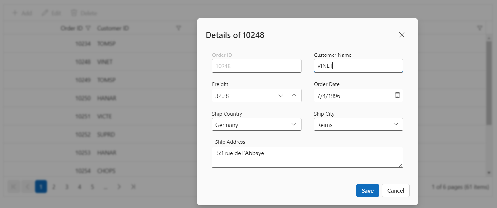

---
layout: post
title: Dialog editing in Vue Grid component | Syncfusion
description: Learn here all about Dialog editing in Syncfusion Vue Grid component of Syncfusion Essential JS 2 and more.
control: Dialog editing 
platform: ej2-vue
documentation: ug
domainurl: ##DomainURL##
--- 

# Dialog editing in Vue Grid component

Dialog editing is a feature in the Grid component that allows you to edit the data of the currently selected row using a dialog window. With dialog editing, you can easily modify cell values and save the changes back to the data source.This feature is particularly beneficial in scenarios where you need to quickly modify data without navigating to a separate page or view, and it streamlines the process of editing multiple cells.

To enable dialog editing in grid component, you need to set the [editSettings.mode](https://ej2.syncfusion.com/vue/documentation/api/grid/editSettings/#mode) property to **Dialog**. This property determines the editing mode for the grid, and when set to **Dialog**, it enables the dialog editing feature.

Here's an example how to enable dialog editing in the Vue grid component:









        


## Customize edit dialog

The edit dialog in the Grid component allows you to customize its appearance and behavior based on the type of action being performed, such as editing or adding a record. You can modify properties like header text, showCloseIcon, and height to tailor the edit dialog to your specific requirements. Additionally, you can override default localization strings to provide custom text for buttons or other elements within the dialog.

To customize the edit dialog, you need to handle the [actionComplete](https://ej2.syncfusion.com/vue/documentation/api/grid/#actioncomplete) event of the Grid component and perform the necessary modifications based on the **requestType** parameter. The **requestType** parameter identifies the type of action being performed, such as **beginEdit** for editing a record or **add** for adding a new record.

>You can refer the Grid [Default text](../global-local/) list for more localization.

The following example that demonstrates how to customize the edit dialog using the `actionComplete` event:









        


> The Grid add or edit dialog element has the max-height property, which is calculated based on the available window height. So, in the normal window (1920 x 1080), it is possible to set the dialog's height up to 658px.

## Show or hide columns in dialog editing

The show or hide columns in dialog editing feature in the grid allows you to dynamically control the visibility of columns while editing in the dialog edit mode. This feature is useful when you want to display specific columns based on the type of action being performed, such as editing an existing record or adding a new record. To achieve this, you can utilize the [actionBegin](https://ej2.syncfusion.com/vue/documentation/api/grid/#actionbegin) event of the Grid. 

The `actionBegin` event is triggered whenever an action is initiated in the grid, such as editing, adding, or deleting a record. Within the event handler, you can check the **requestType** parameter to determine the type of action being performed. If the **requestType** is `beginEdit` or `add`, you can modify the visibility of columns using the `column.visible` property. This property is used to determine whether a column should be displayed or hidden. Then, when the **requestType** is `save`, you can reset the column visibility to its initial state using the `column.visible` property.

In the following example, the **CustomerID** column is rendered as a hidden column, and the **ShipCountry** column is rendered as a visible column. In the edit mode, the **CustomerID** column will be changed to a visible state and the **ShipCountry** column will be changed to a hidden state.









        


## Use wizard like dialog editing

Wizard-like dialog editing is a powerful feature in the Grid component that enables the creation of intuitive step-by-step forms. This feature provides a structured approach to form completion or data entry by breaking down the process into manageable steps.This feature is particularly useful when you have complex forms that need to be broken down into smaller sections to guide you through the data entry process.

To achieve wizard-like dialog editing in the grid component, you can use the dialog template feature. This feature allows you to define your own custom editing template using the [`editSettings.mode`](https://ej2.syncfusion.com/vue/documentation/api/grid/editSettings/#mode) property set to  **Dialog** and the [editSetting.template](https://ej2.syncfusion.com/vue/documentation/api/grid/editsettings/#template) property to specify the template variable that defines the editors for each step of the wizard.

The following example demonstrate the wizard like editing in the grid with the unobtrusive validation.









        


## Customize add/edit dialog footer

The Customize add/edit dialog footer feature in the grid allows you to modify the footer section of the dialog that appears when editing the currently selected row or adding a new row. By default, the dialog displays two buttons in the footer section: Save and Cancel, which allow you to save or discard the changes made in the dialog. This feature is particularly helpful when you want to add custom buttons to the dialog's footer, implement specific actions, or customize the appearance of the buttons, such as changing their color or size in the dialog's footer. This can be achieved using the [actionComplete](https://ej2.syncfusion.com/vue/documentation/api/grid/#actioncomplete) event of the Grid component.

In the following sample, using the `dialog` argument of the `actionComplete` event, the action for the custom button can be customized.









        


## Edit dialog template from another vue page

The Syncfusion&reg; Vue Grid allows you to customize the edit dialog by loading a template from another Vue page. This provides flexibility in creating custom forms and layouts for editing data within the grid.

To enable the dialog template from another Vue page, use the [editSettings.template](https://ej2.syncfusion.com/vue/documentation/api/grid/editSettings/#template) property of the Syncfusion&reg; Grid. This property allows you to specify the template for the edit dialog, which can be defined in a separate Vue component or file.

The following example demonstrates how to implement a custom edit dialog template from another Vue page.
















